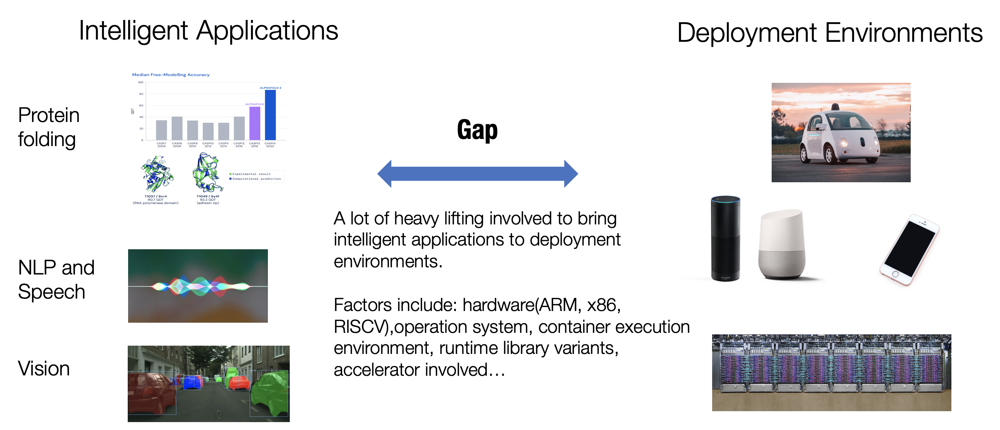
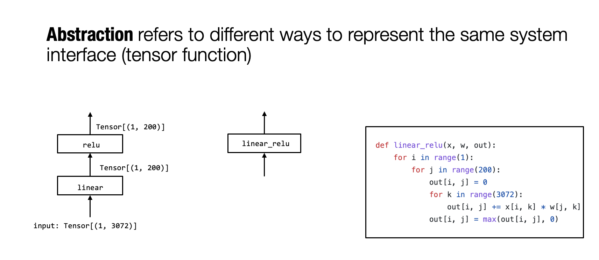
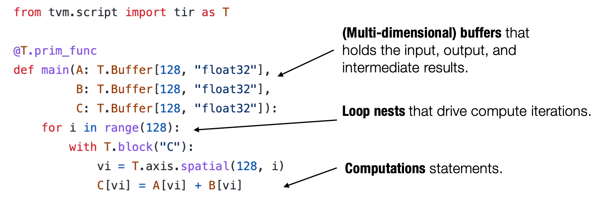
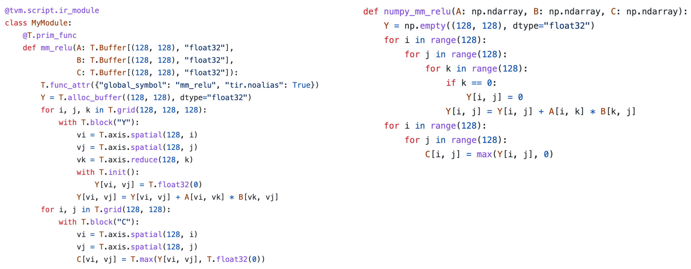

# MLC Chapter 1 & 2

[github](https://mlc.ai/chapter_introduction/index.html) 感觉英文版本写的更准确些

将智能机器学习模型从研发阶段转而部署到这些多样的生产环境，需要相当多的繁重工作。即使对于我们最熟悉的环境（例如在 GPU 上），部署包含非标准算子的深度学习模型仍然需要大量的工程

同时，我们还发现将训练 (Training) 过程本身部署到不同环境会变得越来越重要。这些需求源于出于隐私保护原因，或将模型学习扩展到分布式节点集群的需要，或需要将模型更新保持在用户设备的本地。



本课程将讨论如何把机器学习从开发、研究阶段，引入到生产环境。我们将讨论一系列促进机器学习算法落地部署的方法。

## 什么是机器学习编译

**机器学习编译 (machine learning compilation, MLC) 是指，将机器学习算法从开发阶段，通过变换和优化算法，使其变成部署状态。**

**开发形式** 是指我们在开发机器学习模型时使用的形式。典型的开发形式包就是使用 PyTorch 框架编写的模型描述以及相关权重

**部署形式** 是指执行机器学习应用程序所需的形式。它通常涉及机器学习模型的每个步骤的支撑代码、管理资源（例如内存）的控制器，以及与应用程序开发环境的接口（例如用于 android 应用程序的 java API）。

我们使用术语“编译 (compilation)”，因为可以将这个过程视为与传统编译器所做的非常相似的过程，即编译器将我们的应用程序采用开发形式，并将它们编译为可以部署的库。

首先，这个过程不一定涉及代码生成。例如，部署形式可以是一组预定义的库函数，而 ML 编译仅将开发形式转换为对这些库的调用。其次，遇到的挑战和解决方案也大不相同。

机器学习编译通常有以下几个目标：

1. **集成与最小化依赖** 部署过程通常涉及集成 (Integration)，即将必要的元素组合在一起以用于部署应用程序。 
2. **利用硬件加速** 每个部署环境都有自己的一套原生加速技术，并且其中许多是专门为机器学习开发的。
3. **通用优化** 有许多等效的方法可以运行相同的模型执行。

### 为什么学习 MLC

1. 对于在从事机器学习工作工程师，机器学习编译提供了以基础的解决问题的方法和工具。它有助于回答我们可以采用什么方法来特定模型的部署和内存效率，如何将优化模型的单个部分的经验推广到更端到端解决方案，等一系列问题。
2. 对于机器学习科学家，学习机器学习编译可以更深入地了解将模型投入生产所需的步骤。
3. 对于硬件厂商，机器学习编译提供了一种构建机器学习软件栈的通用方法，能够最好地利用他们构建的硬件。
4. 最后，学习 MLC 本身很有趣。借助这套现代机器学习编译工具，我们可以进入机器学习模型从高级、代码优化到裸机的各个阶段。端到端 (end to end) 地了解这里发生的事情并使用它们来解决我们的问题。

## MLC 关键要素

教程使用了一个两层的 MLP 来说明

1. **张量 (Tensor)** 是执行中最重要的元素。张量是表示神经网络模型执行的输入、输出和中间结果的多维数组。
2. **张量函数 (Tensor functions)** 张量函数描述的是一个计算序列：输入张量和网络权重进行进行计算，获得输出张量。我们将这些计算称为张量函数。值得注意的是，张量函数不需要对应于神经网络计算的单个步骤。部分计算或整个端到端计算也可以看作张量函数。（这也是一般函数具有的性质，只考虑输入到输出的映射）

### 抽象和实现



We use **abstractions** to denote the ways we use to represent the same tensor function。不同的抽象可能会指定一些细节，而忽略其他**实现(Implementations)**细节。例如，`linear_relu` 可以使用另一个不同的 for 循环来实现。

> 个人理解：一个张量函数可以由多种不同的抽象表示，例如上图：可以用简单的流程图表示，也可以用 python 代码表示，也可以用 C++ 代码表示。但是可以看到这些抽象包含了不同数量的实现（implementation），python 抽象肯定比流程图抽象包含的细节更多。在之后可能会混用抽象和实现两个概念，因为实在没有清晰的边界

MLC 实际上是在相同或不同抽象下转换和组装张量函数的过程。

## 元张量函数

一个典型的机器学习模型的执行包含许多步将输入张量之间转化为最终预测的计算步骤，其中的每一步都被称为元张量函数 (primitive tensor function)。

> 个人理解：元张量函数是一个较“小”的张量函数，当小到一定程度时，这个张量函数就不可继续分割了！例如你无法继续对加法进行分割，但是你可以将一个多项式张量函数分割成为许多加法和乘法操作

特别的是，许多不同的抽象能够表示（和实现）同样的元张量函数（正如下图所示）


上面分别是 torch, python, C++ 对于矩阵加法的抽象

许多机器学习框架都提供机器学习模型的编译过程，以将**元张量函数变换（transform）**为更加专门的、针对特定工作和部署环境的函数。


上图可以看做 python 抽象转换为 C++ 抽象

## 张量程序抽象

抽象的变换可以说就是 MLC 的核心，那么我们能否找寻一个合适的抽象，该抽象能够方便我们对其进行变换，从而探寻更合适的实现，这样就能获得最优的张量函数表示。

通常来说，一个典型的元张量函数的抽象包含了以下 3 个部分：

1. 存储数据的多维数组，Multi-dimensional buffer (arrays).
2. 驱动张量计算的循环嵌套，Loops over array dimensions.
3. 计算部分本身的语句，Computations statements are executed under the loops.

我们称这类抽象为**张量程序抽象（ Tensor Program Abstraction）**。



张量程序抽象的一个重要性质是，他们能够被一系列有效的程序变换所改变，但仍然表示同一个张量函数。例如，我们能够通过一组变换操作（如循环拆分、并行和向量化）将上图左侧的一个初始循环程序变换为右侧的程序


重要的是，我们不能任意地对程序进行变换，比方说这可能是因为一些计算会依赖于循环之间的顺序（例如动态规划中，有的嵌套循环的顺序不能被更改，这将会导致错误结果）。但幸运的是，我们所感兴趣的大多数元张量函数都具有良好的属性（例如循环迭代之间的独立性）。

举个例子，下面图中的程序包含额外的 `T.axis.spatial` 标注，表明 `vi` 这个特定的变量被映射到循环变量 `i`，并且所有的迭代都是独立的。这个信息对于执行这个程序而言并非必要，但会使得我们在变换这个程序时更加方便。在这个例子中，我们知道我们可以安全地并行或者重新排序所有与 `vi` 有关的循环，只要实际执行中 `vi` 的值按照从 `0` 到 `128` 的顺序变化。


## TensorIR

Now we are ready to learn one specific instance of tensor program abstraction called TensorIR. TensorIR is the tensor program abstraction in Apache TVM, which is one of the standard machine learning compilation frameworks.

Tensor program abstraction 主要为了方便表示两种实现：

1. 循环
2. 具体硬件加速实现。这其中又主要针对线程优化、指令优化、存储优化

为了更好的理解其中的计算，教程中使用了 low-level numpy 来实现张量函数，所谓的 low-level numpy 是指以下两点：

1. 显式地使用循环。用于更好地展示 tensor program abstraction 对循环的变换
2. 显式地分配数组。申请内存空间来存储中间结果以及最终输出


仍然是以 matrix multiply + relu 为例子，直接看下 TensorIR code 以及 low-level numpy code 的对比



通过对照二者的实现来深入理解二者的联系与区别

1. 函数参数和 buffer，用于存储数据

   ```python
   # TensorIR
   def mm_relu(A: T.Buffer[(128, 128), "float32"],
               B: T.Buffer[(128, 128), "float32"],
               C: T.Buffer[(128, 128), "float32"]):
       ...
   # numpy
   def lnumpy_mm_relu(A: np.ndarray, B: np.ndarray, C: np.ndarray):
       ...
       
   # TensorIR
   Y = T.alloc_buffer((128, 128), dtype="float32")
   # numpy
   Y = np.empty((128, 128), dtype="float32")
   ```

2. 循环

   ```python
   # TensorIR
   for i, j, k in T.grid(128, 128, 128):
   
   # numpy
   for i in range(128):
       for j in range(128):
           for k in range(128):
   ```

   `T.grid` 是 TensorIR 中的语法糖，用于表示嵌套循环

3. 计算块，computation block

   ```python
   # TensorIR
   with T.block("Y"):
       vi = T.axis.spatial(128, i)
       vj = T.axis.spatial(128, j)
       vk = T.axis.reduce(128, k)
       with T.init():
           Y[vi, vj] = T.float32(0)
       Y[vi, vj] = Y[vi, vj] + A[vi, vk] * B[vk, vj]
   
   # numpy
   vi, vj, vk = i, j, k
   if vk == 0:
       Y[vi, vj] = 0
   Y[vi, vj] = Y[vi, vj] + A[vi, vk] * B[vk, vj]
   ```

   这里是二者差别最大的地方。TensorIR 包含一个附加结构：`T.block`

   `T.block` 是基本的计算单元，并且包含一些块轴（block axes），在此例子中 block axes 就是 `(vi, vj, vk)`

   block axes 的声明通常有如下形式

   ```python
   [block_axis] = T.axis.[axis_type]([axis_range], [mapped_value])
   ```

   其中对于 `axis_type` 是最不好理解的。`spatial & reduce` 分别代表什么？个人理解：`axis_type` 标记该轴的性质，`spatial` 代表我们能够对该轴跟随意地使用平行计算，而对 `reduce` 使用平行计算则需要特殊的处理策略

   官方解释

   > we can call `vi`, `vj` **spatial axes** as they directly corresponds to the beginning of a spatial region of buffers that the block writes to. The axes that involves in reduction (`vk`) are named as **reduce axes**.

   这些 block axis 信息能够让 block 循环实现 self-contained，即不看外部的循环声明 `for i, j, k in T.grid(128, 128, 128)` 我们也大概知道这个 block 干了什么事

    教程介绍了一个 block 语法糖来快速创建 axis

   ```python
   # SSR means the properties of each axes are "spatial", "spatial", "reduce"
   vi, vj, vk = T.axis.remap("SSR", [i, j, k])
   ```

4. 函数属性以及装饰器，Function Attributes and Decorators

   这部分是 TensorIR 独有的实现，而 low-level numpy 没有的

   1. 函数属性

      ```python
      T.func_attr({"global_symbol": "mm_relu", "tir.noalias": True})
      ```

      定义了两个属性，一个就是该函数的名字，另一个代表函数中的 buffer memories 不重合

   2. 装饰器

      两个装饰器 `T.prim_func & tvm.script.ir_module` 仅代表对应代码的类别

      其中 `T.prim_func` 代表该函数是一个元张量函数，`tvm.script.ir_module` 代表该类是一个 `IRModule` 类，该类别的本质是一个张量函数的容器（container），可以获得定义在该模块下的张量函数

      ```python
      type(MyModule)
      # tvm.ir.module.IRModule
      type(MyModule["mm_relu"])
      # tvm.tir.function.PrimFunc
      ```

使用下面的代码可查看 `IRModule` 的脚本

```python
import IPython

IPython.display.Code(MyModule.script(), language="python")
```


经常看到 TorchScript, xxScript，现在又有了 TVM Script，这里对 Script 进行一个定义（by GPT）

> a "script" in computing generally refers to a computer program or a series of instructions that is interpreted or carried out by another program rather than by the computer processor. In the context of frameworks like PyTorch or TVM, "script" generally refers to a programming interface for compiling Python code into a form that can be optimized, serialized and run in a separate non-Python runtime environment.

## 变换，Transformation

在上一节中，我们给出了如何使用低级 NumPy 编写 `mm_relu` 的示例。 在实践中，可以有多种方法来实现相同的功能，并且每种实现都可能导致不同的性能。

下面的代码块显示了 `mm_relu` 的一个稍微不同的变体。它与原始程序的不同是

- 我们用两个循环 `j0` 和 `j1` 替换了 `j` 循环；
- 迭代顺序略有变化。

```python
def lnumpy_mm_relu_v2(A: np.ndarray, B: np.ndarray, C: np.ndarray):
    Y = np.empty((128, 128), dtype="float32")
    for i in range(128):
        for j0 in range(32):
            for k in range(128):
                for j1 in range(4):
                    j = j0 * 4 + j1
                    if k == 0:
                        Y[i, j] = 0
                    Y[i, j] = Y[i, j] + A[i, k] * B[k, j]
    for i in range(128):
        for j in range(128):
            C[i, j] = max(Y[i, j], 0)
```

我们可以通过变换，让我们的 IRModule 表示上方的实现

在此之前，我们需要创建一个 `Schedule` 类，该类的输入为一个 IRModule

```python
sch = tvm.tir.Schedule(MyModuleWithAxisRemapSugar)
```

利用 Schedule 类可以获得 block & loops

```python
block_Y = sch.get_block("Y", func_name="mm_relu")
i, j, k = sch.get_loops(block_Y)
```

首先将 loop j 分成两个循环

```python
j0, j1 = sch.split(j, factors=[None, 4])
```

你可以使用上面的方法查看 script 哪里有改变

```python
IPython.display.Code(sch.mod.script(), language="python")
```

接着我们要将循环进行重新排序

```python
sch.reorder(j0, k, j1)
```

下面查看变换后的代码

```python
# from tvm.script import ir as I
# from tvm.script import tir as T

@I.ir_module
class Module:
    @T.prim_func
    def mm_relu(A: T.Buffer((128, 128), "float32"), B: T.Buffer((128, 128), "float32"), C: T.Buffer((128, 128), "float32")):
        T.func_attr({"global_symbol": "mm_relu", "tir.noalias": T.bool(True)})
        # with T.block("root"):
        Y = T.alloc_buffer((128, 128))
        for i, j_0, k, j_1 in T.grid(128, 32, 128, 4):
            with T.block("Y"):
                vi = T.axis.spatial(128, i)
                vj = T.axis.spatial(128, j_0 * 4 + j_1)
                vk = T.axis.reduce(128, k)
                T.reads(A[vi, vk], B[vk, vj])
                T.writes(Y[vi, vj])
                with T.init():
                    Y[vi, vj] = T.float32(0)
                Y[vi, vj] = Y[vi, vj] + A[vi, vk] * B[vk, vj]
        for i, j in T.grid(128, 128):
            with T.block("C"):
                vi, vj = T.axis.remap("SS", [i, j])
                T.reads(Y[vi, vj])
                T.writes(C[vi, vj])
                C[vi, vj] = T.max(Y[vi, vj], T.float32(0))
```

基本上没有什么变化，除了最外侧的循环以及 vj 的表示

```python
# split and reorder effect
for i, j_0, k, j_1 in T.grid(128, 32, 128, 4)
# split effect
vj = T.axis.spatial(128, j_0 * 4 + j_1)
```

除此之外还可以将 relu 的循环移到里面

```python
block_C = sch.get_block("C", "mm_relu")
sch.reverse_compute_at(block_C, j0)
```

查看 script 看到还新诞生了一个变量 ax0

```python
# from tvm.script import ir as I
# from tvm.script import tir as T

@I.ir_module
class Module:
    @T.prim_func
    def mm_relu(A: T.Buffer((128, 128), "float32"), B: T.Buffer((128, 128), "float32"), C: T.Buffer((128, 128), "float32")):
        T.func_attr({"global_symbol": "mm_relu", "tir.noalias": T.bool(True)})
        # with T.block("root"):
        Y = T.alloc_buffer((128, 128))
        for i, j_0 in T.grid(128, 32):
            for k, j_1 in T.grid(128, 4):
                with T.block("Y"):
                    vi = T.axis.spatial(128, i)
                    vj = T.axis.spatial(128, j_0 * 4 + j_1)
                    vk = T.axis.reduce(128, k)
                    T.reads(A[vi, vk], B[vk, vj])
                    T.writes(Y[vi, vj])
                    with T.init():
                        Y[vi, vj] = T.float32(0)
                    Y[vi, vj] = Y[vi, vj] + A[vi, vk] * B[vk, vj]
            for ax0 in range(4):
                with T.block("C"):
                    vi = T.axis.spatial(128, i)
                    vj = T.axis.spatial(128, j_0 * 4 + ax0)
                    T.reads(Y[vi, vj])
                    T.writes(C[vi, vj])
                    C[vi, vj] = T.max(Y[vi, vj], T.float32(0))
```

在移动 block_C 的过程中，变量 j 自动分解成为了 [j0, 4]，同时 block_Y 也自动生成一个循环声明 `for k, j_1 in T.grid(128, 4)`

似乎在块中不能复用之前所创建的 `vi, vj, vk`，必须要重新创建

我们还可以将 reduction 从循环中单独分离出来

```python
sch.decompose_reduction(block_Y, k)
```

分离出来过后，等价的 low-level numpy 代码如下

```python
def lnumpy_mm_relu_v3(A: np.ndarray, B: np.ndarray, C: np.ndarray):
    Y = np.empty((128, 128), dtype="float32")
    for i in range(128):
        for j0 in range(32):
            # Y_init
            for j1 in range(4):
                j = j0 * 4 + j1
                Y[i, j] = 0
            # Y_update
            for k in range(128):
                for j1 in range(4):
                    j = j0 * 4 + j1
                    Y[i, j] = Y[i, j] + A[i, k] * B[k, j]
            # C
            for j1 in range(4):
                j = j0 * 4 + j1
                C[i, j] = max(Y[i, j], 0)

```

## 构建与运行

IRModule 可以构建成为实际运行的程序。首先通过构建函数并指定部署环境，以获得一个 `runtime.Module`，这其实是一个可运行函数的集合，看做一个 container

```python
rt_lib = tvm.build(MyModule, target="llvm")
print(type(rt_lib))
print(isinstance(rt_lib, tvm.runtime.Module))
# <class 'tvm.driver.build_module.OperatorModule'>
# True
```

从 `rt_lib` 中获取可运行函数，并传入参数

```python
func_mm_relu = rt_lib["mm_relu"]

a_nd = tvm.nd.array(a_np)
b_nd = tvm.nd.array(b_np)
c_nd = tvm.nd.empty((128, 128), dtype="float32")
type(c_nd)

func_mm_relu(a_nd, b_nd, c_nd)

np.testing.assert_allclose(c_mm_relu, c_nd.numpy(), rtol=1e-5)
```

比较不同实现的时间差

```python
f_timer_before = rt_lib.time_evaluator("mm_relu", tvm.cpu())
print("Time cost of MyModule %g sec" % f_timer_before(a_nd, b_nd, c_nd).mean)
f_timer_after = rt_lib_after.time_evaluator("mm_relu", tvm.cpu())
print("Time cost of transformed sch.mod %g sec" % f_timer_after(a_nd, b_nd, c_nd).mean)

# in my computer
# Time cost of MyModule 0.00229258 sec
# Time cost of transformed sch.mod 0.00158203 sec
```

原理解释

在下图中，我们关注最里面的两个循环：`k` 和 `j1`。高亮的地方显示了当我们针对 `k` 的一个特定实例迭代 `j1` 时迭代触及的 `Y`、`A` 和 `B` 中的相应区域


我们可以发现，`j1` 这一迭代产生了对 `B` 元素的**连续访问**。具体来说，它意味着在 `j1=0` 和 `j1=1` 时我们读取的值彼此相邻。这可以让我们拥有更好的缓存访问行为。此外，我们使 `C` 的计算更接近 `Y`，从而实现更好的缓存行为

原始的矩阵乘法可按照下图示意，按照 k 循环的方向进行点积，对于每一次读取 B 矩阵来说，都不会是连续的存储空间，所以访存读取将变得更慢，进而成为计算瓶颈


## 张量表达式

之前使用了 TVMScript 来创建 TensorIR，tvm 还提供了另外一种方式：使用 tensor expression (te) 来生成 TensorIR 代码

```python
from tvm import te
A = te.placeholder((128, 128), "float32", name="A")
B = te.placeholder((128, 128), "float32", name="B")
k = te.reduce_axis((0, 128), "k")
Y = te.compute((128, 128), lambda i, j: te.sum(A[i, k] * B[k, j], axis=k), name="Y")
C = te.compute((128, 128), lambda i, j: te.max(Y[i, j], 0), name="C")
```

这里的表述和上面的 `mm_relu` 是一样的

## TVM 练习

TODO 教程给了加法和矩阵乘法为例子
