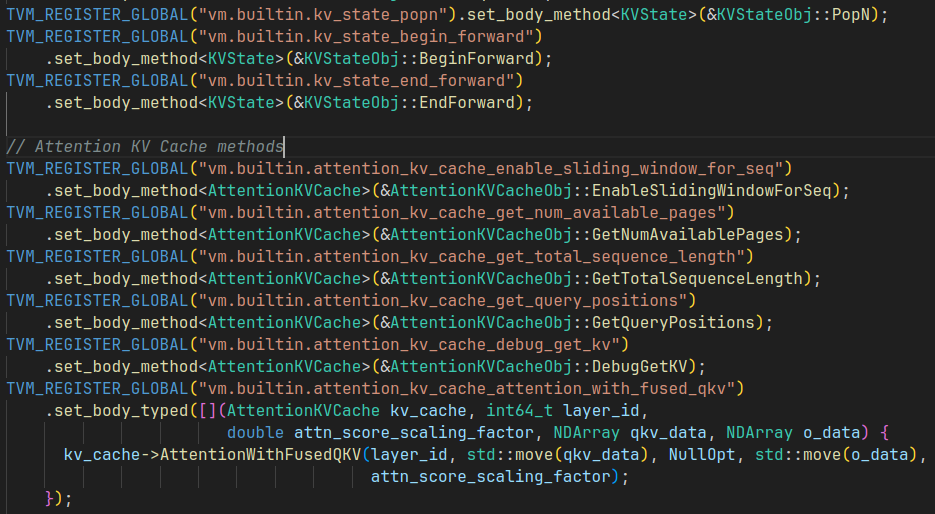

# MLC-LLM Usage

如何使用 MLC-LLM 工具链，需要回答以下问题：

1. MLC-LLM 的安装如何运行
2. 如何构建模型
3. 如何将模型进行编译并运行

## Concept

- 安装 [tvm unity install](https://llm.mlc.ai/docs/install/tvm.html)

   最简单的方式是通过 pre-built package 一键安装，下面是安装了 cuda 12.2 版本的 tvm unity

   ```shell
   pip install --pre -U -f https://mlc.ai/wheels mlc-ai-nightly-cu122
   ```

   如果需要安装其他 cuda 版本包，可以去 https://mlc.ai/wheels 寻找对应的 wheel 包，下载后安装

   > pip install -pre 会将 pre-release version packages 放入搜索路径当中

   > tvm unity 是 tvm 的一个分支版本，你可以在 tvm github 的 branch 中看到他。实际上 tvm unity 就是 tvm 的最新版本，功能和 tvm 一样，提供模型编译功能

   除此之外还可能要安装 xgboost

   ```python
   pip install xgboost --force
   ```

   > 我使用 --forece 强制安装，也可以用 -U 更新安装

   检验安装是否完成

   ```shell
   python -c "import tvm; print(tvm.__file__)"
   python -c "import tvm; print(tvm._ffi.base._LIB)"
   python -c "import tvm; print(tvm.cuda().exist)"
   ```

- 安装 [mlc-llm install](https://llm.mlc.ai/docs/install/mlc_llm.html)

   模型部署可以分为两个阶段： compile & runtime，tvm unity 提供了 compile 功能，而 mlc 则提供了 runtime 功能（个人理解）

   同样地，通过下载 wheels 进行本地安装

   ```python
   pip install --pre -U -f https://mlc.ai/wheels mlc-llm-nightly-cu122 mlc-ai-nightly-cu122
   ```

- Overview Function of tvm & mlc-llm

   我们要做的事情非常明确：构建模型 -> 编译模型 -> 运行模型

   tvm 其实为这件事情提供了完整的能力支撑：我们可以通过 tvm python api (relax) 来完成模型构建，然后对所构建的模型进行编译，使其能够在对应的平台上运行

   而 mlc-llm 则是一个由 tvm 支撑的，面相 LLM 的开发仓库。mlc-llm 包含了许多由 tvm python api 构建的语言模型。并且定义了许多 chat 配置模版，可以方便地调用模型来构建完整的聊天应用

- 如何通过 relax (tvm python api) 来构建模型，并编译运行，以 linear 层为例

   参考 [notebook](https://github.com/mlc-ai/notebooks/blob/main/mlc-llm/tutorial_add_new_model_architecture_in_tvm_nn_module.ipynb) [define_new_models](https://llm.mlc.ai/docs/compilation/define_new_models.html)

   直接跑官方的 notebook 肯定是跑不通的，继承了 tvm 文档的一贯风格😂原因在于 tvm/relax api 变化太快，但是文档完全没有跟上，下面就是其中一个例子

   ```python
   # before
q = q.permute_dims([0, 2, 1, 3])  # [b, h, s, d]
   k = k.permute_dims([0, 2, 1, 3])  # [b, h, t, d]
   v = v.permute_dims([0, 2, 1, 3])  # [b, h, t, d]
   
   # after
q = q.permute_dims(0, 2, 1, 3)  # [b, h, s, d]
   k = k.permute_dims(0, 2, 1, 3)  # [b, h, t, d]
   v = v.permute_dims(0, 2, 1, 3)  # [b, h, t, d]
   ```
   
   无法完成对 `nn.KVCache` 的一些操作

- Expression Node

   

- TIR & AST

   下面的整理基本上来自于 [TVM 自底向上（二）：TIR 的概念和编译原理](https://zhuanlan.zhihu.com/p/533161438)

   TIR 是 TVM 中最接近目标硬件的数据结构，是可以被编译为目标硬件编程语言（C++、CUDA、LLVM IR等）的中间表示。对于没有学习过编译原理的读者而言，会比较难以理解：**各种编程语言的语法，区别都非常大，那么 TIR 是如何做到可以编译为任何一种语言的？**

   **这里就要引入一个新的概念，叫抽象语法树（Abstract Syntax Tree，今后都简称为 AST）。不管任何编程语言，有什么特性如何，语法如何，一段程序都是如下元素组成的：**

   - **变量的声明、变量初始化（赋值或者内存分配）**
   - **变量的运算（四则运算、布尔运算等）、函数的调用**
   - **流程的控制（if-else 条件判断，循环等）**

   **那么，任何一段代码，都可以表达为类似于如下的树结构：**

   

   通常，AST 是按照中序遍历来阅读的，那么，上面的代码翻译为 C++，就是：

   ```c++
   void main(int x) {
       if (x < 5) {
           x = x * 2;
       }
   }
   ```

   翻译成 Python，就是：

   ```python
   def main(x):
       if x < 5:
           x = x * 2
   ```

   **即使 C++ 和 Python 的语法不同，只要实现相应的翻译器（也就是 CodeGen），在中序遍历的过程中，将树节点翻译为相应语法的字符串，就可以得到最终的源代码了。**

   

   **有了 AST，TIR 就能解决如下痛点：相同的计算指令、加速指令在不同硬件之间的转换。**

   目前对 AST 有了一定了解，那到底什么是 TIR 呢？如何构建一个 TIR？并且 TIR 又是如何转变为 AST 的？

   以下是个人理解：

   > TensorIR 就是 AST 本身，而通常我们所说的 TensorIR 是 TensorIR AST 的简称，为了让概念变得更加清晰将 TensorIR code & TensorIR AST 进行区分
   >
   > AST 可以翻译成为各种语言，但我们通常需要选择一种主语言来完成 TensorIR code 与 TensorIR AST 之间的转换，而 python 显然是一个不错的选择
   >
   > 使用 Python 所实现的 python TensorIR code，我们就称之为 TVMScript。TVMScript 借助 python AST 能够将 code 转换为 TensorIR AST，从而再利用其他语言的 CodeGen 转换为其他语言。

- IRModule & PrimFunc & CodeGen

   使用 TVMScrip 来编写 python TensorIR code 有几个重要的组件：

   1. IRModule，IRModule 是可以被编译的最小单元，所有的 TensorIR code 都必须在 IRModule 中实现
   2. PrimFunc，PrimFunc 是一个完整的函数，能够作为 API 入口被编译后的 IRModule 调用

   ```python
   import tvm
   from tvm.ir.module import IRModule
   from tvm.script import tir as T
   import numpy as np
   
   @tvm.script.ir_module
   class MyModule:
       @T.prim_func
       def main(a: T.handle, b: T.handle):
           # We exchange data between function by handles, which are similar to pointer.
           T.func_attr({"global_symbol": "main", "tir.noalias": True})
           # Create buffer from handles.
           A = T.match_buffer(a, (8,), dtype="float32")
           B = T.match_buffer(b, (8,), dtype="float32")
           for i in range(8):
               # A block is an abstraction for computation.
               with T.block("B"):
                   # Define a spatial block iterator and bind it to value i.
                   vi = T.axis.spatial(8, i)
                   B[vi] = A[vi] + 1.0
   
   
   ir_module = MyModule
   print(type(ir_module))
   print(ir_module.script())
   ```

   3. Compile，编译 IRModule，看下效果

   ```python
   import numpy as np
   
   mod = tvm.build(ir_module, target="llvm")
   # mod = tvm.build(ir_module, target="cuda")
   
   a = tvm.nd.array(np.arange(8).astype("float32"))
   # [0. 1. 2. 3. 4. 5. 6. 7.]
   
   b = tvm.nd.array(np.zeros((8,)).astype("float32"))
   mod(a, b)
   # [1. 2. 3. 4. 5. 6. 7. 8.]
   ```

   `tvm.build` 的最后一个参数 target，就是用来选择用哪一个 CodeGen 来编译 TIR AST

   > TIR AST -> C++/CUDA -> bin

- Algebraic Data Types (ADTs)

   通过组合旧的数据类型来定义新的数据类型

   > ADTs are trying to define new types by combining exsisting types. (result from GPT)

- Expression & Statement

   [TVM 自底向上（二）：TIR 的概念和编译原理](https://zhuanlan.zhihu.com/p/533161438)

   CodeGenC 会遍历到两种 TIR Node：Expression（表达式） 和 Statement（语句）。Expression（表达式）中包含了常见的变量声明、运算、判断、函数调用，而 Statement（语句）中包含了控制流（if-else，Loop 等）、内存管理、赋值（Assignment）等操作

- Frontend & Backbend & RelayIR & TensorIR

   [TVM 基本框架和概念](https://zhuanlan.zhihu.com/p/532873577)

   向上，兼容所有不同的深度学习框架（也叫 frontend），例如 pytorch、TensorFlow、onnx

   向下，兼容所有不同的底层硬件和推理框架（也叫 backend），同时性能最大化，例如 x86 cpu、arm cpu、mali gpu、nvidia gpu

   **因此，为了覆盖上述的全部场景，TVM 中引入了两个 IR**（Intermediate Representation，即中间表示）：

   1. 为了向上兼容的 **Relay IR**（简称 Relay），基于不同深度学习平台训练好的模型，在进入 TVM 后都会首先被转换为 Relay 的表示，消除表示差异；

   2. 为了向下兼容的 **Tensor IR**（简称 TIR），所有模型在编译为指定硬件上的源代码之前，都要先 lower 为 TIR。

      

   为什么要使用两种 IR，为什么不只设计 TensorIR，直接从 onnx -> cuda 一步到位。个人理解有以下原因：

   1. 从 pytorch/onnx 表示到 CUDA 表示有许多优化是可以进行的，在这个过程中，使用层级式的优化是更容易实现的
   2. 更高抽象的 IR 有利于快速地表示计算图，例如在 TVM 中通常就会使用 Relax IR 来快速搭建网络。也就是说我们可以直接舍弃从 ONNX/pytorch 转 Relax/RelayIR 的这个过程，直接使用 IR 来搭建网络
   3. 更高抽象的 IR 有利于在图融合层面进行优化
   4. 更低抽象的 IR 有利于设计更多运算细节，例如面向不同的硬件设计不同的并行方式

## -----


- 

- 如何使用 Git-LFS (Large File System)

   git-lfs 是用于管理 repo 中的大型文件。安装方式 [link](https://packagecloud.io/github/git-lfs/install)

   ```shell
   curl -s https://packagecloud.io/install/repositories/github/git-lfs/script.deb.sh | sudo bash
   apt install git-lfs
   ```

   在 huggingface 中 clone 一个模型通常会先运行 `git lfs install`，这一步就会对 git 进行全局的设置，能够在使用 `git clone` 的时候下载仓库中的 LFS 文件（一般为模型权重）

   ```shell
   git lfs install
   git clone https://huggingface.co/openai-community/gpt2
   # If you want to clone without large files - just their pointers
   GIT_LFS_SKIP_SMUDGE=1 git clone https://huggingface.co/openai-community/gpt2
   ```

   这里的设置是全局的，只用设置一次。但是有时候仓库中有很多 LFS 文件，并不是所有的文件都是我们需要的，所以可以使用如下方法

   ```shell
   # skip lfs globally
   git lfs install --skip-smudge
   # clone repo first
   git clone https://huggingface.co/openai-community/gpt2
   
   # pull certain file you need
   git lfs pull --include "model.safetensors"
   # pull all lfs
   git lfs pull
   ```

   我们先 clone 仓库，然后再进入仓库，对该仓库进行单独的配置，最后使用 `git lfs pull` 单独下载 LFS 文件

   可以通过 `git lfs uninstall` 来取消配置

- Models and model lib

   想要使用 mlc-llm 运行一个 chat model 需要两件事情：符合 mlc 要求的模型权重和模型库（model weights and model library）

   获取途径有两个

   1. 使用 mlc-llm 已经准备好的模型权重 [model cards hf](https://huggingface.co/mlc-ai)，模型库 [binary-mlc-llm-libs](https://github.com/mlc-ai/binary-mlc-llm-libs)

      ```python
      # Download pre-conveted weights
      git lfs install && mkdir dist/
      git clone https://huggingface.co/mlc-ai/Llama-2-7b-chat-hf-q4f16_1-MLC \
                                         dist/Llama-2-7b-chat-hf-q4f16_1-MLC
      
      # Download pre-compiled model library
      git clone https://github.com/mlc-ai/binary-mlc-llm-libs.git dist/prebuilt_libs
      ```

   2. 自己编译模型权重和模型库 [convert model weights via mlc](https://llm.mlc.ai/docs/compilation/convert_weights.html)，[compile model libraries](https://llm.mlc.ai/docs/compilation/compile_models.html)

- 使用 Python API 运行 chat model

- 配置 MLCChat，mlc-llm 提供两个 dataclass 来设定配置

- **Convert Model Weights** and **Compile Model Library**

   pre-request: tvm unity compiler & mlc_chat

   直接从 huggingface 上拉取模型，然后使用命令行工具转换

   ```python
   # Create directory
   mkdir -p dist/models && cd dist/models
   # Clone HF weights
   git lfs install
   git clone https://huggingface.co/togethercomputer/RedPajama-INCITE-Instruct-3B-v1
   cd ../..
   # Convert weight
   mlc_chat convert_weight ./dist/models/RedPajama-INCITE-Instruct-3B-v1/ \
       --quantization q4f16_1 \
       -o dist/RedPajama-INCITE-Instruct-3B-v1-q4f16_1-MLC
   ```

   教程还让我们生成 MLC Chat Config，为之后生成 model libraries 提供一些信息

   ```shell
   mlc_chat compile ./dist/RedPajama-INCITE-Chat-3B-v1-q4f16_1-MLC/mlc-chat-config.json \
       --device cuda -o dist/libs/RedPajama-INCITE-Chat-3B-v1-q4f16_1-cuda.so
   ```

## llm_chat.cc

理清 llm_chat.cc 的调用逻辑，理清之后需要验证两件事情：

1. batch verify 是否符合我们的期望
2. 如何 pop kv cache

### Concept

- Reload 似乎不是一个常用的函数，只会在初始化 `ChatModule` 的时候使用，reset chat 倒是在之后重启会话会经常用到

- Init & Init functions 功能

- `FunctionTable`

  是一个巨大的 struct 结构体，使用了 `_InitFunctions & _TryInitKVState` 两个方法，将 python 中用 TIR 所写的一些张量函数以及一些在 tvm 里预先定义好的 global function 放到一块

  **在之后使用 `ft_.xx_funtion` 直接调用这些函数**

  **这一块难道不应该单独放一个文件吗？模块化的表达或许会更好一些**

  并且 mlc_llm 的同学喜欢使用 `_` 下划线来标志该变量是一个类成员，而不喜欢使用 `this->` 来表明

- `class LLMChat`

  这个就是该文件的最重要最核心的主类

  在类的末尾定义了一堆成员，可以在类的方法中直接使用，包含上面提到的 `FunctionTable`，如果看到啥也没有的地方

  - `GetInputTokens` 获得 tokens, vector of ints

  - `GetInputTokenNDArray` 通过 vector of ints，获得一个 NDArray tensor

  - `PrepareBeforeEmbedding`，reset chat，append message to conversations，最后调用 `GetInputTokens` 获得 token ids (vector of ints)

  - `EmbedStep`，使用 `PrepareBeforeEmbedding` 获得 token ids，然后使用 `GetInputTokenNDArray` 转换成 NDArray，最后使用 `ft_.embed_func_` 来进行词嵌入

    **Shape: (B, N, C)**, batch 应该只能是 1

    这里还使用 `auto tend = std::chrono::high_resolution_clock::now();` 进行了计时，计算 embedding time

  - `ForwardEmbeddings`

    `Downcast` 是用于类型转换 `Downcast<NDArray>` 就是将返回类型转为 NDArray 类型

    这里直接调用了 `ft_.prefill_with_embed_func_` 完成 prefill 操作，而 `ft_.prefill_with_embed_func_` 实际上在所有的模型中都没有被定义

  - `ForwardTokens`

    **这是前向的核心调用方法**

    该方法使用一个 if 判断，分别调用 prefill 和 decode

    ```c++
    if (input_tokens.size() > 1 &&ft_.prefill_func_defined())
    ```

    核心代码

    ```c++
    IntTuple seq_ids_tuple({0});
    // get input shape
    ShapeTuple input_len_shape{input_len};
    
    // prepare kvcache
    ft_.kv_cache_begin_forward_func_(kv_cache_, seq_ids_tuple, input_len_shape);
    
    // reshape input data
    input_data = ft_.nd_view_func_(input_data, input_len_shape);
    
    // embed function
    auto embed = ft_.embed_func_(input_data, params_);
    
    // reshape embed shape
    ShapeTuple embedding_shape = {1, input_len, GetHiddenSizeFromEmbedding(embed)};
    embed = ft_.nd_view_func_(embed, embedding_shape);
    
    // prefill or decode
    ret = ft_.prefill_func_(embed, kv_cache_, params_); // ret = ft_.decode_func_(embed, kv_cache_, params_)
    
    // end kv cache
    ft_.kv_cache_end_forward_func_(kv_cache_);
    ```

    在其中调用了 kv cache 相关的方法，这里也总结一下他们的作用：

    1. `ft_.kv_cache_begin_forward_func_` 实际上调用的是 `rnn_state.cc` 中的 `BeginForward` 方法。该方法会更新三个类成员

       1. `cur_batch_size = seq_ids.size()`
       2. `cur_append_lengths = append_lengths`
       3. `cur_seq_ids = seq_ids`

       通常来说，我们会固定 batch size 为 1，所以重点就是更新了 `append_lengths` 这个方法

    2.  `ft_.kv_cache_end_forward_func_`，该方法是调用的 `paged_kv_cache.cc` 中的 `EndForward` 方法。该方法会更新对应 `seq_id` 的 `seq_length` 指针

       ```c++
       auto it = seq_map_.find(seq_id);
       it->second.seq_length += seq_length;
       ```

       除此之外还调整了 `available_history_num`

       ```c++
       if (seq_length > 1) {
       // We cannot rollback the prefill input
       it->second.available_history_num = 0;
       } else {
       it->second.available_history_num =
           std::min(it->second.available_history_num + 1, max_history_ - 1);
       }
       ```

       这里认为 `seq_length > 1` 就是在进行 `prefill`，所以会直接设置 `available_history_num` 为 0，该设置会阻止 `PopN` 方法来对 kv cache 的位置进行回退

  - `PrefillWithEmbedStep`

    这个函数明显是希望调用 `ForwardEmbeddings` 来完成 prefill，但是我们所定义的模型里面并没有 `prefill_with_embed` 的接口，所以这个函数应该是不会被用到的

- tvm python 和 C++ 的相互调用

  这是理解如何使用 tvm 的关键一步，由于 python 和 C++ 之间能够相互调用，所以在看代码的时候会变得非常混乱

  这里通过 4 个文件来完成这个过程的理解

  1. in mlc `kv_cache.py`
  2. in tvm `paged_kv_cache.cc`
  3. in tvm `kv_state.cc`
  4. in mlc `llm_chat.cc`

  最先接触到的即为 `kv_cache.py` 中对于 `PagedKVCache` 的 python 定义，我们就以此为起点，说明如果创建一个 kv cache，并且如何完成对 kv cache 的操作

  在 **`kv_cache.py`** 中完成了创建 kv cache 的操作，使用的是调用 C++ `vm.builtin.paged_attention_kv_cache_create_reduced`，该函数在 **`paged_kv_cache.cc`** 中底部。调用该方法所传入的参数都是使用 python 构建的 TIR function，这些 function 将成为 C++ 中的 `PagedAttentionKVCacheObj` 的 `PackedFunc` 成员

  但这些 kv cache packed function 都是为了在 kv cache 内部使用，而不会暴露给外部函数。真正暴露给外部使用的接口为 `PagedAttentionKVCacheObj` 中成员函数 `BeginForward & EndForward AttentionWithFusedQKV` 等等

  这些核心成员函数通过 **`kv_state.cc`** 中的**注册机制** `TVM_REGISTER_GLOBAL & set_body_typed & set_body_method` 完成注册。注册完成过后就能够被 C++ 和 python 任意调用。如果使用 `set_body_method` 方法注册，则在调用的时候需要传入 kv cache object 本身，不然你对象都没创建，怎么调用其方法？而使用 `set_body_typed` 方法则是直接使用 lambda 函数将 kv cache object 直接显式作为参数传入

  最后这些注册完的函数将在 **`llm_chat.cc`** 中使用，使用方式是将其存储在 `FunctionTable` 中

  

  简而言之：

  1. `set_body_method` 需要传入对象作为第一个参数
  2. `set_body_typed` 采用 lambda 函数显式传入参数
  3. `TVM_REGISTER_GLOBAL` 注册的函数能够被 python 和 C++ 任意调用
  4. python TIR function in KV Cache is not meant to be used by users, but to build APIs. The APIs are actually something you want to use

  再从文件的角度来分析

  1. in mlc `kv_cache.py`

     定义基础 TIR Function

  2. in tvm `paged_kv_cache.cc`

     构建 KV Cache class & API

  3. in tvm `kv_state.cc`

     注册 API

  4. in mlc `llm_chat.cc`

     使用 API

- `picojson` 能够处理 json 文件，通过 key 来获得其中 value，然后使用 `.get<type>` 来对 value 进行转换

- `conversation` 用于存储对话和生成的 token string。在 huggingface transformers 中 `add_bos_token` 可以设置在 tokenizer 里面，但是在 mlc_llm 里是设置在 `conversation` 里面。但是在新版的 conversation 里面又没有设置 add bos token 的选项了

## Install from source

由于自己需要对 C++ 文件做一些修改，所以需要从源码进行编译

可以使用 pip 来安装 tvm，然后再按照源码编译的方式安装 `mlc_llm`

```shell
# clone from GitHub
git clone --recursive https://github.com/mlc-ai/mlc-llm.git && cd mlc-llm/
# create build directory
mkdir -p build && cd build

# generate build configuration
## choose only cuda related to be true
## ROCm Vulkan Metal OpenCL to be false
python ../cmake/gen_cmake_config.py

# build mlc_llm libraries
cmake .. && cmake --build . --parallel $(nproc) && cd ..
```

mlc_llm 和 tvm 的版本关系是强绑定的，最好都使用最新版本的！或者都使用最新版本的 build from source

可以尝试关闭 flash infer 的编译，因为这个编译所使用的时间很长，包也比较重

## Question

- mlc-llm 似乎没有 tvm 的 auto tune 功能，而是选择使用手工实现 tir，似乎又回到了手工设计算子的时代 [[Question] performance optimization](https://github.com/mlc-ai/mlc-llm/issues/1800)。现在 AutoTune 这个功能已经不是其最大的卖点了！
- mlc container on Orin [github](https://github.com/dusty-nv/jetson-containers/tree/dev/packages/llm/mlc)
- tvm ndarray 使用方法
- tvm build & function
- 我希望给 attention 传入定制的 mask，如何完成该操作？
