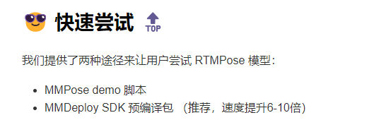
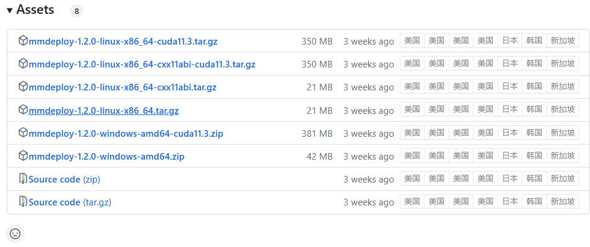

# MMDeploy

转了一圈了，还是回到了 [MMDeploy](https://github.com/open-mmlab/mmdeploy)，这个项目能够部署这么多的模型必定有可学习之处，并且能够快速推进我的项目进度，所以选择尝试

## Install

1. install mmdeploy

   ```shell
   pip install mmdeploy
   ```

2. install onnx

   ```shell
   pip install onnx
   pip install onnxruntime
   ```

3. 直接转换

   ```shell
   python tools/deploy.py \
       configs/mmpose/pose-detection_onnxruntime_static.py \
       td-hm_hrnet-w32_8xb64-210e_coco-256x192.py \
       hrnet_w32_coco_256x192-c78dce93_20200708.pth \
       demo/resources/human-pose.jpg \
       --work-dir mmdeploy_models/mmpose/ort \
       --device cpu \
       --show
       
   python tools/deploy.py \
       configs/mmpose/pose-detection_simcc_onnxruntime_dynamic.py \
       /github/mmdeploy/model_zoo/rtmpose/rtmpose-m_8xb256-420e_aic-coco-256x192/rtmpose-m_8xb256-420e_aic-coco-256x192.py \
       /github/mmdeploy/model_zoo/rtmpose/rtmpose-m_8xb256-420e_aic-coco-256x192/rtmpose-m_simcc-aic-coco_pt-aic-coco_420e-256x192-63eb25f7_20230126.pth\
       demo/resources/human-pose.jpg \
       --work-dir mmdeploy_models/mmpose/ort \
       --device cpu \
       --show
   ```

   surprisingly 没有遇到什么错误

4. 测试了一下速度。对于 detection 模型 ONNX 格式有显著的速度提升，而对于 pose 模型，甚至 ONNX 格式有所下降

5. RTMDet 并没有较好的推理速度，大概需要 150 ms 来获得一张图片的结果。直接转战 YOLO 好了...

6. Ultratics YOLO 也是一个超棒的学习项目啊...其中也包含了 ONNX 导出 TRT 导出

   先学习导出的流程，然后再针对报错进行特殊化处理

## SDK 预编译包

1. 参考 [github/mmpose](https://github.com/open-mmlab/mmpose/blob/main/projects/rtmpose/README_CN.md) 来使用 SDK 进行推理。整个 readme 太长了，不太好阅读，建议在使用 vscode or typora 阅读，这样更有层次

   

2. 在 mmdeploy 项目中下载预编译包

   

   然后解压

3. 从硬件模型库中下载模型 [openplatform](https://platform.openmmlab.com/deploee)

   

   选择 aic coco 联合数据集模型，并且选用 dynamic 模型，我不太清楚 dynamic 和 static 之间的区别

   把下载好的模型放到上方解压的 mmdeploy 预编译包中

4. 安装 mmdeploy-runtime

   ```python
   pip install mmdeploy-runtime
   ```

   这可能是 mmlab 套壳的 onnxruntime

5. 经过测试不需要安装预编译包，实际上直接 pip install mmdeploy-runtime 就可以了，里面已经包含了那些预编译的 .so 文件

## SDK on windows

1. 遇到问题

   ```python
   RuntimeError: failed to create detector
   ```

2. 

[[deploee\] terminology · open-mmlab/mmdeploy · Discussion #1564 (github.com)](https://github.com/open-mmlab/mmdeploy/discussions/1564)

使用 mmpose 的模型不太行，尝试一下其他模型
