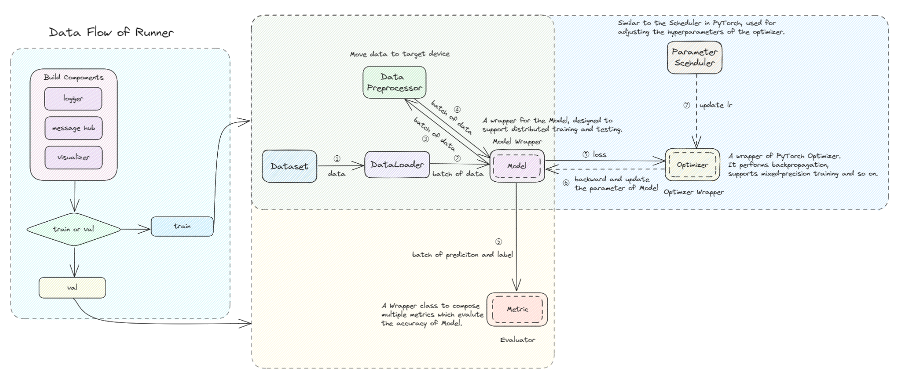

# MMEngine 2.0

系统地对 mmengine 进行总结，按照目前的笔记风格，对概念进行整理

## Registry

在 mmengine 中 Registry 仍然是一个很重的设计，逻辑链条复杂。这个设计的优点在于：能够方便地使用配置文件构建所需的实例。但是**缺点也非常明显**：

1. 损害了代码的易读性，无法链接到对象，代码都找不到在哪儿🧐
2. 在跨项目使用的时候存在切换 scope 的问题
3. Registry 本身的代码逻辑不好读
4. 由于注册逻辑的存在，在 build 的时候增加了代码复杂程度

所以使用的最佳方式为：在 config 中指定 scope 名称为项目包名称（可以 import），然后在项目中新建一个 `registry.py`，通过 `locations` 来注册模块

```python
from mmengine.registry import DATASETS as MMENGINE_DATASETS

DATASETS = Registry(
    'dataset',
    parent=MMENGINE_DATASETS,
    locations=['PROJECT.datasets'])
```

这里必须要加入 `parent & locations` 参数，才能成功注册。原因是在 Runner 中使用的是 mmengine 的根注册器，在这里加入 parent，才能将我们的注册器链接到根注册器中，链接方式为 `import_module(scope.registry)`。而加入 locations 使得注册器通过 `import_from_location` 方法，将模块真正地注册进去

之后，无论你是使用 `from mmengine.registry import xxx` 还是使用 `from PROJECT.registry import xxx`，你 PROJECT 中注册的模块一定能被找到

## Config

在之前的笔记中已经总结得非常好了，缺点仍然是代码的易读性不够好。在继承代码配置的时候，也很难通过跳转的方式得到基本配置文件

## Dataset

一般来说需要自己重构，不需要做过多的定义。对于 mmengine 来说，设计了如下结构：

1. meta info，用于保存数据集的额外信息，例如数据集名称、数据集类别
2. lazy init，在创建 dataset class 时不必将所有的 data list 载入
3. `load_data_list`，获得整个 data list
4. `get_data_info`，是通过 idx 获得 data list item 的样板函数，其中实现了 `serialize_data` 逻辑，作用是让多个 dataloader worker 共享内存空间来 [Save memory](https://mmengine.readthedocs.io/en/latest/advanced_tutorials/basedataset.html#save-memory)
5. `prepare_data`，是通过 idx 获得 input data 的样板函数，在这个过程中调用 `get_data_info` 获得 data list item，然后使用 `pipeline` 获得 input data 以及进行数据增强

其中，所谓的 `pipeline` 就是一个 `Compose` 类，其包含了一系列 TRANSFORM 类，这些类定义好了前向方法 `__call__(data_item)`，当 data item 顺序通过这些类后，获得最终的 input data

## ManagerMixin

ManagerMixin 能够对类的实例进行管理，从而能够从全局使用同一个共享对象。其实现通过设置元类 `metaclass=ManagerMeta` 完成

1. `ManagerMeta` 设置了一个 `cls._instance_dict` 来保存类的实例，并且规定类的`__init__` 参数必须包含 `name`。这保证每一个类的对象都有一个对应的 name 作为其标识符
2. `ManagerMixin` 实现了两个方法：`get_instance & get_current_instance`，他们通过 name 来获得类中的实例。其中 `get_instance` 会创建对象，如果对象之前没被创建过

## MessageHub & Logger

这两者都是基于 ManagerMixin 的类，所以全局都是使用的同一个实例

**Message hub** 用于存储两个部分：

1. log information，主要为 lr, loss 这种训练时产生日志，保存在 `self._log_scalars: Dict[name, HistoryBuffer]`。要存储这些信息，还使用了 `HistoryBuffer` 来存储，实际上这个 buffer 就是一个很长的 array，可以不断地更新日志（array 变长），更新方式为：

   - `message_hub.update_scalar('train/loss', loss)`
   - `message_hub.update_scalars(log_dict)`

   这些信息会用于输出日志，以及 visualzation backend `TensorboardVisBackbend`。mmengine 对 visualizer 统一了接口，使用 `add_scalars` 来向这些可视化后端添加记录

2. runtime information, 主要是 iter times, meta information 等信息，保存在 `self._runtime_info[name, value]`不使用 `HistoryBuffer` 存储

**MMLogger** 的使用非常简单，在代码中可以直接获得 logger

```python
from mmengine.logging import MMLogger 

# get instance
logger = MMLogger.get_instance(name='mmengine')
# or get current instance
logger = MMLogger.get_current_instance()
# log
logger.info(log_string)
```

也可以使用接口 `print_log`

```python
from mmengine.logging import print_log

print_log(msg, logger='current')
```

## Checkpoint & WeightInit

checkpoint 和权重初始化是非常相关的，当然权重初始化也有其他的简单情况。这里我将二者放在一起整理

一般装载 checkpoint 分为2步：

1. 从文件读取 checkpoint 到内存当中
2. 将读取的 checkpoint 文件装载到模型当中

这两部分别可由：`_load_checkpoint` 以及 `_load_checkpoint_to_model` 完成

为了完成第一步，需要应对不同的文件类型，有的文件是从网上下载的，有的文件是从本地读取的。mmengine 使用了 `CheckpointLoader` 来处理不同的文件类型，基本上常用的就是 `torch.load` 从本地装载

为了完成第二步，实际上就是调用了 pytorch 的 `module.load_state_dict` 只是更改了默认 `strict=False`，并且加入了 logger 记录不匹配的权重

而 `PretrainedInit` 实际上就是使用 `load_checkpoint` 完成的。除此之外，还有一个 `_load_checkpoint_with_prefix` 用于载入固定前缀的权重（key prefix 也会被删除），然后再使用 `load_state_dict` 装载到模型

## BaseModel

mmengine 设计了 `BaseModel`，所有的模型都应该继承这个类，该类设计了三个接口：

1. `train_step`
2. `val_step`
3. `test_step`

`BaseModel` 不直接使用 `forward` 方法，而是在 `xxx_step` 中调用，因为各个 step 中还包含了 data preprocee（将数据移动到 cuda 上），以及模型参数更新。所以最好把 `BaseModel` 看作对模型的封装，是一个流程，而不是模型本身

## ParamScheduler

mmengine 自己实现了一个基础的 `_ParamScheduler` 可以对 lr, momentum 进行规划。实际上只对 lr 进行了规划，很少涉及对 momentum 进行控制

理解 `_ParamScheduler` 有几个重要部分：

1. schedule 在何时开始、何时结束。该类使用了3个属性来进行控制：`begin & end & global_step & last_step`。当 global step 在 begin 和 end 之间时，才会进行 step 迭代，此时才会更新 `self.last_step & self.last_value`
2. schedule 的更新周期由 `by_epoch: bool` 参数控制
3. step 是 lr 更新的核心函数。通过 `self.get_value` 返回每一个 param group 的新学习率。最后将更新的学习率保存为 `self.last_value`。值得注意的是，**更新方式是 chainable 的**，即根据上一次的更新，迭代出当前的学习率，而不是根据 epoch or iteration 的值来计算当前学习率是多少。这样的好处是：在多个 scheduler 连接的时候，不用考虑连接值是多少，直接进行迭代即可

在 scheduler 初始化的时候，会初始化 `self.last_step = -1`，然后会立即执行一次 step，并且保证了 scheduler 一定在 optimizer 之后更新

**另外，scheduler 的具体执行代码在 hook 当中，而不在 model or loop 当中**

scheduler 的 `state_dict`，是直接使用了 `class.__dict__` 来保存，但是排除了 `optimizer`

## OptimizerWrapper

**为什么要做一个 optimizer wrapper：**

1. 统一接口，能够在 base model 中使用 `update_params`
2. 具有扩展性，可以使用梯度裁剪、梯度累计、混合精度训练（AMP）等复杂操作

首先 `OptimizerWrapper` 继承了基类 `BaseOptimWrapper`，这个类别的作用就是统一 wrapper 和原始 optimizer 的接口，包括：`step, param_groups` 等。而 `OptimizerWrapper` 就可以实现高级功能，例如 `update_params`

```python
    def update_params(
            self,
            loss: torch.Tensor,
            step_kwargs: Optional[Dict] = None,
            zero_kwargs: Optional[Dict] = None) -> None:
        loss = self.scale_loss(loss)
        self.backward(loss)
        if self.should_update():	# accumulation
            self.step(**step_kwargs)
            self.zero_grad(**zero_kwargs)
```

实际上 optimizer 的行为还要更复杂一些，例如：我们需要对 backbone 采取单独的学习率，这需要接收模型参数，所以不能使用简单的 `Registry` 方式来直接创建 optimizer wrapper。mmengine 中使用了一个 `DefaultOptimWrapperConstructor` 来创建 optimizer wrapper。可以通过添加 `paramwise_cfg` 来控制不同网络层的学习率

```python
optim_wrapper = dict(type='OptimWrapper', 
                     optimizer=dict(type='AdamW', lr=0.0001, weight_decay=0.01),
                     paramwise_cfg=dict(custom_keys={'layer_name': dict(lr_mult=0.1)}))
```

`paramwise_cfg` 通过设置 `custom_keys`，对包含有 `layer_name` 的参数单独将其学习率乘以 0.1，并将**该层单独**作为一个 group 添加到 param groups 当中

## Evaluator

Evaluator 的逻辑非常简单，其保存了一系列 metrics，这些 metrcis 能够评估预测结果

在 val loop 过程中，输出结构首先通过 `Evaluator.process` 方法进行初步处理，`Evaluator.process` 调用的则是 `metric.process`，我们可以在这里打包一些所需要的结果，保存在 `metric.result` 当中。之后就调用了 `Evaluator.evaluate -> metric.evaluate` 将保存在 `metric.result` 中的结果进行处理，计算最终指标。

所以关键调用函数为 `metric.evaluate`，过程如下：

1. 使用 `collect_results` 对不同 rank 的结果进行整合，并且将结果都放在了 cpu 上
2. 使用 `metric.compute_metrics` 方法在主进程中计算最终的指标，然后将计算结果广播到其他进程

所以在实际使用过程中，我们只需实现 metric 类，并且实现关键的两个函数即可：`process & compute_metrics`

并且在实现 process 的过程中，`self.results` 中每一个样本为单样本，而不是 batch 样本。这是因为在分布式测评时，我们会以单样本的总数去裁剪 collected results

## Dist Comm

分布式通信基本上和 `torch.distributed` 相似，不过改进了一些可用性，例如：加入 `is_distributed()` 判断，使得在非分布式系统上不会报错；对需要创建 place holder 的地方自动创建，例如 `all_gather` 相关方法

除此之外还提供了 CPU 上的 `collect_results` 方法，该方法是创建了一个临时文件夹，将各个 rank 的对象保存在文件夹中，然后在 rank0 上进行整合

## DefaultHooks

Hooks 机制是在 runner 的特定节点插入一些功能。Default hooks 其实非常重要，负责了记录日志，更新学习率，保存模型等。但是通常在配置中被隐藏起来了，在 mmengine 中 default hooks 有6个

1. **IterTimerHook**，`after_iter`，记录每一个 iteration 实用的时间，估算训练所需时间 eta

2. **LoggerHook**，`after_train_iter`，日志将根据 interval 进行采样，最终输出到 terminal，并保存到日志文件和 visualization backend 中

3. **ParamSchedulerHook**，`after_train_iter or after_train_epoch`，在每一个 epoch or iter 过后更新学习率

4. **CheckpointHook**，`after_train_iter or after_train_epoch & after_val_epoch & after_train`，保存信息：model, optimizer, scheduler, epoch, iter, seed, dataset meta 等

5. **DistSamplerSeedHook**，`before_train_epoch` 设置随机种子 `set_epoch`

6. **RuntimeInfoHook**，`before_train_iter & after_train_iter & after_val_epoch` 这里会将运行时的信息放入 message hub 当中，包括 meta，lr，loss，metrics


## Runner

**重要！**模型训练流程图如下



我将用伪代码的形式来描述整个 Runner 流程

```python
class Runner:
    def __init__(self, **cfgs):
        # dataloader, can be lazy init
        self.train_dataloader = self.build_dataloader(mode='train')
        self.val_dataloader = self.build_dataloader(mode='val')
        self.test_dataloader = self.build_dataloader(mode='test')
        
        # init distributed, self.setup_env(), I elaborate here
        mp.set_start_method('fork', force=True)
        torch.cuda.set_device(local_rank)
        torch.dist.init_process_group(backend='nccl')
        
        # random seed
        self.set_randomness(seed)
        
        # log and experiment_name
        self.mkdir_or_exist(work_dir)	# done before here
        self._experiment_name = ...
        self._log_dir = ...
        self.logger = self.build_logger()
        
        # message hub
        self.message_hub = self.build_message_hub()
        
        # visualizer
        self.visualizer = self.build_visualizer()
        
        # build model and dist model
        self.model = self.build_model()
        self.model = self.wrap_model(self.model)
        
        # hooks
        self.hooks = self.register_hooks(default_hooks, custom_hooks)
        
        # dump config
        self.dump_config()
        
	def train(self):
        # build loops
        self.train_loop = self.build_train_loop()	# EpochBased or IterBased
        self.val_loop = self.build_val_loop()
        
        # build optimizer and scheduler
        self.optm_wrapper = self.build_optim_wrapper(model_parameters)
        self.param_schedulers = self.build_param_scheduler(self.optim_wrapper)	# a list
        
        # init model weights
        model.init_weights()
        
        # load or resume
        self.load_or_resume()
        
        # run loop
        model = self.train_loop.run()
        
        return model 
```

注意，建议使用 `mp.set_start_method('spawn', forec=True)`，因为这会造成一些潜在问题 [link](https://pytorch.org/docs/stable/notes/multiprocessing.html#cuda-in-multiprocessing) [issue](https://github.com/pytorch/pytorch/issues/40403)，但是如果能确保在 fork 之前没有任何的 CUDA 操作（不创建 cuda tensor, 不将模型移到 cuda 上等）就没有问题

## 学习点

1. `inspect` 可以用于查看函数参数，获得类的成员

2. Mixin

   Mixin 是面向对象程序设计语言中的类，提供了方法的实现。其他类可以访问 mixin 类的方法。由于 Python 允许使用多重继承，因此 Mixin 就可使用多继承实现

   多继承会顺序继承，所以同名的方法会优先使用排序靠前的父类

   ```python
   class A:
       def print(self): print("A")
   
   class B:
       def print(self): print("B")
   
   class C(B, A): pass
   class D(A, B): pass
   
   C().print() # B
   D().print() # A
   ```

   多继承的初始化还需要注意 Method Resolution Order, MRO 的顺序，参考 [CSDN](https://blog.csdn.net/uncle_ll/article/details/88900521)，举一个简单例子

   ```python
   class A(object):
       def __init__(self):
           print('init a')
           super().__init__()
   
   class B(object):
       def __init__(self):
           print('init b')
           super().__init__()  # comment this line, you will see no A is initialized
   
   class C(B, A):
       def __init__(self):
           B.__init__(self)
   
   C()
   print(C.mro())
   
   # init b
   # init a
   # [<class '__main__.C'>, <class '__main__.B'>, <class '__main__.A'>, <class 'object'>]
   ```

   可以看到我们只是调用了 `B.__init__` 但是 A 仍然被初始化了，这是因为在 B 的初始化方法中我们用了 `super().__init__`，这里需要理解 super 的作用

   实际上这里 super 的参数是省略的，完整的参数为：

   ```python
   super(B, self).__init__()
   # super(cls, instance).__init__()
   ```

   其作用就是在 mro 列表中获得下一个对象，通常来说就是父类

   另一个有趣的现象是，你无法实现下面的代码，因为无法生成 MRO 列表

   ```python
   # Wrong
   class C(A, B):
       def __init__(self):
           B.__init__(self)
   # Correct
   class C(B, A):
       def __init__(self):
           B.__init__(self)
   ```

   如果可以生成 MRO 的话会是这样子：`C->A->B->A`，那么 A 可以覆盖 B，而 B 也可以覆盖 A，这就矛盾了，到底谁覆盖谁？

3. **理解原始 optimizer 组件**

   下方代码是一个简单的 Optimizer 的实验，从结果可以知道：

   1. `state.keys() & param_groups[0]['params'] & model parameters` 的长度都是一样的（前提是只有一个 param groups，并且他们都需要进行梯度计算 `requires_grad`）。实际上是因为他们都指向的同一个事物：模型的可学习参数
   2. `state_dict` 包含 `state & param_groups` 两个部分
      - `param_groups` 包含了当前的学习率、权重衰减等等
      - `state` 包含了当前的中间状态，例如梯度的一阶平均和二阶平均
   3. `defaults` 代表输入未经过 scheduler 的优化器参数

   ```python
   # simple optimizer test
   import torch
   from torch.optim.adamw import AdamW
   from torch.optim.lr_scheduler import CosineAnnealingLR
   from torchvision.models import resnet50
   model = resnet50(pretrained=False)
   opt = AdamW(model.parameters(), lr=0.01)
   # multi groups
   # params = list(model.parameters())
   # opt = AdamW([{'params': params[0], 'lr': 0.01},
   #              {'params': params[1:], 'lr': 0.001}])
   lr_scheduler = CosineAnnealingLR(opt, T_max=10)
   
   img = torch.randn(1, 3, 224, 224)
   target = torch.randint(0, 1000, (1,))
   
   output = model(img)
   loss = torch.nn.CrossEntropyLoss()(output, target)
   loss.backward()
   opt.step()
   lr_scheduler.step()
   
   print(len(opt.state))
   print(len(opt.param_groups[0]['params']))
   print(len(list(model.parameters())))
   print(opt.state_dict().keys())
   print(opt.param_groups[0].keys())
   print(opt.param_groups[0]['lr'])
   print(opt.defaults)
   
   # 161
   # 161
   # 161
   # dict_keys(['state', 'param_groups'])
   # dict_keys(['params', 'lr', 'betas', 'eps', 'weight_decay', 'amsgrad', 'foreach', 'maximize', 'capturable', 'differentiable', 'fused', 'initial_lr'])
   # 0.009755282581475769
   # {'lr': 0.01, 'betas': (0.9, 0.999), 'eps': 1e-08, 'weight_decay': 0.01, 'amsgrad': False, 'foreach': None, 'maximize': False, 'capturable': False, 'differentiable': False, 'fused': None}
   ```

4. Amp Training

   混合精度训练其实是自动地将某些节点转换为 fp16 进行计算，但是大多数节点仍然还是 fp32 计算，例如 layer norm，这对 transformer 来说就不太友好。经过测试纯卷积确实能够节省接近一半的显存 ~40%，而 transformer block 能节省 ~10% 的显存，在一些极致场景下，这10%可能就是你需要的。下面是测试的简单脚本

   ```python
   # a script to test amp training
   import torch
   import torch.nn as nn
   import torch.optim as optim
   from torch.cuda.amp import GradScaler, autocast
   
   device = "cuda"
   
   model = nn.Sequential(
       nn.Conv2d(256, 256, 3, 1, 1),
       nn.ReLU(inplace=True),  # inplace=True saves more memory
       nn.Conv2d(256, 256, 3, 1, 1),
       nn.ReLU(inplace=True)
   )
   
   model.to(device)
   
   # input_data = torch.randn(1, 256, 1024, 1024, device=device)
   # target = torch.randn(1, 256, 1024, 1024, device=device)
   input_data = torch.randn(8, 1024, 1024, device=device)
   target = torch.randn(8, 1024, 1024, device=device)
   loss_fn = nn.MSELoss(reduction='sum')
   optimizer = optim.SGD(model.parameters(), lr=1e-3)
   
   do_amp = False
   # Runs forward and backward passes with autocasting.
   for _ in range(1000):
       if do_amp:
           with autocast():
               output = model(input_data)
               loss = loss_fn(output, target)
   
           # Scales loss.  Calls backward() on scaled loss to create scaled gradients.
           # Backward passes under autocast are not recommended.
           scaler = GradScaler()
           scaler.scale(loss).backward()
   
           # scaler.step() first unscales the gradients of the optimizer's assigned params.
           # If these gradients do not contain infs or NaNs,# optimizer.step() is then called,
           # otherwise, optimizer.step() is skipped.
           scaler.step(optimizer)
   
           # Updates the scale for next iteration.
           scaler.update()
           optimizer.zero_grad()
   
       else:
           output = model(input_data)
           loss = loss_fn(output, target)
           loss.backward()
           optimizer.step()
           optimizer.zero_grad()
   ```

5. 梯度裁剪

   对于梯度的二范数值超过阈值的情况进行缩放。下面是一个简单的测试代码

   ```python
   import torch.nn as nn
   import torch
   
   clip_func = nn.utils.clip_grad_norm_
   
   a = torch.tensor([2., 5.], requires_grad=True)
   y = (a ** 2).sum()
   y.backward()
   print('tensor_grad before clip:', a.grad)
   print('grad norm before clip:', torch.norm(a.grad))
   total_norm = clip_func([a], 10, norm_type=2)
   print('tensor_grad after clip:', a.grad)
   print('grad norm after clip:', torch.norm(a.grad))
   print('total_norm is the same as grad norm before clip:', total_norm)
   
   # tensor_grad before clip: tensor([ 4., 10.])
   # grad norm before clip: tensor(10.7703)
   # tensor_grad after clip: tensor([3.7139, 9.2848])
   # grad norm after clip: tensor(10.0000)
   # total_norm is the same as grad norm before clip: tensor(10.7703)
   ```

6. 在对类方法使用 `partial` 方法时，是会报错的，因为 `self` 不会被自动传入，必须使用 `functools.partialmethod`

7. 网络如果存在一些不稳定算子，即使固定了随机种子也没办法，可以查看其中的例子 [torch.use_deterministic_algorithms](https://pytorch.org/docs/stable/generated/torch.use_deterministic_algorithms.html)，例如插值之类的操作都无法保证可复现性。下面是一个简单的 `F.grid_sample` 的随机性展示，也可以查看 [pytorch discuss](https://discuss.pytorch.org/t/f-grid-sample-non-deterministic-backward-results/27566/5)，可以看到固定随机种子的梯度是有微小差异的

   ```python
   # test on F.grid_sample
   import torch
   import torch.nn as nn
   import torch.nn.functional as F
   from mmengine.runner.utils import set_random_seed
   from torch.optim.sgd import SGD
   
   set_random_seed(0)
   class GridSample(torch.nn.Module):
       def __init__(self):
           super().__init__()
           self.conv = nn.Sequential(
               nn.Conv2d(3, 256, 3, padding=1),
               nn.BatchNorm2d(256),
               nn.ReLU(),
               nn.Conv2d(256, 256, 3, padding=1),
               nn.BatchNorm2d(256),
               nn.ReLU(),
               nn.Conv2d(256, 256, 3, padding=1),
           )
   
       def forward(self, x, grid):
           x = self.conv(x)
           return F.grid_sample(x, grid, mode='bilinear', padding_mode='zeros', align_corners=True)
   
   grid_sample = GridSample().cuda()
   x = torch.randn(4, 3, 10, 10).cuda()
   optim = SGD(grid_sample.parameters(), lr=0.0001)
   
   for i in range(10):
       grid = torch.randn(4, 10, 10, 2).cuda()
       out = grid_sample(x, grid)
       tgt = torch.randn(4, 256, 10, 10).cuda()
       loss = F.mse_loss(out, tgt, reduction='sum')
       print(loss.item())
       loss.backward()
       optim.step()
       optim.zero_grad()
   ```

   这个随机性在训练过程中带来的表现为：resume 过后只能对上第一个 iteration 的 loss 值，之后就对不上了，因为梯度变了
   
8. 还有一个省显存的使用方法：activation checkpointing，可以在 mmengine 中方便配置

## Question

1. 最后的 `PackxxxInputs` 现在是否能够通过 `@dataclass` 简单处理掉

2. Logger 写得还是比较繁琐，能不能写得更简洁一些，尤其是 LogProcessor，不过用来使用的话，完全没问题

3. CheckpointHook 中保存 best model 是有 bug 的

4. Fileio 写得也比较复杂，可以考虑简化。到底什么是 FileClient?

5. Evaluator 中加入了 其设计的 BaseDataElement 逻辑，不好用

6. Optimizer 中加入了 `base_param_settings`，这似乎是一个无用设计，考虑去除

7. 为什么 pytorch 通常需要递归子模块？搞清楚其中区别 [modules vs children](https://www.cnblogs.com/marsggbo/p/11512242.html#nnmodules-vs-nnchildren)，modules 是完全递归，我们通常不希望这样做，而 children 则是向下递归一层，而 `parameters & named_parameters` 就是返回每一个可学习的网络层参数

8. BaseModel 的概念不够好，而是更应该理解为 xxx 模型

9. Hook 的标识不够清晰。注册了哪些 default hook，有什么用，这些对于阅读代码的人来说不友好

10. AMP 在什么时候能够节省显存？我尝试过自己的代码，并不怎么省显存，是 nn.Embedding 的问题？[issue](https://github.com/pytorch/pytorch/issues/98814) 实际上也没办法手动转换，比较麻烦

11. `MMDistributedDataParallel` 有没有替代方式，不够优雅

12. `data_preprocessor` 写得比较隐晦，有时候会忽略掉

13. num workers 是真的很有用，尤其是当获取 data 的时间大于计算时间的时候，在 cpu 上进行数据增强还是比较耗时的...

14. amp 的训练似乎出现了问题，即使是浮点训练，loss 也下降没那么快，是不是要检查下 loss 的输出是否有平滑

    是的 loss 是由 log processor 进行了平滑处理，window size = 10。而且 mmengine 的 amp optim wrapper 默认是对整个模型进行自动半精度处理，但通常在 head 部分不会使用半精度。所以我去除了 autocast 的 context，选择使用 mmcv 中的 `auto_fp16` 的装饰器形式，只对模型的 backbone 部分进行半精度，然后将 `AmpOptimWrapper` 的 `optim_context` 改为默认版本，不使用 `autocast` 的上下文

    `clip_grad` 对于训练的收敛也是非常重要的，如果不进行梯度剪裁的话，loss 在初期似乎下降更慢，没有做过完整的实验

15. 在模型中的随机过程也必须确定下来，这样才能完全的 resume！

16. revised keys 没有办法传到 runner 当中

17. random seed 到底能控制到哪些层面？

    worker 中的随机种子是独立控制的

18. 对上了 cosine learning rate and warm by epoch

19. logger 没办法看到是从哪个文件记录的，不好 debug

20. config 的代码也太重了，我不需要这么多的功能，需要删繁就简，但如果使用 LazyConfig 的格式，registry 就会成为历史

21. Pytorch 的 fp16 在 ViT 当中的计算过程

22. 不好替换 collate function，是使用的 `get` 方法，找不到你注册的 collate function，必须要在 config 里面使用完整路径

23. freeze weights 应该在 build 的时候就完成，更准确地说需要在 DDP 之前完成，否则 DDP 将不会识别 `requires_grad=False`，并尝试更新梯度，这就会导致报错 [github issue](https://github.com/pytorch/pytorch/issues/22049#issuecomment-505617666)

    一个典型的报错：

    - `RuntimeError: Expected to have finished reduction in the prior iteration before starting a new one. `
    - `Parameter indices which did not receive grad for rank 0`

24. mmengine worker init fn 会让每一个 epoch 的随机性相同，参考 [zhihu](https://zhuanlan.zhihu.com/p/618639620)

    ```python
    from torch.utils.data import Dataset, DataLoader
    from mmengine.dataset import worker_init_fn as default_worker_init_fn
    from mmengine.dataset.sampler import  DefaultSampler
    from mmengine.runner.utils import set_random_seed
    import numpy as np
    set_random_seed(1)
    class TestDataset(Dataset):
        def __init__(self, num):
            self.data = [i for i in range(num)]
    
        def __getitem__(self, idx):
            ori_data = self.data[idx]
            random_aug = np.random.randint(0, 100)
            return (ori_data, random_aug)
    
        def __len__(self):
            return len(self.data)
    from functools import partial
    init_fn = partial(
        default_worker_init_fn,
        num_workers=8,
        rank=0,
        seed=0,
        disable_subprocess_warning=True)
    
    dataset = TestDataset(20)
    samper = DefaultSampler(dataset, shuffle=True)
    dataloader = DataLoader(dataset, sampler=samper, batch_size=10, worker_init_fn=init_fn, num_workers=8)
    data_iter = iter(dataloader)
    epoch = 3
    for epoch_id in range(0, epoch):
        # set epoch
        samper.set_epoch(epoch_id)
        for idx, data in enumerate(dataloader):
            print(f'epoch {epoch_id}, iter {idx}, data {data}')
        print('-----------------------------------------')
    ```

    解决方法是加入 `torch.initial_seed()`

    ```python
    worker_seed = (num_workers * rank + worker_id + seed + torch.initial_seed()) % 2**32
    ```

25. mmengine 中所产生的 json file 实际上是 line json，直接使用 `json.loads` 读取会产生问题，需要逐行读取

    ```python
    for line in f:
        data = json.loads(line)
    ```

    这还是在 hugging face 学的