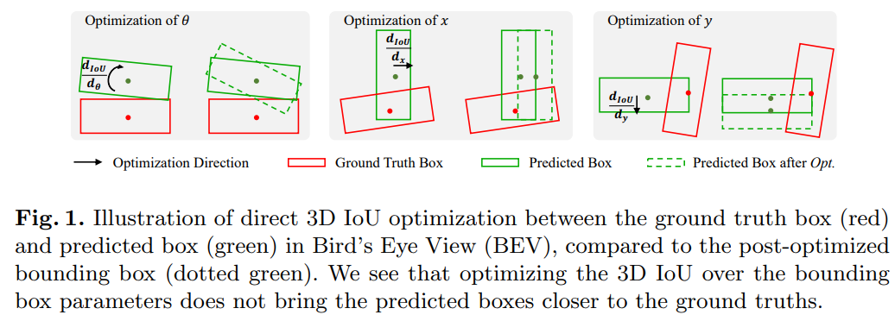
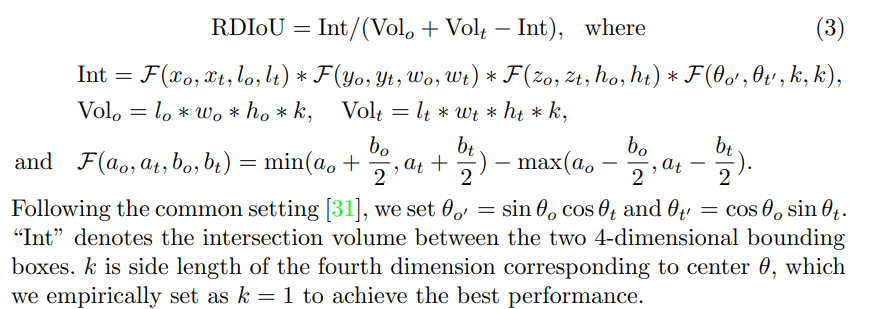
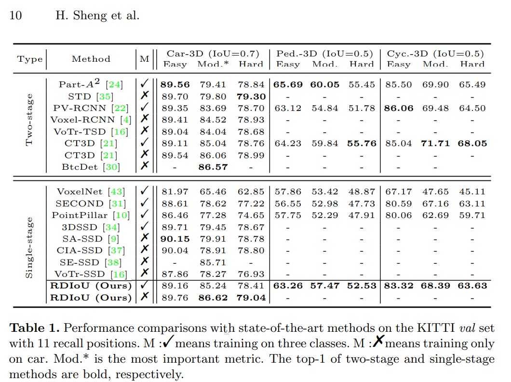

# RDIoU

---

Sheng, Hualian, et al. *Rethinking IoU-Based Optimization for Single-Stage 3D Object Detection*. 1, arXiv:2207.09332, arXiv, 19 July 2022. *arXiv.org*, http://arxiv.org/abs/2207.09332.

---

这篇论文的效果也是非常棒，基本上就超越了大部分的纯点云方法，感觉像是 GFL 的 3d 沿伸，非常有意思。整理一下，看看复现效果如何

## RDIoU

由于旋转框的属性，IoU loss 很容易受到两个框之间的相对角度的影响，这将会影响网络的收敛，例如下图所示，优化的方向并不是我们所期望的

所以论文将旋转维度解耦出来，相当于把框都固定到某个方向，然后再计算他们的 IoU。解耦出来的旋转角度以独立乘积加入其中。完整的损失函数如下

在 PillarNet 中也应用了类似的思想，我实验下来效果并不是特别好。我估计单独使用这个 IoU loss 的提升也是相对有限的，在论文里也没有提到这个消融实验

## GIoU & DIoU

这里顺手整理一波升级的 IoU，参考 [zhihu](https://zhuanlan.zhihu.com/p/94799295)

IoU 的缺点：

1. 不能反映两者的距离
2. 不能反映非重合区域的情况

为改善上面的两个缺点，提出 GIoU
$$
G I o U=I o U-\frac{\left|A_{c}-U\right|}{\left|A_{c}\right|}
$$
其中 $A_c$ 表示两个框的最大闭包，$U$ 则表示两个框的联合面积，如果两个选框距离比较远，并且非重叠区域很大的话，GIoU 就能反映出来。之后又提出了 DIoU
$$
D I o U=I o U-\frac{\rho^{2}\left(b, b^{g t}\right)}{c^{2}}
$$
其中 $c$ 是最大闭包的对角线，$\rho$ 是欧式距离计算公式，$b, b^{gt}$ 代表框的中心。DIoU 损失比 GIoU 损失收敛得更快，也更直观

之后又提出了另外一个 CIoU，进一步考虑长宽比，这里不做进一步整理了

## RDIoU + DIoU

把 RDIoU 和 DIoU loss 结合起来
$$
\mathcal{L}_{R L}=1-\mathrm{RDIoU}+\rho_{c} \\
\rho_{c}=\frac{\delta\left(\boldsymbol{c}_{o}, \boldsymbol{c}_{t}\right)}{\operatorname{Diag}} \\
\text { Diag }=\mathcal{G}\left(x_{o}, x_{t}, l_{o}, l_{t}\right)+\mathcal{G}\left(y_{o}, y_{t}, w_{o}, w_{t}\right)+\mathcal{G}\left(z_{o}, z_{t}, h_{o}, h_{t}\right)+\mathcal{G}\left(\theta_{o^{\prime}}, \theta_{t^{\prime}}, k, k\right) \text {, } \\
\mathcal{G}\left(a_{o}, a_{t}, b_{o}, b_{t}\right)=\left(\max \left(a_{o}+\frac{b_{o}}{2}, a_{t}+\frac{b_{t}}{2}\right)-\min \left(a_{o}-\frac{b_{o}}{2}, a_{t}-\frac{b_{t}}{2}\right)\right)^{2}

$$

## RDIoU + GFL

像 GFL 一样，我们希望选框的质量也能加入的评分体系当中，不了解 GFL 可以看看作者在知乎上的解析

1. [大白话 Generalized Focal Loss](https://zhuanlan.zhihu.com/p/147691786)
2. [大白话 Generalized Focal Loss V2](https://zhuanlan.zhihu.com/p/313684358)

GFL 中的 quality focal loss 简单来讲就是使用 soft target + focal loss。其中 soft target 是由 hard  target + iou quality 共同产生。论文中的公式如下
$$
\mathcal{L}_{R Q F L}=-\beta_{1}|\mathrm{RDIoU}-y|^{\beta_{2}}((1-\mathrm{RDIoU}) \log (1-y)+\mathrm{RDIoU} \log (y))
$$
而对于回归的 DFL，并没有进一步像 GFL 中借鉴

整体的优化 loss 就表示如下
$$
\mathcal{L}=\mathcal{L}_{R Q F L}+\gamma_{1} \mathcal{L}_{d}+\gamma_{2} \mathcal{L}_{R L}
$$
中间的 loss 是方向分类 loss，使用 cross entropy

## Experiment

### KITTI

在 KITTI 上效果爆炸

