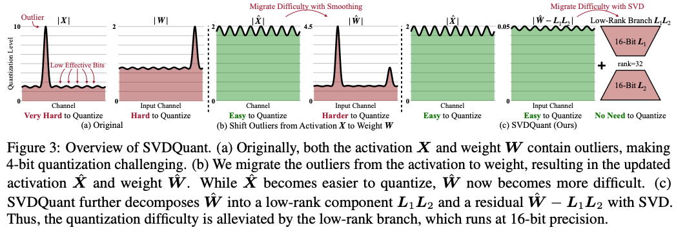
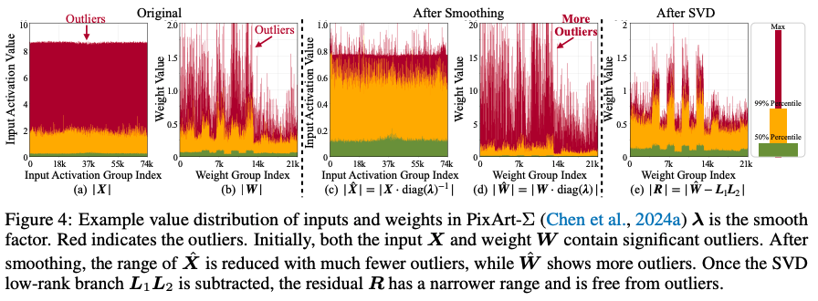
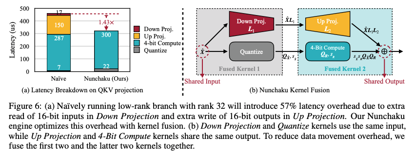
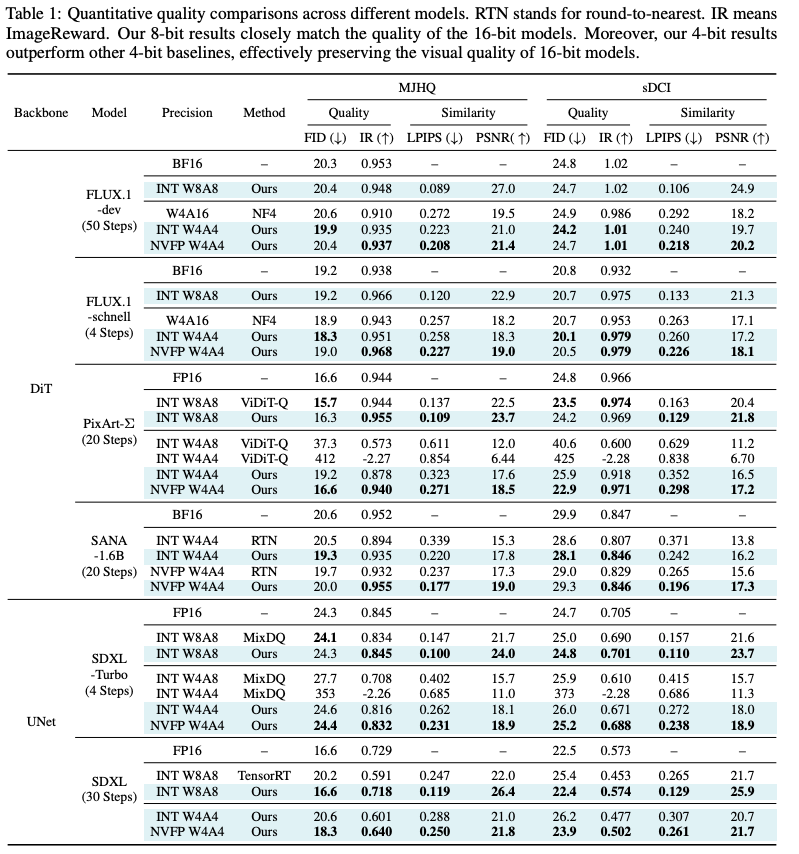
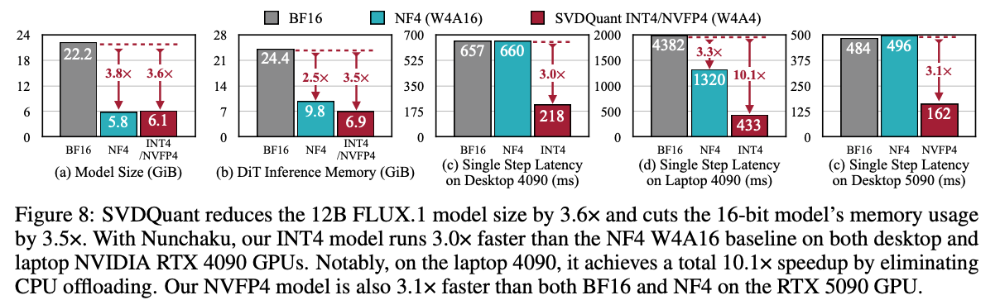
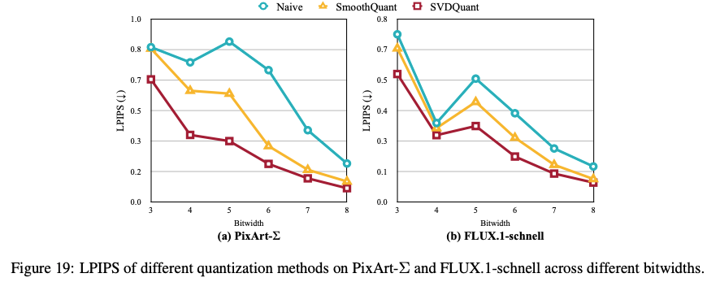

# SVDQuant

[arxiv](https://arxiv.org/abs/2411.05007) [github](https://github.com/nunchaku-tech/deepcompressor)

## Introduction

所面临的问题：当前的主流方法  SmoothQuant (W8A8) 会将 activation outlier 转移到权重当中，但是对于 W4A4 的量化方法，这种 smoothing 方式也将受到更多限制，因为 4-bit 权重无法像 8-bit 权重一样对 outlier 有很好的精度保证。

解决思路：使用一个 low-cost branch 将这些 outlier 进行吸收。具体来说，论文先利用 smoothing 的方式将 activation 的 outlier 移动到 weight 上，然后将 weight 的 outlier 用两个低秩矩阵 $L_1L_2$ 进行吸收。具体来说 weight $W$ 将被分解为两个部分：
$$
W = R + L_1L_2
$$
最终得到的 residual $R$ 会是一个更好量化的矩阵。如此 activation & weight 都能够进行很好的 4-bit 量化





论文在 related work 中也提到了其他方法也使用了 low-rank 的方式来做量化，不过他们的缺陷在于没办法做出加速效果，只专注于权重压缩效果。实际上把量化模型进行加速并不简单，这就是写算子的魅力时刻🫡

## Method

### 理论优化

矩阵乘法量化误差的定义
$$
E(\boldsymbol{X},\boldsymbol{W})=\|\boldsymbol{X}\boldsymbol{W}-Q(\boldsymbol{X})Q(\boldsymbol{W})\|_{F}
$$
为了方便描述，定义上述矩阵的形状：`X.shape = (m, k) & W.shape = (k, n)`

Frobenius 范数定义
$$
\|A\|_F = \sqrt{\sum_{i=1}^{m} \sum_{j=1}^{n} |a_{ij}|^2} = \sqrt{\operatorname{tr}(A^H A)}
$$
论文利用缩放得到了量化误差的一个上界，这个上界会更好分析和优化
$$
E(\boldsymbol{X},\boldsymbol{W}) \leq \|\boldsymbol{X}\|_{F} \|\boldsymbol{W} - Q(\boldsymbol{W})\|_{F} + \|\boldsymbol{X} - Q(\boldsymbol{X})\|_{F} \left( \|\boldsymbol{W}\|_{F} + \|\boldsymbol{W} - Q(\boldsymbol{W})\|_{F} \right)
$$
证明过程如下
$$
\begin{align*}
&\|\boldsymbol{X}\boldsymbol{W} - Q(\boldsymbol{X})Q(\boldsymbol{W})\|_F \\
&= \|\boldsymbol{X}\boldsymbol{W} - \boldsymbol{X}Q(\boldsymbol{W}) + \boldsymbol{X}Q(\boldsymbol{W}) - Q(\boldsymbol{X})Q(\boldsymbol{W})\|_F \\
&\leq \|\boldsymbol{X}(\boldsymbol{W} - Q(\boldsymbol{W}))\|_F + \|(\boldsymbol{X} - Q(\boldsymbol{X}))Q(\boldsymbol{W})\|_F \\
&\leq \|\boldsymbol{X}\|_F \|\boldsymbol{W} - Q(\boldsymbol{W})\|_F + \|\boldsymbol{X} - Q(\boldsymbol{X})\|_F \|Q(\boldsymbol{W})\|_F \\
&= \|\boldsymbol{X}\|_F \|\boldsymbol{W} - Q(\boldsymbol{W})\|_F + \|\boldsymbol{X} - Q(\boldsymbol{X})\|_F \|\boldsymbol{W} - (\boldsymbol{W} - Q(\boldsymbol{W}))\|_F \\
&\leq \|\boldsymbol{X}\|_F \|\boldsymbol{W} - Q(\boldsymbol{W})\|_F + \|\boldsymbol{X} - Q(\boldsymbol{X})\|_F \left(\|\boldsymbol{W}\|_F + \|\boldsymbol{W} - Q(\boldsymbol{W})\|_F\right).
\end{align*}
$$
本质上利用了三角不等式和柯西不等式。这个上界由4个关键因素限制

1. activation & weight 的 F-范数大小
2. activation & weight 的量化误差大小

如果是做 w4a16 量化的话，第二项直接为零，所以直接缩小 activation 的 F-范数将变得非常有收益，这也就是 AWQ 方法的直接体现。而对于 activation & weight 的量化误差，其实是整个误差当中的小头，也是几乎无法消除的部分。**所以矩阵乘法量化误差的核心其实就是 activation & weight 的 F-范数大小**

SVDQuant 首先也采用 AWQ 当中的 smoothing 方法，把 activation 当中的 outlier 转移到 weight 当中
$$
\hat{\boldsymbol{X}}=\boldsymbol{X}\cdot\operatorname{diag}(\boldsymbol{\lambda})^{-1}\\
\hat{\boldsymbol{W}}=\boldsymbol{W}\cdot\operatorname{diag}(\boldsymbol{\lambda})
$$
经过放缩的 weight 现在的 outlier 也会变得比较多，论文使用一个 low-rank 分支来把这些异常值进行转移，留下一个 outlier 较少的 residual 部分
$$
\hat{\boldsymbol{W}}=\boldsymbol{L}_{1}\boldsymbol{L}_{2}+\boldsymbol{R}\\
\boldsymbol{X}\boldsymbol{W}=\hat{\boldsymbol{X}}\hat{\boldsymbol{W}}=\hat{\boldsymbol{X}}\boldsymbol{L}_{1}\boldsymbol{L}_{2}+\hat{\boldsymbol{X}}\boldsymbol{R}\approx\underbrace{\hat{\boldsymbol{X}}\boldsymbol{L}_{1}\boldsymbol{L}_{2}}_{\text{16-bit low-rank branch }}+\underbrace{Q(\hat{\boldsymbol{X}})Q(\boldsymbol{R})}_{\text{4-bit residual }}.
$$
其中两个低秩矩阵的形状为 `L_1.shape = (m, r) & L_2.shape = (r, k)`

如此一来，矩阵乘法被分解为了两个部分：由 activation & low-rank 组成的高精度运算 + 由 activation & residual 组成的低精度运算。其中高精度运算的 tops 由于低秩的存在，会显著较低，可得其计算占比

```python
# r << min(m, n, k), usually 16 or 32
ratio = (m * r + n * r) / (m * n)
```

现在我们的目标就是要找到足够好的低秩矩阵，让矩阵乘法的量化误差最低。将低秩矩阵带回原来的矩阵量化误差式子中
$$
\|\hat{\boldsymbol{X}}\hat{\boldsymbol{W}}-\left(\hat{\boldsymbol{X}}\boldsymbol{L}_{1}\boldsymbol{L}_{2}+Q(\hat{\boldsymbol{X}})Q(\boldsymbol{R})\right)\|_{F}=\|\hat{\boldsymbol{X}}\boldsymbol{R}-Q(\hat{\boldsymbol{X}})Q(\boldsymbol{R})\|_{F}=E(\hat{\boldsymbol{X}},\boldsymbol{R})
$$
可以看到最终的误差从原来的 $E(X, W)$ 变为了当前的 $E(\hat{X}, R)$。此时回顾之前的矩阵量化误差分析结论：影响矩阵量化误差的2个关键因素就是 activation & weight 的 F-范数。换句话说，我们现在想要做的就是降低 $\hat{X}$ 和 $R$ 矩阵的 F-范数。而 $\hat{X}$ 是已经利用了 smoothing 方法进行优化，论文就不做进一步的讨论，问题进一步简化为：寻找足够好的低秩矩阵，以最小化 $R$ 矩阵的 F-范数大小 
$$
\|\boldsymbol{R}\|_{F}=\min_{L_1,L_2}\left\|\hat{\boldsymbol{W}}-\boldsymbol{L}_{1}\boldsymbol{L}_{2}\right\|_{F}
$$
这个问题其实早就被 SVD (Singular Value Decomposition) 给解决了。在 SVD 的语言中，这里就是在寻找 `rank=r`  的 $\hat{W}$ 矩阵的最优近似，即：$\hat{W}$ 矩阵的低秩近似。这里直接给出结论：$\|\boldsymbol{R}\|_{F}$ 的最小值就是 $\hat{W}$ 中 `i>r` 的奇异值的的几何平均 $\sqrt{\sum_{i=r+1}^{\min(m,n)}\sigma_{i}^{2}}$，而低秩矩阵则表示为
$$
\hat{\boldsymbol{W}}=\boldsymbol{U}\boldsymbol{\Sigma}\boldsymbol{V}\\\boldsymbol{L}_{1}=\boldsymbol{U}\boldsymbol{\Sigma}_{:,r}\\\boldsymbol{L}_{2}=\boldsymbol{V}_{:r,:}
$$
至此 SVDQuant 的误差理论分析已经结束，经由 smoothing + SVD 的双重优化，完成了对矩阵乘法误差的显著降低

### 算子优化

由于 SVDQuant 引入了低秩分支，虽然计算量少，但是输入和输出 shape 并没有改变，也需要花费大量的时间用于 memory 操作上。如果不做融合的操作，两个 branch 就会分别对输入和输出进行 memory 读取/写入，这样 memory 的操作就重复了两次。为了解决这个问题， SVDQuant 提出了 Numchaku (双截棍) Fused Kernel 的方式，只对输入和输出进行一次读取/写入，显著减少运行时间



## Experiment

SVDQuant 应该就是受到 LoRA 领域的启发，很有可能其出发点就是想要加速 LoRA 模型。论文的实验都是用的 diffusion 模型，没有 LLM 相关的结果。在 diffusion 评价指标上，SVDQuant 的指标都很好，非常接近 fp16 模型



在运行效率上，能够减少 3.6x 的显存，加速 3x



论文在附录里还和 SmoothQuant 在多个 bit-width 下进行了对比，其结果持续优于 SmoothQuant，但是在 8-bit 下对 SmoothQuant 没有显著优势



另外论文也指出对于 2-bit 量化（W2A4 or W4A2），SVDQuant 无法生成有意义的图像，一些研究也指出对于如此低 bit 的量化需要使用 QAT 的方式来大量更改 weight 的分布

## Question

- 什么是 Theorem & Proposition & Lemma & Corollary？

  > From DeepSeek
  >
  > 它们都是指“被证明为真的陈述”，但根据其重要性、功能和在逻辑链条中的位置，被赋予了不同的名称。你的混淆感非常正常，因为它们的区别有时确实有些主观。
  >
  > | 术语            | 中文     | 角色                     | 重要性                           | 依赖性                   |
  > | :-------------- | :------- | :----------------------- | :------------------------------- | :----------------------- |
  > | **Theorem**     | **定理** | 主要成果，理论核心       | **非常高**                       | 相对独立                 |
  > | **Proposition** | **命题** | 次要成果，有用的独立事实 | **中等**                         | 相对独立                 |
  > | **Lemma**       | **引理** | 辅助工具，证明的中间步骤 | **较低**（作为工具）             | **高**（为证明定理服务） |
  > | **Corollary**   | **推论** | 主要结果的直接推论或特例 | **可变**（但低于它所依赖的定理） | **极高**（直接源于定理） |

- SVDQuant 中是如何计算 smoothing factor $\lambda$ 的？

- SVDQuant 实际上只考虑了一层矩阵乘法的量化误差，对于深度学习的多层量化误差其实会局限性。如何寻找更优的低秩矩阵并结合 smoothing，仍然是一个可探索的话题

- SVDQuant 的 kernel 不太好和 norm 层融合起来，but it's not impossible