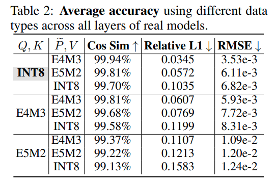

# SageAttention

[github](https://github.com/thu-ml/SageAttention) [arxiv](https://arxiv.org/abs/2410.02367)

## Concept

- Attention is unaccelerated in low-precision

  虽然目前低比特量化已经走到 8/4-bit 甚至更低，但实际上都只对 linear 层进行了量化，对于 attention 计算都是保持 fp16

- FlashAttention3 is good, but only optimized for Hopper

- 量化 attention 的挑战

  > 1. The matrix $K$ exhibits a significant channel-wise outlier, leading to substantial accuracy loss during quantization.
  > 2. Simply quantizing $(P, V)$ into INT8 does not consistently ensure the accuracy of $PV$ across various scenarios.

  对于挑战1，论文提出了一个 smooth K matrix 的方案。对于挑战2，论文直接使用 fp16 来做，不过使用一个 low-precision fp16 accumulator，这能让速度为原来的 2x

- Sage Attention 使用 INT8 进行量化，而不使用 FP8

  因为 INT8 操作能在更多的 GPU 上支持，而且 INT8 矩阵乘通常会比 FP16 快4倍，比 FP8 快2倍。并且实验得出 INT8 精度比 FP8 精度更好（但其实 FP8 的精度也已经保留得很好了）

  

  > From DeepSeek
  >
  > **INT8 & FP16 & FP8 理论峰值性能分析**
  >
  > - FP16/FP32混合精度：每个Tensor Core每个周期可处理 `16x16x16` 的矩阵块
  > - INT8：每个周期可处理 `32x32x32` 的矩阵块（通过张量分解实现）
  > - **FP8**：与INT8共享相同的计算单元，但需要额外的**缩放因子处理**（动态范围扩展），导致实际有效吞吐量约为INT8的 **50-70%**
  > - **理论加速比**：INT8的计算量是FP16的4倍（`(32^3)/(16^3) = 8`，但受指令级优化限制，实际为4倍）INT8比FP8快约 **1.4-2倍**（取决于缩放因子优化）

- FlashAttention

  [zhihu](https://zhuanlan.zhihu.com/p/676655352)

- Dynamic Quantization

- per-token & per-tensor & per-channel & per-block

  之前在 SmoothQuant 了解到了前三个量化方法，现在又多了一个 per-block，per-block 是在 per-token 的基础上再对 token 进行了分组，进一步减少了 scales 数量

  ```python
  # matrix A(M, N)
  import torch
  
  # per-tensor, scales (1,)
  scales = torch.max(A) / 127
  
  # per-token, scales (M,)
  scales = torch.max(A, dim=1) / 127 
  
  # per-channel, scales (N,)
  scales = torch.max(A, dim=0) / 127
  
  # per-block, scales (M // block_size,)
  A_ = reshape(A, "(m b) N -> m (b N)", b = block_size)
  scales = torch.max(A_, dim=1)
  ```

  对于 K & V 的量化不能使用 per-channel 量化，因为 reduction dimension 就是 channel dimension，最后无法通过该 per-channel scale 对计算结果反量化。

- Results on 3080Ti

  Problem size

  ```python
  batch_size = 1
  seq_len = 2560
  num_heads = 16
  head_dims = 64
  ```

  sage attention 不计算 triton kernel 之间的间隙的话，是非常快的，基本上只要 0.31 ms (0.0)

  torch flash attention2 0.52 ms

  flashinfer attention 0.42 ms

  贴一个 nsys 图像

## Question

- Tensor core mma 是什么意思？

  INT8 mma(u8, u8, s16)，fp16 accumulator mma(f16, f16, f16)