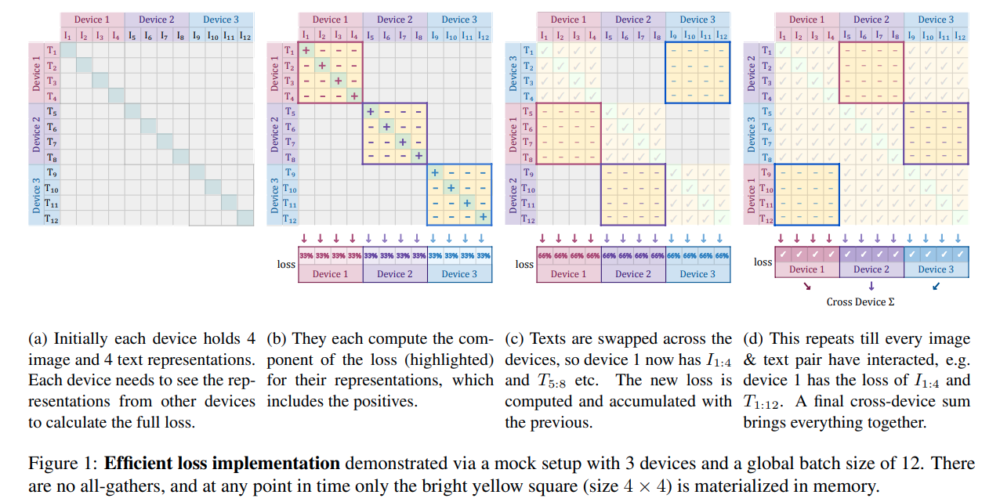

# SigLIP

CLIP 升级版本，使用了 4 个 TPUv4，训练了两天，就达到了 84.5% 的 ImageNet zero shot 成绩

核心：将 batch size 和 loss 解耦

- We find that the sigmoid loss performs significantly better than the softmax loss when the batch size is smaller than 16k

  这是不是说明 softmax 只在 batch size 大的时候，作用更大？

- 使用 temperature & bias

  init bias = -10，因为大部分的 loss 都是负样本，如果不加这个 bias，模型会在初期训练大量地偏向预测为负样本

  问题：为什么在 softmax 不需要这样的 bias？

- Efficient loss calculation

  得益于 sigmoid 的简单性，使得 loss 可以以独立的 block 进行

  

  We use the ScalingViT-Adafactor optimizer [58] by default for all our experiments

## SAM

- dataset 

  使用 dataset engine 构建了 SA-1B，似乎这个数据集是用 SAM 模型自动标注的，但问题是，SAM 训练也用这个数据集，这是合理的吗？ 