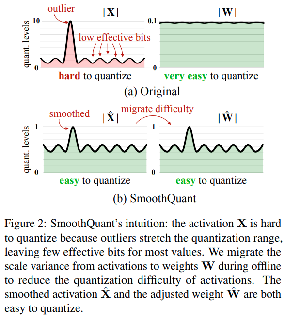
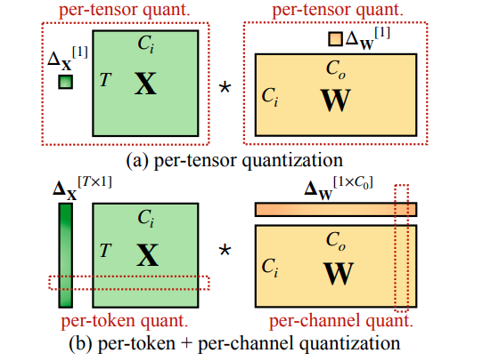
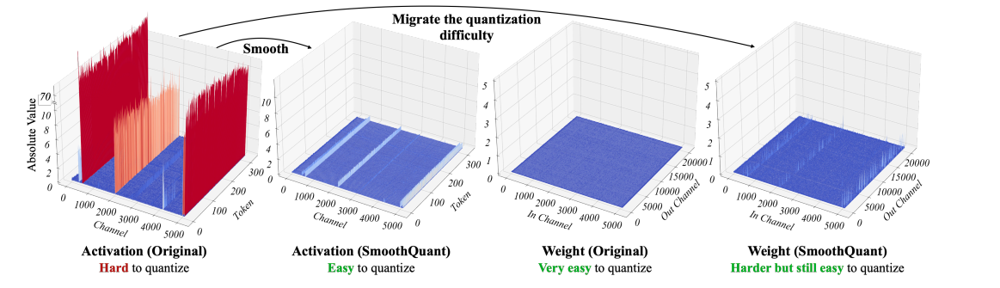
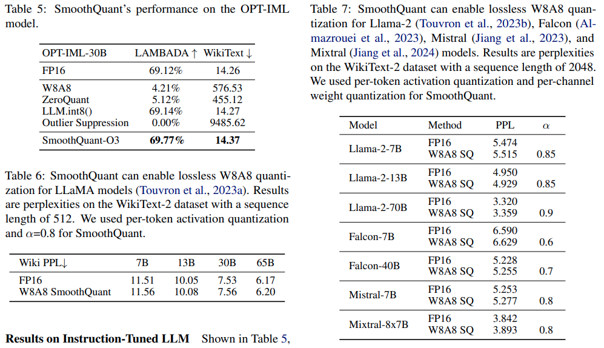

# SmoothQuant

[arxiv](https://arxiv.org/abs/2211.10438) [github](https://github.com/mit-han-lab/smoothquant)

smooth quant 是目前 dynamic quantization 的主流方法，在 W8A8 上能够有效保留模型精度，之前只是听别人讲解过，现在需要自己来深入理解下

## Concept

- SmoothQuant is a PTQ solution to enable 8-bit weight, 8-bit activation (W8A8) quantization for LLMs

  之前一直以为 smooth quant 是一种 online quantization，看来误会大了

- Why it is hard to do activation quantization

  When we scale up LLMs beyond 6.7B parameters, systematic outliers with **large magnitude will emerge in activations** (Dettmers et al., 2022), leading to large quantization errors and accuracy degradation.

  之前的方法要么只对小模型奏效，要么没有加速的 kernel 实现

- Key observation

  Even if activations are much harder to quantize than weights due to the presence of outliers (Dettmers et al., 2022), **different tokens exhibit similar variations across their channels.**

- Intuition of SmoothQuant

  

  SmoothQuant proposes a mathematically equivalent per-channel scaling transformation that significantly smooths the magnitude across the channels, making the model quantization-friendly

- Per-tensor & per-token & per-channel quantization

  所谓量化就是将高比特的浮点值压缩为一个低比特值，这个值可以是浮点也可以是 int。我们通常在实践中使用的量化公式如下
  $$
  Q(W) = \Delta·\text{Round}(\frac{W}{\Delta}) \\ \Delta = \frac{\max{(|W|)}}{2^{N-1}}
  $$
  其中 $\Delta$ 就是我们常说的 scale，而 $Round(\frac{W}{\Delta})$ 就是我们需要保存的量化权重。我们在计算 $\Delta$ 的时候有好几种粒度，论文有清楚的图示来表示这三种粒度的量化方式
  
  
  
  - Per-tensor 量化就是最简单粗暴的，一个 tensor 只使用一个 scale
  - Per-token 量化针对于 X (actication) 量化，一个 tensor 有 `num_tokens` 个 scale
  - Per-channel 量化针对于 W (weight) 量化，一个 tensor 有 `num_out_channels` 个 scale
  
  其实可以将 per-token 和 per-channel 统一地看待：一个 MNK 的矩阵乘，X shape (M, K) W shape (N, K) 他们的 reduction dimension 是 K 维度，在量化的时候统计 scale 的也是 K 维度
  
  利用下面的函数就可以计算得到对称量化（per-tensor & per-channel）的 scale 结果
  
  ```python
      def find_params(self, x: torch.Tensor, weight=True):
          """ Args:
              - x: weight of linear, shaped in (N, K) i.e. (output_dim, input_dim)
              - weight: always True, this is for compatibility with Quantizer
          """
          if x.dim() == 3:
              # x should shaped in (N, K, group_size)
              assert x.shape[-1] == self.group_size
              # view back to 2D
              x = rearrange(x, "N G C -> N (G C)")
          
          assert x.dim() == 2
          out_dim , in_dim = x.shape
          group_size = self.group_size
  
          # reshape x to (out_dim, num_groups, group_size)
          grouped_x = x.view(out_dim, -1, group_size)
  
          # get scale
          max_abs = torch.max(torch.abs(grouped_x), dim=-1, keepdim=True)[0]
          self.scale = max_abs / self.max_q   # (out_dim, num_groups, 1)
  ```
  
- Dynamic quantization & static quantization

  这只针对于 activation 的量化。weight 是一成不变的，而 activation 是变化的。论文解释如下

  > We can calculate ∆ offline with the activations of some calibration samples, what we call static quantization. We can also use the runtime statistics of activations to get ∆, what we call dynamic quantization.

- 为什么量化 activation 是困难的，量化 weight 是简单的

  - weight distribution is quite uniform and flat, even with INT4 does not degrade accuracy

  - 在 activation 中存在着 outliers，这些 outliers 是其他值的 100x，这就导致了其他值的精度会被抹去

  - Outliers persist in fixed channels，论文指出 outliers 会出现在一小部分的 channel 中，即：如果某个 channel 有 oulier，那么在所有 token 的对应 channel 中，会持续出现 outlier

    

    论文也做了实验，对比了 per-token & per-channel 对模型精度的影响

    

    可以看到 per-channel 的确几乎无退化，但是光有 per-channel 量化是没办法做 INT8 gemm 来达到加速目的的😐必须要将 activation 一起量化才行

- Migrate the quantization difficulty from activations to weights

  这里就是讨论了，如何将 activation 的量化难度分一部分给 weight，从而有效降低量化误差
  $$
  Y=(X·diag(s)^{-1})·(diag(s)W)=\hat{X}\hat{W}
  $$
  接下来的问题就是这个 scale $s$ 应该如何计算了

  论文提出了一个 migration strength $\alpha$ 的超参数，这个形式 AWQ 都没有进行改变
  $$
  s_j = \frac{max(X_j)^{\alpha}}{max(W_j)^{1-\alpha}}
  $$

- Lossless performance

  经过多个模型和数据集验证，W8A8 的 SmoothQuant 基本上能够做到精度无损或者很低的损失

  

## Question

- 将 activation 的量化难度转移到 weight，有点像 AWQ 的思路，其是根据 activation 的大小来对权重进行缩放。二者似乎是并行的方法，如果进行叠加会有意义吗？

- AWQ 的思想基本上就是 SmoothQuant 只用到权重上，一个套路讲两个故事，这可真能水啊🤣不过好消息就是，我能够直接应用 AWQ 的量化框架来计算 SmoothQuant 所需要的量化参数，不需要任何的改动

  下面的公式是 AWQ 的量化误差，其中没有 activation 的量化
  $$
  Err(Q(w·s)\frac{x}{s}) = \Delta·\text{RoundErr}(\frac{w·s}{\Delta})·x·\frac{1}{s}
  $$
  