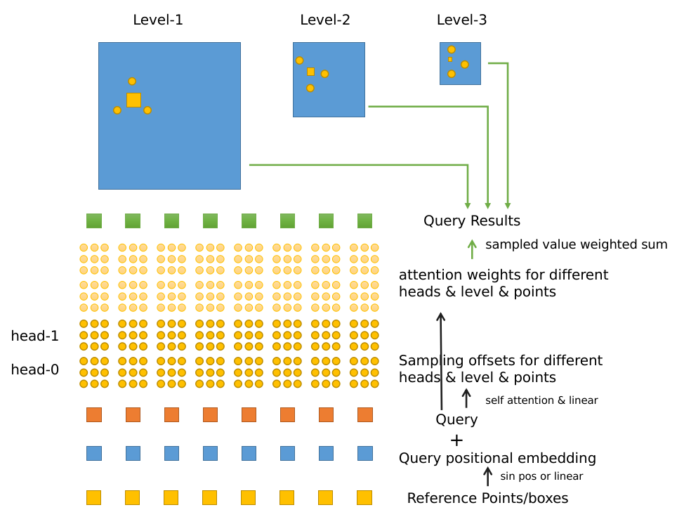
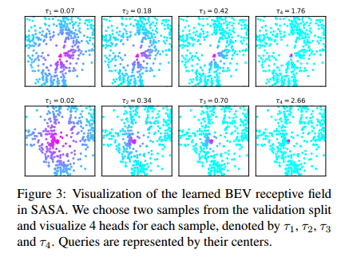
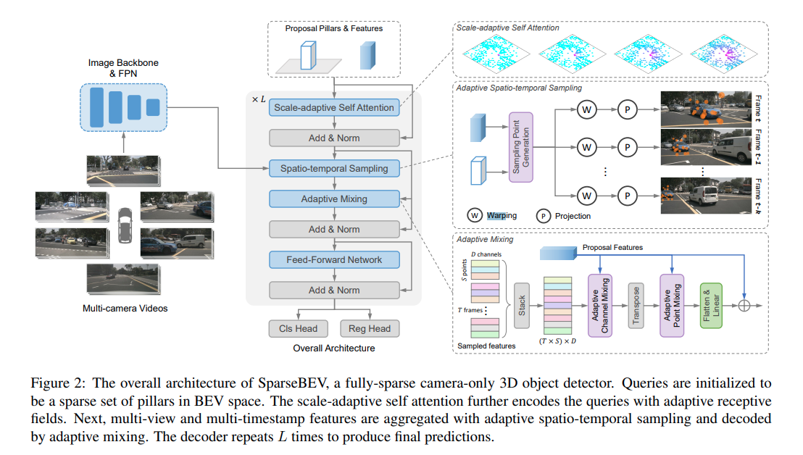

# SparseBEV

[arxiv](https://arxiv.org/abs/2308.09244) [github](https://github.com/MCG-NJU/SparseBEV) [zhihu](https://zhuanlan.zhihu.com/p/654821380)

## Concept

1. FPN

   其实之前整理过 FPN，在 YOLO 的笔记里面，现在又复习了一次。其实霹导画的图一步总结到位了，只不过在 SparseBEV 里面没有 extra conv，即：输入多少个 feature map 就输出多少个 feature map

2. input image with sweeps

   输入图像的 shape 为 $(B, T, N, C, H, W)$​，其中 T 为帧数，在 SparseBEV 中为8，N 为相机数量。在 T 张图片中，只有1张为有标签的样本，剩余7张为该标记样本之前的7帧图片，如果不足7张则以最早的图片重复填充

3. Query formulation

   query 将分为两个部分：positional & content query，这和 DINO 是一致的。positional query 就是 box 的位置，由 10 个维度组成

   ```python
   # (x, y, z, w, l, h, sin, cos, vx, vy)
   nn.Embedding(self.num_query, 10)
   ```

   之后的 position encoding 其实只用到了前面 3 维，这可能不太合理的地方，还是应当考虑一下 box 的大小信息

   而 content query 与 DINO 有所区别，使用的是单个 query 进行重复，而不是直接使用多个 query

4. **Dealing with Motion**

   因为输入图像不仅仅是当前帧，还有附近时间点的图像数据，所以需要处理时序数据。时序的难点在于动态物体：如何去聚合动态物体的特征？他们在不同帧的位置是不一样的，这给特征采样带来了难度。SparseBEV 处理的方式很简单：用匀速假设处理运动。

   若已知当前的 query position (10 dims)，那么计算其他帧的 query position 就使用当前位置减去速度 × 时间
   $$
   x_{t}=x_0+v_x·(T_t-T_0)
   $$
   t 为目标时刻，下标0为当前时刻

   除了物体运动外，自车也是运动的，这部分可以通过传感器解决，是已知量。我们可以轻松通过刚体旋转的方式获得物体在不同自车坐标系下的位置
   $$
   P_t=E_tE_0^{-1}P_0\\
   E_t=[R|t]
   $$
   实际上这一步在模型前向代码里并没有体现，是在数据预处理的时候就把自车运动的参数融合到 `lidar2img` 的投影矩阵当中了，直接一步到位：将当前帧里的点，投影到不同帧中的图像坐标系当中

5. **Sampling**

   又一次回到 Multi-scale Deformable Atttention 的理解当中了。这一次将更加完整地剖析 MSDA 的各个角度🧐画图小能手又重新画了一个示意图！虽然理解是依靠概念，但是图像记忆会更加深刻。该示意图需要从下往上看，代表了 Deformable Attention 的整个逻辑流程

   

   Deformable Attention 你需要准备三大件：query, reference points, multi-level value，然后就开始愉快的注意力

   1. 先将 reference points 进行编码，然后加到 query 当中，使得每个 query 具有位置编码
   2. query 进行自注意力。相当于 query 之间去沟通各自的位置信息以及特征信息
   3. query 生成 sampling offsets & attention weights，这里的 sampling offsets & weights 会有**非常多组**，每一个 level & head & num points 都会生成一个相应的 offsets & weigths
   4. 通过采样和加权求和获得最终的输出

   其中**初始化还有一些细节**：

   1.  reference points 的初始化

      在两阶段中，reference points 可以通过一阶段提出的 proposal 进行初始化。若没有 proposal，reference points 可以初始化为一系列的 anchor，这些 anchor boxes 都是可学习的参数，是模型的一部分

   2. sampling offsets 的初始化

      一般来说初始化的 offsets 不要太随机了，这样生成的采样点会非常不可控。所以将生成 offsets 的 linear.weight 初始化为零，linear.bias 初始化为 `(-0.5, 0.5)` 之间的随机波动

   3. Query 的初始化

      在 SparseBEV 当中 Query 的初始化好像就使用了一个单独的 `nn.Embedding(1, dim)`，然后进行重复 `num_queries` 次获得。而在 DINO 当中是使用了 `nn.Embedding(num_queries, dim)`，我觉得根据我对 query 的理解，使用一个 query 然后重复是合理的

6. **SASA, scale adaptive self attention** 

   用于控制感受野大小，从而获得 multi-scale 特征，这相当于起到了聚合多尺度特征的作用。所以在 SparseBEV 中没有使用任何的 encoder，来进一步对 image backbone feature 抽特征，这就与常规的 DETR 区别开来，节省了大量的计算量

   

   SASA 的计算公式如下
   $$
   Attn(Q,K,V)=Softmax(\frac{QK^T}{\sqrt d} - \tau D)
   $$
   其中 $\tau$ 是一个可学习的参数，控制感受野大小。可以看到 D 越小代表距离越小，此时在 softmax 中占比就越大；反之 D 越大代表距离越长，此时在 softmax 中占比就越小

   对于不同的 head 采取不同的 $\tau$ 就能让不同的 head 有不同的感受野能力，之前我简单地把 $\tau$ 看做是一个维度为 `num_head` 的可学习参数，但这样的理解是错误的，因为 $\tau$ 在训练完过后就成为了定值，与样本无关了。确定的理解是 $\tau$ 是由 query 生成的，每一个 query 都会生成 `num_head` 个 $\tau$ 值，这样就能够和样本本身关联起来，例如如果遇到大车，那么 $\tau$ 值就会相应变小，以获得更大的感受野

   ```python
   tau = linear(query)	# (N, num_head), N is number of queries
   
   # similarity.shape =  (N, N, num_head)
   # dist.shape = (N, N)
   tau_dist = tau[:,None,:] * D[:,:,None]	# (N, N, num_head)
   similarity = similarity - tau_dist
   ```

7. Adaptive Mixing

   其实就是不同的维度做一个 mixing，然后再用 linear 投射到指定维度罢了。但为什么 mixing 要使用 query 生成矩阵？是否另外用一个可学习的 query 去做效果也是一样的？答案是否定的，作者做了实验，如果使用 static query 去生成矩阵效果会差很多，这就说明了 query 中包含了 mixing 所需要的信息。这个信息到底是什么？query 随着 decoder 层数的加深，会获得越来越清晰的空间信息（box）和时间信息（velocity），并且这些信息是与当前样本相关的。基于这些条件信息去做聚合肯定比 static query 效果更好

   ```python	
   # M: (B*Q, G, C, C)
   # S: (B*Q, G, P, P)
   # out: (B*Q, G, P, C)
   '''adaptive channel mixing'''
   out = torch.matmul(out, M)	# out: (B*Q, G, P, C)
   out = F.layer_norm(out, [out.size(-2), out.size(-1)])
   out = self.act(out)
   
   '''adaptive point mixing'''
   out = torch.matmul(S, out)  # implicitly transpose and matmul
   out = F.layer_norm(out, [out.size(-2), out.size(-1)])
   out = self.act(out)
   
   '''linear transfomation to query dim'''
   out = out.reshape(B, Q, -1)
   out = self.out_proj(out)
   out = query + out
   ```

   为了进一步理解 Mixing 操作，我简单看了下 [MLP Mixer](https://paperswithcode.com/method/mlp-mixer)，我简单认为：MLP Mixer 其实是等价于 Depth-wise Convolution + Point-wise Convolution。该操作是一种高效的沟通操作，和 transformer block 相比速度会更快，但效果仍然不如 transformer block。这是因为 Depth-wise 的沟通不能实现跨 depth 的沟通，虽然跨 depth 的沟通能够在 Point-wise 部分完成，此时信息之间的联系可能变得难以发现。所以说这仍然是 speed & accuracy trade off

8. **如何构建 Transformer Model**

   transformer 可以大致地分为四个部分：

   1. Inputs，包括输入的特征图谱，可学习的 query 以及 positional embedding
   2. Encoder，包括 self attention 以获得 encoded feature map
   3. Decoder，包括 self attention & cross attention & decode head 以获得预测结果
   4. Loss

   通常使用一个大类例如 `SparseBEV` 类，来包含所有的功能，在这里定义了可学习的参数 learnable query，以及 loss 的计算调用。然后再使用一个大类 `SparseBEVTransformer` 来包装 encoder 和 decoder 的部分，有可能在 encoder 和 decoder 的输入输出之间需要一些衔接操作，都会在这个类里实现，例如 level embedding 以及生成第一阶段的 proposal。最终的 transformer 细节都单独由 `SparseBEVEncoder` 和 `SparseBEVDecoder` 实现

9. **What is Attention, Really?**

   在学习 DETR 的时候尝试回答了：what is query, really? 现在我尝试用直观的理解回答 what is attention, really? 注意力机制有3个部分：query, key, value，这三个部分到底代表了什么概念？我之前说 query 所代表的是一个概念、一个目的、一个问题，那么 key 和 value 就代表了环境 (environment)，query 通过和 key value 的交流沟通，获得所需要的信息，从而清晰自己的概念、完成自己的目的。这里就可以进一步地推广：key & value 实际上也是概念

   下面对 Attention 的详细过程做直观的理解，我以图像分类任务为例子进行类比，此时采用 self attention:

   1. query & key & value 都是特征图谱本身
   
   2. `linear(query) & linear(key)`，利用 linear 生成 query & key 特征
   
      query 和 key 生成的特征将形成 attention matrix，我们要回答的问题是 query 和 key 到底生成了什么特征？为什么要生成这个特征？我认为这个特征的意义在于：寻找最有用的 value 特征的**位置**
   
      有这么多的特征像素，哪些像素会对这个分类任务有作用呢？显然不是所有的特征像素都会起作用。而使用 linear 处理 query 和 key 所生成的特征，就是为了判断哪些特征是有用的
   
      可以做这样一个想象：其中一个 `linear(query)` 产生的特征说，我这里好像包含一个耳朵，你们其他地方有啥？而一个 `linear(key)` 产生的特征则说：我这里包含一个耳朵，你是左耳，我是右耳！经过友好的交流过后，二者产生的特征所生成的点积就很大，在之后的特征处理就会高度关联
   
   3. `linear(value)`，利用 value 生成特征
   
      `linear(value)` 会区别于 `linear(key) & linear(query)`，它其实是真正在提取特征的一步。仍然可以做这样一个想象：`linear(value)` 提取了耳朵、颜色、材质等概念，不同的 head 提取不同的概念
   
   5.  通过 attention matrix 组合 `linear(value)` 特征，这是一个整合操作。对每一个 head，query 把对自己有用的线性地组合起来获得 output
   
   6. 通过 `linear(output)`，将多个 head 的特征进行组合，回到原本的特征空间
   
      区别于 FFN，所有的 `linear` 层过后都没有跟任何的激活函数，这也就说明了这里的变换是线性的，而非线性的变换留在了 FFN 当中，能够捕捉更复杂的模式和关系
   
   有了上述的理解过后，我们应该如何来看待 self attention & cross attention？其实很好理解：self attention 理解环境，cross attention 透过环境理解问题。有时候 self attention 本身就能解决问题，例如在图像分类中，就一直用 self attention，最后使用一个 max pooling 获得全局特征。根据我的理解，也许创造一个 cls token 再去和环境做 cross attention 也许也能获得一样的答案🤔
   
   做 cross attention 另外一个原因：不是所有的环境都对问题有所贡献。cross attention 天然地带有稀疏属性，我们的计算复杂度随 query 的长度线性增长（假设环境不变）。在我们理解环境过后，不需要环境中的所有特征，而是部分地需要其中的特征，那么 cross attention 就能完成任务

## Layout

SparseBEV 几乎是将 query 的信息全部释放出来：

1. 利用 query 生成 $\tau$​，增强了注意力的空间先验知识，让 query 能够更注意其周围的物体
2. 利用 query 生成 mix matrix，动态地融合了时空信息
3. 利用 ego motion & velocity 将 query 在不同的帧之间进行空间对齐，使得获得的信息更有效



流程就直接看上面的图，基本上非常清晰。仍然说明几个点：

1. Attention + Add + Norm 一直都是主流，只有在 Vision Transformer 里面是 Norm + Attention + Add。这和 bottleneck 和 inverted bottleneck 有点类似，其实只要 blocks 连接起来了，全部都变成了 Attention + Add + Norm，所以仍然是核心的结论：只要你想维持数值稳定，就必须使用 Norm 层✅
2. warping 其实就是上述的 deal with motion 过程

## Question

1. In this work, we argue that the self attention can play the role of BEV encoder, since queries are defined in BEV space.

   应该有更好的 encoder 方式，还有什么可以考虑的？

2. 似乎使用了自己写的 deformable attention，是不是可以用两阶段的方案？

3. temporal alignment 是怎么做的？

   简单的堆叠 +  channel mix + token mix，肯定有更简单时空方案

4. 为什么要对 decoder 使用 shared params？

5. SparseBEV 没有使用 encoder 来进一步对特征进行加强，在 DETR 系列中都有一个 encoder 来提取 neck 输出的特征

6. 采样还有没有更好的方案？我不想根据 query 乱采样，我想要在时空上采样最有用的特征，contrastive sampling

7. Adaptive Mixing 感觉也比较简单，能否有更有效的聚合时空特征的方式

8. 配合 offline & tracking 能否让准确率持续上升

9. sampling offsets 没有对 offsets 的值域进行限制，导致采样点可能会偏移到图像外面，这是大家的共识 [The reference points in the Deformable DETR](https://github.com/open-mmlab/mmdetection/issues/8656)，另外一个 issue 解释了为什么使用 normalizer [Why sampling_offsets in `MSDeformAttn` is normalized by n_points](https://github.com/fundamentalvision/Deformable-DETR/issues/38)，这是因为初始化导致的

10. sampling weights 没有处理 outside range 的可能性，有可能因为仅有少数点在图像特征外，影响不大，但我认为还是应该处理一下

11. 在 sampling 4d 里面，valid mask 的逻辑写的太长了，可以使用 `torch.gather` 快速完成

12. 在第一层 decoder 的时候，并不知道 query box 的大小和速度，完全依赖于先验。但是随着 decoder 层数的加深，query box 也能够朝着目标选框移动。或许基于 instant velocity 的假设并不是最优解

13. 我需要把 ViT 的发展历史完整的整理一遍，到底 ViT 的真实实力是什么？大家在对比的时候，认为比 ViT 更强，到底是不是更强？ViT 在对比之中之所以被吊打，可能只是因为没有发挥出它的全部实力，例如没有使用 MIM 训练

14. 使用 r50 作为 backbone，freeze BN & first stage 对于训练有多少收益？

    [issue](https://github.com/hyz-xmaster/swa_object_detection/issues/5) 提到了 mmdet 自己的技术报告，里面说道

    > The batch size used when training detectors is usually small (1 or 2) due to limited GPU memory, and thus BN layers are usually frozen as a typical convention.

    这是有道理的。至于 freeze stages 还是以实验结果为准。在 EVA 的 [issue](https://github.com/baaivision/EVA/issues/60) 里提到，对于大的模型还是以 end to end 调整所有参数最好，但是需要调整超参数。似乎只有 R50 会冻结 stem & 第一层，甚至有时候第一层都不会冻结 [detrex deformable detr](https://github.com/IDEA-Research/detrex/blob/main/projects/deformable_detr/README.md)
    
15. 当使用 multi node 时可能存在的 `collect_results` bug，参考 [discussion](https://github.com/open-mmlab/mmengine/discussions/584)
