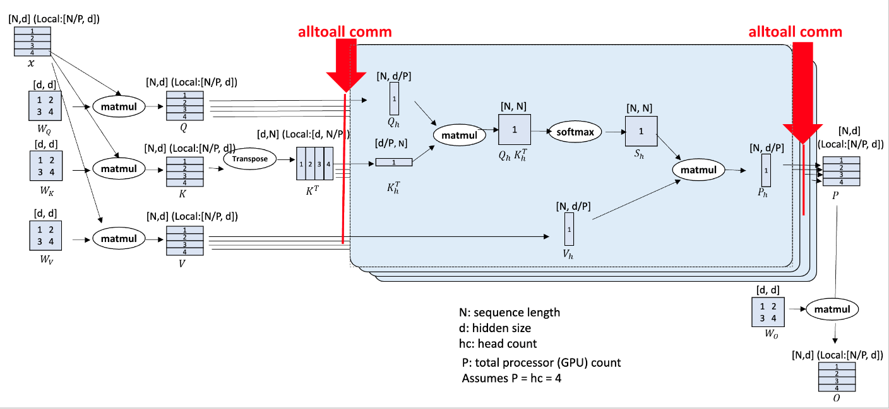

# TP & SP

对于大模型训练/推理来说，一般有 Pipeline parallelism：DP, TP, SP, PP

而 DP (data parallel) 是最简单的并行手段，早就成为了标配并行方法。PP (pipeline parallel) 则更为复杂，通常不是首选的 parallelism。PP 需要把模型切分成为多个部分，并放置在不同的 GPU 上（e.g. 模型前12层放 GPU0，后12层放 GPU1），然后再通过 micro-batches，让各个 GPU 进行流水线处理 micro-batches，从而减少 bubble。 在 [issue](https://github.com/ByteDance-Seed/VeOmni/issues/238) 中提到使用 EP (expert parallel) + FSDP2 已经能够很高效地进行大规模训练 DeepSeek V3 了。而 FSDP 则对 TP (tensor parallel) 和 SP (sequence parallel) 进行了好的封装，可以轻松使用，故本篇笔记就对这二者进行整理

我们首先对 TP 和 SP 的概念进行介绍，然后通过 Megatron-LM SP 和 Ulysses-SP 两个例子来看下实际应用

## Concept

[Pytorch Tensor Parallelism](https://docs.pytorch.org/docs/2.11/distributed.tensor.parallel.html)

在 Pytoch tensor parallelism 当中把 sequence parallel 也算成了 tensor parallel 当中的一种，其把 tp 分为了三类：Colwise; Rowwise; Sequence。在我的理解里，我们会把 colwise 和 rowwise 作为 tensor parallelism 看待，其会对权重进行不同方向的切分；而对 sequence 则是对 activation 在 sequence 维度进行的切分 

### Colwise Parallel

所谓 colwise parallel，是在输出 channel 上进行切分。Pytorch colwise parallel 对两个 `nn.Module` 进行了实现：`nn.Linear & nn.Embedding`

1. linear 层的 colwise parallel

   ```python
   linear = nn.Linear(K, N)	# in dim = K, out dim = N
   linear.weight.shape = (N, K)
   ```

   如果对 linear 进行 colwise 切分，假设有 2 个 GPU，则切分过后的 weight 为

   ```python
   linear_local = colwise_parallel(linear)
   linear_local.weight.shape = (N / 2, K)
   ```

2. embedding 层的 colwise parallel

   ```python
   embed = nn.Embedding(vocab, dim)
   embed.weight.shape = (vocab, dim)
   ```

   假设有 2 个 GPU，切分过后的 weight 为 `(vocab, dim / 2)`

虽然都是 colwise parallel，embed 和 Linear 层在切分权重的维度 index 是不一样的。一个是 shard 0 (linear)，一个是 shard 1 (embed)，但相同的是，他们的输出 channel 会进行切分

### Rowwise Parallel

和 colwise 相反，rowwise 是在输入 channel 上进行切分，其输出 channel 在切分前后是不变的。同样也对 linear 和 embedding 层实现

1. linear 层的 rowwise parallel

   ```python
   linear = nn.Linear(K, N)	# in dim = K, out dim = N
   linear.weight.shape = (N, K)
   ```

   如果对 linear 进行 rowwise 切分，假设有 2 个 GPU，则切分过后的 weight 为

   ```python
   linear_local = rowwise_parallel(linear)
   linear_local.weight.shape = (N, K / 2)
   ```

   每个 GPU 上计算 `y_local = linear_local(x)` 得到 shape 和原输出相同的 `(*, N)`，但其只使用了输入 `x` 的一半 channel。所有 GPU 的结果需要做一次 **all-reduce (sum)** 才能还原完整输出。

2. embedding 层的 rowwise parallel

   ```python
   embed = nn.Embedding(vocab, dim)
   embed.weight.shape = (vocab, dim)
   ```

   假设有 2 个 GPU，切分过后的 weight 为 `(vocab / 2, dim)`

   和 colwise 相反，embedding 的 rowwise 是沿着 **vocab 维度** 切分。因为每个 GPU 只持有部分 token 的嵌入向量，在 forward 时需要根据 token id 路由到对应 GPU 上查询，或者先 all-gather 得到完整权重

colwise 和 rowwise 通常会组合使用，这在之后的 megatron sp 实际应用中我们就能看到其应用

### Sequence Parallel

sp 是在 sequence length 维度上进行切分，其是对 activation 进行切分，而不是对 weight。我们可以通过 `sequence_dim` 来指定切分哪一个维度。pytorch 对 norm & dropout 层有实现 sequence parallel

```python
class torch.distributed.tensor.parallel.SequenceParallel(
    *, sequence_dim=1, use_local_output=False
)
```

**`use_local_output`**（`bool`，默认 `False`）：控制模块输出是否为 `DTensor`。默认为 `False`，输出保持为 sharded DTensor；设为 `True` 时输出退化为普通的 `torch.Tensor`（local tensor），在某些需要绕过 DTensor 的下游逻辑中可能有用

sequence parallel 的核心功能是对输入和输出的 placement 进行检查和变换：

- **输入处理**：如果输入是普通 `torch.Tensor`，假定它已在 sequence 维度上被外部切分好，直接包装为 sharded DTensor；如果输入是 DTensor 但未在 sequence 维度切分，则将其 redistribute 到 sequence 维度切分的 layout
- **输出**：总是 sequence 维度上的 sharded DTensor

### Placement

在 sequence parallel 中我们引入了 placement 的概念，但没有进行解释

> Placement describes how a DTensor is placed onto the DeviceMesh. Placement and DeviceMesh together describe the DTensor Layout

Placement 描述了 DTensor 在 DeviceMesh 上的分布方式。更具体来说有如下 placement

| Placement    | 每个 rank 持有的 shape                 | 各 rank 数据的关系         |
| ------------ | -------------------------------------- | -------------------------- |
| Shard(dim)   | global_shape 但 dim d 缩小1/world_size | 不重叠的切片，concat得全局 |
| Replicate()  | global_shape（完整）                   | 完全相同的副本             |
| Partial(sum) | global_shape（完整）                   | 部分和，all-reduce得全局   |

我们可以对 placement 进行检查和转换

```python
tensor.placements == (Shard(1),)
tensor.redistribute(placements=(Shard(1),))
```

placement 转换可以通过不同的通信原语完成

| 当前 placement | 目标 placement | 通信原语          | 说明                    |
| -------------- | -------------- | ----------------- | ----------------------- |
| Shard(d)       | Replicate()    | all-gather        | 所有 rank 收集完整数据  |
| Shard(d1)      | Shard(d2)      | all-to-all        | 不同维度间交换 shard    |
| Replicate()    | Shard(d)       | local chunk       | 本地切片，无通信        |
| Partial()      | Replicate()    | all-reduce        | 规约后广播              |
| Partial()      | Shard(d)       | reduce-scatter    | 规约后分散              |
| Replicate()    | Partial()      | 本地除法          | 除以 world_size，无通信 |
| Shard(d)       | Partial()      | all-gather 后除法 | 先收集再取平均          |

通常来说经过 colwise & sequence parallel 过后，placement 会是 shard，即不重叠的切片，而在 rowwise parallel 过后，我们会得到 partial placement

## Megatron-LM SP

我在接触 [meta-lingua](https://github.com/facebookresearch/lingua) 的时候其实就已经接触到了上述的各种 parallel，只是并不清楚 lingua 的实现就是遵从 Megatron-LM 的 sequence parallel 实现。Megatron SP 的特点是：需要 all-gather 使得 sequence length 完整

以下是从 lingua 当中摘取的 tp 代码，其使用了 sp & tp，我用注释标明了 tensor & weight 的形状以帮助理解

```python
main_plan["embeddings"] = ColwiseParallel(
    input_layouts=Replicate(), output_layouts=Shard(1)
)    # (B, N/2，C), all-to-all is implicitly performed

for layer in model.model.layers:
    layer_plan = {}
    # here we assume world_size = 2, i.e. 2 GPUs
    layer_plan["input_layernorm"] = SequenceParallel()    # (B, N/2, C)
    layer_plan["self_attn"] = PrepareModuleInput(         # (B, N, C), all-gather
        input_layouts=(Shard(1), None),
        desired_input_layouts=(Replicate(), None),
    )
    layer_plan["self_attn.q_proj"] = ColwiseParallel()    # (B, N, C/2), weight (N/2, K)
    layer_plan["self_attn.k_proj"] = ColwiseParallel()
    layer_plan["self_attn.v_proj"] = ColwiseParallel()
    layer_plan["self_attn.o_proj"] = RowwiseParallel(output_layouts=Shard(1))    # (B, N/2, C), weight (N, K/2), reduce-scatter is implicitly performed

    # Feedforward layers tp
    layer_plan["post_attention_layernorm"] = SequenceParallel()    # (B, N/2, C)
    layer_plan["mlp"] = PrepareModuleInput(                        # (B, N, C), all-gather
        input_layouts=(Shard(1),),
        desired_input_layouts=(Replicate(),),
    )
    layer_plan["mlp.gate_proj"] = ColwiseParallel()    # (B, N, C/2)
    layer_plan["mlp.up_proj"] = ColwiseParallel()      # (B, N, C/2) 
    layer_plan["mlp.down_proj"] = RowwiseParallel(output_layouts=Shard(1))    # (B, N/2, C), reduce-scatter is implicitly performed

    parallelize_module(
        layer,
        tp_mesh,
        layer_plan,
    )
```

在上述代码中我们可以指定 input & output placement 来完成 placement 的转换。例如在 `embeddings` 层中，我们指定了 output placement 是 `Shard(1)`，即我们在 sequence dim 中进行 shard，那么原本的 output 就从 `(B, N, C/2)` 转换成了 `(B, N/2, C)` （假设只有2个 GPU），这个转换需要一个 all to all 通信，由 `ColwiseParallel` 隐式完成

Megatron SP 特点也是其缺点：使用了 all gather。这个操作的使用显存、通信成本会比较高，需要在每一个 GPU 上存储所有 sequence 的状态，这样我们只能节省掉 norm 层的 activation，对于后续 attention 的 activation 存储没有帮助。这一点缺陷在之后的 Ulysses SP 中得到显著的改善

## Ulysses SP

Ulysses SP 的 [readme](https://github.com/deepspeedai/DeepSpeed/blob/master/blogs/deepspeed-ulysses/README.md) 把 Megatron SP 的缺点分析得非常准确了

> On modern clusters with intra-node NVSwitch interconnect and inter-node fat tree IB topology, the communication volume transmitted per link for an all-to-all for aggregate message of size *M* over *P* GPUs is *M/P*. For a transformer model with hidden size h, sequence length of N, and parallelism degree of P, DeepSpeed sequence parallelism performs all-to-all for the QKV projections with an aggregate message size of *3Nh* before the attention computation, and another all-to-all for output context projection with a size *Nh* for each transformer layer. Therefore, DeepSpeed sequence parallelism incurs an aggregate communication volume per link of ***4Nh/P (or with the complexity of O(N/P).*** Note that this communication volume is constant when both N and P are increased proportionally.

两次 all gather 和两次 reduce-scatter 都是高复杂度操作，**我们能否省掉他们？**

我们为什么需要 all gather？因为 attention 需要完整的 sequence 以进行计算，否则只能进行类似 Chunked prefill 的操作。巧妙的是，**我们需要完整的 sequence，但是却不需要所有的 head**，因为 attention head 之间的计算是没有依赖关系的，可以并行计算。Ulysses 巧妙地利用 alltoall 操作，构建了完整的 sequence + 单独 head 切片，以节省 all gather 的通信量和存储空间，伪代码和示意图如下



```python
# ============================================
# Ulysses Sequence Parallelism (Pseudo-code)
# ============================================
N = sequence_length
d = hidden_size    
hc = head_count    
P = world_size

# here assume hc % P == 0

def ulysses_attention(x, W_Q, W_K, W_V, W_O):
    """
    x: [N/P, d]  -  local sequence chunk
    W_Q, W_K, W_V: [d, d] - weight matrix
    W_O: [d, d] - outptu weight matrix
    """
    
    # Step 1: Local Linear Projections (Q, K, V)
    Q_local = matmul(x, W_Q)   # [N/P, d]
    K_local = matmul(x, W_K)   # [N/P, d]  
    V_local = matmul(x, W_V)   # [N/P, d]
    
    # Step 2: First AllToAll (SP -> Head Parallel)
    Q_h = alltoall(Q_local, split_dim=0, gather_dim=1)   # [N, d/P]
    K_h = alltoall(K_local, split_dim=0, gather_dim=1)   # [N, d/P]  
    V_h = alltoall(V_local, split_dim=0, gather_dim=1)   # [N, d/P]
        
    # Step 3: Flash Attention Computation
    P_h = flash_attn(Q_h, K_h, V_h, causal=True)    # [N, d/P]

    # Step 4: Second AllToAll (Head Parallel -> SP)
    P_local = alltoall(P_h, split_dim=0, gather_dim=1)   # [N/P, d]
    
    # Step 5: Output Projection
    O = matmul(P_local, W_O)           # [N/P, d]
    
    return O
```

 Ulysses SP 简单有效，而且兼容性极强，对于其他的 parallel 方法都能够很好兼容，例如 ZeRO3 & tensor parallelism