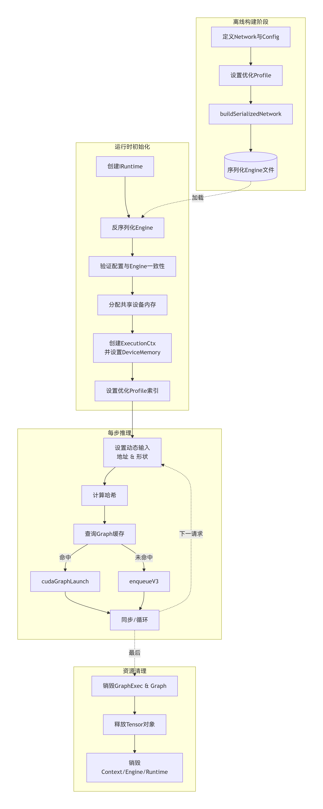

# TensorRT-EDGE-LLM

这是 NVIDIA 目前推出的一款端侧 LLM/VLM 推理框架，主要针对于 Thor GPU，可以说是 exclusive support 了。对于想要快速在 Thor 上部署自己端侧模型的团队来说可能是一个不错的选择。

学习思路：

1. 整理部署流程
2. 整理基本的代码逻辑，如何利用 TensorRT 来构建一个 llm app
3. 如何测试模型精度，尤其对量化模型而言
4. 进阶：如何管理算子和 KVCache
5. 进阶：如何完成 EAGLE3 投机采样

## Get Started

先用 Qwen0.6B 走通一个 demo 看看，根据 [Quick_Start_Guide](https://github.com/NVIDIA/TensorRT-Edge-LLM/blob/main/docs/source/developer_guide/01.2_Quick_Start_Guide.md)

在 guide 当中说需要在 x86 host 上进行模型 export，我想尝试直接在 thor 上直接 export 不知道能不能行

基础镜像直接使用 NGC pytorch container [doc](https://docs.nvidia.com/jetson/agx-thor-devkit/user-guide/latest/setup_docker.html#docker-setup-test)，竟然可以直接 work，之前一直要单独为 jetson 搞一个镜像，nv 的基建越来越好了。使用命令创建容器

```shell
docker run -it --ipc=host --ulimit memlock=-1 --ulimit stack=67108864 --runtime=nvidia image_id
```

使用 [HF-Mirror](https://hf-mirror.com/) 下载 Qwen0.6B 模型，推荐使用镜像网站开发的 hfd 方式

```shell
apt install aria2
wget https://hf-mirror.com/hfd/hfd.sh
chmod a+x hfd.sh
export HF_ENDPOINT=https://hf-mirror.com
./hfd.sh Qwen/Qwen3-0.6B
```

## TensorRT Basics

跟 DeepSeek 交流半天后画出来的 TensorRT 的 workflow

```txt
flowchart TD
    subgraph 离线构建阶段
        A1[定义Network与Config] --> A2[设置优化Profile]
        A2 --> A3[buildSerializedNetwork]
        A3 --> A4[(序列化Engine文件)]
    end

    subgraph 运行时初始化
        B1[创建IRuntime] --> B2[反序列化Engine]
        B2 --> B3[验证配置与Engine一致性]
        B3 --> B4[创建ExecutionContext<br>并设置DeviceMemory]
        B4 --> B5[设置优化Profile索引]
    end

    subgraph 每步推理
        direction TB
        C1[设置动态输入<br>地址 & 形状] --> C2{计算哈希<br>（输入地址/形状/LoRA）}
        C2 --> C3[查询Graph缓存]
        C3 -- 已存在 --> C4[cudaGraphLaunch]
        C3 -- 不存在 --> C5[enqueueV3]
        C4 --> C6[返回]
        C5 --> C6
    end

    subgraph 资源清理
        D1[销毁GraphExec & Graph]
        D2[销毁Context/Engine/Runtime]
    end

    A4 -.->|加载| B2
    B5 --> C1
    C6 -->|循环| C1
    C6 -.->|最后| D1
    D1 --> D2
```



可以看到 workflow 大致分为3个部分

1. 离线构建 engine

   这部分由 llm builder 构建，或者也可以使用 `trtexec` 工具，获得 `llm.engine`。其中比较难理解的是 `OptimiztionProfile` 这个概念。这个概念的产生是由于输入为动态输入，我们不知道动态 dimension 的值到底是多少。为了优化这个动态 dimension，我们可以给这个 dimension 设置三个值：`min, max, opt`，其中最大最小值就是该值被允许的范围，而 `opt` 值则是用于 kernel selection，具体来说 TensorRT 会直接使用这个值作为 input，来测试哪个 kernel 的速度是最快的。不过这个值对于今天的 LLM 来说不是很重要，今天的 kernel 都可以通过 heuristic 算法在线进行决定哪个 kernel 是较优的

   这个 `OptimizationProfile` 可以保存多个，在之后推理的时候利用 engine 生成多个 context (e.g. prefill & decode context)，每一个 context 使用不同的 profile，以利用不同的 kernel 获得更好的加速效果

2. 运行时初始化

   使用之前构建好的 engine，构建不同的 context 并给他们配置 device Memory 用于存储计算过程中的 activation & workspace。context 才是 TensorRT 推理的真实主体，并对不同的 context 配置相应的的 optimization profile。在这里我想把 engine 和 context 的概念介绍得更清楚一点：

   1. engine：是由 TensorRT 编译优化过后的**模型**，其包含**权重、网络结构、优化策略**，可被序列化到 disk 当中
   2. context：执行推理的运行时环境，包含激活内存、临时工作空间。可配置不同的 profile 以调用最优 kernel 来应对不同 shape 的输入
   3. 二者的关系：context 由 engine 生成，与 engine 绑定，每次推理需创建或复用。一个 engine 可被多个 context 共享

3. 推理

   首先我先介绍下 cuda graph 是什么

   > From Kimi & DeepSeek
   >
   > CUDA Graph 旨在降低**重复执行的、由多个 CUDA 操作（如内核启动、内存拷贝）组成的序列**所带来的 CPU 端调度开销，并允许 GPU 对整个计算任务进行全局优化
   >
   > 在传统 CUDA 编程中，每个操作（kernel launch、cudaMemcpy 等）都是**独立提交**到 GPU 命令队列的：
   >
   > - CPU 为每个操作执行一次 API 调用 → 驱动处理 → 命令入队列。
   > - 当任务流固定、反复执行时（如深度学习训练中的每一个迭代），这些重复的 API 调用会产生可观的 CPU 开销（驱动验证、上下文切换、队列维护等）
   >
   > CUDA Graph 的核心思想：**将一系列 CUDA 操作“固化”为一个静态的、可重用的图结构，一次性提交给 GPU，之后只需一条指令就能执行整个图**，从而极大减少 CPU 参与度

   在使用 cuda graph 之前需要先构建 cuda graph，简单来说就是让 context 推理一些固定形状的 input，把这些静态的图结构记录下来，保存为 cuda graph

   如果我们有现成的 cuda graph (e.g. decode)，那么直接使用 cuda graph 进行推理，如果没有则使用 `cotext.enqueue` 进行推理

## ONNX Export

### Basic

我希望以 trt edge 为一个 best practice 样例，来总结 onnx export 步骤和注意事项

onnx export 的命令其实只有一行

```python
torch.onnx.export(
    model,
    inputs,	# dict of input
    onnx_path,
    export_params=True,
    dynamic_axes=...,
    input_names=...,
    output_names=...,
    opset_version=ONNX_OPSET_VERSION,	# 19 in our case
    do_constant_folding=True,
    dynamo=False
)
```

核心作用就是使用 dummy inputs 推理模型前向，记录 forward 过程中的计算图

其中有三个核心的问题：

1. 多个输入和输出只能是以 tuple 的形式存在，如何给这些 tuple 中的元素加入名字，这样方便我们在之后找到这些元素对应什么内容（我们不想只通过顺序数字来确定）
2. 推理过程中，input & output tensor 的 shape 非常重要，会影响到 TensorRT 选择算子的结果。如何设置哪些 axes 是固定的
3. 没有被注册的算子无法被推理，计算图无法构建，也无法导出为 ONNX

前两个问题都很好解决

1. 通过 `input_names & output_names` 对输入和输出 tuple 进行指定即可，一定严格按照 `model.forwar` 的输入输出顺序进行指定

2. 通过 `dynamic_axes` 指定动态轴

   ```python
   dynamic_axes = {
       "input_ids": {
           0: "batch_size",	# give names to dymaci axes
           1: "seq_len"
       }
   }
   ```

   由此确定了 `input_ids` 的第 0,1 个 axis 都是动态的，并取名为 `batch_size & seq_len`

最后一个问题是最难的，需要相对复杂的工序：

1. 首先我们需要在 pytorch 定义一个 dummy custom op，这样计算图能够正常推理

   ```python
   @torch.library.custom_op("trt::attention_plugin", mutates_args=())
   def attention_plugin(...):
       # Dummy implementation for ONNX export, this is not used in the actual inference
       return attn_output, past_key_value.clone()
   ```

2. 其次我们需要在 ONNX 当中定义一个 custom op，这样 ONNX 在导出计算图的时候能使用该 op 作为节点

   ```python
   def register_attention_plugin_onnx_symbolic_functions() -> None:
       """Register symbolic functions for ONNX export."""
   
       # Register our custom symbolic functions
       register_custom_op_symbolic("trt::attention_plugin",
                                   symbolic_attention_plugin, ONNX_OPSET_VERSION)
   ```

   感觉这已经是上古时代的方式了，相关教程最好的可能还是 OpenMMLab 出的，现在根本找不到官方的教程，torch 都准备弃用这些接口了

   在这个过程中我发现很多帮助 onnx 构建图的参数似乎都没有必要，例如 schema 可以不被注册

   ```python
   onnx.defs.register_schema(attention_plugin_schema)
   ```

   再例如可以不设置输出 tensor type shape，这只是 ONNX 想要你设置的 shape，以让其感到放心😂，不影响导出 ONNX 的正确性。对于 TensorRT 来说这些 shape 都在导出的计算图中包含了，我估计是我们所写的 torch dummy custom op 起了作用

   ```python
   attn_output.setType(qkv_type.with_sizes(attn_output_sizes))
   
   # IF NOT SET, WARNING WOULD BE GIVEN
   # Warning: The shape inference of trt::AttentionPlugin type is missing, so it may result in wrong shape inference for the exported graph. Please consider adding it in symbolic function. (function UpdateReliable)
   ```

   但是 `symbolic_helper.parse_args` 这个装饰器必须要添加，否则所有的 input 全部都是以 tensor value 的形式存在，在判断 if-else 的时候必须使用 bool，如果是 tensor value 的话判断永远为 true。其实这个控制流完全可以放到 plugin 内部去做

   ```python
   @symbolic_helper.parse_args("v", "v", "v", "v", "v", "i", "i", "b", "i", "v", "v")
   def symbolic_attention_plugin(
       g: torch.onnx._internal.torchscript_exporter.jit_utils.GraphContext,
       qkv: torch._C.Value,
       past_key_value: torch._C.Value,
       context_lengths: torch._C.Value,
       rope_rotary_cos_sin: torch._C.Value,
       kvcache_start_index: torch._C.Value,
       num_q_heads: torch._C.Value,
       num_kv_heads: torch._C.Value,
       enable_tree_attention: torch._C.Value,
       head_size: torch._C.Value,
       attention_mask: Optional[torch._C.Value] = None,
       position_ids: Optional[torch._C.Value] = None,
   ):
       """Custom attention plugin operation for ONNX export."""
   
       # Build inputs list - kvcache_start_index is now always required
       inputs = [
           qkv, past_key_value, context_lengths, rope_rotary_cos_sin,
           kvcache_start_index
       ]
       if enable_tree_attention:
           assert attention_mask is not None and attention_mask.type().kind(
           ) != 'NoneType', "attention_mask should be provided for tree attention"
           assert position_ids is not None and position_ids.type().kind(
           ) != 'NoneType', "position_ids should be provided for tree attention"
           inputs.append(attention_mask)
           inputs.append(position_ids)
   
       qkv_type = qkv.type()
       past_key_value_type = past_key_value.type()
       attn_output, present_key_value = g.op(
           "trt::AttentionPlugin",
           *inputs,
           num_q_heads_i=num_q_heads,
           num_kv_heads_i=num_kv_heads,
           head_size_i=head_size,
           enable_tree_attention_i=1 if enable_tree_attention else 0,
           outputs=2)
   ```

   另外除了 `outputs` 外的 kwargs 全部是 plugin 的 attribute，必须以 `_i` 结尾，否则也会报错

### Export LLM

EDGE-LLM 在对 huggingface LLM 进行 export 时进行了封装，利用 `EdgeLLMModelForCausalLM` 来统一模型输入和输出形式。能够统一起来多亏了现在的 LLM 的输入、输出格式的高度一致，对于曾经的 cv 模型那叫一个百花齐放。我们如果使用自己的 LLM 模型，也可以遵循 EDGE-LLM 的封装

## HF custom model

可以根据 Janus 的写法总结一个构建 custom huggingface model 的最佳实践

## Plugin

How to build a basic plugin, BEST PRACTICE

Tricks

### TensorRT Basic Usage

trt 的 python & cpp api 都是相似的，我应该简单整理一下，这样才能在 python 里完成量化的对比


## Apis

- 入口是 `LLMInferenceRuntime::handleRequest`

Edge-llm 自己构建了一个轻量 tensor 抽象，我觉得挺不错的

自己构建了一个 linear kvcache 来管理 kv cache，也挺不错的

EngineRunner & InferenceRunner 的功能

## Questions & Misc

- timer system 在 llm inference example 里也有

- 如果关闭 cuda graph，这样我就可以看真实的 nsys profile 了

- TensorRT 在导出的时候需要配合 ONNX 设置好哪些是 input，而哪些是 output，这也需要我仔细整理

- Myelin 融合节点似乎并不是万能钥匙，我测出来的 rmsnorm 比 myelin 的要快很多

- 还好自己有之前 MLC-LLM 的经历，感觉这些代码都能比较快速地理解，而且这里的代码似乎比 MLC-LLM 更加轻量，确实适合作为端侧的推理框架，构建得也比较通用，应该可以扩展到除了 thor 之外的其他端侧 GPU。并且有了 TensorRT 的支持，可以直接从 ONNX Parse 出计算图，在项目初期有不错的优势