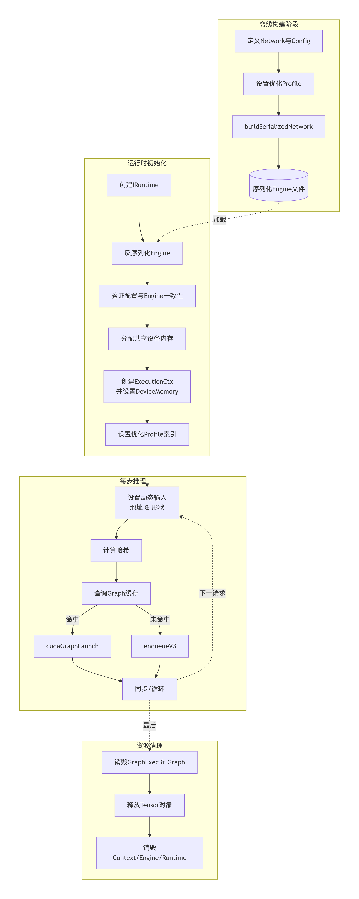

# TensorRT-EDGE-LLM

这是 NVIDIA 目前推出的一款端侧 LLM/VLM 推理框架，主要针对于 Thor GPU，可以说是 exclusive support 了。对于想要快速在 Thor 上部署自己端侧模型的团队来说可能是一个不错的选择。

学习思路：

1. 整理部署流程
2. 整理基本的代码逻辑，如何利用 TensorRT 来构建一个 llm app
3. 如何测试模型精度，尤其对量化模型而言
4. 进阶：如何管理算子和 KVCache
5. 进阶：如何完成 EAGLE3 投机采样

## Get Started

先用 Qwen0.6B 走通一个 demo 看看，根据 [Quick_Start_Guide](https://github.com/NVIDIA/TensorRT-Edge-LLM/blob/main/docs/source/developer_guide/01.2_Quick_Start_Guide.md)

在 guide 当中说需要在 x86 host 上进行模型 export，我想尝试直接在 thor 上直接 export 不知道能不能行

基础镜像直接使用 NGC pytorch container [doc](https://docs.nvidia.com/jetson/agx-thor-devkit/user-guide/latest/setup_docker.html#docker-setup-test)，竟然可以直接 work，之前一直要单独为 jetson 搞一个镜像，nv 的基建越来越好了。使用命令创建容器

```shell
docker run -it --ipc=host --ulimit memlock=-1 --ulimit stack=67108864 --runtime=nvidia image_id
```

使用 [HF-Mirror](https://hf-mirror.com/) 下载 Qwen0.6B 模型，推荐使用镜像网站开发的 hfd 方式

```shell
apt install aria2
wget https://hf-mirror.com/hfd/hfd.sh
chmod a+x hfd.sh
export HF_ENDPOINT=https://hf-mirror.com
./hfd.sh Qwen/Qwen3-0.6B
```

## TensorRT Basics

跟 DeepSeek 交流半天后画出来的 TensorRT 的 workflow

```txt
flowchart TD
    subgraph 离线构建阶段
        A1[定义Network与Config] --> A2[设置优化Profile]
        A2 --> A3[buildSerializedNetwork]
        A3 --> A4[(序列化Engine文件)]
    end

    subgraph 运行时初始化
        B1[创建IRuntime] --> B2[反序列化Engine]
        B2 --> B3[验证配置与Engine一致性]
        B3 --> B4[创建ExecutionContext<br>并设置DeviceMemory]
        B4 --> B5[设置优化Profile索引]
    end

    subgraph 每步推理
        direction TB
        C1[设置动态输入<br>地址 & 形状] --> C2{计算哈希<br>（输入地址/形状/LoRA）}
        C2 --> C3[查询Graph缓存]
        C3 -- 已存在 --> C4[cudaGraphLaunch]
        C3 -- 不存在 --> C5[enqueueV3]
        C4 --> C6[返回]
        C5 --> C6
    end

    subgraph 资源清理
        D1[销毁GraphExec & Graph]
        D2[销毁Context/Engine/Runtime]
    end

    A4 -.->|加载| B2
    B5 --> C1
    C6 -->|循环| C1
    C6 -.->|最后| D1
    D1 --> D2
```



可以看到 workflow 大致分为3个部分

1. 离线构建 engine

   这部分由 llm builder 构建，或者也可以使用 `trtexec` 工具，获得 `llm.engine`。其中比较难理解的是 `OptimiztionProfile` 这个概念。这个概念的产生是由于输入为动态输入，我们不知道动态 dimension 的值到底是多少。为了优化这个动态 dimension，我们可以给这个 dimension 设置三个值：`min, max, opt`，其中最大最小值就是该值被允许的范围，而 `opt` 值则是用于 kernel selection，具体来说 TensorRT 会直接使用这个值作为 input，来测试哪个 kernel 的速度是最快的。不过这个值对于今天的 LLM 来说不是很重要，今天的 kernel 都可以通过 heuristic 算法在线进行决定哪个 kernel 是较优的

   这个 `OptimizationProfile` 可以保存多个，在之后推理的时候利用 engine 生成多个 context (e.g. prefill & decode context)，每一个 context 使用不同的 profile，以利用不同的 kernel 获得更好的加速效果

2. 运行时初始化

   使用之前构建好的 engine，构建不同的 context 并给他们配置 device Memory 用于存储计算过程中的 activation & workspace。context 才是 TensorRT 推理的真实主体，并对不同的 context 配置相应的的 optimization profile。在这里我想把 engine 和 context 的概念介绍得更清楚一点：

   1. engine：是由 TensorRT 编译优化过后的**模型**，其包含**权重、网络结构、优化策略**，可被序列化到 disk 当中
   2. context：执行推理的运行时环境，包含激活内存、临时工作空间。可配置不同的 profile 以调用最优 kernel 来应对不同 shape 的输入
   3. 二者的关系：context 由 engine 生成，与 engine 绑定，每次推理需创建或复用。一个 engine 可被多个 context 共享

3. 推理

   首先我先介绍下 cuda graph 是什么

   > From Kimi & DeepSeek
   >
   > CUDA Graph 旨在降低**重复执行的、由多个 CUDA 操作（如内核启动、内存拷贝）组成的序列**所带来的 CPU 端调度开销，并允许 GPU 对整个计算任务进行全局优化
   >
   > 在传统 CUDA 编程中，每个操作（kernel launch、cudaMemcpy 等）都是**独立提交**到 GPU 命令队列的：
   >
   > - CPU 为每个操作执行一次 API 调用 → 驱动处理 → 命令入队列。
   > - 当任务流固定、反复执行时（如深度学习训练中的每一个迭代），这些重复的 API 调用会产生可观的 CPU 开销（驱动验证、上下文切换、队列维护等）
   >
   > CUDA Graph 的核心思想：**将一系列 CUDA 操作“固化”为一个静态的、可重用的图结构，一次性提交给 GPU，之后只需一条指令就能执行整个图**，从而极大减少 CPU 参与度

   在使用 cuda graph 之前需要先构建 cuda graph，简单来说就是让 context 推理一些固定形状的 input，把这些静态的图结构记录下来，保存为 cuda graph

   如果我们有现成的 cuda graph (e.g. decode)，那么直接使用 cuda graph 进行推理，如果没有则使用 `cotext.enqueue` 进行推理

## ONNX Export

### Basic

我希望以 trt edge 为一个 best practice 样例，来总结 onnx export 步骤和注意事项

onnx export 的命令其实只有一行

```python
torch.onnx.export(
    model,
    inputs,	# dict of input
    onnx_path,
    export_params=True,
    dynamic_axes=...,
    input_names=...,
    output_names=...,
    opset_version=ONNX_OPSET_VERSION,	# 19 in our case
    do_constant_folding=True,
    dynamo=False
)
```

核心作用就是使用 dummy inputs 推理模型前向，记录 forward 过程中的计算图

其中有三个核心的问题：

1. 多个输入和输出只能是以 tuple 的形式存在，如何给这些 tuple 中的元素加入名字，这样方便我们在之后找到这些元素对应什么内容（我们不想只通过顺序数字来确定）
2. 推理过程中，input & output tensor 的 shape 非常重要，会影响到 TensorRT 选择算子的结果。如何设置哪些 axes 是固定的
3. 没有被注册的算子无法被推理，计算图无法构建，也无法导出为 ONNX

前两个问题都很好解决

1. 通过 `input_names & output_names` 对输入和输出 tuple 进行指定即可，一定严格按照 `model.forwar` 的输入输出顺序进行指定

2. 通过 `dynamic_axes` 指定动态轴

   ```python
   dynamic_axes = {
       "input_ids": {
           0: "batch_size",	# give names to dymaci axes
           1: "seq_len"
       }
   }
   ```

   由此确定了 `input_ids` 的第 0,1 个 axis 都是动态的，并取名为 `batch_size & seq_len`

最后一个问题是最难的，需要相对复杂的工序：

1. 首先我们需要在 pytorch 定义一个 dummy custom op，这样计算图能够正常推理

   ```python
   @torch.library.custom_op("trt::attention_plugin", mutates_args=())
   def attention_plugin(...):
       # Dummy implementation for ONNX export, this is not used in the actual inference
       return attn_output, past_key_value.clone()
   ```

2. 其次我们需要在 ONNX 当中定义一个 custom op，这样 ONNX 在导出计算图的时候能使用该 op 作为节点

   ```python
   def register_attention_plugin_onnx_symbolic_functions() -> None:
       """Register symbolic functions for ONNX export."""
   
       # Register our custom symbolic functions
       register_custom_op_symbolic("trt::attention_plugin",
                                   symbolic_attention_plugin, ONNX_OPSET_VERSION)
   ```

   感觉这已经是上古时代的方式了，相关教程最好的可能还是 OpenMMLab 出的，现在根本找不到官方的教程，torch 都准备弃用这些接口了

   在这个过程中我发现很多帮助 onnx 构建图的参数似乎都没有必要，例如 schema 可以不被注册

   ```python
   onnx.defs.register_schema(attention_plugin_schema)
   ```

   再例如可以不设置输出 tensor type shape，这只是 ONNX 想要你设置的 shape，以让其感到放心😂，不影响导出 ONNX 的正确性。对于 TensorRT 来说这些 shape 都在导出的计算图中包含了，我估计是我们所写的 torch dummy custom op 起了作用

   ```python
   attn_output.setType(qkv_type.with_sizes(attn_output_sizes))
   
   # IF NOT SET, WARNING WOULD BE GIVEN
   # Warning: The shape inference of trt::AttentionPlugin type is missing, so it may result in wrong shape inference for the exported graph. Please consider adding it in symbolic function. (function UpdateReliable)
   ```

   但是 `symbolic_helper.parse_args` 这个装饰器必须要添加，否则所有的 input 全部都是以 tensor value 的形式存在，在判断 if-else 的时候必须使用 bool，如果是 tensor value 的话判断永远为 true。其实这个控制流完全可以放到 plugin 内部去做

   ```python
   @symbolic_helper.parse_args("v", "v", "v", "v", "v", "i", "i", "b", "i", "v", "v")
   def symbolic_attention_plugin(
       g: torch.onnx._internal.torchscript_exporter.jit_utils.GraphContext,
       qkv: torch._C.Value,
       past_key_value: torch._C.Value,
       context_lengths: torch._C.Value,
       rope_rotary_cos_sin: torch._C.Value,
       kvcache_start_index: torch._C.Value,
       num_q_heads: torch._C.Value,
       num_kv_heads: torch._C.Value,
       enable_tree_attention: torch._C.Value,
       head_size: torch._C.Value,
       attention_mask: Optional[torch._C.Value] = None,
       position_ids: Optional[torch._C.Value] = None,
   ):
       """Custom attention plugin operation for ONNX export."""
   
       # Build inputs list - kvcache_start_index is now always required
       inputs = [
           qkv, past_key_value, context_lengths, rope_rotary_cos_sin,
           kvcache_start_index
       ]
       if enable_tree_attention:
           assert attention_mask is not None and attention_mask.type().kind(
           ) != 'NoneType', "attention_mask should be provided for tree attention"
           assert position_ids is not None and position_ids.type().kind(
           ) != 'NoneType', "position_ids should be provided for tree attention"
           inputs.append(attention_mask)
           inputs.append(position_ids)
   
       qkv_type = qkv.type()
       past_key_value_type = past_key_value.type()
       attn_output, present_key_value = g.op(
           "trt::AttentionPlugin",
           *inputs,
           num_q_heads_i=num_q_heads,
           num_kv_heads_i=num_kv_heads,
           head_size_i=head_size,
           enable_tree_attention_i=1 if enable_tree_attention else 0,
           outputs=2)
   ```

   另外除了 `outputs` 外的 kwargs 全部是 plugin 的 attribute，必须以 `_i` 结尾，否则也会报错

### Export LLM

EDGE-LLM 在对 huggingface LLM 进行 export 时进行了封装，利用 `EdgeLLMModelForCausalLM` 来统一模型输入和输出形式。能够统一起来多亏了现在的 LLM 的输入、输出格式的高度一致，对于曾经的 cv 模型那叫一个百花齐放。我们如果使用自己的 LLM 模型，也可以遵循 EDGE-LLM 的封装

## HF custom model

可以根据 Janus 的写法总结一个构建 custom huggingface model 的最佳实践

## Plugin

### Add a RMSNorm

rmsnorm 属于一个比较简单的 kernel，我们从 flashinfer 当中加进来

- 首先需要准备所需要的头文件

  我们只需要准备 system lib 就行了

  ```python
  ['/usr/include/python3.12',
   '$cuda_home/include',
   '$cuda_home/include/cccl',
   '/cyq/Projects/flashinfer/.venv/lib/python3.12/site-packages/tvm_ffi/include',
   '/cyq/Projects/flashinfer/.venv/lib/python3.12/site-packages/tvm_ffi/include',
   PosixPath('/cyq/Projects/flashinfer/include'),
   PosixPath('/cyq/Projects/flashinfer/csrc'),
   PosixPath('/cyq/Projects/flashinfer/3rdparty/cutlass/include'),
   PosixPath('/cyq/Projects/flashinfer/3rdparty/cutlass/tools/util/include'),
   PosixPath('/cyq/Projects/flashinfer/3rdparty/spdlog/include')]
  ```

- 构建好了所需要的 cmake 并编译通过

  1. 寻找 flashinfer & tvm 头文件
  2. add library
  3. include directories
  4. link cuda & tvm .so
  5. 把所有的 flashinfer definition 打开
  6. 设置 compilation args

  基本是按照 flashinfer jit 编译命令比对着来的构建的

- 如何构建一个 tensor view，这很重要！

  这是 claude code kimi 给出的回答，明天需要直接在 tvm ffi 项目下 check 一下

  ```cpp
  ● Now I understand. tvm::ffi::TensorView is a non-owning view that wraps a DLTensor. 
    You can create it from a DLTensor* pointer. Here's how to construct it from raw    
    data:                                                                              
                                                                                       
    #include <tvm/ffi/container/tensor.h>                                              
    #include <dlpack/dlpack.h>                                                         
                                                                                       
    using tvm::ffi::TensorView;                                                        
                                                                                       
    // Example: Create TensorView from raw CUDA buffer
    TensorView create_tensor_view(
        void* data_ptr,           // Your raw GPU buffer pointer
        const std::vector<int64_t>& shape,  // Tensor shape
        DLDataType dtype,         // Data type (see below)
        int device_id = 0         // CUDA device ID
    ) {
        // Create DLTensor on stack (TensorView copies it internally)
        DLTensor dl_tensor;
        dl_tensor.data = data_ptr;
        dl_tensor.device = DLDevice{kDLCUDA, device_id};
        dl_tensor.dtype = dtype;
        dl_tensor.shape = const_cast<int64_t*>(shape.data());
        dl_tensor.ndim = static_cast<int>(shape.size());
        dl_tensor.strides = nullptr;  // nullptr = contiguous
        dl_tensor.byte_offset = 0;
  
        return TensorView(&dl_tensor);
    }
  
    // Usage examples:
    void* my_buffer = ...;  // Your allocated GPU memory
  
    // Float32 tensor [batch_size, seq_len, num_heads, head_dim]
    std::vector<int64_t> shape = {32, 1024, 32, 128};
    TensorView view = create_tensor_view(
        my_buffer,
        shape,
        DLDataType{kDLFloat, 32, 1}  // float32
    );
  
    Common dtype values:
  
    ┌──────────┬──────────────────────────────┐
    │   Type   │          DLDataType          │
    ├──────────┼──────────────────────────────┤
    │ float32  │ DLDataType{kDLFloat, 32, 1}  │
    ├──────────┼──────────────────────────────┤
    │ float16  │ DLDataType{kDLFloat, 16, 1}  │
    ├──────────┼──────────────────────────────┤
    │ bfloat16 │ DLDataType{kDLBfloat, 16, 1} │
    ├──────────┼──────────────────────────────┤
    │ int32    │ DLDataType{kDLInt, 32, 1}    │
    ├──────────┼──────────────────────────────┤
    │ int64    │ DLDataType{kDLInt, 64, 1}    │
    └──────────┴──────────────────────────────┘
  
    FlashInfer provides predefined constants in tvm_ffi_utils.h (line 34-50):
    constexpr DLDataType dl_float32 = DLDataType{kDLFloat, 32, 1};
    constexpr DLDataType dl_float16 = DLDataType{kDLFloat, 16, 1};
    constexpr DLDataType dl_bfloat16 = DLDataType{kDLBfloat, 16, 1};
    constexpr DLDataType dl_int32 = DLDataType{kDLInt, 32, 1};
    constexpr DLDataType dl_int64 = DLDataType{kDLInt, 64, 1};
  
    Important: Ensure your shape array remains valid for the lifetime of the TensorView
     (it stores a pointer to it). For temporary shape arrays, copy them to heap or use
    a persistent storage.
  ```


### Create Plugin Skill

我以 `Int4GroupwiseGemmPlugin & AttentionPlugin` 为例子来整理整个 plugin 流程

0. Create python symbolic，对于 plugin 的 dtype，in & out 说明都需要在这个 python 文件中表达清楚。这个 python plugin file 的功能包含：1. 定义 onnx symbolic; 2. 定义 pytorch symbolic; 3. 定义 register function，该 function 在 export onnx 之前需要被调用

   ```python
   """
   Dummy Attention Plugin for TensorRT Integration
   
   This module provides a custom TensorRT operation for attention computation that can be
   exported to ONNX format. It includes RoPE (Rotary Position Embedding) application,
   KV cache management, and attention computation in a single fused operation.
   
   The module contains:
   - attention_plugin: Dummy TensorRT operation for attention computation, this is not used in the actual inference.
   - ONNX export utilities for the custom operation
   """
   
   from typing import Optional, Tuple
   
   import torch
   from torch.onnx import register_custom_op_symbolic, symbolic_helper
   from torch.onnx.symbolic_helper import _get_tensor_sizes
   
   from ...common import ONNX_OPSET_VERSION
   
   # Define ONNX OpSchema for AttentionPlugin
   
   
   @symbolic_helper.parse_args("v", "v", "v", "v", "v", "i", "i", "b", "i", "v",
                               "v")
   def symbolic_attention_plugin(
       g: torch.onnx._internal.torchscript_exporter.jit_utils.GraphContext,
       qkv: torch._C.Value,
       past_key_value: torch._C.Value,
       context_lengths: torch._C.Value,
       rope_rotary_cos_sin: torch._C.Value,
       kvcache_start_index: torch._C.Value,
       num_q_heads: torch._C.Value,
       num_kv_heads: torch._C.Value,
       enable_tree_attention: torch._C.Value,
       head_size: torch._C.Value,
       attention_mask: Optional[torch._C.Value] = None,
       position_ids: Optional[torch._C.Value] = None,
   ):
       """Custom attention plugin operation for ONNX export."""
   
       # Build inputs list - kvcache_start_index is now always required
       inputs = [
           qkv, past_key_value, context_lengths, rope_rotary_cos_sin,
           kvcache_start_index
       ]
       if enable_tree_attention:
           assert attention_mask is not None and attention_mask.type().kind(
           ) != 'NoneType', "attention_mask should be provided for tree attention"
           assert position_ids is not None and position_ids.type().kind(
           ) != 'NoneType', "position_ids should be provided for tree attention"
           inputs.append(attention_mask)
           inputs.append(position_ids)
   
       qkv_type = qkv.type()
       past_key_value_type = past_key_value.type()
       attn_output, present_key_value = g.op(
           "trt::AttentionPlugin",
           *inputs,
           num_q_heads_i=num_q_heads,
           num_kv_heads_i=num_kv_heads,
           head_size_i=head_size,
           enable_tree_attention_i=1 if enable_tree_attention else 0,
           outputs=2)
   
       qkv_sizes = _get_tensor_sizes(qkv)
       attn_output_sizes = qkv_sizes[:-1] + [num_q_heads, head_size]
       attn_output.setType(qkv_type.with_sizes(attn_output_sizes))
   
       # KV Cache output has the same shape as input past_key_value except for dimension 3 (sequence length)
       # Shape: [batch_size, 2, num_kv_heads, present_kv_cache_len (dynamic), head_size]
       past_kv_sizes = _get_tensor_sizes(past_key_value)
       present_key_value.setType(past_key_value_type.with_sizes(past_kv_sizes))
   
       return attn_output, present_key_value
   
   
   @torch.library.custom_op("trt::attention_plugin", mutates_args=())
   def attention_plugin(
       qkv: torch.Tensor,
       past_key_value: torch.Tensor,
       context_lengths: torch.Tensor,
       rope_rotary_cos_sin: torch.Tensor,
       kvcache_start_index: torch.Tensor,
       num_q_heads: int,
       num_kv_heads: int,
       enable_tree_attention: bool,
       head_size: int,
       attention_mask: Optional[torch.Tensor] = None,
       position_ids: Optional[torch.Tensor] = None,
   ) -> Tuple[torch.Tensor, torch.Tensor]:
       """
       Dummy TensorRT operation for attention computation, this is not used in the actual inference.
       
       This operation wraps the logic after v_proj and before o_proj into a single 
       AttentionPlugin operation during ONNX export. It handles RoPE application,
       KV cache management, and attention computation in a fused manner.
       
       Args:
           qkv: Concatenated QKV tensor of shape (batch_size, seq_len, num_q_heads * head_size + 2 * num_kv_heads * head_size)
           past_key_value: KV cache tensor of shape (batch_size, 2, num_kv_heads, past_len, head_size)
           rope_rotary_cos_sin: RoPE tensor of shape (batch_size, seq_len, rotary_dim) containing cos and sin values
           context_lengths: Context length tensor of shape (batch_size,) indicating current position in cache
           kvcache_start_index: Start index of KV cache of shape (kv_cache_start_batch_size,), required
           num_q_heads: Number of query heads
           num_kv_heads: Number of key-value heads
           enable_tree_attention: Whether to enable tree attention
           head_size: Size of each attention head
           attention_mask: Attention mask of shape (batch_size, seq_len, seq_len + past_len), optional
           position_ids: Position IDs tensor of shape (batch_size, seq_len), optional
           
       Returns:
           Tuple[torch.Tensor, torch.Tensor]: Attention output tensor and updated KV cache
               - Attention output: shape (batch_size, seq_len, num_q_heads * head_size)
               - Updated KV cache: shape (batch_size, 2, num_kv_heads, present_kv_cache_len, head_size) with dynamic shapes
           
       Raises:
           AssertionError: If enable_tree_attention is True but required tensors are missing
       """
       if enable_tree_attention:
           assert attention_mask is not None, "attention_mask should be provided for tree attention"
           assert position_ids is not None, "position_ids should be provided for tree attention"
   
       batch_size, seq_len, qkv_size = qkv.shape
       assert head_size * (
           num_q_heads + 2 * num_kv_heads
       ) == qkv_size, f"qkv_size {qkv_size} should be equal to head_size * (num_q_heads + 2 * num_kv_heads) {head_size * (num_q_heads + 2 * num_kv_heads)}"
       assert past_key_value.shape[
           0] == batch_size, f"batch_size of kv_cache {past_key_value.shape[0]} should be equal to batch_size of qkv {batch_size}"
       assert past_key_value.shape[
           1] == 2, f"kv_cache {past_key_value.shape[1]} should have 2 tensors"
       assert past_key_value.shape[
           2] == num_kv_heads, f"num_kv_heads of kv_cache {past_key_value.shape[2]} should be equal to num_kv_heads of qkv {num_kv_heads}"
       assert past_key_value.shape[
           4] == head_size, f"head_size of kv_cache {past_key_value.shape[4]} should be equal to head_size of qkv {head_size}"
   
       assert qkv.dtype == torch.float16, f"qkv {qkv.dtype} should be in float16"
       assert past_key_value.dtype == torch.float16, f"past_key_value {past_key_value.dtype} should be in float16"
   
       # Dummy implementation for ONNX export, this is not used in the actual inference
       attn_output = torch.zeros(batch_size,
                                 seq_len,
                                 num_q_heads,
                                 head_size,
                                 dtype=qkv.dtype,
                                 device=qkv.device)
   
       return attn_output, past_key_value.clone()
   
   
   def register_attention_plugin_onnx_symbolic_functions() -> None:
       """Register symbolic functions for ONNX export."""
   
       # Register our custom symbolic functions
       register_custom_op_symbolic("trt::attention_plugin",
                                   symbolic_attention_plugin, ONNX_OPSET_VERSION)
   
       print("Registered ONNX symbolic functions for custom attention plugin")
   
   ```

   

1. 固定开头，plugin version + plugin name + static fileds init + register

   ```cpp 
   namespace
   {
   constexpr char const* kINT4_GEMM_PLUGIN_VERSION{"1"};
   constexpr char const* kINT4_GEMM_PLUGIN_NAME{"Int4GroupwiseGemmPlugin"};
   
   } // namespace
   
   // Static class fields initialization
   PluginFieldCollection Int4GroupwiseGemmPluginCreator::mFieldCollection{};
   std::vector<PluginField> Int4GroupwiseGemmPluginCreator::mPluginAttributes;
   REGISTER_TENSORRT_PLUGIN(Int4GroupwiseGemmPluginCreator);
   ```

2. (Optional, but recommended) 为了更好的可读性，可以创建一些 constexpr or enum，来告知第 i 个 input & output 对应哪些含义 

3. 构建 plugin constructor

   有两个 constructor，一个 constructor 直接接收参数，另一个 constructor 接收 serialize data，给 member 进行赋值

   ```cpp
   Int4GroupwiseGemmPlugin::Int4GroupwiseGemmPlugin(std::string const& name, int32_t N, int32_t K, int32_t groupSize)
       : mLayerName(name)
       , mGemmN(N)
       , mGemmK(K)
       , mGroupSize(groupSize)
   {
   }
   
   Int4GroupwiseGemmPlugin::Int4GroupwiseGemmPlugin(std::string const& name, void const* data, size_t length)
       : mLayerName(name)
   {
       deserializeValue(&data, &length, &mGemmN);
       deserializeValue(&data, &length, &mGemmK);
       deserializeValue(&data, &length, &mGroupSize);
   }
   ```

3. 定义 number of outputs, output datatype, output dimensions

   可以根据所定义的 python 文件来写

   ```cpp
   int32_t AttentionPlugin::getNbOutputs() const noexcept { return 1;}
   DataType Int4GroupwiseGemmPlugin::getOutputDataType([[maybe_unused]] int32_t index,
       [[maybe_unused]] nvinfer1::DataType const* inputTypes, [[maybe_unused]] int32_t nbInputs) const noexcept
   {
       return DataType::kHALF;
   }
   
   DimsExprs Int4GroupwiseGemmPlugin::getOutputDimensions([[maybe_unused]] int32_t outputIndex,
       nvinfer1::DimsExprs const* inputs, [[maybe_unused]] int32_t nbInputs, nvinfer1::IExprBuilder& exprBuilder) noexcept
   {
       // Output[0] is attention result, has shape [B, S. Hq, D]. Refers to QKV shape [B, S, Hq+Hk+Hv,D]
       DimsExprs output;
   
       output.nbDims = 3;
       output.d[0] = inputs[0].d[0];
       output.d[1] = inputs[0].d[1];
       output.d[2] = exprBuilder.constant(mGemmN);
       return output;
   }
   
   ```

   需要注意的是，如果有多个 Output 且各个 output 的 datatype 不一样，需要根据 index 逐个确认

4. supportformatCombination

   针对于 input & output tensor 的 data format  作一些检查，包含 tensor 的 data type & dimension & layout，顺带检查一下 input & output 的数量是否与 python plugin 定义对齐。为了更好的可读性，可以把 case 中的数字换成 enum

   ```cpp
   bool Int4GroupwiseGemmPlugin::supportsFormatCombination(
       int32_t pos, nvinfer1::PluginTensorDesc const* inOut, int32_t nbInputs, int32_t nbOutputs) noexcept
   {
       // input 0: Fp16 activation tensor, input 1: packed int4 weights in type int8, input2: Fp16 scale values.
       // output 0: Fp16 computed result of the int4-woq gemm
       try
       {
           assert(nbInputs == 3 && nbOutputs == 1);
           assert(pos < (nbInputs + nbOutputs));
           auto const& tensorDesc = inOut[pos];
           bool status{true};
   
           switch (pos)
           {
           case 0:
           {
               status &= tensorDesc.type == DataType::kHALF;
               status &= tensorDesc.format == TensorFormat::kLINEAR;
               status &= tensorDesc.dims.nbDims == 3;
               status &= tensorDesc.dims.d[2] == mGemmK;
               break;
           }
           case 1:
           {
               // The int4 weights are packed and swizzled into a special layout with int16 [N/4, K].
               // Since TensorRT doesn't have Int16 datatype, we use int8 datatype to store the weights.
               // Therefore the type should be [N/2, K] in int8.
               status &= tensorDesc.type == DataType::kINT8;
               status &= tensorDesc.format == TensorFormat::kLINEAR;
               status &= tensorDesc.dims.nbDims == 2;
               status &= tensorDesc.dims.d[0] == mGemmN / 2;
               status &= tensorDesc.dims.d[1] == mGemmK;
               break;
           }
           case 2:
           {
               // The accepted scale for the kernel should be fp16 with [K/group_size,N]
               status &= tensorDesc.type == DataType::kHALF;
               status &= tensorDesc.format == TensorFormat::kLINEAR;
               status &= tensorDesc.dims.nbDims == 2;
               status &= tensorDesc.dims.d[0] == mGemmK / mGroupSize;
               status &= tensorDesc.dims.d[1] == mGemmN;
               break;
           }
           case 3:
           {
               status &= tensorDesc.type == DataType::kHALF;
               status &= tensorDesc.format == TensorFormat::kLINEAR;
               status &= tensorDesc.dims.nbDims == 3;
               status &= tensorDesc.dims.d[2] == mGemmN;
               break;
           }
           default: break;
           }
           return status;
       }
       catch (std::exception const& e)
       {
       }
       return false;
   }
   ```

5. enqueue

   核心的发起函数，调用 kernel launcher。根据 input & output tensor 的信息，把 kernel launcher 所需的数据传递进去

   ```cpp
   int32_t Int4GroupwiseGemmPlugin::enqueue(nvinfer1::PluginTensorDesc const* inputDesc,
       [[maybe_unused]] nvinfer1::PluginTensorDesc const* outputDesc, void const* const* inputs, void* const* outputs,
       [[maybe_unused]] void* workspace, cudaStream_t stream) noexcept
   {
       auto const& inputDesc0 = inputDesc[0];
       int32_t const M = inputDesc0.dims.d[0] * inputDesc0.dims.d[1];
   
       half* gemmInPtr = reinterpret_cast<half*>(const_cast<void*>(inputs[0]));
       int8_t* weightsInPtr = reinterpret_cast<int8_t*>(const_cast<void*>(inputs[1]));
       half* ScaleInPtr = reinterpret_cast<half*>(const_cast<void*>(inputs[2]));
       half* gemmOutDevicePtr = reinterpret_cast<half*>(outputs[0]);
   
       if (M <= 6)
       {
           trt_edgellm::kernel::gemv_forward_cuda_new(
               gemmInPtr, weightsInPtr, ScaleInPtr, gemmOutDevicePtr, M, mGemmN, mGemmK, mGroupSize, stream);
       }
       else
       {
           trt_edgellm::kernel::gemm_forward_cuda_new(
               gemmInPtr, weightsInPtr, ScaleInPtr, gemmOutDevicePtr, M, mGemmN, mGemmK, mGroupSize, stream);
       }
       return 0;
   }
   ```

   由于我们使用的是 tvm tensor view，所以我们需要把 tensor 重新进行包装，转换成为 tvm ffi tensor，这样 flashinfer kernel 才能接受

6. 针对 member 的序列化和反序列化

   ```cpp
   size_t Int4GroupwiseGemmPlugin::getSerializationSize() const noexcept
   {
       return sizeof(mGemmN) + sizeof(mGemmK) + sizeof(mGroupSize);
   }
   
   void Int4GroupwiseGemmPlugin::serialize(void* buffer) const noexcept
   {
       serializeValue(&buffer, mGemmN);
       serializeValue(&buffer, mGemmK);
       serializeValue(&buffer, mGroupSize);
   }
   ```

7. 一些模板方法，几乎不需要改动

   - deconstructor
   - clone
   - get plugin type
   - get plugin namespace
   - set plugin namespace
   - set plugin version
   - initialize
   - terminate
   - destroy
   - configure plugin
   - get workspace, return 0

8. 构建 plugin creator constructor & create plugin 方法

   把 python 当中以 `_i` 作为参数的输入，就是 plugin 的 attribute

   ```cpp
   Int4GroupwiseGemmPluginCreator::Int4GroupwiseGemmPluginCreator()
   {
       static std::mutex sMutex;
       std::lock_guard<std::mutex> lock(sMutex);
   
       mPluginAttributes.clear();
       mPluginAttributes.emplace_back(PluginField("gemm_n", nullptr, PluginFieldType::kINT32, 1));
       mPluginAttributes.emplace_back(PluginField("gemm_k", nullptr, PluginFieldType::kINT32, 1));
       mPluginAttributes.emplace_back(PluginField("group_size", nullptr, PluginFieldType::kINT32, 1));
   
       mFieldCollection.nbFields = mPluginAttributes.size();
       mFieldCollection.fields = mPluginAttributes.data();
   }
   ```

   其中 PluginFiled 参数中的 1，代表着这个 filed 只传入了一个值，可能超过了1个值代表传入是一个 list？目前来看只看到了 length = 1 的情况

   之后就可以用这些 attribute 来实例化 plugin

   ```cpp
   nvinfer1::IPluginV2* Int4GroupwiseGemmPluginCreator::createPlugin(
       char const* name, nvinfer1::PluginFieldCollection const* fc) noexcept
   {
       try
       {
           // Read N, K attributes for the plugin.
           std::optional<int32_t> gemmN = parsePluginScalarField<int32_t>("gemm_n", fc);
           std::optional<int32_t> gemmK = parsePluginScalarField<int32_t>("gemm_k", fc);
           std::optional<int32_t> groupSize = parsePluginScalarField<int32_t>("group_size", fc);
   
           bool checkRequiredFields = gemmN.has_value() && gemmK.has_value() && groupSize.has_value();
           if (!checkRequiredFields)
           {
               return nullptr;
           }
   
           Int4GroupwiseGemmPlugin* plugin
               = new Int4GroupwiseGemmPlugin(std::string(name), gemmN.value(), gemmK.value(), groupSize.value());
           return plugin;
       }
       catch (std::exception const& e)
       {
       }
       return nullptr;
   }
   ```

9. 剩余的 creator 的方法也是几乎不用改动

   - get plugin name
   - get fileds name
   - set plugin names
   - get plugin version
   - deserialze

### Transfer from flashinfer

通常我会将算子在 flashinfer 当中测试精度，此使算子已经集成到了 flashinfer 当中。不过由于 TensorRT 对 cuda stream 有要求，而 flashinfer 的 stream 直接使用默认流，所以我们在迁移的过程中只需要加入 cuda stream 参数，并把其默认设置的 stream 代码删除即可

```cpp
void CustomFMHACutlassSM100Run(TensorView q, TensorView k, TensorView v, TensorView o,
                               Optional<TensorView> maybe_lse, int64_t causal, cudaStream_t stream) {
    /* comment this line */
    // const cudaStream_t stream = get_stream(o.device());
}
```

另外，tensorrt plugin 都是需要输出的。不能设置 number of output = 0，如果想要做到 inplace 的效果，例如 (kv cache inplace write)，则需要把 kv cache 作为输出，我们在 set tensor address 的时候进行控制

## TensorRT 

trt 的 python & cpp api 都是相似的，我应该简单整理一下，这样才能在 python 里完成量化的对比


## Apis

- 入口是 `LLMInferenceRuntime::handleRequest`

Edge-llm 自己构建了一个轻量 tensor 抽象，我觉得挺不错的

自己构建了一个 linear kvcache 来管理 kv cache，也挺不错的

EngineRunner & InferenceRunner 的功能

- Attention plugin

  attention plugin 当中对于 kv cache 的使用需要谨慎。其中有两个参数需要深入理解

  ```python
  def attention_plugin(
      qkv: torch.Tensor,
      past_key_value: torch.Tensor,
      context_lengths: torch.Tensor,
      rope_rotary_cos_sin: torch.Tensor,
      kvcache_start_index: torch.Tensor,
      num_q_heads: int,
      num_kv_heads: int,
      enable_tree_attention: bool,
      head_size: int,
      attention_mask: Optional[torch.Tensor] = None,
      position_ids: Optional[torch.Tensor] = None,
  ) -> Tuple[torch.Tensor, torch.Tensor]:
      """    
      Args:
          qkv: Concatenated QKV tensor of shape (batch_size, seq_len, num_q_heads * head_size + 2 * num_kv_heads * head_size)
          past_key_value: KV cache tensor of shape (batch_size, 2, num_kv_heads, past_len, head_size)
          rope_rotary_cos_sin: RoPE tensor of shape (batch_size, seq_len, rotary_dim) containing cos and sin values
          context_lengths: Context length tensor of shape (batch_size,) indicating current position in cache
          kvcache_start_index: Start index of KV cache of shape (kv_cache_start_batch_size,), required
          num_q_heads: Number of query heads
          num_kv_heads: Number of key-value heads
          enable_tree_attention: Whether to enable tree attention
          head_size: Size of each attention head
          attention_mask: Attention mask of shape (batch_size, seq_len, seq_len + past_len), optional
          position_ids: Position IDs tensor of shape (batch_size, seq_len), optional
          
      Returns:
          Tuple[torch.Tensor, torch.Tensor]: Attention output tensor and updated KV cache
              - Attention output: shape (batch_size, seq_len, num_q_heads * head_size)
              - Updated KV cache: shape (batch_size, 2, num_kv_heads, present_kv_cache_len, head_size) with dynamic shapes
          
      Raises:
          AssertionError: If enable_tree_attention is True but required tensors are missing
  ```

  - `past_key_value` 这里就是 kv cache 本身，`past_len` 为 kv cache 的最大容量长度、

  - `context_length` 这里代表了各个 batch 的 input tokens 的数量，区别于 `qkv` 其 `seq_len` 实际上是一个 padded length，代表了这个 batch 当中的 max `seq_len`

    在 prefill 时 context length 就是 input tokens 数量；在 decode 时 context length = past tokens + 1。这说明了 context length 代表了 attention 在进行计算的 seq length 总长度，而不是单独的 input tokens 长度 or past seq lengths

  - `kvcache_start_index` 代表存储计算好的新的 kv cache 存储位置，如果是 prefill 则为 0；decode 则为 history token 数量

  在 attention 计算过程中，会根据 `kvcache_start_index` 来确定 past kv cache 在哪儿，即：在 start index 之前的 kv cache 都会被作为 history 进行 attention 计算。然后使用 input tokens 和 past kv cache 进行 attention 计算，最终写入到 `kvcache_start_index` 处

## Questions & Misc

- timer system 在 llm inference example 里也有
- 如果关闭 cuda graph，这样我就可以看真实的 nsys profile 了
- TensorRT 在导出的时候需要配合 ONNX 设置好哪些是 input，而哪些是 output，这也需要我仔细整理
- Myelin 融合节点似乎并不是万能钥匙，我测出来的 rmsnorm 比 myelin 的要快很多
- 还好自己有之前 MLC-LLM 的经历，感觉这些代码都能比较快速地理解，而且这里的代码似乎比 MLC-LLM 更加轻量，确实适合作为端侧的推理框架，构建得也比较通用，应该可以扩展到除了 thor 之外的其他端侧 GPU。并且有了 TensorRT 的支持，可以直接从 ONNX Parse 出计算图，在项目初期有不错的优势
- onnx + tensorrt 能够处理简单的 if-else 条件吗？