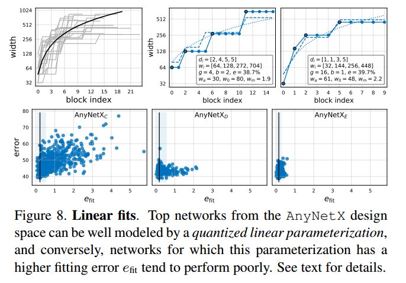
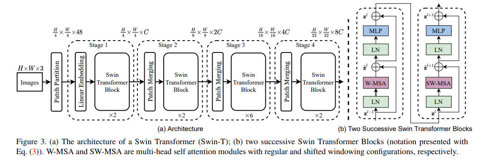

# Timm Image Backbone

## Common usage

### create model

使用 timm 创建模型非常简单

```python
import timm
model = timm.create_model('resnet50', pretrained=True)
```

为了更顺利理解 timm 的架构，我需要了解 timm 是如何管理模型，并通过字符串映射获得模型的

在许多深度模型框架中都有这样的机制：将字符串映射成为模型，他们都使用了“注册”机制，在 timm 中也是如此。timm 将所有注册的模型都写在了模型文件的底部，例如下面的是 `timm.models.resnet.py` 中注册的 resnet50 结构

```python
@register_model
def resnet50(pretrained: bool = False, **kwargs) -> ResNet:
    """Constructs a ResNet-50 model.
    """
    model_args = dict(block=Bottleneck, layers=[3, 4, 6, 3])
    return _create_resnet('resnet50', pretrained, **dict(model_args, **kwargs))
```

通过 `@register_model`，timm 将所有模型、模型配置都统一存放在了 `timm.models._registry.py` 中的字典

```python
_model_entrypoints: Dict[str, Callable[..., Any]] = {}  # mapping of model names to architecture entrypoint fns
_model_default_cfgs: Dict[str, PretrainedCfg] = {}  # central repo for model arch -> default cfg objects
_model_pretrained_cfgs: Dict[str, PretrainedCfg] = {}  # central repo for model arch.tag -> pretrained cfgs
```

### input preprocess

对于原始图片需要进行预处理，才能输入到模型中

```python
# get model specific transforms (normalization, resize)
data_config = timm.data.resolve_model_data_config(model)
transforms = timm.data.create_transform(**data_config, is_training=False)
```

### inference

有了模型，有了输入图像，可直接进行推理

```python
from PIL import Image
import numpy as np
import timm

img = Image.fromarray(np.random.randint(0, 255, (224, 224, 3), dtype=np.uint8))
data_config = timm.data.resolve_model_data_config(model)
transforms = timm.data.create_transform(**data_config, is_training=False)

model.eval()
output = model(transforms(img).unsqueeze(0))  # output is (batch_size, num_features) shaped tensor
```

### Extract features

将 `create_model` 中的参数 `features_only=True` 即可获得中间 feature map

```python
import torch
import timm
m = timm.create_model('resnest26d', features_only=True, pretrained=True, out_indices=(2,3))
o = m(torch.randn(2, 3, 224, 224))
for x in o:
    print(x.shape)
```

总结下 `timm.create_model` 的完整逻辑：

1. 输入有三个重要元素：

   1. `model_name`，其由两部分组成 `model.pretrained_tag`，前半部分代表模型名，后半部分代表预训练 tag
   2. `pretrained`，是否拉取预训练权重
   3. `features_only`，是否仅用于抽取特征

2. 通过 `model_name` 创建模型

   模型的创建方法全部都写在了模型的文件里，如上面的 `def resnet50(...)`，就是典型的模型创建方法。通常来说 timm 还喜欢用一层 `_create_model` 的抽象，用于真实的创建模型，`@register_model` 所装饰函数通常用于创建 config，可看做配置文件。而 `_create_model` 需要干两件事：加载预训练函数以及使用配置创建文件

   ```python
   def _create_convnext(variant, pretrained=False, **kwargs):
       # variant is model name, you can find config with variant
       model = build_model_with_cfg(
           ConvNeXt, variant, pretrained,
           feature_cfg=dict(out_indices=(0, 1, 2, 3), flatten_sequential=True),
           **kwargs)
       return model
   ```

   这里写为 `kwargs` 的输入对于阅读代码来说很不友好，需要自己查看到底会传入什么东西。我认为 `kwargs` 主要包含三个部分：

   1. `pratrained_tag`
   2. `features_only`
   3. `out_indices`，会覆盖掉默认的 `out_indices`

3. 如果 `features_only` 则可能会使用 `FeatureListNet` 去封装一下原模型

   `FeatureListNet` 就是根据 `out_indices` 返回输出，并且会剔除掉 `head` 相关的层，只保留前向计算必须的网络层

## ResNet

timm 中实现的 ResNet 类其实实现了整个 ResNet 家族，包含了 ResNet / ResNeXt / SE-ResNeXt / SE-Net

思路：先看经典的 ResNet34 & ResNet50 & ResNet101，然后在此基础上做变化，搞清楚每一个配置所对应的（增加的） trick/module

ResNet34 & ResNet50 的模型配置非常简单，二者唯一区别在于 block 的选择，在下面的 table 1 能看到一些维度细节

```python
model_args = dict(block=BasicBlock, layers=[3, 4, 6, 3])
model_args = dict(block=Bottleneck, layers=[3, 4, 6, 3])
```

### ImageNet backbone 通用框架

ResNet 分为四个部分，这也是目前 vision backbone 的主流框架

1. Stem

   模型的第一部分，通常选取大 kernel 来进行下采样，也可以使用多个小 kernel 的堆叠来替换大 kernel (deeper)

   timm 中关联参数 `stem_type='deep', stem_width=32`，并且通常以后缀 `d` 来标识，例如 `resnet50d`

2. Stem pooling

   通常采用一个 max pooling 进行下采样

3. Feature blocks

   模型的主体部分，通常分为四个 stages

   timm 中使用参数 `block=Bottleneck` 以指定 block 类型

4. Head

   分类头，通常为一个 avrage pool + fc (linear)

### 理解 ResNet building block

理解 feature blocks 有三个核心概念：

1. Bottleneck

   对于 resnet50 及更大的 resnet 来说，都会使用 Bottleneck 的网络块作为基础块。所谓的 Bottleneck，就是两头大，中间小。下面这个 table 1 非常经典，是 resnet 家族的结构表

   

   要看到“瓶颈”，需要展开看 building block 的第一层。例如 stage 1 中每一个 building block 第一层是一个 (1x1,64) 的卷积，这里的 64 代表的是输出通道数，而输入通道数为上一层的输出，即：256，所以形成了 `256->64->256` 的“瓶颈”，其中 `expansion=256/64=4`

   除此之外，还有一个**隐藏的“瓶颈”**在于不同 stage 之间的连接，例如 stage1 -> stage2 之间有一个 `256->128->512` 的瓶颈

   其实 Bottleneck 还是 Inverted Bottleneck 都是一样的，因为你把多个瓶颈连接起来，就会出现反瓶颈🤔，例如 `256->64->256->64->256` 中间就有反瓶颈 `64->256->64`

2. Residual conncections

   为了完成残差链接，我们唯一可能需要做的是对输入进行降采样，可以使用 avarage pool + conv1x1 + norm 的方式完成下采样和通道数的调整，这样的下采样方式用 `d` 标识，如 `resnet50d`。原始的 resnet 下采样方式选择 conv2d + norm 完成

3. Forward order

   前向路径的代码非常清晰，看完就知道网络结构

   ```python
       def forward(self, x: torch.Tensor) -> torch.Tensor:
           shortcut = x
   
           x = self.conv1(x)
           x = self.bn1(x)
           x = self.act1(x)
   
           x = self.conv2(x)
           x = self.bn2(x)
           x = self.drop_block(x)	# not original
           x = self.act2(x)
           x = self.aa(x)			# not original
   
           x = self.conv3(x)
           x = self.bn3(x)
   
           if self.se is not None:
               x = self.se(x)
   
           if self.drop_path is not None:
               x = self.drop_path(x)
   
           if self.downsample is not None:
               shortcut = self.downsample(shortcut)
           x += shortcut
           x = self.act3(x)
   ```

   解释：

   - conv1 conv2 con3 分别对应上表中的卷积。对于 resnet34，表中只有两层卷积，分别对应代码中的 conv2 conv3，在代码中为 BasicBlock class
   - 激活函数均为 ReLU
   - se 为通道注意力，squeeze and excitation
   - aa 为 anti-aliasing / blur pool
   - drop_block & drop_path 没有出现在整个残差网络家族中
   - ResNeXT 就是调整下 conv2 中的 groups 参数以及对应的 neck channel 即可。而 DW 卷积就是将 groups 调整到和 channel 数量一致，这里也不难看到 NAS 的影子：通过调整 channel 和 groups 获得最优的模型结构

## MobileNet

timm MobileNet 只实现了 V3 版本，并且是使用 EfficientNet 的基础模块，应该是参考了 NAS 的框架，通过字符串来创建模型

为了更清楚地理解 MobileNet 的结构，我选择直接看 torch 中的实现

```python
from torchvision.models.mobilenetv3 import mobilenet_v3_large

model = mobilenet_v3_large(pretrained=False)
```

理解 MobileNet 结构只需要三个部分

1. First layer

   这一部分类似于 resnet 的 stem 部分，用于初始图像的下采样。这一层非常简单，仅由一层 ConvBNAct 构成

2. Inverted residual blocks

   倒残差网络中的“倒”是指的 inverted bottleneck，这是一个两头小，中间大的结构。我将其前向网络写为如下

   ```python
   def forward(self, x):
       shortcut = x
       if self.input_channels != self.expaned_channels:
           # stride = 1, project expand channels
           x = self.ConvBnAct1(x)
           
       x = self.DWBnAct(x)	# downsample if stride = 2
       
       if self.use_se:
           x = self.se(x)
   
       # stride = 1, project out channels
       x = self.ConvBn2(x)
       
       # only used when stride = 1 and in_c = out_c
       if self.use_res:
           x += shortcut
   ```

3. Head

   MobileNet 最后的头要重一些，首先先将输出做一个升维，然后再进行 average pool，最后使用一个 mlp 来预测

   ```python
   def classifier(self, x):
       # 6 times expansion
       x = self.ConvBnAct(x)
       
       # average pool
       x = self.avgpool(x)
       
       # mlp: linear + hardswish + dropout + linear
       x = self.mlp(x)
   ```

为了精确描述网络结构，最重要的就是配置中间的 inverted residual block，MobileNetV3 Large 配置如下：

```python
inverted_residual_setting = [
    # input_channels, kernel, expanded_channels, out_channels, use_se, activation, stride, dilation
    # reduce_divider = 1, dilation = 1
    bneck_conf(16, 3, 16, 16, False, "RE", 1, 1),
    bneck_conf(16, 3, 64, 24, False, "RE", 2, 1),  # C1
    bneck_conf(24, 3, 72, 24, False, "RE", 1, 1),
    bneck_conf(24, 5, 72, 40, True, "RE", 2, 1),  # C2
    bneck_conf(40, 5, 120, 40, True, "RE", 1, 1),
    bneck_conf(40, 5, 120, 40, True, "RE", 1, 1),
    bneck_conf(40, 3, 240, 80, False, "HS", 2, 1),  # C3
    bneck_conf(80, 3, 200, 80, False, "HS", 1, 1),
    bneck_conf(80, 3, 184, 80, False, "HS", 1, 1),
    bneck_conf(80, 3, 184, 80, False, "HS", 1, 1),
    bneck_conf(80, 3, 480, 112, True, "HS", 1, 1),
    bneck_conf(112, 3, 672, 112, True, "HS", 1, 1),
    bneck_conf(112, 5, 672, 160 // reduce_divider, True, "HS", 2, dilation),  # C4
    bneck_conf(160 // reduce_divider, 5, 960 // reduce_divider, 160 // reduce_divider, True, "HS", 1, dilation),
    bneck_conf(160 // reduce_divider, 5, 960 // reduce_divider, 160 // reduce_divider, True, "HS", 1, dilation),
]
# mlp hidden channel
last_channel = adjust_channels(1280 // reduce_divider)  # C5
```

## RegNet

### RegNet 中的概念

1. Design space

   由一群相同架构不同参数的模型组成的空间，即为 design space。通过一些经典的统计数据，我们能对这个空间的模型进行分析，例如：error distribution

2. Error distribution

   为了衡量某一个空间的好坏，论文使用了 EDF (empirical distribution function) 来描述空间质量

   对于 n 个模型来说，其 error EDF 表示为
   $$
   F(e)=\frac{1}{n}\sum^{n}_{i=1}1[e_i<e]
   $$
   其中 $e_i$ 为第 i 个模型的误差，$F(e)$ 描述了误差低于 e 的模型数量，其一般图像如下，标签中的数据为 min error & mean error

   

   论文中就是对一个搜索空间采样500个模型，然后进行短期的训练（10 epochs on ImageNet），构建出这个搜索空间的 EDF。EDF 越靠左越好

3. AnyNet & AnyNetX design space

   AnyNet 空间即为经典的 ResNet 架构，由三部分组成：stem, body, head。其中 body 是最核心的部分，body 由多个 stages 组成，每一个 stages 由多个相同的 block 组成，并且每个 stage 都会进行下采样

   

   AnyNetX 则规定了 block 的形式：即为 ResNet 中的 Bottleneck（和本文中的 bottleneck 有微小区别），同时也称 bottleneck 为 X block

   AnyNetX 中每一个 stage 的自由度如下：

   1. number of blocks， $d_i\le16$
   2. block width， $w_i\le1024$ 并且为8的倍数
   3. bottleneck ratio，$b_i \in \{1,2,4\}$
   4. group width，$g_i\in\{1,2,4,...,32\}$

   如果有 4 个 stage 的话，整个模型的搜索空间为 $(16·128·3·6)^4≈10^{18}$

### 理解 RegNet

RegNet 的目标就只有两个：

1. 简化 design space 的搜索空间
2. 简化过后的空间，能够有更好的模型表现

从 AnyNetX (也称为 AnyNetX_A) 开始，一步一步完成这两个目标：

1. AnyNetX_B，采用了 shared bottleneck ratio，即所有 stage 采样相同的 bottleneck ratio。论文发现该约束并不改变 EDF 图像
2. AnyNetX_C，采用了 shared group width，同样不改变 EDF
3. AnyNetX_D，规定每个 stage 的宽度逐级递增 $w_{i+1}\ge w_i$，这将大大改进 EDF 图像分布。这符合现有流行模型的配置
4. AnyNetX_E，规定每个 stage 的深度逐级递增 $d_{i+1}\ge d_i$，这将改善 EDF 图像分布。**实际上这并不符合现有流行模型的配置**，因为最后一个 stage 的深度通常会减小

AnyNetX_E 的搜索空间相比原始的 AnyNet 下降了7个数量级。论文分析 AnyNetX_E 中的好模型长什么样子，发现了深度和宽度的量化线性关系



论文一开始使用如下的线性公式来限制宽度和深度
$$
u_j=w_0+w_a·j
$$
其中 $u_j$ 是第 j 个 block 的宽度（j 是拉通所有 stage 来数的），$w_0,w_a$ 是超参数

为了将这个线性公式量化，论文使用一个 $w_m$ 来作为一个宽度因子（width multiplier）
$$
u_j=w_0·w_m^{s_j}\\
$$
真正的量化就是对 $s_j$ 进行上下取整，获得真正的每一个深度的宽度
$$
w_j=w_0·w_m^{\left \lfloor s_j \right \rceil }
$$
$w_m$ 我理解为一个“阶梯”因子，例如当 $w_m=2$ 时，每一个阶段的宽度就会翻倍，而 $\left \lfloor s_j \right \rceil$ 就代表了哪一个 stage，当 $w_m$ 取得比较大时，阶梯就少，平台就长；反之阶梯就多，平台就短

通过这个线性量化条件来限制网络后，搜索空间也会大量缩小（~$10^8$），至此我们称这个搜索空间为 **RegNetX**

同时 RegNetX 的参数变为 6 个：$w_0,w_a,w_m,d,b,g$，它们的范围为：$d<64,w_0,w_a<256,1.5\le w_m \le3$，$b,g$ 的范围和之前一致

接下来论文将继续探索 RegNetX 空间里更好的模型，因为我们仍然有 $10^8$ 的搜索数量。论文采样 100 个模型，训练更久一些，获得如下结论：

1. 深度不管对于计算量小的模型和计算量大的模型，都大约在20个 blocks (~60 layers)
2. 好的模型都使用了 bottleneck ratio = 1
3. 好的模型都使用了 width multiplier $w_m$ ≈ 2.5
4. $g, w_a, w_0$ 都随着复杂度增加


有了如上的观察过后，继续限制 RegNetX 的搜索空间：

1. 取 bottleneck ratio = 1
2. 网络深度 $12 \le d \le 28$，做了该限后，搭配于线性量化约束，我们之前的 $d_{i+1}\ge d_i$ 就不存在了，因为最后一个 stage 的深度会被限制住。**这样就符合了主流模型配置**：最后一个 stage blocks 数量少
3. 宽度因子 $w_m \ge 2$ 

至此 design space 的设计就结束，之后论文就在这个空间里采样，以获得不同计算量的模型。**这样的设计与当前 mobile networks 中所使用的 inverted bottleneck 是冲突的**，因为其取 bottleneck ratio < 1 并且始终取 g = 1，作者测试了该空间的 EDF，是差于 b = 1，g ≥ 1 的。并且作者还测试了分辨率，认为 r = 224x224 是最佳的，**提升分辨率并没有提升 EDF**

个人认为造成上述原因有两点：

1. RegNet 缩小搜索空间的标准一直都是 EDF，而 EDF 只有对误差的评估，没有对模型参数、速度进行评估。在之后的实验也看到 RegNet 在较小参数下可能表现略逊于 EfficientNet。但是如果所比较的方式为相同激活值（activations）的条件下，RegNet 是胜出的，这也是为什么 RegNet 的速度远快于 EfficientNet
2. 分辨率的提升带来准确率的提升是不争的事实，我猜测是训练方式的问题，导致了模型无法在多分辨率下泛化

论文还在 X block 中加入了 SE layer，由该 block 组成的模型称为 RegNetY，效果更好了

### RegNet bottleneck

timm 中 regnet bottleneck 和 ResNet 中几乎一样，有如下区别

> This is almost exactly the same as a ResNet Bottlneck. The main difference is the SE block is moved from after conv3 to after conv2. Otherwise, it's just redefining the arguments for groups/bottleneck channels.
>

前向代码如下

```python
    def forward(self, x):
        shortcut = x
        x = self.conv1(x)
        x = self.conv2(x)
        x = self.se(x)
        x = self.conv3(x)	# no activation
        if self.downsample is not None:
            # NOTE stuck with downsample as the attr name due to weight compatibility
            # now represents the shortcut, no shortcut if None, and non-downsample shortcut == nn.Identity()
            x = self.drop_path(x) + self.downsample(shortcut)
        x = self.act3(x)
        return x
```

## Swin Transformer

最终还是要向这篇 ICCV 2021 best paper 发起进攻。我不仅想要知道 Swin 的实现细节，我更想了解其训练方法，因为 timm 中后期将之前很多网络按照 swin 的方式重新训了一次，都有提升。除此之外，我还想知道 swin 最具价值的思想

### Swin 中的概念

1. **PatchEmbed**

   和 ResNet 中的 Stem 是一个概念，将初始图像进行下采样，所使用的是 `Conv2d(3, embed_dim, kernel_size=patch_size, stride=patch_size)`，并且加入了 post norm 维持数值稳定，还将输出张量变为 `NHWC` 布局

2. **Relative Positional Bias**

   怪不得看 SparseBEV 的时候觉得 SASA 眼熟，和 relative posisional bias 的形式是一模一样的。其目的就是在 attention 中加入位置的感知，也许距离近的权重更改更高一些，距离远的权重低一些
   $$
   Attn(Q,K,V)=Softmax(\frac{QK^T}{\sqrt d} + B)
   $$
   为了保持灵活性，B (bias) 是一个可学习的参数，并且对每一个 head 都不一样

   创建这个 bias 的过程是值得学习的，我们的目的是：创建一个 bias matrix $(HW,HW,1)$，代表了 windows 中两两之间的 bias。我自己的实现如下，是一个二维的实现而没有展开到一维，运用了 **`meshgrid` & 索引**

   ```python
   # impl my relative bias
   import torch
   
   def get_relative_position_index(win_h, win_w):
       # get coordinates of center pixel
       coord = torch.stack((torch.meshgrid(torch.arange(win_h), torch.arange(win_w))), dim=-1) # (H, W, 2)
       coord = coord.reshape(-1, 2) # (H*W, 2)
       offset = coord.unsqueeze(1) - coord.unsqueeze(0) # (HW, HW, 2)
       offset[:, :, 0] += win_h - 1    # shift to non-negative
       offset[:, :, 1] += win_w - 1
       return offset
   
   win_h, win_w = 3, 3
   num_heads = 2
   rel_bias = torch.randn(2*win_h-1, 2*win_w-1, num_heads)
   index = get_relative_position_index(3, 3)
   bias = rel_bias[index[:, :, 0], index[:, :, 1]] # (HW, HW, num_heads)
   ```

3. **WindowAttention**

   窗口注意力非常容易理解：将输入的特征图分解为窗口 `(num_windows * B, N, C)`，在每一个窗口内进行注意力计算。因为需要使用 relative positional bias，所以要将 `num_heads` 的维度单独分出来，之前的注意力可以直接合并到 batch 的维度

   没有使用 `attn_mask` 来添加 bias，但实际上是可以一起做的，前向代码如下

   ```python
       def forward(self, x, mask: Optional[torch.Tensor] = None):
           B_, N, C = x.shape
           qkv = self.qkv(x).reshape(B_, N, 3, self.num_heads, -1).permute(2, 0, 3, 1, 4)	 # (3, B, num_heads, N, C)
           q, k, v = qkv.unbind(0)
   
           q = q * self.scale
           attn = q @ k.transpose(-2, -1) # (B, num_heads, N, N)
           
           # relative positional bias
           attn = attn + self._get_rel_pos_bias()
           
           if mask is not None:	# shift attn mask
               num_win = mask.shape[0]
               attn = attn.view(-1, num_win, self.num_heads, N, N) + mask.unsqueeze(1).unsqueeze(0)
               attn = attn.view(-1, self.num_heads, N, N)
           # attend
           attn = self.softmax(attn)
           attn = self.attn_drop(attn)
           x = attn @ v
   
           x = x.transpose(1, 2).reshape(B_, N, -1)
           x = self.proj(x)
           x = self.proj_drop(x)
           return x
   ```

   这里对比了一些 torch 的常用操作：`split, chunk, unbind`，以及 `einops`。前面三个操作是将某一个维度进行分开，split 是传入一个 `split_size`，chunk 传入分离数量，相当于传入均匀的 `split_size`，并且最后一个 size 为自动调整的，而 unbind 相当于 `chunk(dim_size)`。einops 在对于形状的操作是最方便的

4. **ShifedWindowAttention**

   所谓的滑动窗口，就是将 window 划分斜上滑动一段距离 `shift_size`，这个操作是使用的 `torch.roll` 完成的

   ```python
   import torch
   
   x = torch.arange(16).view(4, 4)
   # roll
   y = torch.roll(x, (-1, -1), dims=(0, 1))
   
   # results
   tensor([[ 0,  1,  2,  3],
           [ 4,  5,  6,  7],
           [ 8,  9, 10, 11],
           [12, 13, 14, 15]])
   ----
   tensor([[ 5,  6,  7,  4],
           [ 9, 10, 11,  8],
           [13, 14, 15, 12],
           [ 1,  2,  3,  0]])
   ```

   窗口活动过后不能按照平常的 window attention 完成，因为有拼接的部分，所以需要制作 attention mask 来处理便宜到右下角的图像。其实现使用了 python built-in  `slice` 来巧妙完成，可视化结果参考 [issue](https://github.com/microsoft/Swin-Transformer/issues/38#issuecomment-823810343)。简单总结：

   1. 生成一个大的 mask 模板 (H, W)，其中 HW 代表**整个图片**的高宽

   2. 对 mask 进行分区，总共分成 8 个子区域，当 window 数量为 4 个的时候示意图如下（实际上 windows 0 的区域在 H W 大的时候，比例会比较大）

      

      代码如下，利用了 sice 来对区域进行赋值操作

      ```python
                  img_mask = torch.zeros((1, H, W, 1))  # 1 H W 1
                  cnt = 0
                  for h in (
                          slice(0, -self.window_size[0]),
                          slice(-self.window_size[0], -self.shift_size[0]),
                          slice(-self.shift_size[0], None)):
                      for w in (
                              slice(0, -self.window_size[1]),
                              slice(-self.window_size[1], -self.shift_size[1]),
                              slice(-self.shift_size[1], None)):
                          img_mask[:, h, w, :] = cnt
                          cnt += 1
      ```

   3. 使用 `window_partition` 将 mask 切分成 window size

      ```python
      # (1, H, W, 1) -> (nW, window_size, window_size, 1)
      mask_windows = window_partition(img_mask, self.window_size)  # nW, window_size, window_size, 1
      ```

   4. 在每一个 window size 内部，不同子区域之间是不做注意力的，所以区域号不同的加入惩罚 `attn_mask = -100`

      ```python
      mask_windows = mask_windows.view(-1, self.window_area)	# (nW, HW)
      attn_mask = mask_windows.unsqueeze(1) - mask_windows.unsqueeze(2)	# (nW, HW, HW)
      # mask
      attn_mask = attn_mask.masked_fill(attn_mask != 0, float(-100.0)).masked_fill(attn_mask == 0, float(0.0))
      ```

5. **PatchMerging**

   是 Swin 中下采样的方式，将 2x2 的区域特征堆叠起来，然后用一个 Linear 转换维度。该方法替换了原始的卷积下采样

   ```python
       def forward(self, x):
           B, H, W, C = x.shape
           x = x.reshape(B, H // 2, 2, W // 2, 2, C).permute(0, 1, 3, 4, 2, 5).flatten(3)
           x = self.norm(x)
           x = self.reduction(x)	# linear project 4C->2C
           return x
   ```

### 理解 Swin Transformer

了解了 Swin 的基本概念，接下来就是组装他们。Swin 的架构直接上图就行了



同时再整理一下 timm 中统一的分类头

```python
def forward_head(self, x):
    # x is direct output of Stage-4
    x = self.norm(x)	# this norm is actually written in forward_features part
    
    # head
    x = self.global_pool(x)	# nn.AdaptiveAvgPool2d(1)
    out = self.linear(x)
    return out
```

这里我加入了一个 LayerNorm，实际上这一层是在 `forward_features` 中的，但是在上面的示意图中不能展示出来，加在这里表示强调

## Concept

1. DropPath 的理解，[DropPath in TIMM seems like a Dropout?](https://stackoverflow.com/questions/69175642/droppath-in-timm-seems-like-a-dropout)

   实际上 DropPath 是以一定概率丢弃整个 sample，例如我们有一个 batch `(N,C,H,W)`，我们将随机舍弃一个样本，将其值设置为0。在常规的前向路径中，直接丢弃样本根本无法产生有效的输出，但是用在残差链接中就不一样了
   $$
   H_l=ReLU(b_lf_l(H_{l-1})+H_{l-1})
   $$
   其中 $H_l$ 代表隐藏层输出，$b_l$ 为一个伯努利分布（二项分布），如果我们随机丢弃了某个样本，即 $b_l=0$，结果将全部使用上一层的隐藏层输出。这样的 DropPath 可以创造“随机深度”现象，能够让训练更稳定、收敛更快，让网络的深度变得更深

2. dataclass，参考 [理解 python dataclass](https://zhuanlan.zhihu.com/p/59657729)

   dataclass 是一个适合于存储数据对象的类，可以通过 `@dataclass` 装饰器实现，我们只需要定义好提示类型即可

   ```python
   from dataclasses import dataclass
   @dataclass
   class Point:
       x: int
       y: int
       z: int = 0	# default
   ```

   这样就可以不通过定义 `__init__` 方法或者类方法来方便初始化，并且在 print 时能够有较高的可读性

   ```python
   p = Point(1, 2)
   p = Point(x='2', y=3)	# no error
   ```

   在 timm 中也使用了 `replace` 方法替换其中的字段

   ```python
   from dataclasses import replace
   replace(p, **kwargs)
   ```

   除此之外 dataclass 还可以加入参数

   ```python
   @dataclass(order=True, frozen=True, repr=False)
   ```

   以上三个例子代表是否能够比较，是否能够在创造后被改变，以及是否生成字符串表示

   还可以通过定义 `__post_init__` 方式来创建复杂的初始化

   ```python
   import math
   @dataclass
   class FloatNumber:
       val: float = 0.0
       def __post_init__(self):
           self.decimal, self.integer = math.modf(self.val)
   # >>> a = Number(2.2)
   # >>> a.val
   # >>> 2.2
   # >>> a.integer
   # >>> 2.0
   ```

   如果定义了 `__init__` 方法，使用 dataclass 就没有意义
   
   还可以使用 `field(default_factory=func)` 来获得更复杂的初始化c

## 问题

1. timm 中的 tag 表示了什么意思

   通常这些 tag 表示了模型是如何进行训练的，使用了哪些数据集，但不清楚具体的训练配置

2. timm 中如何不更改模型获得了中间特征？

3. PretrainedCfg & DefaultCfg 有什么作用？Dataclass 是一个装饰器，有什么作用

4. jit 是一个需要注意的点吗？

5. timm 是如何书写长代码的？

   - 代码段落的长度

     就像写文章一样，每一个人的断句是不一样的，看自身喜欢写长句还是写短句

     有的代码段落就算只有两行也有空行间隔。最终决定条件：这段代码与周围代码的相关程度

   - 对于简单代码，我经常喜欢写如下代码

     ```python
     a = func(); a = a.func
     ```

     可以通过合理的命名方式来避免，也尽量少写一些 `_var` 的变量名称

   - 注释情况

     简要的必要说明，如果是在一个代码段落中就夹在中间，其他时候可以用空行间隔

   - 对于每一个模型类别都进行了参数解释，对重要模型解释模型来源以及特殊含义

   - 对于长的代码行并没有做太多的分行处理，尤其是 `if ... else`，timm 很喜欢写在一行

6. **timm 训练 resnet 的方法有哪些？**对比 EVA, ConvNeXT, Swin, ResNet v1 v2, MAE

   以 `.sw` tag 的训练方法 [discussion](https://github.com/huggingface/pytorch-image-models/discussions/1829) [_timm_hparams.md](https://gist.github.com/rwightman/943c0fe59293b44024bbd2d5d23e6303) [ResNet strikes back](https://arxiv.org/abs/2110.00476) [pytorch pretrained](https://pytorch.org/blog/how-to-train-state-of-the-art-models-using-torchvision-latest-primitives/) [how to train your vits](https://arxiv.org/abs/2106.10270)

7. activation 和 norm 的使用位置：norm 会频繁使用以维持数值稳定，**在 ViT 中通常使用在最前面，即 pre-norm**，但 norm 在 mlp 中基本不会使用。activation 在每一个 conv or linear 层过后都会有，除非是最后的输出层

   mlp 中基本上不带 norm 层，但是每一层 linear 过后基本上需要使用 dropout，但是大多数时候设置为 0.0🧐但是 drop path 用得更多，在 swin 和 convnext 中都有使用

   ```python
       def forward(self, x):
           x = self.fc1(x)
           x = self.act(x)
           x = self.drop1(x)
           x = self.fc2(x)
           x = self.drop2(x)
           return x
   ```

   rule: 

   1. no activation if use residual!!! 为什么最后一层没有 act? 因为要使用残差连接，这更有利于残差学习。如果加入了激活层，有的值就直接被置零了，破坏了残差学习
   2. it is ok not to use relu for each block output：mobilenet, transformers, regnetz (timm), efficientnet

8. 卷积 backbone 和 transformer backbone 有什么必然的差别吗？为什么 Swin 的横空出世提升了 SOTA 这么多？

   我认为 ConvNeXT 可能给出了答案：Swin 的成功仍然是 **Transformer 架构**的成功：更少的 activation layer，更少的 norm 并且使用 LayerNorm。另外一个关键点：**下采样的方式也非常重要！**在 ConvNeXT 中指出，只使用一个简单的 Conv2d 进行 stride 2 下采样会直接导致训练发散！但是在加入了 pre-norm 之后，训练就会变得稳定，并且提升了准确率。ConvNeXT 得出结论：**在分辨率改变前，使用一层 norm layer 是必要的，这会极大增强训练稳定性**。并且区别与 ResNet，下采样是不会参与到残差连接的结构当中的，这样的下采样方式能够显著提升表现

