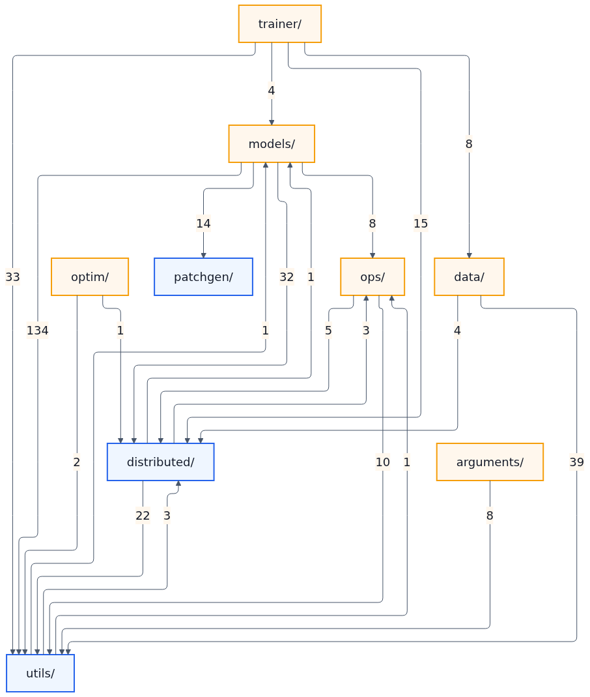

# FSDP & VeOmni

本文档将介绍 FSDP 以及训练框架 VeOmni。旨在回答几个核心问题：

1. FSDP 解决了什么问题？
2. FSDP 如何与其他并行技巧结合？这在 VeOmni 当中是如何应用的？
3. VeOmni 在训练上做了哪些优化使得其由于市面上的其他训练框架？

## VeOmni Code Structure

以下结构由 AI 生成

- 📁 **arguments/** — _负责定义和解析训练配置，是整个训练流程的参数入口。这里用 dataclass 组织模型、数据、优化器、checkpoint、分布式并行、profiling、WandB 等配置，并支持从 YAML 和命令行合并参数，最终为 trainer 提供统一的 `VeOmniArguments` 配置对象。_
- 📁 **data/** — _负责训练数据从原始样本到模型输入的完整处理链路。它包含数据集加载与包装、多数据源混合、chat template、多模态预处理、数据变换、动态 batching、分布式 dataloader，以及将样本整理成 batch 的 collator；其中不少逻辑会结合并行状态处理序列切分、padding 和 micro-batch 组织。_

- 📁 **distributed/** — _负责分布式训练的基础设施。它维护全局并行拓扑和进程组，覆盖数据并行、FSDP/FSDP2、张量并行、流水并行、上下文并行、Ulysses 序列并行、MoE 通信、梯度裁剪、activation offloading 和模型并行化，是 trainer、data、models、ops 等模块共同依赖的底层能力。_

- 📁 **models/** — _负责模型构建、模型加载、模型变体实现和 patched 模型集成。它提供 tokenizer、processor、config、foundation model 的构建入口，管理 HuggingFace 与 VeOmni 自定义模型之间的加载选择，处理空权重初始化和分片权重加载，并收纳大量 Transformers、Seed-Omni、Diffusers 风格的模型实现与生成后的优化版本。_

- 📁 **ops/** — _负责训练和推理中用到的优化算子与运行时 patch。这里包含 flash attention、fused cross entropy、fused load balancing loss、fused MoE、group GEMM、DiT 相关算子、NPU patch 等实现，为模型和 trainer 提供更高性能或特定硬件适配的计算路径。_

- 📁 **optim/** — _负责优化器和学习率调度器的构建。它将训练参数中的优化配置转换为实际的 optimizer 和 scheduler 对象，为 trainer 的训练循环提供参数更新、学习率 warmup、decay 等能力。_

- 📁 **patchgen/** — _负责生成和校验 patched modeling 文件。它通过 `PatchConfig` 描述要替换的 class、method、function 和 import，再用 AST 方式读取 HuggingFace 原始 modeling 源码并生成自包含的优化版本，常用于生成 GPU/NPU/序列并行相关的模型实现。_

- 📁 **trainer/** — _负责训练主流程和任务级训练逻辑。`BaseTrainer` 串联参数、分布式初始化、模型构建、数据构建、并行化、优化器、学习率调度器、训练上下文和 callbacks；不同任务的 trainer 在此基础上扩展 text、VLM/Omni、DPO、RL、DiT/diffusion 等训练行为。_

- 📁 **utils/** — _负责全项目共享的通用工具。这里包含日志、设备与通信 backend 判断、可选依赖和版本检测、环境变量、HDFS/本地文件系统兼容访问、随机种子、显存统计、checkpoint 辅助、模型参数统计、loss 处理、LoRA、重计算和 MoE 监控等能力，是被其它目录广泛依赖的基础工具层。_

目录依赖图



说明：

- **节点**：一个顶层 package 目录。
- **箭头方向**：`A → B` 表示 `A` 目录下的文件在静态代码中依赖 `B` 目录下的文件。
- **箭头数字**：从源目录到目标目录的文件级依赖边数量。数字越大，说明两个目录之间的静态耦合越强。
- **橙色节点**：更偏上层入口或编排层，向外依赖较多。
- **蓝色节点**：更偏底层基础设施，被其他目录依赖较多。
- **紫色节点**：输入和输出依赖较平衡，通常起连接作用。

## VeOmni 优化总结

一句话总结 veomni: 使用 FSDP + SP +  EP 来高效训练 omni model 的训练框架

- **FSDP**：解决模型参数放不进一张 GPU 的问题。将参数/梯度/优化器状态切到多卡，按需 all-gather。两个关键特性：(1) **非侵入**——对模型代码完全透明，不用改 forward，直接包一层 `fully_shard`；(2) **灵活组合**——通过 `dp_replicate × dp_shard` 二维 mesh 升级为 HSDP，把重的 FSDP 通信锁节点内，轻的 DDP 通信跨节点
- **SP (Ulysses)**：解决长序列（多模态 32K-256K tokens）单卡放不下的问题。序列切到多卡，attention 时 all-to-all 交换。实现了 **Async-Ulysses** 版本，all-to-all 通信与 QKV 投影计算 overlap，隐藏通信延迟
- **EP**：解决 MoE 大模型 expert 参数多的问题。expert 切到多卡，token 按路由分发到对应 expert。受 Comet 启发，采用 **operator-level 细粒度通信计算重叠**：将 all-to-all dispatch/combine 拆分为多个 chunk，第一个 chunk 通信完成后立即启动对应 expert 的 GEMM 计算，同时下一个 chunk 的通信仍在进行，形成通信-计算流水线。对比 DualPipe（pipeline 级，跨 micro-batch 重叠），Comet/VeOmni 方案对模型代码透明、跨模态通用、不影响其他并行策略调度。Comet 论文实测单 MoE 层加速 1.96x，端到端 1.71x

## Questions

1. 为什么要单独提一个 omni 的训练框架，其 non-trival 在哪儿？

   虽然论文提了不少点，但总体来讲就是两点：

   1. omni 模型的多样性，需要我们针对多种模型进行支持，包含模型结构以及 loss 的计算。传统 llm 训练框架多样性不够，因为模型和训练范式已经收敛
   2. omni 模型相比于 llm 模型比较小，vision 一般为几百 Million 参数，而语言模型则是 Billion 级别。我们不能用同一套切分方法（TP/PP/EP）来对待 omni 和 llm 模型，二者需要使用不同的策略。通常来说其他模态的方法直接使用 ddp 或简单 FSDP 就行

   其实这也是 model-centric 的一种体现。model-centric 并不是说模型的代码里没有任何的并行代码了，部分的 sequence parallel 仍然需要在模型前向中构建。我理解的 model-centric 是可以让框架自由地定义每一个 module 能够以什么样的并行方式进行训练，而不是所有的模型使用同一套方法，这在之前的训练框架中可能不是很好支持的

2. flash attention var len 在其中的使用。模型与算子是如何结合的？如何做到论文中所说的 model centric。其实我们还是要自己实现模型，模型上的复用度可能不是考虑重点

3. sequence parallel 是如何注入到模型当中的？其中有什么需要注意的，尤其是梯度方面

   sequence parallel 实际上是实现了不同的 attention，对 flash attention 注入通信原语

   ```shell
   Replacing attn_implementation from 'flash_attention_2' to 'veomni_flash_attention_2_with_sp'
   ```

   ulysses sp 是在 data collator 的时候就已经进行了切分，position embeddings 需要在 model forward 处进行特殊处理。注意 text model 不需要处理 pos embed 的切分，其根据切分好的 pos id 即可计算，只有 vision model 需要对 position embedding 进行切分。这是 text 和其他 modality 的重大区别：text 本身就是高度被 token 化的，其 tokenizer 以及位置编码不依赖于模型本身。而其他模态一般在模型内部进行 tokenize 和位置编码计算，例如对图像进行 patch，然后再抽象成为 token，最后计算其位置编码，最重要的是各家 VL 的位置编码还不太一样，但是各家的 text model 的位置编码都是一样的，这估计也是出于工程化的考虑

   所以说虽然论文说 parallel plan 和 model 做解耦，然而并没办法完全进行解耦。还是需要很多 patch 进行代码注入

4. 在 Data 处理过程中必要的 padding

5. 数据的预处理

6. offloading 是如何做到的？有社么功能？

7. （not urgent）qwenvl 系列是如何处理视觉的，special token，chat template

8. profile 系统是如何做的？npu 能否用统一的 traceviewer (tensorboard)

9. HSDP 是什么？和 FSDP 的区别？

   FSDP 把所有 GPU 放在一个 shard group 里，参数切成 N 份，forward 时要跨全部 GPU 做 all-gather。跨节点时通信瓶颈明显。

   HSDP 引入二维 device mesh `[dp_replicate, dp_shard]`：

   - **shard 维度**：组内做 FSDP（参数切分、all-gather、reduce-scatter）
   - **replicate 维度**：组间做 DDP（参数复制、梯度 all-reduce）

   例：8 GPU，`dp_replicate=2, dp_shard=4`

   ```
       GPU0  GPU1  GPU2  GPU3  ← Replicate Group 0 (FSDP: 参数切4份)
       GPU4  GPU5  GPU6  GPU7  ← Replicate Group 1 (FSDP: 参数切4份)
     
     跨组: GPU0↔GPU4, ... DDP all-reduce 梯度
   ```

   如果 shard group 对齐物理节点（同组 GPU 在同一节点），FSDP 的 all-gather/reduce-scatter 锁在 NVLink 内，只有轻量的 DDP all-reduce 跨节点。

   VeOmni 里只需改两个参数：`dp_replicate_size` 和 `dp_shard_size`（约束 `replicate × shard = dp_size`），模型代码和 parallel_plan 零改动。

10. 组合并行与 GPU 卡数计算

    当我们使用 FSDP + SP + EP 的时候，他们是如何在 GPU 之间进行分配的？以 mesh dim 作为参考。一般我们会使用 `dp_replicate & dp_shard` 作为 FSDP 所使用的 GPU 数据。sp & ep 实际上可以不使用额外的 mesh dim，而是直接在 `dp_shard` 维度进行切分 sequence。例如 `dp_shard=8`，而 sp 就可以是 2/4/8 三种可能

    通常我们只会设置 sp size，这样会默认将 `dp_shard` 和 sp 进行共享。如果同时设置了 `dp_shard` 和 sp，那么就会让权重在 `dp_shard * sp` 个 GPU 中进行 shard

    在 veomni 当中 `dp_replicate` 都是为 1 的，其会把多个 sample 打包成为一个长的 sequence length 一次输入到 forward 当中。这和之前传统的 batch 思维是不一样的

    EP 与 SP 不同——EP **不参与主 mesh 的维度**。SP 的 ulysses_size 被合并进 `dp_shard_sp`
    参与主 mesh 的 GPU 计数（`world_size = dp_replicate × dp_shard × ulysses`），而 EP 用独立
    的 2D mesh `[ep, ep_fsdp]` 重新组织同一批 GPU。

    两个概念：

    - **EP rank**（ep 维度，size=ep_size）：决定 expert 归属。共 ep_size 个 EP rank，每个存
      `num_experts / ep_size` 个 expert 的完整语义。EP rank 0 存 experts 0..N/2-1，EP rank 1
      存 experts N/2..N-1。
    - **ep_fsdp 维度**（size = world_size / ep_size）：同一 EP rank 内的多张卡，存**同一批**
      expert，但通过 FSDP Shard(1) 各自只持 1/ep_fsdp_size 的参数切片。不同 ep_fsdp 位置的卡
      存的是同一批 expert 的不同参数碎片，不是不同 expert。

    EP mesh 用 `torch.arange(world_size)` 拿全部 rank，reshape 为 `(ep_size, ep_fsdp_size)`。
    EP rank 之间 expert **不重复**；同一 EP rank 内的 ep_fsdp 卡之间 expert **重复但参数被 FSDP 切分**。

    两个 group：

    - **ep_group**（固定 ep_fsdp，变 ep，size=ep_size）：内含每个 EP rank 各一张卡。
      做 all-to-all dispatch/combine——token 根据 router 结果，从当前 EP rank 发到持有目标
      expert 的那个 EP rank。
    - **ep_fsdp group**（固定 ep，变 ep_fsdp）：就是 EP rank 本身。组内做 FSDP all-gather/reduce-scatter
      拼出组内共享的那批 expert 的完整权重。

    例：world_size=8, ep=2, ulysses=2, dp_shard=4，128 experts：
    - 主 mesh `[dp_shard=4, ulysses=2]`，rank 0..7
    - EP mesh `(2,4)`：EP rank 0 = {0,2,4,6}，EP rank 1 = {1,3,5,7}
    - EP rank 0 的 4 张卡共同持有 experts 0..63（FSDP 分担），
      EP rank 1 的 4 张卡共同持有 experts 64..127（FSDP 分担）
    - ep_group[0] = {0,1}：GPU0 上的 token 需要 expert 80 → all-to-all 发给 GPU1（EP rank 1）

## FSDP 工作原理

**`fully_shard` 是什么**

FSDP2 的核心 API，per-module 粒度的参数切分：

```python
from torch.distributed._composable.fsdp import fully_shard, MixedPrecisionPolicy

fully_shard(module, mesh=fsdp_mesh, mp_policy=mp_policy, reshard_after_forward=True)
```

与 FSDP1 的 `FullyShardedDataParallel(model, ...)` （整体包一层）不同，FSDP2 逐个 module 调用。

| 参数 | 作用 |
|------|------|
| `mesh` | `DeviceMesh`，决定参数在哪些 GPU 上 shard |
| `reshard_after_forward` | forward 后是否立即释放完整参数 |
| `mp_policy` | `MixedPrecisionPolicy(param_dtype, reduce_dtype)`，参数/梯度精度 |
| `shard_placement_fn` | 沿哪维切分，默认 dim-0，EP 场景用 `Shard(1)` |

`mp_policy.param_dtype` 控制前向的**计算精度**：参数 all-gather 后 cast 到此类型，forward 和 backward 都在此精度下计算。`mp_policy.reduce_dtype` 仅控制梯度 **reduce-scatter 通信**的精度，不影响 backward 计算。

```
有 mp_policy (param=bf16, reduce=fp32):
  all_gather → cast to bf16 → forward(bf16) → backward(bf16)
  → cast grad to fp32 → reduce-scatter(fp32) → cast back to bf16 → optimizer(bf16)

无 mp_policy (mp_ignored):
  all_gather → forward(原始dtype) → backward(原始dtype)
  → reduce-scatter(原始dtype)
```

`resetarded_after_forward=False` 常用于 mp_ignored 的 module：参数少但精度要求高（如 MoE gate 的 fp32 路由），开着不减显存不如换速度。

约束：**必须自底向上**——先 shard 子 module，再 shard 父 module。

这是因为 PyTorch 在注册 `fully_shard` 时通过 DFS 收集该 module 下的参数。如果遇到已经有 FSDP 状态的子 module，DFS 停止——该子 module 的参数不纳入当前 FSDP group。这样父子 FSDP unit 管理的参数集**互斥**，各自独立调度。

但如果先 shard 父 module，此时子 module 还没有 FSDP 状态，DFS 会一路到底、把所有参数收进一个 group。之后再 shard 子 module 时，这些参数已经被父 group 管理——**double management**。

自底向上保证的是：子 unit 先注册，父 unit 的 DFS 撞到子 unit 时止步。包含归包含，参数归参数。

**FSDPParamGroup 划分——DFS 截止规则**

`_get_managed_modules` 的核心逻辑（`_fully_shard/_fsdp_init.py:149-152`）：

```python
def dfs(module):
    if not _is_composable_with_fsdp(module):
        return
    elif module not in root_modules_set and _get_module_fsdp_state(module) is not None:
        return  # module 已经是 FSDPModule → 停止递归，不收集其子参数
    for submodule in module.children():
        dfs(submodule)
    modules.append(module)
```

以 VeOmni 的三级嵌套为例（root → decoder layer → moe experts）：

```
fully_shard(experts):           # Step 1 — 最内层
    DFS 进入 experts 内，收集所有参数 → group A

fully_shard(layer):              # Step 2 — 中间层
    DFS 从 layer 出发 → 进入 experts → _get_fsdp_state ≠ None → 停止
    → group B = {attn, norm, gate}  # 不含 experts

fully_shard(model):              # Step 3 — 最外层
    DFS 从 model 出发 → 进入 layer → _get_fsdp_state ≠ None → 停止
    → group C = {embed, lm_head, final_norm}  # 不含 layer 内任何参数
```

每个 group 是独立的 FSDP unit——自己的 all-gather / reshard 调度、自己的 mesh、自己的 mp_policy。

**嵌套运行时的 forward 流程**

以 `reshard_after_forward=True` 的 decoder layer 为例（内含 separately-sharded experts）：

```
1. layer FSDP:   pre-hook → all_gather(layer_params)     ← attn, norm, gate 解 shard
2. layer.forward():
   ├── self_attn(unsharded_params)                       ← 使用 layer group 的参数
   ├── experts FSDP: pre-hook → all_gather(experts)     ← 子 unit 独立解 shard
   ├── moe(unsharded_experts)                             ← 专家计算
   ├── experts FSDP: forward hook → reshard(experts)     ← 子 unit 独立 reshard
   └── norm(unsharded_params)                             ← layer 参数仍在 unshard 状态
3. layer FSDP:   forward hook → reshard(layer_params)    ← forward 返回后才 reshard
```

子 unit（experts）的 unshard→compute→reshard 循环完全在 layer 的 forward 内部完成，与 layer unit 互不干扰。layer 的参数在步骤 3 之前始终 unsharded——因为 reshard hook 绑定在 layer 上，只有 layer.forward() 返回后才触发。

**FSDP 省了哪些显存**

核心思路：**不用的东西不占显存**。

| | DDP（每卡常驻） | FSDP N 卡（每卡常驻） |
|---|---|---|
| 参数 | 100% | 1/N |
| 梯度 | 100% | 1/N |
| 优化器状态 (AdamW) | 100% | **1/N** ← 最大头（参数 ×2） |

all-gather 出的完整参数**只在当前层 forward/backward 期间临时存在**，算完即释放。

FSDP 对激活值不省，通常配合 activation checkpointing 使用：FSDP 省参数/梯度/优化器，AC 省激活值。

**逐层 all-gather —— 这才是省峰值显存的关键**

FSDP **不是一次性 gather 整个模型**，而是逐层做：

```
Layer 0:  all_gather(L0) → forward L0 → reshard L0
Layer 1:  all_gather(L1) → forward L1 → reshard L1
...
Layer N:  all_gather(LN) → forward LN → reshard LN
```

内存中**永远不会同时存在所有层的完整参数**。峰值 = max(单层完整参数, 全部激活值)，而非 "完整模型 + 激活值"。

**完整流程（单层 Layer N，reshard_after_forward=True）**

```
常驻:  [P_shard]                              ← 始终只有 1/N 参数

① All-Gather #1 (forward 前)
   [P_shard] ──► [P_full]                     ← 拼出完整参数（临时）

② Forward:  input ──► Layer_N(P_full) ──► output + activations

③ Reshard after forward
   [P_full] ──► [P_shard]                     ← 扔掉 ¾，释放显存

   ... 算完所有层的 forward，激活值留在显存 ...

④ All-Gather #2 (backward 前)                 ← 又拼一次！
   [P_shard] ──► [P_full]

⑤ Backward:  grad_output + activations + P_full ──► [G_full]

⑥ Reduce-Scatter
   [G_full] ──► [G_shard]                     ← 梯度压回 1/N，其余扔掉
```

**为什么 backward 前要第二次 all-gather？**

因为 forward 后把完整参数**扔了**（让位给激活值），backward 又需要完整参数求梯度，注意我们不仅要求参数梯度，还需要求 input 激活值的梯度，所以我们需要完整的参数来求解。

如果 `reshard_after_forward=False`：forward 后保留完整参数，跳过第 ④ 步，省一次通信。代价是 forward 到 backward 期间完整参数和激活值**同时占显存**。VeOmni 只在 MoE gate 等小模块上用 `False`（fp32 精度 + 参数少，开着不减换速度）。

两次 all-gather 不是 Bug，是刻意用通信换显存：把峰值从 "一层完整参数 + 全部激活值" 降到 "max(一层完整参数, 全部激活值)"。

**为什么需要 Reduce-Scatter 而不是 All-Reduce**

all-gather 的逆操作。backward 算出完整梯度后，每人只需要自己那份来更新参数：

- **All-Reduce**：每人得到完整梯度 → 占显存 → 但每人只更新 1/N 参数 → 浪费 (N-1)/N
- **Reduce-Scatter**：梯度按位置求和后分散，每人只留自己的 shard → 不浪费

```
All-Gather:   分散 → 集中     （借来完整参数）
Reduce-Scatter: 集中 → 分散   （还回去，只留自己那份梯度）

两者互为逆过程，FSDP 的精髓就是这一对操作。
```

通信量：一次 forward-backward ≈ 3 × 参数总量（2 次 AG + 1 次 RS），DDP 约 2 × 参数总量。FSDP 多 ≈50% 通信，换来模型能塞进显存。

**FSDP 在 VeOmni 中的应用**

**fsdp_mesh 的构造（parallel_state.py:256-272）**

主 DeviceMesh 维度 `[pp, dp_replicate, dp_shard, ulysses, cp, tp]`，大小 =1 的维度跳过（`dp_shard` 除外，始终保留）。`fsdp_mesh` 按配置选取子 mesh：

```python
@property
def fsdp_mesh(self):
    if self.dp_replicate_enabled:              # HSDP
        if self.dp_shard_sp_enabled:
            return self.device_mesh["dp_replicate", "dp_shard_sp"]   # 2D
        elif self.dp_shard_enabled:
            return self.device_mesh["dp_replicate", "dp_shard"]      # 2D
        else:
            return self.device_mesh["dp_replicate"]                  # DDP only
    elif self.dp_shard_sp_enabled:             # FSDP + SP
        return self.device_mesh["dp_shard_sp"]                       # 1D 展平
    elif self.dp_shard_enabled:                # 纯 FSDP
        return self.device_mesh["dp_shard"]                          # 1D
    else:
        return self.device_mesh["dp"]                                # DDP
```

**dp_shard — FSDP 核心维度**

所有 all-gather / reduce-scatter 都在这个维度对应的通信组内进行。`fully_shard` 直接拿 `fsdp_mesh`：

```python
# torch_parallelize.py:405, 513, 518
fsdp_kwargs = {"mesh": parallel_state.fsdp_mesh, "reshard_after_forward": True, "mp_policy": mp_policy}
fully_shard(layer_mod, **fsdp_kwargs)
fully_shard(model, **fsdp_kwargs)
```

**include_sp_in_fsdp — SP 并入 FSDP**

`include_sp_in_fsdp=True` 将 ulysses/cp 维度并入 `dp_shard_sp`，展平为 1D mesh，让 SP rank 之间也做参数切分。`dp_shard=4, ulysses=2` → `fsdp_mesh["dp_shard_sp"]` 是 size=8 的 1D mesh，每 rank 只持 1/8 参数。

不并入的话 SP rank 各自持完整参数副本，显存浪费。

**EP + FSDP 两级 sharding**

EP **不参与主 mesh**，用独立 2D mesh `[ep, ep_fsdp]`（ep_fsdp = world_size / ep_size）。

Expert module 的 `fully_shard` 用的是 **ep_fsdp 子 mesh**，不是主 mesh：

```python
# torch_parallelize.py:437-441
para_fsdp_mesh = parallel_state.extra_parallel_fsdp_device_mesh[para][f"{para}_fsdp"]
para_fsdp_kwargs["mesh"] = para_fsdp_mesh
para_fsdp_kwargs["shard_placement_fn"] = lambda param: Shard(1)  # dim-1 sharding
```

两级切分：

```
EP Shard(0):     [128 experts, H, I] → [32 experts, H, I]     按 expert 数量切
FSDP Shard(1):   [32 experts, H, I]   → [32 experts, H/fsdp, I]  沿 hidden dim 再切
```

- dim-0 由 EP 的 `parallel_plan` 处理：不同 EP rank 持**不重复**的 expert 子集
- dim-1 由 FSDP `fully_shard(..., shard_placement_fn=Shard(1))` 处理：同一 EP rank 内多卡分担

这正是嵌套 FSDP 的实例：`experts` 是最内层的 FSDP unit（ep_fsdp mesh + Shard(1)），`decoder layer` 是中间层（fsdp_mesh），`root model` 是最外层。三级 group 的参数互斥，生命周期独立调度。

---

## TP + FSDP 组合

TP 和 FSDP 不是互斥的——二者通过 DeviceMesh 维度分层实现正交组合。核心原则：**不同 mesh 维度的 shard 落在 weight tensor 的不同 dim 上，互不冲突。**

参考代码：`lingua_distributed.py`（Meta Lingua）+ `tp_plan.py`（Megatron-style TP plan）

**三类 TP 的 Shard 维度**

| TP 类型 | 权重 Shard | 激活值处理 |
|---------|-----------|-----------|
| ColwiseParallel | dim=0（output features） | 输出沿 last dim shard |
| RowwiseParallel | dim=1（input features） | reduce-scatter 输出 |
| SequenceParallel | **不切权重** | 沿 seq dim 切激活值 |

RowwiseParallel 总是配对在 ColwiseParallel 后面出现（如 QKV proj → o_proj，gate/up → down），激活值 shard 维度在二者之间自然对齐，无需额外通信。

**DeviceMesh 分层**

以 tp=2, dp_shard=2（4 GPU）为例：

```
mesh = [dp_replicate=1, dp_shard=2, tp=2]

          tp=0    tp=1
dp=0      GPU0    GPU1
dp=1      GPU2    GPU3

FSDP group (mesh["dp_shard"]): {GPU0,GPU2} / {GPU1,GPU3} — 固定 tp，变化 dp
TP group   (mesh["tp"]):       {GPU0,GPU1} / {GPU2,GPU3} — 固定 dp，变化 tp
```

`lingua_distributed.py:97-120` 构建 mesh，`parallelize_model:408-461` 先 TP 后 FSDP：

```python
# ---- Step 1: TP ----
if distributed_args.tp_size > 1:
    tp_parallelize(model, device_mesh["tp"], model_args, distributed_args)
    # parallelize_module 把 weight 变成 DTensor(local, tp_mesh, [Shard(dim)])

# ---- Step 2: FSDP2 ----
fully_shard(module, mesh=device_mesh["dp_replicate", "dp_shard"], ...)
```

**PyTorch 2.9 的 FSDP2+DTensor 组合机制**

`_fsdp_param.py:284-363`：

```python
self.is_dtensor = isinstance(param, DTensor)        # TP 参数 → True
self._tp_spec = cast(DTensor, param)._spec           # 保存 TP 的 DTensorSpec

# 两个 mesh 必须共享同一父 mesh
dp_global_mesh = _mesh_resources.get_root_mesh(dp_mesh)
tp_global_mesh = _mesh_resources.get_root_mesh(tp_mesh)
assert dp_global_mesh == tp_global_mesh

# 构建组合 SPMD mesh: ["dp_shard", "tp"]
submesh_names = dp_mesh.mesh_dim_names + tp_mesh.mesh_dim_names
self._spmd_mesh = dp_global_mesh[submesh_names]      # 2D mesh

# 组合 placements: FSDP Shard + TP 原有 placements
dp_shard_tp_placement = (fsdp_placement, *self._tp_spec.placements)

# 取 TP DTensor 的 _local_tensor，沿 FSDP shard dim 再切一刀
param_data = cast(DTensor, param)._local_tensor      # TP 的本地 shard
chunks = _chunk_with_empty(param_data, shard_world_size, dim=shard_dim)
sharded_param = chunks[shard_rank]                   # 最终本地参数
```

**具体 trace: Qwen2-7B + tp=2 + dp_shard=2**

以 hidden=3584, intermediate=18944 为例：

| 权重 | 原始 shape | TP 后 local | FSDP2 chunk 后（dim=0） | 每 GPU 占比 |
|------|-----------|------------|------------------------|-----------|
| q_proj (Colwise) | `[3584,3584]` | `[1792,3584]` | `[896,3584]` | 1/4 |
| k_proj (Colwise) | `[512,3584]` | `[256,3584]` | `[128,3584]` | 1/4 |
| o_proj (Rowwise) | `[3584,3584]` | `[3584,1792]` | `[1792,1792]` | 1/4 |
| gate_proj (Colwise) | `[18944,3584]` | `[9472,3584]` | `[4736,3584]` | 1/4 |
| down_proj (Rowwise) | `[3584,18944]` | `[3584,9472]` | `[1792,9472]` | 1/4 |
| **layernorm** | `[3584]` | `[3584]`（未切） | `[1792]` | **1/2** |

Linear 权重是真正 2D 正交 shard，4 GPU 各 1/4，零冗余。

Layernorm（SequenceParallel 不切权重）仅被 FSDP2 沿 dp_shard 切：tp=0 和 tp=1 持有相同的 FSDP chunk，tp 维 2 倍冗余。好在 layernorm 参数量极小（~1/1000），可以忽略。

**Optimizer State 同样被切分**

`DTensor.size()` 返回 local tensor 的 shape（不是 `tensor_meta` 的 global shape），AdamW 按 local 大小分配 momentum 和 variance。

证据链：
1. `_fsdp_param.py:386` — `self.sharded_param = nn.Parameter(self.to_sharded_dtensor(sharded_param))`
2. `to_sharded_dtensor` → `_from_local_no_grad(local_tensor, spec)` → `DTensor(local_tensor, ...)`
3. VeOmni `optimizer.py:413-451` — `model.named_parameters()` 直接传给 `AdamW(params)`
4. `_state_dict_utils.py:268-272` — DCP 保存 optimizer state 时需 `redistribute` 从 `[Shard, Shard]` gather 到 `[Replicate, Replicate]`，反证 runtime 中是 sharded

以 q_proj 为例（fp32 AdamW）：

| 对象 | 全局大小 | 每 GPU (4 GPU) |
|------|---------|---------------|
| Weight | `[3584,3584]` | `[896,3584]` |
| Momentum | `[3584,3584]` | `[896,3584]` |
| Variance | `[3584,3584]` | `[896,3584]` |

**RowwiseParallel 反向：梯度计算纯本地**

以简单的 linear 为例，`nn.Linear(in=8, out=4), tp=2`：

```
W_full = [4, 8]           rank0: W₀ = [4, 4]       rank1: W₁ = [4, 4]
输入已由上游 Colwise 切分: rank0: x₀ = [1, 4]       rank1: x₁ = [1, 4]
```

**Forward：**
```
y₀ = x₀ @ W₀^T = [1,4]   y₁ = x₁ @ W₁^T = [1,4]   → reduce-scatter → 拼接为 [1, 4]
```

**Backward（grad_y 先 all-gather 到 [1,4]）：**

```python
# ---- compute grad_W (local, zero comm) ----
grad_W₀ = grad_y.T @ x₀               # (4,1) @ (1,4) = (4, 4) ← matches W₀
grad_W₁ = grad_y.T @ x₁               # (4,1) @ (1,4) = (4, 4) ← matches W₁

# ---- optimizer step (local, zero comm) ----
W₀ -= lr * grad_W₀
W₁ -= lr * grad_W₁

# ---- compute grad_x for upstream Colwise layer (local) ----
grad_x₀ = grad_y @ W₀                 # (1,4) @ (4,4) = (1, 4)
grad_x₁ = grad_y @ W₁                 # (1,4) @ (4,4) = (1, 4)
```

整个 backward 中唯一一次 TP 通信是 all-gather grad_y。grad_W 计算、optimizer step、grad_x 计算全是本地操作——因为 weight shard `W_i` 只依赖本地的 input shard `x_i` 和全量 `grad_y`。

**Colwise + Rowwise 配对与 FSDP2 叠加的完整通信**

```
Forward:
  [B, N, D] ──► all-gather(PrepareModuleInput) ──► [B, N, D]
  ──► Colwise(gate): matmul(W_col, x) → [B, N, intermediate/tp]
  ──► SiLU (local op)
  ──► Colwise(up): matmul(W_up, x) → [B, N, intermediate/tp]
  ──► gate * up → [B, N, intermediate/tp]
  ──► Rowwise(down): matmul(W_down, gated) → [B, N, D] (partial)
  ──► reduce-scatter → [B, N/tp, D]

Backward:
  [B, N/tp, D] ──► all-gather → [B, N, D]
  Rowwise(down): local grad_W_down + local grad_gated → [B, N, intermediate/tp]
  element-wise: local grad_gate, grad_up → [B, N, intermediate/tp]
  Colwise(gate/up): local grad_W_col + local grad_x (partial) → [B, N, D]
  ──► reduce-scatter → [B, N/tp, D]
```

**每层 TP 通信：2 forward（PrepareModuleInput 的 all-gather + Rowwise 的 reduce-scatter）+ 2 backward（all-gather grad_y + reduce-scatter grad_x）。**

FSDP2 叠加在 dp_shard 维度上：每次 TP forward/backward 的 matmul 前，FSDP2 额外做 weight all-gather；每次 backward 的 grad_W 计算后，FSDP2 额外做 grad reduce-scatter。两套通信在不同 mesh 维度上，互不冲突。

个人补充：其实在 veomni 框架之中 TP 其实是没有被实现的。我认为 TP 被使用的核心目的，就是为了减少显存的使用。然而对于现在的 MoE 模型来说，大部分的参数其实都在 expert mlp 层。所以直接使用 expert parallelism 就能够满足减少显存使用的需求。而 EP 对比 TP 应该是更高效的 parallel 方式（待求证），因为对 token 进行 all2all 的通信量，应当小于权重进行 all-gather 的通信量


### EP vs TP?

- **EP（专家并行）**：每张GPU放置 **1个完整的专家**。Token根据路由结果，通过 All-to-All 通信被发送到对应的专家GPU上计算，结果再通过 All-to-All 收回。
- **TP（张量并行）**：不使用EP，而是将 **每个专家的权重矩阵按内部维度切分** 到8张GPU上。所有GPU共同持有全部8个专家的分片。对任意一个token，当它选择某个专家时，需要8张GPU协同完成该专家的前向计算（例如通过 All-Gather + All-Reduce）。

为方便量化，假设：
- 总 token 数为 $T$（即 micro batch 的批量×序列长度）
- 每个 token 选择 top-2 专家（$k=2$）
- 隐藏维度为 $H$，专家 FFN 中间层维度为 $4H$（常见设定）
- 负载均衡理想

通信量对比

1. EP 的通信量（All-to-All）

   - 每张GPU上有 $T$ 个token，每个token选2个专家，总共产生 $2T$ 个“token-专家”请求。

   - 理想均匀分配下，每个专家收到 $(2T)/8 = T/4$ 个token。

   - **每张GPU的发送/接收量**：$(T/4) \times H$ 个元素。

   - 由于 All-to-All 同时收发，**每张GPU的总通信量**约为：$ 2 \times \frac{T}{4} \times H = \frac{1}{2} T H $


2. TP 的通信量（All-Gather + All-Reduce）

   每个 token 每选中一个专家，都要在8张GPU上完成一次完整的 TP 前向。以标准 Megatron 风格的 FFN TP 为例：

   - 第一个线性层（列并行）：输出部分激活，需要 **All-Gather** 拼出完整激活（维度 $4H$）。

   - 第二个线性层（行并行）：需要 **All-Reduce** 求和部分结果（维度 $H$）。

   - 每次 All-Gather 通信量：每张GPU发送+接收约 $ \frac{7}{8}\times 4H \times 2 \approx 7H$（对8卡 ring all-gather 的近似）。

   - 每次 All-Reduce 通信量：约 $ 2\times\frac{7}{8}\times H = 1.75H$。

   - 单个 token 单个专家的总通信量：约 $7H + 1.75H = 8.75H$。


每个 token 选 2 个专家，总 token 数为 $T$，因此 **每张GPU的总通信量**为：$ T \times 2 \times 8.75H = 17.5\, T H $

**结论：在该场景下，TP 的每 GPU 通信量是 EP 的 35 倍。**即使考虑通信与计算的重叠优化，EP 的 All-to-All 也远比 TP 的密集集合通信轻量得多，因为 EP 只传输被路由选中的 token，而 TP 对所有 token 都要做全卡协同的矩阵分片计算

## 补充

### FSDP1 vs FSDP2

**核心区别**

FSDP1 的核心是：把一个 FSDP unit 里的多个参数 flatten 成一个大的 `FlatParameter`，再对这个大张量做 shard。

FSDP2 的核心是：保留 per-parameter 语义，每个参数本身以 `DTensor` 的形式表达分片，不再依赖一个大 `FlatParameter` 来承载一组参数。

所以二者都能省参数、梯度和优化器状态，但内部抽象完全不同：

| 项目 | FSDP1 | FSDP2 |
|------|-------|-------|
| 主要 API | `FullyShardedDataParallel(model)` | `fully_shard(module)` |
| 参数表示 | 多个参数 flatten 成 `FlatParameter` | 每个参数是 sharded `DTensor` |
| 分片粒度 | FSDP unit 内的扁平大张量 | 原始 parameter 粒度 |
| 参数名语义 | 原始参数名需要映射回 `FlatParameter` 的 offset | 更接近原始参数名和形状 |
| checkpoint | `Full` 态更通用，`Sharded` 态强依赖当时的 flatten 和 world size | sharded state 更自然，重分片更容易 |
| LoRA / partial freeze | 基础权重和 LoRA 混入同一个 flat buffer 时很尴尬 | 每个参数独立，更适合 LoRA 和冻结参数 |
| TP / EP / SP 组合 | 可组合性较弱 | 基于 `DeviceMesh` / `DTensor`，更适合多维并行 |
| 调试参数 | 需要 summon full params 或处理 flat view | 参数语义更直观 |

**FSDP1 的 gather 不是全模型 gather**

FSDP1 虽然使用 `FlatParameter`，但 gather 的粒度是 FSDP unit，不是整个模型。比如按 transformer layer wrap 时，每个 layer 有自己的 `FlatParameter`：

```txt
forward layer_i:
  all-gather FlatParameter_i
  view back to q_proj / k_proj / v_proj / mlp weights
  run layer_i forward
  reshard or free full FlatParameter_i
```

因此 FSDP1 的显存收益来自“逐 unit gather，用完释放”。如果只在 root model 外面包一层，unit 太大，确实会接近全模型 gather；所以 FSDP1 的 auto wrap 粒度非常关键。

**为什么 FSDP1 的 sharded checkpoint 不好迁移**

FSDP1 的 `Sharded` checkpoint 保存的是 flat buffer 的若干切片。这个切片依赖三件事：

1. 当时的 FSDP wrap 边界；
2. 每个 `FlatParameter` 里参数拼接的顺序和 offset；
3. 当时的 world size 和 shard 数。

例如用 8 张卡训练并保存了 `Sharded` 分片，之后想用 4 张卡恢复，或者模型结构稍微变了，`FlatParameter` 的大小、切片边界、offset 都可能变化。旧 checkpoint 里的二进制分片数据就很难直接映射到新的 `FlatParameter` 上。

这时通常只能退回两种方案：

1. 保存或先转换成 `Full` state dict，再按新的并行配置重新 shard；
2. 写自定义 resharding 逻辑，理解旧 flat buffer 和新 flat buffer 的参数映射、offset、padding 和 rank 分布。

第二种方案很复杂，而且容易和模型结构变化、参数名变化、tie weights、optimizer state 对不上。

**为什么 FSDP1 对 LoRA / 冻结参数不友好**

LoRA 常见设置是：

```python
base_weight.requires_grad = False
lora_weight.requires_grad = True
```

但 FSDP1 flatten 后，一个 `FlatParameter` 本质上只是一个张量，它的 `requires_grad` 是单一属性。如果基础权重和 LoRA 权重被放进同一个 flat buffer，就会出现语义不匹配：buffer 的一部分需要训练，另一部分不需要训练。

这会带来几个麻烦：

1. `requires_grad` 不能自然表达“同一个 `FlatParameter` 的不同 slice 有不同训练状态”；
2. 反向传播和 reduce-scatter 梯度时，需要知道哪些 offset 对应冻结参数，哪些 offset 对应 LoRA 参数；
3. 冻结权重的梯度理论上应该是 `None` 或零，但在 flat grad buffer 里要通过 mask 或 offset 切片额外处理；
4. optimizer state 也要避免给冻结 slice 分配或更新状态，否则会浪费显存并增加实现复杂度。

FSDP2 的 per-parameter `DTensor` 更自然：基础权重和 LoRA 权重仍然是不同参数，各自有自己的 `requires_grad`、梯度和 optimizer state，不需要把“是否训练”编码到一个 flat buffer 的切片里。

### Gradient Checkpointing in VeOmni

对照 `VeOmni` 代码后有几点需要先校正：

1. `gradient_checkpointing_enable` 不是普通 `nn.Module` 或 `FSDPModule` 的接口，而是 HuggingFace `PreTrainedModel` 风格模型提供的接口。`VeOmni` 在 `build_parallelize_model` 中用 `hasattr(model, "gradient_checkpointing_enable")` 做兼容判断。
2. `VeOmni` 的 activation checkpointing 主要是按 block/layer 粒度使用，而不是按单个 `Linear` 粒度使用。典型情况是一个 `decoder_layer`、一个 vision block 或一个 diffusion transformer block。
3. `VeOmni` 自己写的 `CheckpointFunction` 默认不会走。默认配置是 `enable_reentrant=False`，只有 `enable_reentrant=True` 时才会 monkey patch `torch.utils.checkpoint.CheckpointFunction`。
4. 中间 activation 不是被“存储到了 cache 当中”等 backward 再取用。更准确地说，是 autograd 不再长期持有这些中间 tensor；tensor 析构后，其底层 CUDA memory block 回到 PyTorch CUDA caching allocator，后续可复用。

**Gradient Checkpointing 解决的问题**

FSDP 省的是参数、梯度和优化器状态；activation checkpointing 省的是 activation。普通训练中，forward 会保存 backward 所需的中间 activation，例如 `Linear -> GELU -> Linear` 里的 hidden state。长序列、多模态模型里 activation 往往是显存大头，所以需要用 activation checkpointing 把一部分中间结果丢掉，backward 时再重算。

核心思想：**只保存 checkpoint block 的边界输入，不保存 block 内部的中间 activation；backward 走到这个 block 时，先重新 forward 一次，再继续 backward。**

以两层 MLP 为例：

```python
class MLPBlock(nn.Module):
    def __init__(self):
        super().__init__()
        self.fc1 = nn.Linear(1024, 4096)
        self.act = nn.GELU()
        self.fc2 = nn.Linear(4096, 1024)

    def forward(self, x):
        h = self.fc1(x)
        a = self.act(h)
        y = self.fc2(a)
        return y
```

不用 checkpoint 时，forward 后 autograd 需要长期保留：

```txt
x    # block input
h    # fc1 output, used by GELU backward
a    # GELU output, used by fc2 backward
```

使用 checkpoint：

```python
from torch.utils.checkpoint import checkpoint

y = checkpoint(block, x, use_reentrant=False)
```

forward 后主要保留：

```txt
x              # checkpoint boundary input
block          # recompute function
small metadata # RNG state / graph metadata depending on mode
```

不长期保留：

```txt
h = fc1(x)
a = gelu(h)
```

backward 走到 `checkpoint(block)` 时：

```txt
1. load saved boundary input x
2. recompute h = fc1(x), a = gelu(h), y = fc2(a)
3. run backward through fc2, gelu, fc1
4. release recomputed internal activations after use
```

所以 activation checkpointing 不是减少计算，而是用额外一次 forward compute 换显存。

**PyTorch 中如何使用**

最直接的使用方式：

```python
out = torch.utils.checkpoint.checkpoint(
    block,
    hidden_states,
    use_reentrant=False,
)
```

在 HuggingFace/VeOmni 里通常不会手写到每个训练脚本中，而是调用：

```python
model.gradient_checkpointing_enable(
    gradient_checkpointing_kwargs={
        "use_reentrant": False,
        "context_fn": noop_context_fn,
    }
)
```

随后模型内部的 layer/block 会使用 `_gradient_checkpointing_func` 包住 forward。`VeOmni` 里有两种常见写法。

第一种是在 loop 中显式 checkpoint 一个 block：

```python
for blk in self.blocks:
    if self.gradient_checkpointing and self.training:
        hidden_states = self._gradient_checkpointing_func(
            blk.__call__,
            hidden_states,
            cu_seqlens,
            None,
            position_embeddings,
        )
    else:
        hidden_states = blk(
            hidden_states,
            cu_seqlens=cu_seqlens,
            position_embeddings=position_embeddings,
        )
```

第二种是 layer 继承 `GradientCheckpointingLayer`，checkpoint 逻辑藏在 `__call__` 中：

```python
class GradientCheckpointingLayer(nn.Module):
    gradient_checkpointing = False

    def __call__(self, *args, **kwargs):
        if self.gradient_checkpointing and self.training:
            return self._gradient_checkpointing_func(
                partial(super().__call__, **kwargs),
                *args,
            )
        return super().__call__(*args, **kwargs)
```

所以在模型 forward 里可能只看到普通的：

```python
for decoder_layer in self.layers:
    hidden_states = decoder_layer(
        hidden_states,
        attention_mask=attention_mask,
        position_embeddings=position_embeddings,
    )
```

但实际 `decoder_layer.__call__` 会在 `gradient_checkpointing=True` 且 `training=True` 时走 checkpoint。

**`reentrant=True` 和 `reentrant=False` 的区别**

`reentrant=True` 是老实现。第一次 forward 在 `torch.no_grad()` 下执行，checkpoint 区域内部不建 autograd graph，也不保存内部 activation。backward 时重新 forward，并在 `CheckpointFunction.backward` 内部再调用一次 `torch.autograd.backward`。

```txt
reentrant=True:
  forward:
    save boundary inputs
    run block under no_grad
    return outputs through CheckpointFunction

  backward:
    restore boundary inputs
    recompute full block under enable_grad
    call torch.autograd.backward inside checkpoint backward
```

`reentrant=False` 是新实现。forward 会保留 autograd graph 结构，但通过 checkpoint/saved-tensor 机制避免长期保存大 activation。backward 时按需 recompute，语义更接近普通 autograd，兼容性更好。

```txt
reentrant=False:
  forward:
    run block with graph structure
    avoid keeping internal saved tensors

  backward:
    recompute missing tensors when needed
    continue normal autograd backward
```

主要区别：

| 项目 | `reentrant=True` | `reentrant=False` |
|------|------------------|-------------------|
| forward 是否 `no_grad` | 是 | 否 |
| 内部 graph | 不记录 | 记录 graph 结构 |
| backward | checkpoint 内部重入 autograd | 正常 autograd 流程中按需 recompute |
| kwargs / nested output | 支持较弱 | 支持更好 |
| `torch.autograd.grad` | 兼容性差 | 兼容性更好 |
| `VeOmni` 默认 | 否 | 是 |

`VeOmni` 默认使用 `reentrant=False`。只有打开 `enable_reentrant=True` 时，才会把 `torch.utils.checkpoint.CheckpointFunction` 替换成 `VeOmni` 自己的 `CheckpointFunction`。

**为什么 `VeOmni` 要自己写 `CheckpointFunction`**

`VeOmni` 自定义 `CheckpointFunction` 的目的不是重新发明 activation checkpointing，而是修 `use_reentrant=True` 和 FSDP 组合时的额外 all-gather。

FSDP 正常会在 backward 前对当前 FSDP unit 做参数 all-gather。reentrant checkpoint 的 backward 又会重新 forward 一次，这个 recompute forward 也可能触发 FSDP unshard。如果时机处理不好，就可能出现重复 all-gather。

`VeOmni` 的自定义逻辑会在 checkpoint backward 中手动协调 FSDP hook：

```python
state = _get_module_fsdp_state_if_fully_sharded_module(ctx.patch_module)
if state:
    handle = _module_handle(state, ctx.patch_module)
    if handle:
        _pre_backward_hook(state, ctx.patch_module, handle, None)

with torch.enable_grad():
    outputs = ctx.run_function(*detached_inputs)

torch.autograd.backward(outputs_with_grad, args_with_grad)

if handle:
    _post_backward_hook(state, handle, None)
```

这段逻辑本质上是在 reentrant checkpoint 的 backward 内部，控制 FSDP pre-backward unshard 和 post-backward reshard/reduce-scatter 的时机，避免 checkpoint recompute 和 FSDP backward hook 叠加导致额外 all-gather。

**中间 activation 是如何被省掉的**

普通 autograd 下，即使 Python 局部变量离开作用域，中间 activation 也不会立刻释放，因为 autograd graph 的 backward node 会持有它们：

```txt
y.grad_fn
  -> Fc2Backward saves a
      -> GeluBackward saves h
          -> Fc1Backward saves x
```

所以 `block` 返回后，`h` 和 `a` 仍然被 autograd saved tensors 引用，不能释放。

checkpoint 改变的是这条引用链。以 `reentrant=True` 为例，第一次 forward 在 `torch.no_grad()` 下执行：

```python
with torch.no_grad():
    outputs = run_function(*args)
```

因此 checkpoint 区域内部不会创建普通的 `Fc2Backward`、`GeluBackward`、`Fc1Backward` 节点，也不会让这些节点保存 `h` 和 `a`。外部 graph 只看到一个大的 `CheckpointFunctionBackward`：

```txt
y.grad_fn
  -> CheckpointFunctionBackward saves x and run_function
```

`block` 返回后，`h` 和 `a` 没有 autograd 引用，Python 局部变量消失后引用计数归零，Tensor 对象析构，其底层 CUDA memory block 回到 PyTorch CUDA caching allocator。这个 allocator 不负责判断 Tensor 是否存活，也没有定期扫描 Tensor 的检查周期；它只是在 Tensor/Storage 释放时接收 free block，在后续分配时复用 free block。

因此更准确的说法是：

```txt
activation checkpointing does not actively delete activations;
it prevents autograd from holding references to internal activations.
```

显存观测上也要区分：

```txt
torch.cuda.memory_allocated(): live tensors currently holding CUDA memory
torch.cuda.memory_reserved(): memory reserved by PyTorch caching allocator
nvidia-smi: closer to reserved memory than allocated memory
```

所以 activation checkpointing 通常降低的是 `memory_allocated` 的峰值；`nvidia-smi` 不一定立刻下降，因为释放的 block 可能只是回到了 PyTorch 的 caching allocator，等待后续复用。
