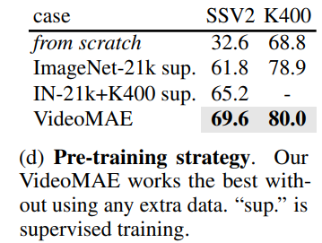

# VideoMAE

[arxiv](https://arxiv.org/abs/2203.12602) [github](https://github.com/MCG-NJU/VideoMAE)

## Concept

- An extremely high proportion of masking ratio (i.e., 90% to 95%) still yields favorable performance for VideoMAE

- VideoMAE achieves impressive results on very small datasets

- VideoMAE shows that data quality is more important than data quantity for SSVP

  We demonstrate that VideoMAE is a data-efficient learner that could be successfully trained with only 3.5k videos

  

- Self-supervised v.s. supervised

  The learned representations have outperformed the ones via supervised learning when being transferred to downstream tasks.

  It is expected that this self-supervised learning paradigm can provide a promising solution to address the challenge of training video transformers.

- vannila mae is not sufficient to cover the image, because it can find the original information at different frames easily

  **Temporal redundancy & correlation. **

- space-time cube embedding

  T x H x W

  This design can decrease the spatial and temporal dimension of input, which helps to alleviate the spatiotemporal redundancy in videos.

  **High Sematic!**

- when we try to transfer the pre-trained VideoMAE models to the other video datasets (e.g. from Kinetics to Something-Something), the results are slightly worse than their counterpart, which is directly pre-trained on its own target video datasets.

# Code

github: https://github.com/MCG-NJU/VideoMAE

## Concept

- 在查看 VideoMAE 代码的时候发现了 [decord](https://github.com/dmlc/decord)，一个可以替代 OpenCV 来读取视频的库，在查看 decord 时候又发现了 [GluonCV 的文档](https://cv.gluon.ai/build/examples_action_recognition/decord_loader.html)，这相对于 Dive Into Deep Learning 似乎是一个更全面的视频任务介绍

  处理 ssv2 数据集需要将 webm 格式转换为 mp4 格式，这样才好用 decord 来进行处理，[issue](https://github.com/MCG-NJU/VideoMAE/issues/62)

- 

## Question

- 在 GluonCV 的文档里说：训练一个 Kinetics-400 大约会花费 8 个 V100 GPU 10 天的时间。但是一个 ImageNet1K 的数据量也有 1Million 张图像，而用 8卡 A100 训练也只需要数小时，或许里面还有上升空间

## Question

- VideoGPT v.s. VideoMAE

- TSN Temporal segment networks for action recognition in videos

  如何进行动作识别

- action detection dataset AVA