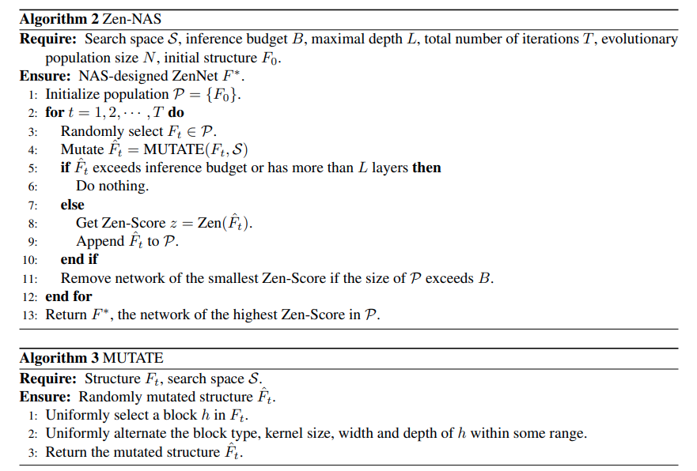

# Zen-Nas

[arxiv](https://arxiv.org/abs/2102.01063)

## Concept

- 计算网络的 accuracy 是一件很耗时的事情，论文设计了 Zen-score 作为一个 accuracy proxy，来代表网络表达能力。Zen-score 只需要几次前向计算即可获得

- 整个 nas 搜索方式是 data free 的，只需要 half GPU day，完全不需要训练网络

- 之前使用进化算法（Evolution Algorithm）以及强化学习算法（Reinforcement Learning），这两个方法均需要大量计算。为了减小计算提出了 predictor-based 方法，训练一个 predictor 来预测网络的 accuracy（将网络表示为一个向量输入到 predictor 当中）。One-shot 方法是训练一个大的 supernet（不理解）

  之前的方法无法在搜索速度和最终结果之间做好的平衡，在 ImageNet 上的表现也不 SOTA

- Search Space 参考 RegNet

- $\Phi$-score & Zen-score

  对于深度学习网络直接应用 $\Phi$​-score 会导致数值溢出，可以通过增加 BN 层然后重新放缩解决该问题

  现代网络使用一些辅助结构：残差结构、BN、self-attention，论文认为这些结构对于模型的表达能力没有大的影响，所以在评分的时候这些结构都去掉了🤔并且所有 non-ReLU 的激活层全部用 ReLU 替换

  $\Phi$-score 的定义为
  $$
  \Phi(f) = \log_{E_{\theta,0}} \left\| \nabla_{x} f(x|\theta) \right\|_F.
  $$
  

  其实就是模型对于 x 的梯度的 Frobenius 范数，然后再求一个期望，所谓期望，就是采样几个点求平均

  区别于之前的方法，是对模型的参数 $\theta$ 求梯度，论文是对输入求梯度。论文认为对参数求梯度是获得网络的可训练性，而不是获得网络的表达性

  但是如之前所说，在衡量 Zen-score 的时候去除了 BN 层，这会导致梯度爆炸。论文称这个问题为 scale-sensitive，也就是越深的网络，导致梯度越不稳定

  为了解决这个问题重新修改了 score 函数，只能说和上面 $\Phi$-score 没啥关系，但是论文说二者是等价的。后面给了一堆数学证明，不会真的是等价的吧
  $$
  Zen(F)=log(\Delta)+\sum_ilog({\sigma_i})
  $$
  其中 $\Delta$ 是一个增量值 $||f(x)-f(x+\alpha\epsilon)||_F$，$\alpha$ 就是一个小量 0.01，而 $x,\epsilon$ 就是随机生成的高斯噪声

  ```python
  mixup_input = input + mixup_gamma * input2
  output = model.forward_pre_GAP(input)
  mixup_output = model.forward_pre_GAP(mixup_input)
  
  nas_score = torch.sum(torch.abs(output - mixup_output), dim=[1, 2, 3])
  nas_score = torch.mean(nas_score)
  ```

  而 $\sigma_i$ 代表第 i 层 BN 输出的所有 channel 的方差的几何平均 $\sigma_i=\sqrt{\sum_j\sigma_{i,j}^2/m}$，其中 m 代表 channel 总数，j 最多取到 m

  ```python
  for m in model.modules():
      if isinstance(m, nn.BatchNorm2d):
          bn_scaling_factor = torch.sqrt(torch.mean(m.running_var))
          log_bn_scaling_factor += torch.log(bn_scaling_factor)
  ```

- 有了 Zen-score 过后，下面就是如何去最大化这个值

  论文直接使用进化算法 Evolutionary Algorithm (EA) 去搜索最大的 Zen-score。为什么选这个算法？因为简单，论文说也可以使用强化学习去搜

  

## Layout


## Question

- Zen-score 的计算方式