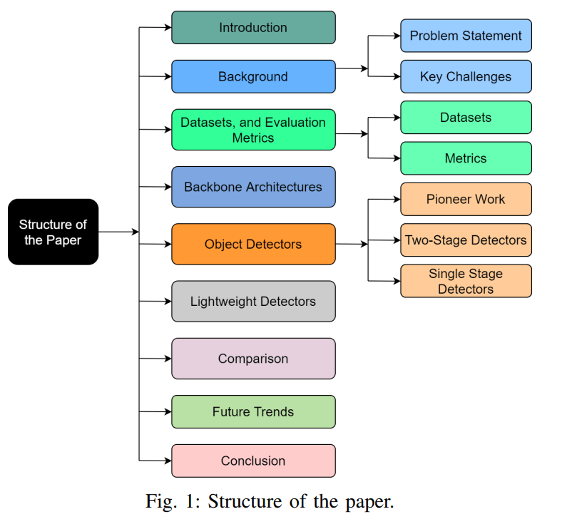

# A Survey of Modern Deep Learning based Object Detection Models

## Introductin

主要内容：

1. 分析单阶段和两阶段检测器 This paper provides an in-depth analysis of major object detectors in both categories – single and two stage detectors. 

2. 评估标志性检测器和轻量级检测器 We present a detailed evaluation of the landmark backbone architectures and lightweight models

## Background

None

## Datasets

**PASCAL VOC 07/12**

1. VOC12 challenge increased them to 11k training images and more than 27k labelled objects

2. Pascal VOC introduced the mean Average Precision (mAP) at 0.5 IoU (Intersection over Union) to evaluate the performance of the models. 

**ILSVRC:** The ImageNet Large Scale Visual Recognition Challenge

was an annual challenge running from 2010 to 2017 and became a benchmark for evaluating algorithm performance. 

The dataset size was scaled up to more than a million images consisting of 1000 object classification classes.

**MS-COCO**: The Microsoft Common Objects in Context

Unlike the Pascal VOC and ILSVCR, it calculates the IoU from 0.5 to 0.95 in steps of 0.5, then using a combination of these 10 values as final metric, called Average Precision (AP)

## Backbone

类似动手学深度学习一样将经典网络列举了一遍：AlexNet, VGG, GoogLeNet, ResNet

下面来点不一样的：ResNeXt ~~CSPNet~~ EfficientNet

 **ResNeXt** was inspired by thestacking of similar blocks in VGG/ResNet [3], [21] and “split-transform-merge” behavior of Inception module [18]. It isessentially a ResNet where each ResNet block is replaced byan inception-like ResNeXt module [知乎](https://zhuanlan.zhihu.com/p/32913695)

**EfficientNet** systematically studied network scaling and itseffects on the model performance. They summarized howaltering network parameters like depth, width and resolutioninfluence its accuracy.

感觉现在 CNN 框架已经到了一个瓶颈，从 EfficientNet 之后可以看出现在的一个方向是搜索更好的网络结构，也就是搜索更好的超参数让网络的更精确地适合于视觉任务，而没有从一个源头上突破 CNN 框架的形式