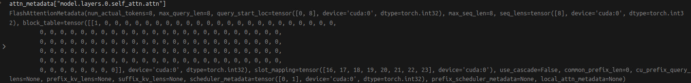

# vLLM

## uv

目前 uv 是一个现代的 python 管理工具包。我认为有如下几个功能很方便：

1. 创建 venv 虚拟环境

   ```shell
   uv venv -p 3.10.0 --seed
   ```

   其中 `-p` 是 `--python` 的缩写用于指定 python 版本，`--seed` 用于下载基础的 packages (pip & setuptools & wheel)。如果不加 `--seed` 则会使用系统的 `pip`，管理起来就比较麻烦

   同时还可以使用 `--system-site-packages` 来把系统当中的 packages 进行导入系统包

   使用 `source .venv/bin/activate` 来开启虚拟环境

2. 以极快的速度下载 python packages

   ```shell
   uv pip install package_name
   ```

   通常是由并行加速完成。有时候项目会编译 cpp or cuda extensions，我在使用 uv pip install 的时候直接卡死。所以如果涉及到编译过程就不要使用

3. 自动生成 python 项目骨架模板文件包括 `pyproject.toml & .gitignore` 等

   ```shell
   uv init project_dir
   ```

   可以通过

   ```shell
   uv add package_name
   uv remove package_name
   ```

   来向 `pyproject.toml` 中写入需要的 package，并且在当前项目中安装该 package

   另外可以通过 `project.scripts` 来给 python 文件增加 cli 接口，参考 [link](https://packaging.python.org/en/latest/guides/writing-pyproject-toml/#creating-executable-scripts)

   ```pyproject.toml
   [project.scripts]
   your_command = "package:cli_entry"
   ```

4. 使用 uv tool 来安装和执行 python packages cli

   > uv executes and installs command-line tools provided by Python packages

   ```shell
   uv tool install package_name
   ```

   通过该命令就可以安装 pacakge，然后在全局使用 packages 当中的 cli 命令，这对平常构建一些小工具还挺有用的

另外在操作过程中遇到 `pip install -e .` 报错，要求 `setup.py` 存在，这是因为 pip 版本过低造成，升级即可。并且保证使用的是 python 对应的 pip 而不是其他，例如 `python3-pip` 可能覆盖你的选项

## install

我使用了 [ngc pytorch-24-10](https://docs.nvidia.com/deeplearning/frameworks/pytorch-release-notes/rel-24-10.html#rel-24-10) docker 镜像，安装时会无法满足 vllm 的需求，所以 pytorch 是被重装了，建议还是使用 24-11 版本

根据官方安装脚本遇到两个问题：

1. [issue13608](https://github.com/vllm-project/vllm/issues/13608)，根据提示安装 cuda 12.4 版本解决

   ```shell
   uv pip install torchvision torchaudio --index-url https://download.pytorch.org/whl/cu124
   ```

2. numpy 预编译版本不匹配，使用 `pip install numpy==1.26.4` 解决

还得是 build from source 用着得劲

vllm commit [18093](https://github.com/vllm-project/vllm/commit/18093084be935fe8aad11a45366bea060b33d60f)

1. 使用本地的 pytorch，根据 [full build with compilation](https://docs.vllm.ai/en/stable/getting_started/installation/gpu.html#full-build-with-compilation) 移除 requirements.txt 当中的 pytorch 要求，我还设置了 cmake 当中的 pytorch 版本

   由于 pytorch 2.5 的原因我还注释了 `env_override.py` 当中的

   ```python
   # torch._inductor.config.compile_thread = 1
   ```

2. 由于编译过程中，tmp 文件可能过大（>40G），所以需要指定一下 `TMPDIR` 放到一个大的空间内

3. 由于编译过程中可能需要重新编译，但是每一次 pip 都会从头编译，不会使用已经编译好的 object，根据 [tip](https://docs.vllm.ai/en/stable/getting_started/installation/gpu.html#full-build-with-compilation) 使用 `ccache`

   ```shell
   NOHASHDIR="true" TMPDIR=./tmp pip install -e . --no-build-isolation -v
   ```

## Quant

目前出于灵活性考虑，我需要在自己的量化框架下实现模型权重校正，然后再将权重进行压缩。所以我需要使得权重压缩格式符合 vllm 的要求，目前有不少框架都支持这个功能，不过实验下来并不是每一个都好用：

1. AutoAWQ：不支持 sym quant
2. GPTQModel：安装报错
3. llm compressor：导出模型乱码，而且代码的封装程度很重
4. AutoGPTQ：安装简单，支持 sym quant，代码封装低

所以 AutoGPTQ 是最理想的量化框架


AutoGPTQ 也存在一个问题：即使使用 sym quant，仍然需要 qzeros 存在，这我不太理解但尊重。目前我需要实现一个 `QuantLinear` 将我们的浮点模型转换为需要的 int 存储格式


竟然还学习到了 python 的新语法：`for-else`，询问了 DeepSeek

> In Python, a `for-else` construct works like this:
>
> - The `else` block executes only if the loop completes normally (i.e., wasn't terminated by a `break` statement)
> - If the loop exits due to a `break`, the `else` block is skipped

nsys profile 命令参考 vllm profile 文档

```shell
nsys profile --trace-fork-before-exec=true --cuda-graph-trace=node -o output -f true python basic.py
```

对于 serve 也可以使用 nsys profile

```shell
nsys profile --trace-fork-before-exec=true --cuda-graph-trace=node --delay 30 --delay 30 --duration 60 -o output -f true bash run_serve.sh
```

观察到开启 `enforce_eager=True` 过后，kernel 之间的间隔明显增大，但是方便 debug

## W4A16 Format

DONE, need notes

## W8A8 Format

Pending

## vLLM EAGLE

Next focus

目前 vllm 主推其 V1 architecture，原始的 V0 版本性能可能不是最优的。在 V1 架构中，投机采样是直接写在了 `GPUModelRunner` 当中，这给我们的实现带来便利（or NOT?）


## vLLM Inference Flow

serve request <=> offline inference 是如何转换的

在哪里执行了 model forward，我们可以 hack 吗？

是如何构建不同精度的模型

如何管理 kv cache

如何管理 batch inference

## vLLM GPUModelRunner with EAGLE3

- `attn_metadata` 是存储 kv cache 的单元，一个 dict of `FlashAttentioMetadata`

  

  注意其中也包含了 draft model kv cache，命名为 `model.layers.32.self_attn.attn`，也就是比 target model 再多一层

- model output 是一个 tuple

  1. hidden state `(N, C)`
  2. aux hidden states, list of hidden states `(N, C)`

- compute logits 在 model forward 之外

  ```python
  sample_hidden_states = hidden_states[logits_indices]
  self.model.compute_logits(sample_hidden_states)
  ```

- drafter propose draft tokens

  之后直接返回 draft tokens & sampled token ids

- 在 GPU model runner 之上还有两层封装，是跟 rpc (Remote Procedure Call) 相关的？

- 循环发生在 `EngineCoreProc.run_busy_loop`

- **什么是 chunked prefill? 在 vllm 当中是默认开启的吗？**

- 在 vllm 当中使用 context manager 来完成 kv cache 的使用

  ```python
  with set_forward_context(attn_metadata,
                           self.vllm_config,
                           num_tokens=num_tokens):
      self.model(input_ids)
  ```

  **需要弄清楚其中的参数含义，如何通过这种方式管理**。`num_tokens` 似乎必须是 int，代表一个 batch decode，但是如何处理不同 history seq len？需要进一步的查看

- cuda graph 似乎需要 buffer or padding?

- sampling meta data & spec decode meta data 会负责通过 logits 进行 verify draft tokens 生成接收 token

- 确保所有的 spec decode 都是 greedy sampling 策略

- 我们需要实现一个 mm eagle，现在开源社区还没有支持。另外 vllm 对 ealge 实现有两个变化：

  1. 使用 unstable kv，stable kv 没有实现 [issue](https://github.com/vllm-project/vllm/issues/14649)
  2. 推荐对 embedding & hidden states 使用 rmsnorm，这样会提高命中率 [pr](https://github.com/vllm-project/vllm/pull/14990)

- **see how the vllm handle when batch size is bigger than 1!**

  其中肯定会涉及 flashinfer 的使用，因为这涉及到 batch kv cache 管理机制

- **Paged Attention 原理，以及其参数含义：block table & page size**

  用一个 block table 映射表，来将离散的 kv cache 组合起来，让程序认为其是在一个连续的 kv cache 上工作，这就是虚拟内存设计 (v in the vLLM)

## Question

1. 为什么 python setup.py develop 又 work 了而 pip install -e . 会报错 build no space？

   因为自己的 pip 版本太低了

2. 为什么说是 zero cpu overhead，但是在 decode 之间还是有 1ms 的空隙？

   有的 blog 说 zero overhead 指的是 prefix caching 这一块，需要调查，估计会很麻烦

3. block table 是什么意思？这应该和 paged attention 有关