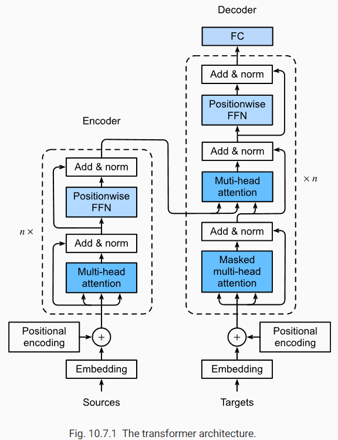
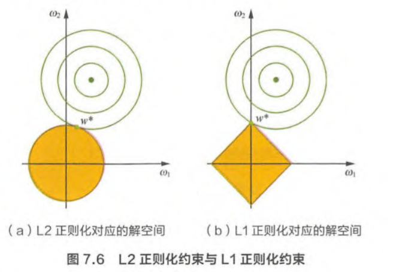
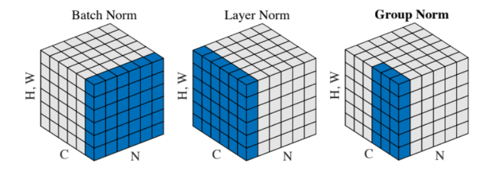
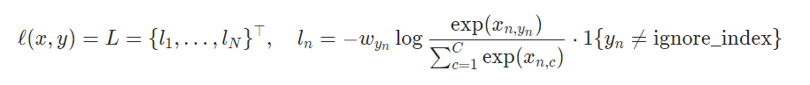

## 算法面经（含解答）

把自己看到的一些面经做一个汇总，面试其实能够考虑到的深度是不太够的，但是有相当的广度，记住一些结论会很有帮助。虽然整理得非常简洁，但是面试的时候尽量展开！

### Transformer

一句话理解 attention 机制：给定 context data key value pair，给定 query，给定 query 与 context 的交互方式（即 attention score & attention pooling function），就能输出预测结果。可以用回归的模型去套一下，会更好理解

#### 缩放点积注意力

$$
a(\mathbf{q}, \mathbf{k})=\mathbf{q}^{\top} \mathbf{k} / \sqrt{d}
$$

这就是 transformer 里用到的注意力机制

假设查询和键的所有元素都是独立的随机变量， 并且都满足零均值和单位方差， 那么两个向量的点积的均值为0，方差为 d。为确保无论向量长度如何，点积的方差在不考虑向量长度的情况下仍然是1，我们将点积除以 $\sqrt d$

如果是 key query 维度不同的情况，可以使用加性注意力

#### 多头注意力

当给定相同的查询、键和值的集合时， 我们希望模型可以**基于相同的注意力机制学习到不同的行为**，然后将不同的行为作为知识组合起来
$$
\mathbf{h}_{i}=f\left(\mathbf{W}_{i}^{(q)} \mathbf{q}, \mathbf{W}_{i}^{(k)} \mathbf{k}, \mathbf{W}_{i}^{(v)} \mathbf{v}\right) \in \mathbb{R}^{p_{v}}
\\
\mathbf{W}_{o}\left[\begin{array}{c}
\mathbf{h}_{1} \\
\vdots \\
\mathbf{h}_{h}
\end{array}\right] \in \mathbb{R}^{p_{o}}
$$

#### 位置编码

自注意力计算结果是不包含位置（顺序）信息的，我们可以自己加上
$$
\begin{aligned}
p_{i, 2 j} &=\sin \left(\frac{i}{10000^{2 j / d}}\right) \\
p_{i, 2 j+1} &=\cos \left(\frac{i}{10000^{2 j / d}}\right)
\end{aligned}
$$

#### Transformer block

只能看个大概，每个结构都是非常重要的设计：

1. multi-head attention
2. add & norm
3. residual connection
4. MLP



### NMS

#### 代码实现

要点：1. 将选框排序，使用该 index 作为索引，顺序筛选；2. 计算 IoU；3. 排除选框

```python
def nms(boxes, score, thresh):
    """
    NMS scripts based on numpy.
    Params:
        - data: (N, 5)
        - thresh: float
        - score: (N,)
    """
    lt = boxes[:, :2]
    rb = boxes[:, 2:]
    area = np.prod(rb - lt, axis=1)
    index = np.argsort(score)
    keep = []
    while len(index) > 0:
        cur_i = index[0]
        cur_box = boxes[cur_i]
        keep.append(cur_box)

        lt_inter = np.maximum(cur_box[:2], boxes[index, :2])
        rb_inter = np.minimum(cur_box[2:], boxes[index, 2:])
        wh_inter = np.clip(rb_inter - lt_inter, a_min=0)
        inter_area = np.prod(wh_inter, axis=1)

        iou = inter_area / (area[cur_i] + area[index] - inter_area)
        index = index[iou < thresh]
    return np.stack(keep, axis=0)
```

#### NMS 的缺陷

1. 将相邻的分数框强制删除，如果一个物体出现在重叠区域将导致物体的检测失败
2. NMS 阈值不易确定，过小会误删，过大会误检
3. NMS 并行度很低

缺点1的改进方法：

1. soft nms，不直接删除框，而是降低重叠选框的得分

用于排序的 score 还可以使用 IoU 值进行矫正，获得更好的评估

### 数据

#### 数据不足

数据不足可能导致模型过拟合，可以使用如下方法

1. 数据增强：旋转，翻转，缩放，平移，噪声，颜色，剪裁
2. 正则化方法（具体方法在后面）

真正解决数据不足的方法可能只有自监督/半监督学习

#### 类别不均衡应该怎么处理

进行均衡（重）采样，或者对损失函数权重进行调整

#### 特征维度大

使用降维方法：PCA 主成分分析，或者使用 embedding 矩阵，把高维向量转化到低维向量

#### 特征归一化

消除量纲影响，控制数值分布范围，可以避免 zigzag 震荡优化

### 过拟合 欠拟合 正则化

#### 过拟合

1. 数据增强
2. 降低模型复杂度
3. 正则化方法

#### 欠拟合

1. 添加新特征
2. 增加模型复杂度
3. 减小正则化系数

#### 正则化方法

1. L1 & L2

   1. L1 正则化会导致学到的参数稀疏，L2 正则化会让学到的参数分布更均匀。可以用下图中的优化理论解释
      $$
      min \ f(x)\\
      s.t. \ m(x) \le 0
      $$
      上面的优化问题（不严谨地）等价于 $min \ f(x) + \lambda m(x)$

      

      而 L1 正则项约束的解空间是多边形。显然，多边形的解空间更容易在尖角处与等高线碰撞出稀疏解

   2. L2 正则化与权重衰减等价

2. Dropout

3. BatchNorm，使用了小批量中的均值和方差，相当于在小批量中引入了噪声，有一定的正则化效果

4. 一致性正则化（半监督学习），使用 consistency loss

### BatchNorm & LayerNorm

#### BatchNorm

BatchNorm 在训练时的过程很简单，使用下面的公式描述即可
$$
\mathrm{BN}(\mathbf{x})=\gamma \odot \frac{\mathbf{x}-\hat{\boldsymbol{\mu}}_{\mathcal{B}}}{\hat{\boldsymbol{\sigma}}_{\mathcal{B}}}+\boldsymbol{\beta}
\\
\begin{aligned}
\hat{\boldsymbol{\mu}}_{\mathcal{B}} &=\frac{1}{|\mathcal{B}|} \sum_{\mathbf{x} \in \mathcal{B}} \mathbf{x} \\
\hat{\boldsymbol{\sigma}}_{\mathcal{B}}^{2} &=\frac{1}{|\mathcal{B}|} \sum_{\mathbf{x} \in \mathcal{B}}\left(\mathbf{x}-\hat{\boldsymbol{\mu}}_{\mathcal{B}}\right)^{2}+\epsilon
\end{aligned}
$$
在测试时均值使用的是训练时候的指数移动平均

具体过程可以看下面的代码，更加清晰

```python
import torch
from torch import nn


def batch_norm(X, gamma, beta, moving_mean, moving_var, eps, momentum):
    # 通过 `is_grad_enabled` 来判断当前模式是训练模式还是预测模式
    if not torch.is_grad_enabled():
        # 如果是在预测模式下，直接使用传入的移动平均所得的均值和方差
        X_hat = (X - moving_mean) / torch.sqrt(moving_var + eps)
    else:
        assert len(X.shape) in (2, 4)
        if len(X.shape) == 2:
            # 使用全连接层的情况，计算特征维上的均值和方差
            mean = X.mean(dim=0)
            var = ((X - mean) ** 2).mean(dim=0)
        else:
            # 使用二维卷积层的情况，计算通道维上（axis=1）的均值和方差。
            # 这里我们需要保持X的形状以便后面可以做广播运算
            mean = X.mean(dim=(0, 2, 3), keepdim=True)
            var = ((X - mean) ** 2).mean(dim=(0, 2, 3), keepdim=True)
        # 训练模式下，用当前的均值和方差做标准化
        X_hat = (X - mean) / torch.sqrt(var + eps)
        # 更新移动平均的均值和方差
        moving_mean = momentum * moving_mean + (1.0 - momentum) * mean
        moving_var = momentum * moving_var + (1.0 - momentum) * var
    Y = gamma * X_hat + beta  # 缩放和移位
    return Y, moving_mean.data, moving_var.data
```

BatchNorm 中可学习的参数只有 $\gamma, \beta \in \mathbb R^{C}$

BatchNorm 在部署时可以和前一层的卷积进行合并可以减少计算（重参数化技术）

BatchNorm 的作用可以总结为如下几点：

1. 固定小批量中的均值和方差 --> 维护数值的相对稳定 --> 缓解梯度爆炸/消失 --> 加速收敛（但通常不增加模型准度）
2. 固定小批量中的均值和方差 --> 引入了小批量内噪声 --> 正则化

#### LayNorm

直接搬上来这个图，瞬间理解这些 Norm 的形式（还缺了一个 instance norm，就是横着一根儿）



这些 normalization 本质上都是想要控制数值的稳定性，而 layer norm 更适合与样本之间形状不同的情况，在 NLP 领域中很常见

### 混淆矩阵

混淆矩阵是用来总结一个分类器结果的矩阵。对于k元分类，其实它就是一个k x k的表格，用来记录分类器的预测结果。对于最常见的二元分类来说，它的混淆矩阵是2乘2的

|                     | Positive | Negative |
| ------------------- | -------- | -------- |
| Prediction Positive | TP       | FP       |
| Prediction Negative | FN       | TN       |

二元混淆矩阵可以用于计算精确率和召回率帮助分析模型
$$
\begin{array}{c}
\text { Accuracy }=\frac{T P+T N}{T P+F P+T N+F N} \\
\text { Precision }=\frac{T P}{T P+F P} \\
\text { Recall }=\frac{T P}{T P+F N}
\end{array}
$$
既然提到了精确率 Precision 和召回率 Recall，避不开就要谈到 PR 曲线：以Recall为横轴，Precision为纵轴，就可以画出一条PR曲线，PR曲线下的面积就定义为AP。PR 曲线上的一个点代表着，在某一个阈值下，模型将大于该阈值的结果判定为正样本，小于该阈值的结果判定为负样本，此时返回结果对应的召回率和精确率

即 PR 曲线可由不同阈值下的混淆矩阵绘制而成，使用这样的评估模型用于表示模型对精确率和召回率的权衡

### 模型压缩和加速

[zhihu](https://zhuanlan.zhihu.com/p/138059904) 从来没处理过...只能捡点的套话整理一下

1. 矩阵分解，分组卷积，小卷积核等计算量都是相对较少的，矩阵分解可以认为是一种降维手段
2. 权值共享也能减低参数数量
3. 全局池化替代全连接层
4. 模型量化和剪枝（不懂），量化是指将信号的连续取值近似为有限多个离散值的过程，可理解成一种信息压缩的方法。剪枝的总体思想是，将权重矩阵中不重要的参数设置为0，结合稀疏矩阵来进行存储和计算
5. 模型蒸馏：大模型生成 soft target 训练小模型

### 损失函数

#### Cross Entropy

交叉熵损失，形式如下：



为什么分类任务可以使用交叉熵损失，而不使用 MSE？这个问题可以从梯度的角度来回答，也可以从线性回归条件下的凸优化角度来回答：

1. 梯度角度：MSE 的梯度会包含 sigmoid 函数的求导，该求导在自变量比较大时会出现梯度消失的问题，而 CE 则不会，梯度仅与预测和标签相关
2. 凸优化角度：线性规划条件下使用 MSE 会变成非凸优化，而使用 CE 则是凸优化

使用 softmax or sigmoid 函数时需要解决上下溢问题，通常直接使用 logit 作为输入，将 softmax 和 log 一起计算就能同时解决上下溢问题
$$
\log \left(\frac{\exp (x-a)}{\sum_{i=1}^{k} \exp _{i}^{(x-a)}}\right)=\log \left(e^{(x-a)}\right)-\log \left(\sum_{i=1}^{k} \exp _{i}^{(x-a)}\right)=(x-a)-\log \left(\sum_{i=1}^{k} \exp _{i}^{(x-a)}\right)
$$

#### Focal Loss

关于 focal loss 可以看这篇 [知乎](https://zhuanlan.zhihu.com/p/80594704)，公式如下：
$$
F L=\left\{\begin{array}{rll}
-\alpha(1-p)^{\gamma} \log (p), & \text { if } & y=1 \\
-(1-\alpha) p^{\gamma} \log (1-p), & \text { if } & y=0
\end{array}\right.
$$
白话来说：focal loss 使用了两个技巧改变 loss function 的分布：

1. alpha 可以调节正负样本 loss 分布 
2. gamma 可以条件难易样本 loss 分布

这样我们就能够平衡难易样本和正负样本之间的 loss，把优化重点放到更难的样本之上，加速优化。上面知乎中的有一条评论也解决了我的疑惑，为什么正样本远小于负样本时 alpha 还取得较小：因为 gamma 的效应太大了，反而需要提升一点负样本的比重。总之就是实践出来的！

#### KL Divergence & CE

[zhihu](https://zhuanlan.zhihu.com/p/292434104) 交叉熵和 KL 散度之间的联系是什么？交叉熵就是用于衡量两个分布之间的相似度。这里又要提一句 KL 散度和交叉熵之间的关系与区别：**KL 散度可以被用于计算两个分布的差异，而在特定情况下最小化 KL 散度等价于最小化交叉熵。而交叉熵的运算更简单，所以用交叉熵来当做代价**。再贴几个公式
$$
S(v)=-\sum_{i} p\left(v_{i}\right) \log p\left(v_{i}\right)
\\
D_{K L}(A \| B)=\sum_{i} p_{A}\left(v_{i}\right) \log p_{A}\left(v_{i}\right)-p_{A}\left(v_{i}\right) \log p_{B}\left(v_{i}\right)
\\
H(A, B)=-\sum_{i} p_{A}\left(v_{i}\right) \log p_{B}\left(v_{i}\right)
\\
H(A, B)=D_{K L}(A \| B)+S_{A}
$$
当 $S_A$ 为常数时，优化交叉熵等价于优化 KL 散度。最后提一句通过 Jensen 不等式可证明 KL 散度大于0

#### Smooth L1

Smooth L1的优点：1. 处理了 L1 的不光滑；2. 处理了 L2 对于离群点惩罚过大

#### IoU Loss

IoU Loss：DIoU, GIoU, CIoU  [zhihu](https://zhuanlan.zhihu.com/p/94799295)，单纯使用 IoU 作为损失函数的缺点：

1. 不能反映两者的距离
2. 不能反映非重合区域的情况

为改善上面的两个缺点，提出 GIoU
$$
G I o U=I o U-\frac{\left|A_{c}-U\right|}{\left|A_{c}\right|}
$$
其中 $A_c$ 表示两个框的最大闭包，$U$ 则表示两个框的联合面积，如果两个选框距离比较远，并且非重叠区域很大的话，GIoU 就能反映出来。之后又提出了 DIoU
$$
D I o U=I o U-\frac{\rho^{2}\left(b, b^{g t}\right)}{c^{2}}
$$
其中 $c$ 是最大闭包的对角线，$\rho$ 是欧式距离计算公式，$b, b^{gt}$ 代表框的中心。DIoU 损失比 GIoU 损失收敛得更快，也更直观

之后又提出了另外一个 CIoU，进一步考虑长宽比，这里不做进一步整理了

### 优化

#### Adam & AdamW

Adam 要将 RMSProp 和 Momentum 结合起来，其实二者一个是对方向的平滑/平均（可从动量角度解释），另一个是对模的平滑/平均（避免 zigzag 更新）
$$
\begin{array}{l}
\mathbf{v}_{t} \leftarrow \beta_{1} \mathbf{v}_{t-1}+\left(1-\beta_{1}\right) \mathbf{g}_{t} \\
\mathbf{s}_{t} \leftarrow \beta_{2} \mathbf{s}_{t-1}+\left(1-\beta_{2}\right) \mathbf{g}_{t}^{2}
\end{array}
$$
我们同时更新动量/一阶矩 $v_t$ 和二阶矩 $s_t$（随机变量 x 的 n 阶矩为 $E[x^n]$）。当 t 比较小的时候，一阶矩和二阶矩会与其估计出现较大的偏差，在更新通过以下式子进行修正
$$
\hat{\mathbf{v}}_{t}=\frac{\mathbf{v}_{t}}{1-\beta_{1}^{t}} \text { and } \hat{\mathbf{s}}_{t}=\frac{\mathbf{s}_{t}}{1-\beta_{2}^{t}}
$$
最后更新参数，注意 ε 是在根号外面的，与 RMSProp 不同，在实践中效果略好，深层原因不明...
$$
\mathbf{g}_{t}^{\prime}=\frac{\eta \hat{\mathbf{v}}_{t}}{\sqrt{\hat{\mathbf{s}}_{t}}+\epsilon}
\\
\mathbf{x}_{t} \leftarrow \mathbf{x}_{t-1}-\eta_{t} \mathbf{g}_{t}^{\prime}
$$
[AdamW pytorch](https://pytorch.org/docs/stable/generated/torch.optim.AdamW.html) 区别于 [Adam pytorch](https://pytorch.org/docs/stable/generated/torch.optim.Adam.html#torch.optim.Adam)，其实很简单，[AdamW](https://paperswithcode.com/method/adamw) 就是把 weight decay 从 EMA 当中分离出来，放到最后去更新梯度，从而不让 EMA 受到 weight decay 的影响

#### 梯度爆炸与消失

1. 出现了很多神经元为0的情况，为什么？原因在于会有一种情况：梯度太大，学习率也大，导致权重更新幅度很大，导致对于任意训练样本，网络的输出都是小于0的，这样神经元是在 ReLU 激活函数后是不会更新的。可以使用 LeakyReLU，缓解这样的情况
2. 梯度消失。上面的情况也属于梯度消失，还有其他原因也经常导致梯度消失：
   1. 网络太深，权重连续相乘，梯度迅速衰减
   2. 损失函数 or 激活函数区域饱和，例如 sigmoid 激活函数
3. 梯度爆炸。也主要有两个原因：
   1. 网络太深，权重连续相乘，梯度迅速攀升
   2. 权值初始化太大，或者学习率太大

解决方法：

1. 使用更好的激活函数，例如 ReLU 替代 sigmoid，可以避免部分梯度消失的情况
2. 梯度裁剪可减缓梯度爆炸的情况
3. 正则化方法也能够减缓梯度爆炸的情况：L1, L2, BatchNorm 都能够一定程度控制参数/训练数值的范围
4. 残差连接捷径，能够让梯度跳过网络直接回传
5. LSTM 门控结构

### Python

#### 迭代器 生成器 yield

[bilibili](https://www.bilibili.com/video/BV1ca411t7A9) 可迭代对象能够帮助我们方便地逐个地访问一个序列，可迭代对象随处可见（list, tuple, dict）。一个类拥有 `__iter__` 方法，代表它的对象是可迭代对象，该方法返回值通常是 self 本身。个人认为，该方法是一个可迭代标志，有的地方强制要求拥有该标志，例如循环。通常在 `__iter__` 方法里写一些初始化代码，每次调用 `__iter__` 的时候就“序列的“指针”就会被“拨到初始位置”（引号表示比喻，之后将沿用）

通过内置函数 `iter` 就可以显式调用该对象的 `__iter__` 方法。不过我们通常在好的封装中没有看到显式地使用 `iter` 方法，例如循环

`__iter__` 相当于做一个初始化，真正的逐个访问序列需要使用另一个方法 `__next__`。每次使用 `__next__` 方法，序列的指针就会往前走一步，直到序列结束位置。可以使用 `next` 方法显式调用对象的 `__next__` 方法

```python
class Test:
    def __init__(self, n):
        self.n = n
        self.count = 0

    def __iter__(self): 
        self.count = 0
        return self

    def __next__(self):
        if self.count < self.n:
            self.count += 1
            return self.count - 1
        else:
            raise StopIteration

t = Test(3)
b = next(t) # can work without __iter__ function
# 0
c = next(t)
# 1

for i in t: # require it as iterable
    print(i)
# 0 1 2
```

虽然 `__next__` 也可以独立于 `__iter__` 运作，但是默认他们必须同时在一个可迭代对象里实现

而 `yield` 关键字将让一个函数变为可迭代对象，但是由于没有 `__iter__` 方法初始化，不能重复迭代，相当于快速实现的一次性可迭代对象。`next` 方法将不断地去 return `yield` 后面的值，直到没有 `yield`

```python
def test(n):
    count = 0
    while count < n:
        yield count
        count += 1

for i in test(3):
    print(i)
# 0 1 2
for i in a:
    print(i)
# no more
```

#### 装饰器

[闭包](https://www.bilibili.com/video/BV1M7411a7M3)：在一个内部函数中，对外部作用域的变量进行引用，(并且一般外部函数的返回值为内部函数)，那么内部函数就被认为是闭包。闭包可以避免全局变量的使用以及提供某种形式数据的隐藏

一个求和的闭包长这样

```python
def average():
    l = []
    def inner(value):
        l.append(value)
        return sum(l)
    return inner

aver = average()
aver(1)	# 1
aver(2)	# 3
```

变量 l （也称自由变量）不会在内存中消失。这和类的属性是有异曲同工之妙的，不过通过闭包实现

装饰器就和闭包有着千丝万缕的联系。https://zhuanlan.zhihu.com/p/285155201

1. 多继承
2. 垃圾处理
3. 多进程/多线程/携程

### CNN 发展史

动手深度学习 现代卷积网络 答一遍

卷积在 GPU 上如何实现并行运算的

mobilenet yolo faster-rcnn

resnet 输入输出通道数不一样怎么办？

空洞卷积和可变卷积

depthwise 卷积

### Anchor-based & anchor-free

区别，好处坏处

### 半监督自监督

了解哪些半监督自监督领域的方法

### Bilinear Nearest 插值

手写

### 匈牙利算法 & DETR

匈牙利算法在 DETR 中的作用和实现方法

### Pooling

Pooling 有什么作用，Pooling 的反向传播

### Dropout

数学原理，反向传播过程

### 难例挖掘

如何做难例挖掘

### 车道线

如何做车道检测

### 小目标和超大目标检测

### 为什么半监督有用
