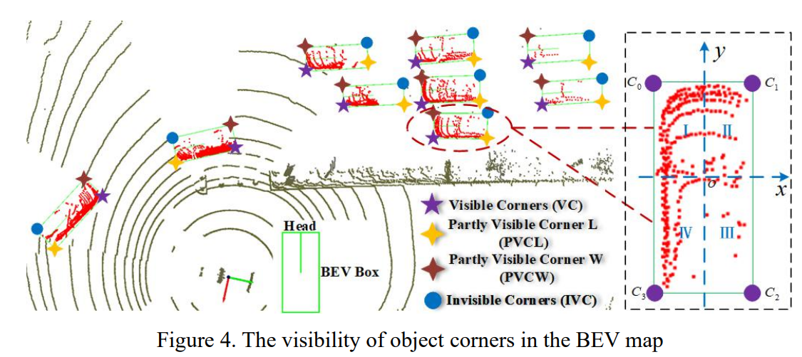
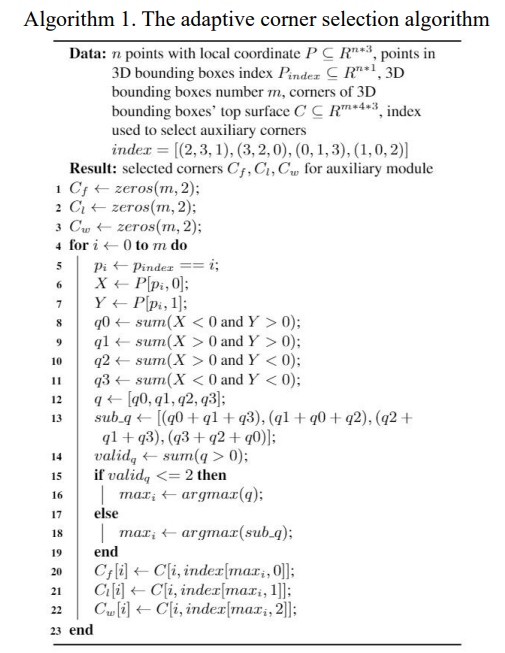
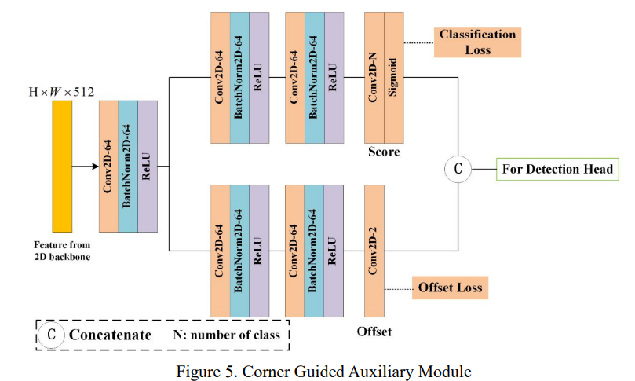
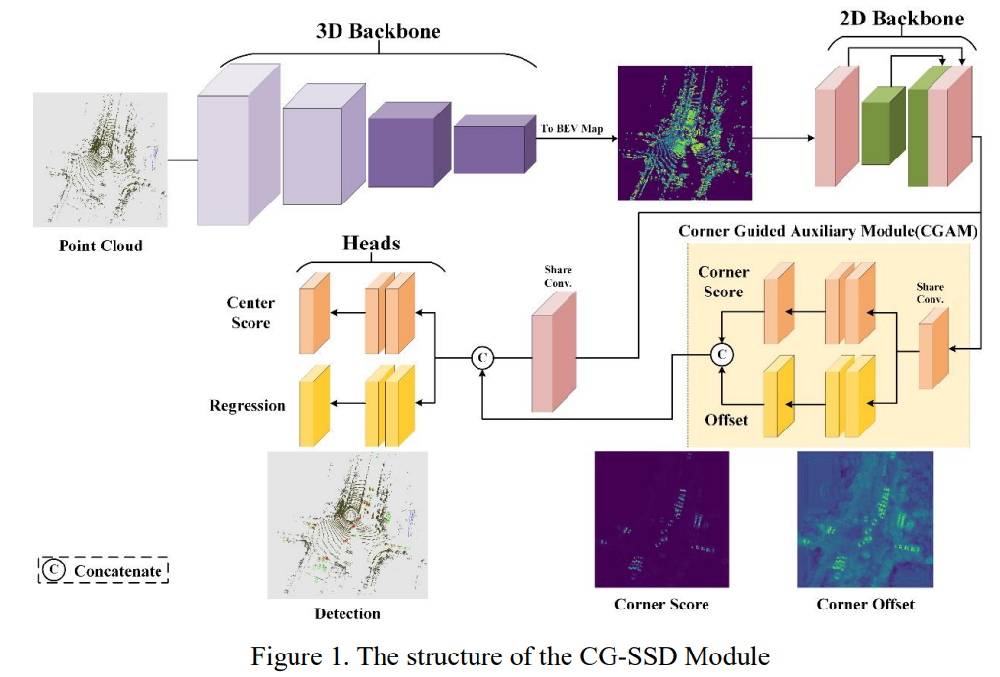
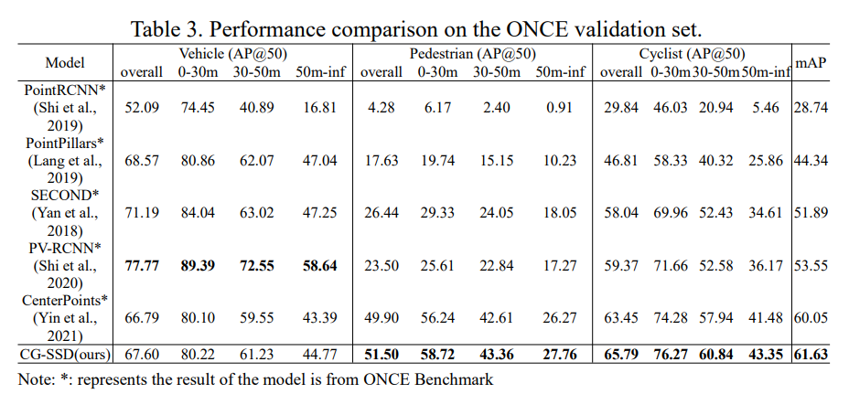
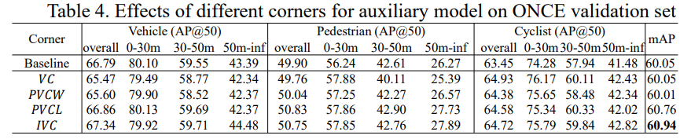
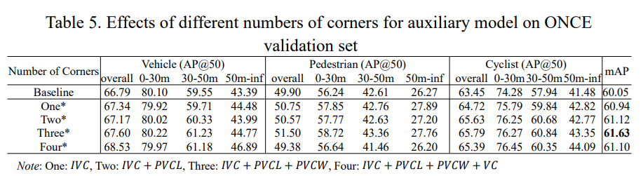
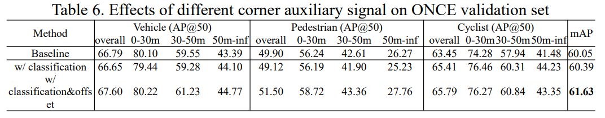
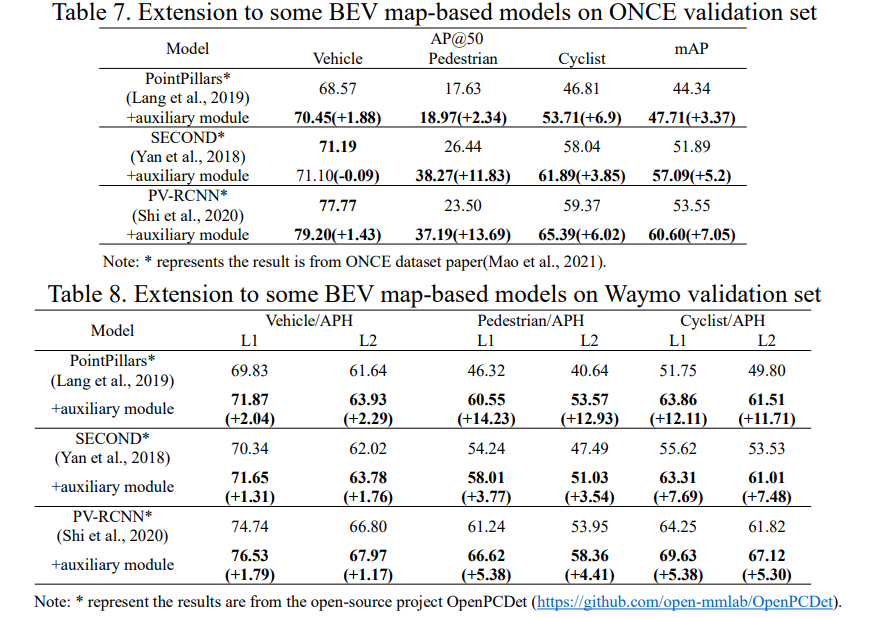

# CG-SSD

这篇是辅助网络最近的一个工作，对于小目标的效果提升非常好！简单整理一下其中的辅助模块 CGAM (corner-guided auxiliary module)

## Introduction

CGAM 的核心思想就是使用 BEV map 去做两个辅助任务：

1. corner classification
2. corner offset predicton

然后将预测得到的 feature map concat 到原来的 BEV map，然后再去做 box prediction。这样的 CGAM 可以当作一个 plug-in 去帮助 BEV-based 网络提点

## Corner Selection

为了让 corner 带有更多的信息，论文还把 corner 分成了四个类别：1. Visible; 2. Partly Visible L; 3. Partly Visble W; 4. Invisible

简单来讲，角的类别是其所在象限的点云数量决定的：点云最多的就是 visible corner，最少的就是 invisible corner，不多不少的就是 partly visible corners

在做 corner classification 的时候不会去识别所有的角，而是去识别后三类角，这样效果最好。Corner Selection 就是把后三类角给找出来，并且为了鲁棒性，分两种情况讨论了如何衡量象限内的点云数量：

1. 如果物体内的点很少，只有两个象限有点云，就直接看单个象限内点云的个数
2. 如果物体内的点云多，考虑连续三个象限内的点云

论文中的详细算法如下

## Archetecture

CGAM 的结构论文也画的非常清晰

整个网络的结构如下

## Experiment

1. ONCE 验证集的结果

2. 不同角对于表现的提升

3. 选取角对表现的提升

4. 预测 offset 对于模型的提升

5. CGAM 作为辅助模块

## 思考

为什么自己的结构不起作用？之后设计结构需要注意哪些地方？

