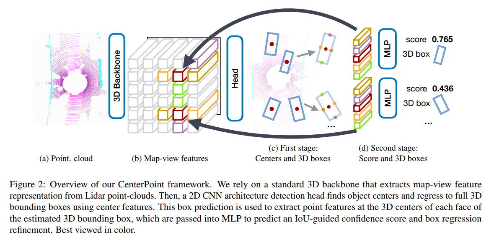
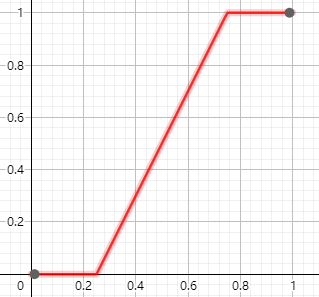
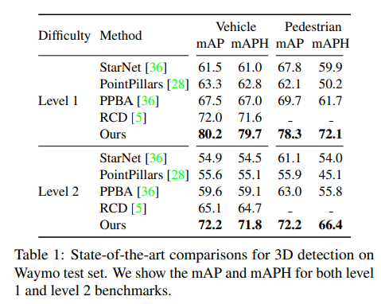
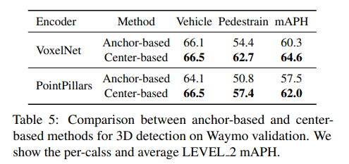
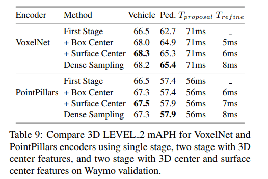
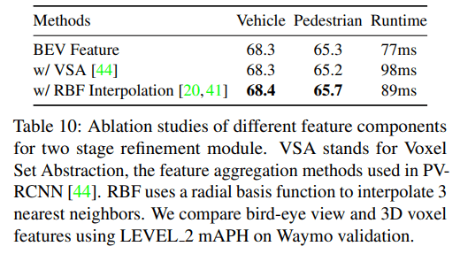

# CenterPoint

---

Yin, Tianwei, Xingyi Zhou, and Philipp Krähenbühl. “Center-Based 3D Object Detection and Tracking.” *ArXiv:2006.11275 [Cs]*, January 6, 2021. http://arxiv.org/abs/2006.11275.

---

## Introduction

### 三维目标检测难点

与二维目标检测相比，三维目标检测有几个基本的难点

1. 点云数据的稀疏性，有大量的空间没有点云 

2. **选框的自由度高，不仅有更灵活的方向，还有更多的尺寸。Anchor-based RPN 难以满足这样的灵活性** 

### Contribution

CenterPoint 是一个 2-Stage 三维目标检测网络，是 center-based 系列思想在三维中的应用，其前作 CenterNet (Objects as Points) 在二维目标检测中有不错的效果，同时也在 CenterPoint 中发挥了重要作用。本论文提出的是一种基本框架，使用 center-based 思想能够不同程度提升 backbone 的表现（约 3-4 mAP）。再经过第二阶段的细化 refinement 还能够继续提升约 2 mAP 的表现，且牺牲的计算较少，控制在 10% 以内。下面简单介绍一下两个阶段的过程：

1. 首先使用 3D backbone 提取点云特征，该特征是以 map-view 的形式（俯视栅格）呈现。第一阶段 Stage-1 使用 map-view features 检测各个目标点的中心位置，然后使用中心位置的特征回归预测 3D 选框的其他属性，包括大小、方向、速度等
2. 第二阶段 Stage-2 使用更多的相关点的特征来对选框进行细化

## CenterPoint Architecture

### 3D 检测网络通用框架

论文里提了一下现代 3D detector 的常见处理过程。首先是使用一个 backbone 对点云数据进行特征提取，该 backbone 也可以叫做 encoder。backbone 的输出为一个 map-view feature map $M\in R^{W\times L\times F}$，其中 W & L 为 width & length 和三维场景的长宽相关，F 为特征维度的大小或者称为 channel number。论文中采用的 backbone 有两个 VoxelNet & PointPillars（建议了解一下这两个网络），对这两个 backbone 做了实验和比较

然后常使用 bounding box detector 在该 feature map 上进行检测。这样的 detector 在二维当中有很多可以借鉴的网络，论文使用了 CenterNet 而不是常规的 anchor-based 网络。下图即为 CenterPoint 结构示意图，接下来详细了解一下两个阶段的细节

### Stage-1

第一阶段基本上就是 CenterNet 思想的复刻，不管是中心预测，还是回归其他属性，所以细节部分请阅读 Objects as Points。这些预测都属于 dense prediction 也就是说每一个栅格 bin 都会有自己的预测结果，所有的第一阶段网络都是常见的卷积网络

#### Center heatmap head

首先需要使用 feature map 预测各个目标的中心点在哪里。这里的过程和 CenterNet 是相似的，下面列出其中的关键部分：

1. 标签 label：将 ground truth 中心点的位置映射到 feature map 中形成中心点的 heatmap $Y\in [0,1]^{W\times L\times C}$，其中 C 为类别数量。这里为什么是一个 0~1 的区间，是由于该标签并不是硬标签，而是使用了高斯核，将该标签附近的栅格也作为了软目标中心，其计算形如下面的公式
   $$
   Y_{xyc}=\exp \left(-\frac{\left(x-\tilde{p}_{x}\right)^{2}+\left(y-\tilde{p}_{y}\right)^{2}}{2 \sigma_{p}^{2}}\right)
   $$

2. 损失函数 loss function：focal loss

以上两个操作都是基于点云的稀疏性、正负样本不均衡而设计。制作软标签的原因是在于中心点的范围实在太小，必须将其辐射出去；而使用 focal loss 也是因为背景点太多，而中心点太少

#### Regression heads

为了预测选框，还需要预测其他的属性

1. **栅格偏差** offset，由于中心目标点是被映射到了栅格中，并不是精准的，所以需要预测一个偏差值进行修正 a sub-voxel location refinement $o \in R^2$ , The subvoxel location refinement o reduces the quantization error
2. **高度** height-above-ground $h_g \in R$, The height-above-ground hg helps localize the object in 3D and adds the missing elevation information removed by the mapview projection
3. **选框大小** the 3D size $s \in R^3$ 
4. **选框方向** and a yaw rotation angle $(sin(α), cos(α)) \in R^2$ 

损失函数对于中心 center 使用的一般 L1 loss，对于选框大小 size 实际预测的是对数大小 logarithmic size，然后再计算 L1 loss。使用对数大小，对于不同形状的选框更可能更有优势，损失函数的曲线会更平滑一些

还有一点需要注意的是，在第一阶段，所有的损失函数仅在标签位置 keypoint location 进行，这个思想和 PointRCNN, SECOND 等一致，仅对 positive proposals 做回归损失计算（以上为根据 CenterNet 的推测，原文似乎并未提及）

### Stage-2

第二阶段有两个任务，细化 refinement 和评分 score。我们从预测选框的每个面的中心提取一个点特征，这样就有6个特征点，但在俯视图中上下表面中心点重合，故只有5个特征点。对于每个点，使用双线性插值  [bilinear interpolation](https://www.cnblogs.com/xpvincent/archive/2013/03/15/2961448.html) 从 feature map 中提取出各自的特征，然后将所有特征连接 concat 送入 MLP 中预测置信度 confidence score $I$ & 3D bounding box

#### 置信度

其中的置信度 $I$ 与分类无关 class-agnostic，仅与 IoU 相关，计算公式如下
$$
I=\min \left(1, \max \left(0,2 \times I o U_{t}-0.5\right)\right)
$$

损失函数为二元交叉熵损失函数
$$
L_{\text {score }}=-I_{t} \log \left(\hat{I}_{t}\right)-\left(1-I_{t}\right) \log \left(1-\hat{I}_{t}\right)
$$
最终的预测分数为如下公式
$$
\hat{Q}_{t}=\sqrt{\hat{Y}_{t} * \hat{I}_{t}}
$$

#### 细化

该细化工作是在第一阶段的提议 proposal 之上进行，即回归预测第一阶段所预测的选框与真实选框之间的残差。并且（在训练时）细化应该是仅对正样本进行，正负样本的标准判定为预测选框与标签 IoU 大于0.55，以 1:1 正负比例各采样128个

> During the training of two-stage CenterPoint, we randomly sample 128 boxes with 1:1 positive negative ratio [43] from the first stage predictions.

在测试\推理时没有标签，则先使用 NMS 筛选出候选选框，然后选取得分最高的500个选框，最后再进行第二阶段的置信度预测和细化。NMS 的得分根据应该是 heatmap $Y$，毕竟此时置信度 $I$ 还没有计算出来

第一阶段和第二阶段的网络结构以及训练方法都介绍完了，一些更具体的基础结构可以参考下面的原文

>All first-stage outputs share a first 3 × 3 convolutional layer, Batch Normalization [25], and ReLU. Each output then uses its own branch of two 3×3 convolutions separated by a batch norm and ReLU. Our second-stage uses a shared two-layer MLP, with a batch norm, ReLU, and Dropout [22] with a drop rate of 0.3, followed by two branches of three fully-connected layers, one for confidence score and one for box regression prediction.

## Experiment

### Waymo

### nuScenes

### Anchor vs. center

### One-stage vs. Two-stage

> Two-stage refinement does not bring an improvement over the single-stage CenterPoint model on nuScenes in our experiments. Similar results have been observed in previous two-stage methods like PointRCNN [45] and PV-RCNN [44].

nuScenes 对于 2-Stage 模型反馈并不好，原因可能在于其采样点较少，限制了进一步的精确细化

### Effects of different feature components 

对于第二阶段的细化，论文直接使用了双线性插值得到的 BEV 特征，实际上还有其他的方法得到各个采样点的特征。比如：

1. PV-RCNN 中采用的 voxel set abstraction (VSA) 操作，也可以将周围 voxel 特征提取到采样点上
2. SA-SSD 中采用的基于空间距离的插值 inverse distance weighted average 也可以将 voxel 特征传播到采样点上

论文将这两种方式在第二阶段的细化环节中与论文采用的 BEV 插值法进行对比实验，虽然效果不是最好，但差距不大，胜在用时

## Conclusion

CenterPoint 的结构其实相对简单，但取得了很好的效果，似乎在告诉我更多的参数就让网络自己去预测好了，或许当人为引入一些 anchor 相关的参数，反而让网络不好学习。并且由于其结构的简单，计算时间相对其他 2-Stage 网络来讲更少，不知道这种 center-based 思想有机会能否运用到更广泛的地方

