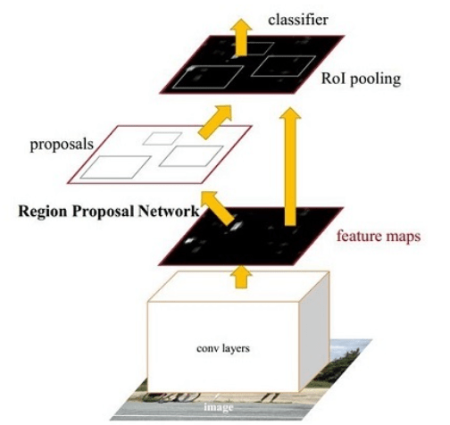
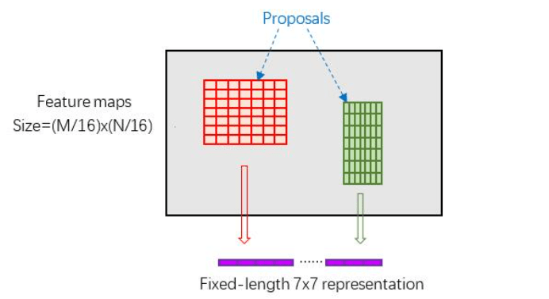

# Faster RCNN note

本文总结自知乎链接https://zhuanlan.zhihu.com/p/31426458

## 整体思路

Faster RCNN其实可以分为4个主要内容：

1. Conv layers 

   Faster RCNN首先使用一组基础的conv+relu+pooling层提取image的feature maps。该feature maps被共享用于后续RPN层和全连接层。

2. Region Proposal Networks

   该层通过softmax判断anchors属于positive或者negative，再利用bounding box regression修正anchors获得精确的proposals。

3. Roi Pooling

   该层收集输入的feature maps和proposals，综合这些信息后提取proposal feature maps，送入后续全连接层判定目标类别。

4. Classification

   利用proposal feature maps计算proposal的类别，同时再次bounding box regression获得检测框最终的精确位置。



## Conv Layers

Conv layers部分共有13个conv层，13个relu层，4个pooling层 

1. 所有的conv层都是：kernel_size=3，pad=1，stride=1
2. 所有的pooling层都是：kernel_size=2，pad=0，stride=2

那么，一个MxN大小的矩阵经过Conv layers固定变为(M/16)x(N/16)

## Region Proposal Networks

### Anchors

提到RPN网络，就不能不说anchors。所谓anchors，实际上就是一组由程序生成的矩形。直接运行作者demo中的generate_anchors.py可以得到以下输出 (不要被这些数字吓到了，没有具体意义)

```python
[[ -84.  -40.   99.   55.]
 [-176.  -88.  191.  103.]
 [-360. -184.  375.  199.]
 [ -56.  -56.   71.   71.]
 [-120. -120.  135.  135.]
 [-248. -248.  263.  263.]
 [ -36.  -80.   51.   95.]
 [ -80. -168.   95.  183.]
 [-168. -344.  183.  359.]]
```

每行有4个值，代表了矩形左上角和右下角两个点$(x_1, y_1, x_2, y_2)$ 

一共9个矩形，来组于不同长宽比和不同大小的组合：长宽比有3种，1:1, 1:2, 2:1


那么这9个anchors是做什么的呢？借用Faster RCNN论文中的原图，如图7，遍历Conv layers计算获得的feature maps，为每一个点都配备这9种anchors作为初始的检测框


简单解释一下上图：

1. conv feature map中，每一个点都是256-dimensions

2. intermidiate layer为 3x3 卷积，out put dimension为256，得到新的conv feature map

3. 在新的conv feature map上，我们对每一个点预先设定的k个anchor做bounding box regression和softmax分类(positive, nagetive两类)，分别对应4k coordinates，2k scores

   换句话说，就是把某一anchor区域中的特征向量拿去做prediction，预测内容为该点的分类和该点/anchor对应的bounding box参数

4. 由于anchor数量是巨大的，训练程序会在合适的anchors中**随机**选取128个postive anchors+128个negative anchors进行训练

### Bounding box regression原理

怎样在anchor的基础上回归得到ground truth标签呢？

给定anchor $(A_x, A_y, A_w, A_h)$ ，给定ground truth $(G_x, G_y, G_w, G_h)$

我们只要去预测中心点的位置偏移，以及矩形长宽的缩放即可

个人觉得这样的回归方法有点麻烦，这样来看CenterNet中的bounding box回归是相当直接的

### Proposal 

1. 生成anchors，得到对应的confidence score & bounding box regression，形成最初的proposal
2. 对所有anchors，根据positive score进行排序，取前6000个anchor proposals
3. 去除较小和超出边界的proposal
4. NMS

## ROI Pooling

Rol pooling层有2个输入：

1. 原始feature maps
2. RPN输出的proposals

这一个Pooling操作还要有一个功能，就是需要处理不同大小的proposal (kernel)。经典的pooing操作是使用相同大小的kernel，这里我们要预先对 proposal (region of interest) 进行统一的分割，使得pooling结果是相同的表示(如下图)



## Classification

Classification部分利用已经获得的proposal feature maps，通过full connect层与softmax计算每个proposal具体属于那个类别（如人，车，电视等），输出cls_prob概率向量；同时再次利用bounding box regression获得每个proposal的位置偏移量bbox_pred，用于回归更加精确的目标检测框


## Training

Faster R-CNN的训练，是在已经训练好的model（如VGG，ZF）的基础上继续进行训练，实际训练过程为以下：

1. 在已经训练好的model(e.g. VGG)，训练RPN
2. 用步骤1中得到的RPN提出proposal
3. 用提出的Proposal训练Fast RCNN
4. 用步骤4中训练好的Fast RCNN继续训练RPN
5. 重复2
6. 重复3

可以看出这是一种类似迭代的过程，但只循环了2次，文章提出更多的循环并不会带来相应的提升
