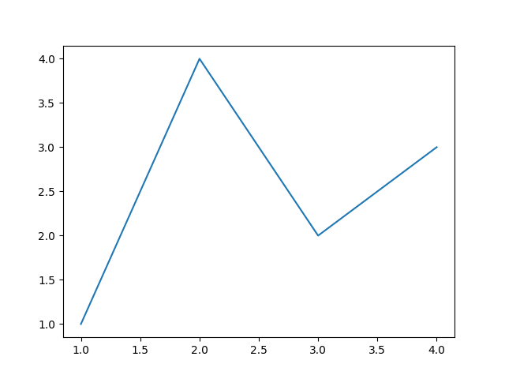
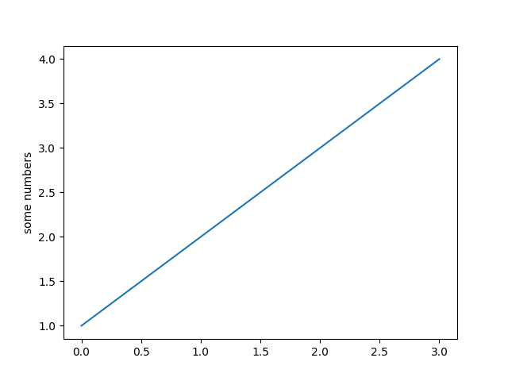
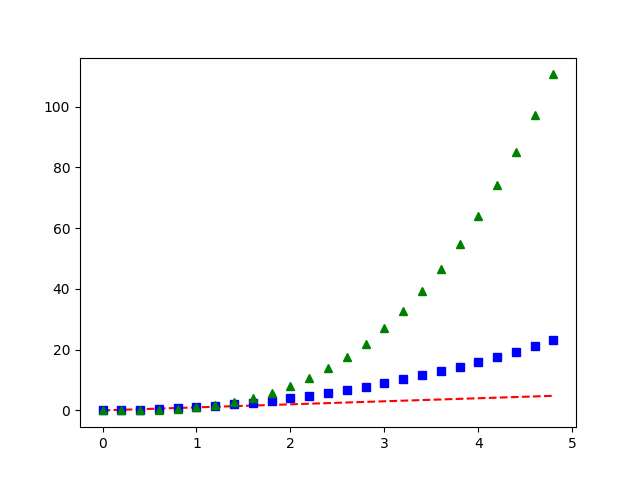
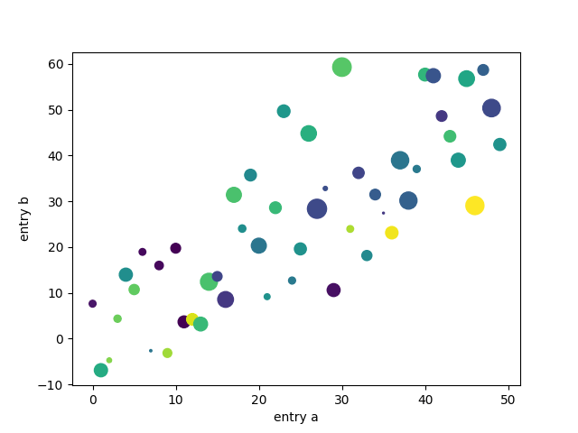
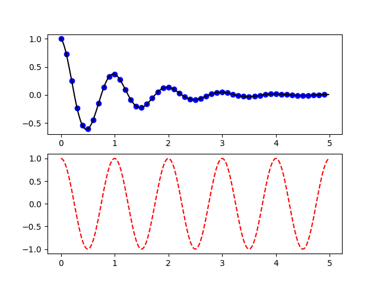
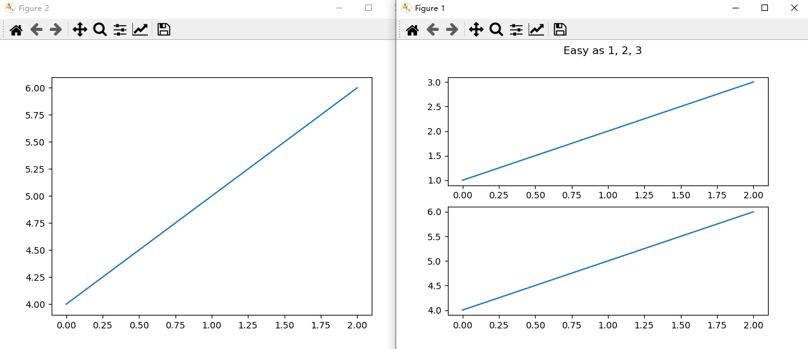
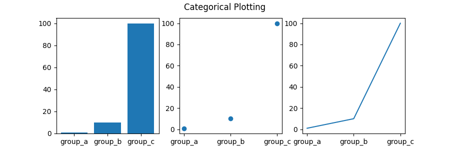
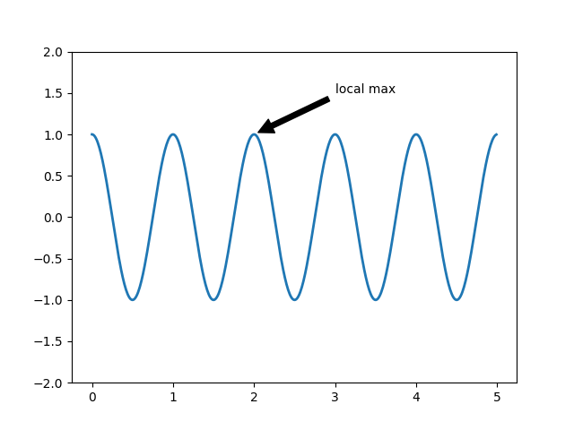

# Matplotlib

不多解释，python 超强的可视化工具，学就完事儿了，参考 [official tutorial](https://matplotlib.org/stable/tutorials/index.html)

## Usage Guide

### A simple example

Matplotlib 的图都是在 [`Figure`](https://matplotlib.org/stable/api/figure_api.html##matplotlib.figure.Figure)s 上绘制的，每个 Figure 都可以包含一个或多个 [`Axes`](https://matplotlib.org/stable/api/axes_api.html##matplotlib.axes.Axes)。然后我们可以使用 [`Axes.plot`](https://matplotlib.org/stable/api/_as_gen/matplotlib.axes.Axes.plot.html##matplotlib.axes.Axes.plot) 在轴上绘制一些数据，使用 axes 创建图形的最简单方法是使用[`pyplot.subplots`](https://matplotlib.org/stable/api/_as_gen/matplotlib.pyplot.subplots.html##matplotlib.pyplot.subplots) （Axes 概念比较抽象，这里就把它们当作一个个的子图好了，subfigure）

```python
import matplotlib.pyplot as plt
import numpy as np

fig, ax = plt.subplots()  ## Create a figure containing a single axes.
ax.plot([1, 2, 3, 4], [1, 4, 2, 3])  ## Plot some data on the axes.

# plt.show()
```

这种方式取名叫 `object-oriented style or OO-style`



除了使用 Axes 绘图以外，matplotlib 还可以使用 `plt.plot()` 进行绘图，它会在“当前” Axes 上执行该绘图，如果它们不存在则创建该 Axes，所以上面的图像可以用下面的代码

```python
plt.plot([1, 2, 3, 4], [1, 4, 2, 3])  ## Matplotlib plot.
```

为这种方式取名叫 `pyplot-style` 目前比较流行这种方式，同时现在也不推荐使用 `pylab` 进行绘图

### Matplotlib basic concept

1. Figure

   可以把 figure 当成一个画布，这个画布可以画任意数量的 Axes

2. Axes

   把 Axes 当成一个小画布

3. Axis

   可以理解为图像里的坐标轴，确定函数取值范围

4. Artist

   基本上任何你看到的东西都是 artist 类，包括 Text objects, Axes, Line2D objects...所有的 artist 都会被画到画布中

最好使用 numpy.array 作为函数的输入，其他类型的变量可能不能很好地处理

### Interactive mode

可以使用交互模式，看到每一个画图的效果，可以使用 ipython 进行交互

```python
import matplotlib.pyplot as plt
plt.ion()
plt.plot([1.6, 2.7])
## a window should show

plt.title("interactive test")
plt.xlabel("index")
```

如果是没有指明交互模式，则需要使用 `plt.show()` 让绘制的图像显示

### Performance

如果感觉渲染得很慢的话，可以是使用 fast style

```python
import matplotlib.style as mplstyle
mplstyle.use('fast')
```

如果有多个 style 的话，确保 fast style 在最后，以保证不被其他 style 修改

## Pyplot tutorial

`matplotlib.pyplot` 包含了各种各样的接口，能够让用户轻松地绘图，下面引用一下官方文档

> Each `pyplot` function makes some change to a figure: e.g., creates a figure, creates a plotting area in a figure, plots some lines in a plotting area, decorates the plot with labels, etc.
>
>  It keeps track of things like the current figure and plotting area, and the plotting functions are directed to the current axes.

### Intro to pyplot

绘制简单映射函数 $y = f(x)$ 图像可以使用 `plt.plot`，详细内容推荐 [plot doc](https://matplotlib.org/stable/api/_as_gen/matplotlib.pyplot.plot.html#matplotlib.pyplot.plot) 

```python
import matplotlib.pyplot as plt
plt.plot([1, 2, 3, 4])
plt.ylabel('some numbers')
plt.show()
```



只传入一个参数，自动使用其 index 作为 x 轴，常用公式为如下

```python
plt.plot(x=, y=, fmt='b-')
# fmt 代表 format 'b-' 代表蓝色直线，为默认值，其它 format 如 'ro' 代表红色圆点
# x, y 可以是二维的，这样将绘画多个函数图像
```

#### Formatting the style of your plot

实际上 `plt.plot` 可以接受任意多的参数，以绘画任意多个函数图像

```python
import numpy as np

# evenly sampled time at 200ms intervals
t = np.arange(0., 5., 0.2)

# red dashes, blue squares and green triangles
plt.plot(t, t, 'r--', t, t**2, 'bs', t, t**3, 'g^')
plt.show()
```



### Plotting with keyword strings

如果有 `data_dict` 存放着数据，则可以直接通过 `data_dict` 和其中的关键字绘图，下面使用了 `plt.scatter` 来绘制一个散点图，[scatter doc](https://matplotlib.org/stable/api/_as_gen/matplotlib.pyplot.scatter.html?highlight=scatter#matplotlib.pyplot.scatter)

```python
data = {'a': np.arange(50),
        'c': np.random.randint(0, 50, 50),
        'd': np.random.randn(50)}
data['b'] = data['a'] + 10 * np.random.randn(50)
data['d'] = np.abs(data['d']) * 100

plt.scatter('a', 'b', c='c', s='d', data=data)
# [c]olor, [s]ize
plt.xlabel('entry a')
plt.ylabel('entry b')
plt.show()
```

图像如下，可以看到散点的颜色和大小也是由 `data` 字典中的 `c & d` 决定的



### Working with multiple figures and axes

`pyplot` 有一个 current figure/axes 概念，也就是当前在哪个画布上绘制哪个图像，下面就展示如何绘制两个子图

```python
def f(t):
    return np.exp(-t) * np.cos(2*np.pi*t)

t1 = np.arange(0.0, 5.0, 0.1)
t2 = np.arange(0.0, 5.0, 0.02)

plt.figure()		# 创建 figure，optional，创建子图的时候也会自动创建
plt.subplot(211)	# 指向子图 (2, 1, 1)
plt.plot(t1, f(t1), 'bo', t2, f(t2), 'k')

plt.subplot(212)	# 创建子图 (2, 1, 2)
plt.plot(t2, np.cos(2*np.pi*t2), 'r--')
plt.show()
```

我们可以把 `plt` 看作一个指针或者画笔，它将指向你将绘图的地方



其中的 `211 & 212` 代表什么呢？这其实是 (2, 1, 1) 的简写，`subplot(2, 1, 1)` 也是一样的效果，三个数字分别表示：num_rows, num_cols, plot_number，其中 plot_number 是一个范围为 1~num_rows * num cols 的数字，能够定位在哪个子图上绘画

下面的代码展示了绘画多个 figure & subplot

```python
import matplotlib.pyplot as plt
plt.figure(1)                # the first figure
plt.subplot(211)             # the first subplot in the first figure
plt.plot([1, 2, 3])
plt.subplot(212)             # the second subplot in the first figure
plt.plot([4, 5, 6])


plt.figure(2)                # a second figure
plt.plot([4, 5, 6])          # creates a subplot() by default

plt.figure(1)                # figure 1 current; subplot(212) still current
plt.subplot(211)             # make subplot(211) in figure1 current
plt.title('Easy as 1, 2, 3') # subplot 211 title
```



还有一个常用的操作 `plt.gca()` 代表获得当前 axes (get current axes)

### Plotting with categorical variables

x 轴不仅可以是 number 还可以是字符串序列 names

```python
names = ['group_a', 'group_b', 'group_c']
values = [1, 10, 100]

plt.figure(figsize=(9, 3))				# 画布大小

plt.subplot(131)
plt.bar(names, values)
plt.subplot(132)
plt.scatter(names, values)
plt.subplot(133)
plt.plot(names, values)
plt.suptitle('Categorical Plotting')	# 给 Figure 添加标题
plt.show()
```



### Controlling line properties

可以对 plot 出来的线条的属性进行设置，例如通过 `plt.setp()` 方法。实际上 `plt.plot()` 返回的是一个 `Line2D` 对象组成的列表，本质上是对 `Line2D` 对象的属性进行更改 [Line2D doc](https://matplotlib.org/stable/api/_as_gen/matplotlib.lines.Line2D.html#matplotlib.lines.Line2D)

```python
# 直接在 plot 方法中进行修改
plt.plot(x, y, linewidth=2.0)

# 使用 plt.step()
line_1, line_2 = plt.plot(x1, y1, x2, y2)
# use keyword args
plt.setp(lines, color='r', linewidth=2.0)
# or MATLAB style string value pairs
plt.setp(line_1, 'color', 'r', 'linewidth', 2.0)
```

### Working with text

通过 `text` 方法可以为 figure 添加文字，通过 `xlabel, ylable, title` 等方法可以给 figure 添加坐标轴标签以及标题，[text doc](https://matplotlib.org/stable/api/_as_gen/matplotlib.pyplot.text.html#matplotlib.pyplot.text) [xlabel doc](https://matplotlib.org/stable/api/_as_gen/matplotlib.pyplot.xlabel.html#matplotlib.pyplot.xlabel), [ylabel doc](https://matplotlib.org/stable/api/_as_gen/matplotlib.pyplot.ylabel.html#matplotlib.pyplot.ylabel) and [title doc](https://matplotlib.org/stable/api/_as_gen/matplotlib.pyplot.title.html#matplotlib.pyplot.title)

```python
mu, sigma = 100, 15
x = mu + sigma * np.random.randn(10000)

# the histogram of the data
n, bins, patches = plt.hist(x, 50, density=1, facecolor='g', alpha=0.75)


plt.xlabel('Smarts')
plt.ylabel('Probability')
# 给 Axes 设置标题，区别于 plt.title()
plt.title('Histogram of IQ')
plt.text(60, .025, r'$\mu=100,\ \sigma=15$')
plt.axis([40, 160, 0, 0.03])	# 对轴进行设置
plt.grid(True)					# 格点设置
plt.show()
```


1. 所有的文字对象都可以像 `Line2D` 一样进行属性设置

   ```python
   t = plt.xlabel('my data', fontsize=14, color='red')
   ```

2. 可以使用 Latex 语法进行数学公式的书写

   ```python
   plt.title(r'$\sigma_i=15$')
   ```

#### Annotating text

通过 `plt.annotate` 对图像中的某个点进行标记

```python
ax = plt.subplot()

t = np.arange(0.0, 5.0, 0.01)
s = np.cos(2*np.pi*t)
line, = plt.plot(t, s, lw=2)

plt.annotate('local max', xy=(2, 1), xytext=(3, 1.5),
             arrowprops=dict(facecolor='black', shrink=0.05),
             )

plt.ylim(-2, 2)
plt.show()
```



### Nonlinear axes

可以对坐标轴进行缩放，例如对数缩放 `plt.xscale('log')` 更多就不再叙述了，可以直接参考 [tutorial](https://matplotlib.org/stable/tutorials/introductory/pyplot.html#logarithmic-and-other-nonlinear-axes)

### 保存图片

使用 `plt.savefig('path\name')` 即可

## 总结

以上就是一些 matplotlib.pyplot 中的基础概念，掌握了基本逻辑过后，就可以通过查询文档进行更多的操作了，放两个参考链接

1. [Matplotlib Cheat Sheet](https://github.com/matplotlib/cheatsheets/)，查看一些代号很方便

2. [Example Gallery](https://matplotlib.org/stable/tutorials/introductory/sample_plots.html#sphx-glr-tutorials-introductory-sample-plots-py)

## TODO

整理一些常用的 api 操作
