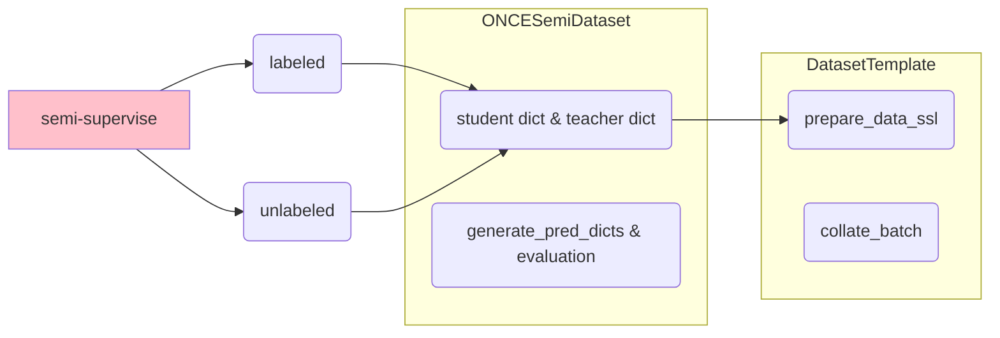

# ONCE Semi-Supervised Training

学习规划：

1. **dataset 结构整理**
2. detector 结构整理（almost done），模型反而是最好理解的部分
3. **semi-supervised 流程整理，SESS + mean teacher**

## Dataset

### build_semi_dataset

通过数据集配置建造 datasets, dataloaders, samplers

1. input params

   ```python
   def build_semi_dataloader(dataset_cfg, 
                             class_names,
                             batch_size,
                             dist, 
                             root_path,
                             workers,
                             logger):
   ```

2. output

   ```python
       return datasets, dataloaders, samplers
   ```

   这三个返回的都是字典，存储四种类型的数据集 `pretrain, labeled, unlabeled, test`

   ```python
       datasets = {
           'pretrain': pretrain_dataset,
           'labeled': labeled_dataset,
           'unlabeled': unlabeled_dataset,
           'test': test_dataset
       }
       dataloaders = {
           'pretrain': pretrain_dataloader,
           'labeled': labeled_dataloader,
           'unlabeled': unlabeled_dataloader,
           'test': test_dataloader
       }
       samplers = {
           'pretrain': pretrain_sampler,
           'labeled': labeled_sampler,
           'unlabeled': unlabeled_sampler,
           'test': test_sampler
       }
   ```

3. used functions

   1. `split_once_semi_data`，就是载入 `once_infos_***.pkl` 文件，里面存储了一些基本信息，比如 frame_id, meta_info, lidar, pose, calib...

      ```python
      def split_once_semi_data(info_paths, data_splits, root_path, logger):
          return once_pretrain_infos, once_test_infos, once_labeled_infos, once_unlabeled_infos
      # pretrain & labeled are the same
      ```

### SemiDatasetTemplate

这个类是所有 semi-dataset 的祖先，该类要处理监督情况下的数据集，也要处理半监督情况下的数据集。同时半监督情况下也分为 teacher & student 两个类型。而这些代码似乎都是用 numpy 在 cpu 上运行，可能 numpy 在 cpu 上更快跟轻量

#### init

1. input params

   ```python
   class SemiDatasetTemplate(torch_data.Dataset):
       def __init__(self, dataset_cfg=None, class_names=None, training=True, root_path=None, logger=None):
   ```

2. attributes

   一些基础的属性

   ```python
           self.dataset_cfg
           self.training
           self.class_names
           self.logger
           self.point_cloud_range
           self.grid_size = self.data_processor.grid_size
           self.voxel_size = self.data_processor.voxel_size
   ```

   由类组成的属性

   ```python
   self.point_feature_encoder	# PointFeatureEncoder
   self.data_augmentor			# DataAugmentor
   self.data_processor			# DataProcessor
   
   self.teacher_augmentor		# Different augmentation for teacher & student
   self.student_augmentor
   ```

   有必要介绍一下三个类的功能

   1. `PointFeatureEncoder` 基本上不做什么事情，看一看 `used_feature_list` 就好

   2. `DataAugmentor` 把需要的 augmentation 放到 `self. data_augmentor_queue` 之后调用，通常有三个操作

      1. random_world_flip，ALONG_AXIS_LIST: ['x', 'y']
      2. random_world_rotation，WORLD_ROT_ANGLE: [-0.78539816, 0.78539816]
      3. random_world_scaling，WORLD_SCALE_RANGE: [0.95, 1.05]

   3. `DataProcessor` 处理点云，一般有三步

      1. mask_points_and_boxes_outside_range

      2. shuffile_points

      3. transform_points_to_voxels，这一步由 spconv 的 `VoxelGenerator` 完成

         ```python
                 points = data_dict['points']
                 voxel_output = self.voxel_generator.generate(points)
                 voxels, coordinates, num_points = voxel_output
         ```

#### prepare_data

给监督学习准备数据（数据增强，体素化等）

1. input params & output

   ```python
       def prepare_data(self, data_dict):
           """
           Args:
               data_dict:
                   points: (N, 3 + C_in)
                   gt_boxes: optional, (N, 7 + C) [x, y, z, dx, dy, dz, heading, ...]
                   gt_names: optional, (N), string
                   ...
           Returns:
               data_dict:
                   points: (N, 3 + C_in)
                   gt_boxes: optional, (N, 7 + C + 1) [x, y, z, dx, dy, dz, heading, ..., class]
                   gt_names: optional, (N), string
                   voxels: optional (num_voxels, max_points_per_voxel, 3 + C)
                   voxel_coords: optional (num_voxels, 3)
                   voxel_num_points: optional (num_voxels)
                   ...
           """
   ```

2. used functions

   1. `self.data_augmentor`，数据增强
   2. 过滤掉不关注的 gt 类别，并且将关注类别转换为 digit。虽然这不是 functions，但我也整理在此
   3. `self.point_feature_encoder & self.data_processor`，体素化

#### prepare_datset_ssl

与常规 prepare_dataset 相比，ssl 要输出两个 data_dict，一个给 teacher，一个给 student，并且要对有无 `gt_boxes` 标签进行分别处理

1. input params

   ```python
       def prepare_data_ssl(self, data_dict, output_dicts):
           # output_dicts is a list: ['teacher', 'student']
   ```

2. output

   ```python
   return teacher_data_dict, student_data_dict
   ```

3. used functions

   1. `self.teacher_augmentor & self.student_augmentor`，与常规 augmentor 不同的是：

      1. 事先将 data_dict 进行了 deepcopy，分别送入二者的 augmentor 中

      2. augmentor 记录了 augmentation 的参数，在之后会 inverse augmentation

         ```python
                 data_dict['augmentation_list'] = copy.deepcopy(self.aug_list)
                 data_dict['augmentation_params'] = {}
         ```

   2. （如果有 gt）过滤掉不关注的 gt 类别

   3. `self.point_feature_encoder & self.data_processor`，体素化

#### collate_batch

pytorch `Dataset` 通过 `collat_fn` 将多个 sample 组合到一个 batch 当中，OpencPCDet 将多个数据字典，打包为一个数据字典。这里需要额外处理 student & teacher 两个 data_dict 的情况

1. input params: batch_list

2. output: 

   1. return teacher_batch, student_batch，如果是 `prepare_dataset_ssl`
   2. return single_batch，如果是 `prepare_dataset`

   每一个 batch 还做了一些形状上的处理：

   1. 对于 `voxels, voxel_num_points` 直接 concat，(N1+N2+..., max_points_per_voxel, 3+C)
   2. 对于 `points, voxel_coords` 加入了 batch 序号，然后再 concat，(N1+N2+..., 1+3+C)
   3. 对于 `gt_boxes` 则要兼顾每个 sample gt 数量不同的情况，用 (batch_size, max_gt, 7+C+1) 形状的 array 存储起来。空 gt 用 0 填补
   4. 其他的直接 stack，或者不变

学习点：

1. `np.pad(array, ...)` 对数据进行 padding。类似的效果也可以先创建 zero matrix，然后再赋值

### ONCESemiDataset

该类继承了 `SemiDatasetTemplate`，并实现三个基本功能

1. **原始数据的获取**
2. **封装预测得到的 pred_dicts**
3. **evaluation code**

一般对于监督学习的 Dataset，还需要实现 `__getitem__`  获得数据，而这里为了兼顾半监督学习，把这两个方法下放到子类去实现了

#### init

1. input params

   ```python
   class ONCESemiDataset(SemiDatasetTemplate):
       def __init__(self, dataset_cfg, class_names, infos=None, training=True, root_path=None, logger=None):
   ```

#### methods

1. `get_lidar` & `get_image` & `project_lidar_to_image`
2. `generate_prediction_dicts` 返回一个 once-style annos list，
3. `evaluation`，根据 det_annos & class_names 生成结果

### ONCEPretrainDataset & ONCELabeledDataset & ONCEUnlabeledDataset & ONCETestDataset

这四个类都继承了 `ONCESemiDataset`，并各自实现 `__getitem__`，构成 input_dict，然后输入 `prepare_data or prepare_data_ssl`，最后返回最终的 data_dict

其中 Pretrain 和 Test 两个 Dataset 是一模一样的，返回常规的 data_dict

Labeled 和 Unlabeled 两个 Dataset 返回 (teacher_dict, student_dict)

## ONCEDataset Infos & Database Processing

为了加速训练过程，我需要加入自己关注的 database 信息，所以必须要学习如何构建自己的 database info

之前在看 `ONCEDataset` 的时候就看到 `__getitem` 就停止了，对于 `get_infos & create_ground_truth_database` 这两个方法并没有仔细看了，现在是必须要上了，在然后就是 `DatabaseSampler` 的功能整理一下，就基本打通了数据集的处理流程，然后就可以加入自己想要的特征了

### get_infos

生成各个 split 生成 info 信息，在之后将这些 info 存储为 `once_infos_***.pkl` 文件

1. input params，基本不需要

2. output，一个列表 `all_infos`，存储了所有 frames 的信息

3. used functions

   1. `process_single_sequence`，返回一个 list of dict，每一个 dict 代表一个 frame，里面字典包括很多信息

      ```python
                      frame_dict = {
                          'sequence_id': seq_idx,
                          'frame_id': frame_id,
                          'timestamp': int(frame_id),
                          'prev_id': prev_id,
                          'next_id': next_id,
                          'meta_info': meta_info,
                          'lidar': pc_path,
                          'pose': pose,
                          'annos':
                          	{
                                  'name':
                                  'boxes_3d':
                                  'boxes_2d':
                                  'num_points_in_gt':
                              }
                      }
      ```

      最终的 `all_infos` 就是多个 `process_single_sequence` 的结果合在一起，形成一个大的 list of dict

### create_groundtruth_database

这一步是为 data augmentation 准备的，只针对训练集生成 database。把每个类别的物体都放在了一起，在之后好针对类别进行采样

1. input params，主要有两个：`info_path & split`，具体一点来说就是 `once_infos_train.pkl & train`。

2. output 可以认为有两个：

   1. `once_dbinfos_train.pkl` 是一个 dict of list of dict，存储所有类别的信息

      ```python
                      db_info = {'name': names[i], 'path': db_path, 'gt_idx': i,
                                  'box3d_lidar': gt_boxes[i], 'num_points_in_gt': gt_points.shape[0]}
      ```

   2. `'%s_%s_%d.bin' % (frame_id, names[i], i)`，直接存储每个场景的每个物体，通过上面的 `db_path` 就可以找到对应的物体

### 如何构建复杂项目？

整理完了代码，虽然知道每一个模块的功能，但是还是稍微有点混乱的感觉。这种感觉来自于一个问题：如果让我自己来设计流程应该怎么去构建代码的结构？现在我只能有一个简单的想法：

1. 清晰地构建我们需要完成的所有流程线
2. 构建每一条流程线需要的代码
3. 对于平行度/相似度高的流程线，比较一下有无共同点，将共同点用一个（基）类实现。高度的模块化能在之后展现更好的灵活性和规范性
4. 实现各个差异化子类

如果把这个 semi-supervised dataset 画一个流程图的画，我会用下图表示



OpenPCDet 的一个优势就在于将 `prepare_dataset` 这一部分使用一个 DatasetTemplate 实现，与具体数据集分离，各个数据集所输入的 data_dict 形式上是统一的，有很好的规范作用，同时也增加了灵活性

## SemiSECOND & AnchorHeadSemi

和原始 SECOND 比较，SemiSECOND 将模型分为三种类型：origin, student, teacher。根据不同的类型，前向方程 `forward` 将稍有差别。Detector 在逻辑上分为上面三类，实际执行模块是落实到 dense head 上，即 `AnchorHeadSemi`

```python
    def set_model_type(self, model_type):
        assert model_type in ['origin', 'teacher', 'student']
        self.model_type = model_type
        self.dense_head.model_type = model_type
```

另一个点：consistency loss 是在模型之外计算的，training loss 是在模型内计算的

### Origin

不做过多介绍，就是原汁原味的 SECOND。training 和 testing 的表现都不改变

### Student

其实 student 模型和 origin 是比较很相似的，只是为了兼容处理 unlabeled data，多了一个判断

- training, return (loss & pred_boxes) or just pred_boxes 
- testing, return pred_boxes with post processing

```python
        elif self.model_type == 'student':
            for cur_module in self.module_list:
                batch_dict = cur_module(batch_dict)
            if self.training:
                if 'gt_boxes' in batch_dict: # for (pseudo-)labeled data, this is the only difference between origin mode
                    loss, tb_dict, disp_dict = self.get_training_loss()
                    ret_dict = {
                        'loss': loss
                    }
                    return batch_dict, ret_dict, tb_dict, disp_dict
                else:
                    return batch_dict
            else:
                pred_dicts, recall_dicts = self.post_processing(batch_dict)
                return pred_dicts, recall_dicts
```

### Teacher

把所有输入都作为 unlabeld，直接 return pred_boxes

```python
        elif self.model_type == 'teacher':
            # assert not self.training
            for cur_module in self.module_list: # MIGHT CONSIDERING GET SOME LOSS
                batch_dict = cur_module(batch_dict)
            return batch_dict
```

### Model Wrapper

半监督学习既有 labeled 数据，又有 unlabeled 数据，所以使用一个 Wrapper 来同时处理两种数据

```python
class DistStudent(nn.Module):
    def __init__(self, student):
        super().__init__()
        self.onepass = student

    def forward(self, ld_batch, ud_batch):
        return self.onepass(ld_batch), self.onepass(ud_batch)
```

## SE-SSD & Mean-Teacher

### sess / se_ssd

sess 和 se_ssd 是非常近似的两个函数。也是半监督学习的核心代码：输入 student & teacher 模型，输入 labeled_data & unlabeled_data，通过前向方程得到预测结果，最后计算监督学习的 loss & 半监督的 consistency loss 

1. input params

   ```python
   def se_ssd(teacher_model, student_model,
            ld_teacher_batch_dict, ld_student_batch_dict,
            ud_teacher_batch_dict, ud_student_batch_dict,
            cfgs, epoch_id, dist):
   ```

2. output: return loss, tb_dict, disp_dict，其中 loss 由2个部分组成

   ```python
       loss = sup_loss + consistency_weight * consistency_loss
   ```

3. used functions 

   1. `load_data_to_gpu(data_dict)` 名字就是功能。提一句：这个函数在监督学习里是被包进了 `model_fn_decorator`

   2. `filter_boxes(data_dict, cfg)` 这一步其实做的是 post_processing 的工作，仅有一个区别：`pred_cls` 没有取最大值，所有 class 的得分都保留了。最终返回 list of dict

      ```python
              record_dict = [{
                  'pred_boxes': final_boxes,
                  'pred_cls_preds': final_cls_preds,
                  'pred_labels': final_labels
              } for _ in batch_size]
      ```

   3. `reverse_transform` 将 teacher 的 augmentation 逆转，并实施 student_augmentation

      ```python
      @torch.no_grad()
      def reverse_transform(teacher_boxes, teacher_dict, student_dict):
          return teacher_boxes	# dict like output of filter_boxes
      ```

   4. **`get_iou_consistency_loss`** 就是计算一致损失的核心

      1. input params: teacher_boxes, student_boxes，经过了 filter & transform

      2. output: box_loss, cls_loss

      3. **计算过程如下**：

         1. 计算 teacher_class & student_class 的匹配矩阵 (Nt, Ns)，类别相同为1，不同为0
         2. 计算 teacher_boxes & student_boxes 的 IoU 矩阵 (Nt, Ns)，并且减去匹配矩阵，这样就能过滤类别不同的 boxes
         3. 计算 student_boxes 匹配的 matched_teacher_boxes (Ns,)。并计算一个 mask：IoU >= thresh = 0.7，在计算 smooth L1 loss 时进行过滤
         4. 计算 smooth L1 loss，并使用 batch_normalizer & num_matched_boxes 进行归一化

         sess 为 `get_consistency_loss`，实现稍有不同，这里不做整理。值得一提的是，ONCE 论文说 box size 相关的一致损失似乎并不重要？

         > SESS [57] performs worse than Mean Teacher with 58.78% mAP, which indicates that size and center consistency may not be useful in driving scenarios.

   5. `sigmoid_rampup` 控制 consistency loss 的权重逐渐增加直到增加到1

### Mean Teacher Update

在每一次 iteration 过后对 teacher model 进行 update。可以大概分为2个阶段：

1. rampup 阶段，使用真实平均值
2. ema 阶段，使用 ema

学习点：

1. 使用 `model.parameters()` 方法完成对所有参数的迭代，并使用 `tensor.data` 对张量值进行修改，`tensor.data` 与原 tensor 共享存储，使用 inplace 操作就可以完成。`tensor.detach()` 也是可以完成类似的功能的

   ```python
   def update_ema_variables_with_fixed_momentum(model, ema_model, alpha):
       for ema_param, param in zip(ema_model.parameters(), model.parameters()):
           # ema_param.data.mul_(alpha).add_(1 - alpha, param.data)
           ema_param.detach().mul_(alpha).add_(1 - alpha, param.data)	
           # if use .data, loss.backward would extremely slow sometimes
   ```

## Mermaid

上面的流程图就是用 mermaid 写的，这里简单总结一下画流程图的语法

1. 使用 `graph` or `flowchart`创建流程图，并初始化其方向 `LR, RL, TB, BT` 从左到右，从上到下都可指定

2. 直接使用变量新建节点，通过一些特殊符指定形状，在字符之内填写文字

   ```mermaid
   flowchart LR
       a("(A node with round edges)") -.->
       b{"{rhombus}"} <-->
       c(("((circle))")) --x
   	d["[square] defualt"]
       style a fill:#ffffd2
       style b fill:#fcbad3
       style c fill:#aa96da
       style d fill:#a8d8ea
   ```

3. 使用箭头 `-->` 连接各个节点，也可在箭头中添加文字 `--text->`。箭头的样式也可以指定：`---, -.-, --x, <-->, ==>`

4. 使用 style 语法更改颜色：`style id fill:#ffffff, stroke: #ffffff, stroke_witdh: 4px`

5. 使用 `subgraph id... end` 语法创建子图

```scripts
flowchart LR
    a("(A node with round edges)") -.->
    b{"{rhombus}"} <-->
    c(("((circle))")) --x
	d["[square] defualt"]
    style a fill:#ffffd2
    style b fill:#fcbad3
    style c fill:#aa96da
    style d fill:#a8d8ea
```

mermaid 还能画很多类型的图表，有需要再去探索吧😎