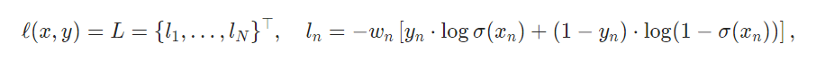
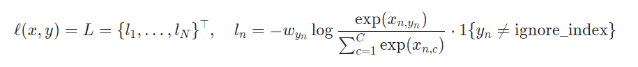

# OpenPCDet loss utils

## SigmoidFocalClassificationLoss

这个类实现了 focal loss，关于 focal loss 可以看这篇 [知乎](https://zhuanlan.zhihu.com/p/80594704)，公式如下：
$$
F L=\left\{\begin{array}{rll}
-\alpha(1-p)^{\gamma} \log (p), & \text { if } & y=1 \\
-(1-\alpha) p^{\gamma} \log (1-p), & \text { if } & y=0
\end{array}\right.
$$
白话来说：focal loss 使用了两个技巧改变 loss function 的分布：

1. alpha 可以调节正负样本 loss 分布 
2. gamma 可以条件难易样本 loss 分布

上面知乎中的有一条评论也解决了我的疑惑，为什么正样本远小于负样本时 alpha 还取得较小：因为 gamma 的效应太大了，反而需要提升一点负样本的比重。总之就是实践出来的！

>重新去查了下focal loss论文，在gamma=0时，alpha=0.75效果更好，但当gamma=2时，alpha=0.25效果更好，个人的解释为负样本(IOU<=0.5)虽然远比正样本(IOU>0.5)要多，但大部分为IOU很小（如<0.1）以至于在gamma作用后某种程度上贡献较大损失的负样本甚至比正样本还要少，所以alpha=0.25要反过来重新平衡负正样本

先来看 forward 函数的输入输出

```python
    def forward(self, input: torch.Tensor, target: torch.Tensor, weights: torch.Tensor):
        """
        Args:
            input: (B, #anchors, #classes) float tensor.
                Predicted logits for each class
            target: (B, #anchors, #classes) float tensor.
                One-hot encoded classification targets
            weights: (B, #anchors) float tensor.
                Anchor-wise weights.

        Returns:
            weighted_loss: (B, #anchors, #classes) float tensor after weighting.
        """ 
```

### 输入输出

输入为：

1. input 是 logits，也就是没有经过 sigmoid 的线性层输出

2. target 是 one-hot 向量

3. weights 是每个 anchor 的权重，通常是一个用于归一化的量，如 1 / num_foreground_anchor

输出为：

1. weighted_loss，经过 focal weights 和输入中 weights 加权过后得到的 binary cross entropy loss

### 关键函数实现

首先需要计算每个 anchor 的每个类别预测的 loss，这是由 `sigmoid_cross_entropy_with_logits` 实现

```python
    def sigmoid_cross_entropy_with_logits(input: torch.Tensor, target: torch.Tensor):
        """ PyTorch Implementation for tf.nn.sigmoid_cross_entropy_with_logits:
            max(x, 0) - x * z + log(1 + exp(-abs(x))) in
            https://www.tensorflow.org/api_docs/python/tf/nn/sigmoid_cross_entropy_with_logits

        Args:
            input: (B, #anchors, #classes) float tensor.
                Predicted logits for each class
            target: (B, #anchors, #classes) float tensor.
                One-hot encoded classification targets

        Returns:
            loss: (B, #anchors, #classes) float tensor.
                Sigmoid cross entropy loss without reduction
        """
        loss = torch.clamp(input, min=0) - input * target + \
               torch.log1p(torch.exp(-torch.abs(input)))
        return loss
```

在 pytorch 中与之功能几乎一样的是 `nn.BCEWithLogitsLoss` 或者 `F.binary_cross_entropy_with_logits`，二者的关系可以用下面的代码表示，[pytorch link](https://pytorch.org/docs/stable/generated/torch.nn.BCEWithLogitsLoss.html#torch.nn.BCEWithLogitsLoss)

```python
sigmoid_cross_entropy_with_logits(input, target)
= F.binary_cross_entropy_with_logits(input, target, reduction='none')
# 如果没有 reduction 则默认为 reduction = 'mean'
```

### 完整实现

```python
class SigmoidFocalClassificationLoss(nn.Module):
    """
    Sigmoid focal cross entropy loss.
    """

    def __init__(self, gamma: float = 2.0, alpha: float = 0.25):
        """
        Args:
            gamma: Weighting parameter to balance loss for hard and easy examples.
            alpha: Weighting parameter to balance loss for positive and negative examples.
        """
        super(SigmoidFocalClassificationLoss, self).__init__()
        self.alpha = alpha
        self.gamma = gamma

    @staticmethod
    def sigmoid_cross_entropy_with_logits(input: torch.Tensor, target: torch.Tensor):
        # 如上一节所示

    def forward(self, input: torch.Tensor, target: torch.Tensor, weights: torch.Tensor):
        """
        Args:
            input: (B, #anchors, #classes) float tensor.
                Predicted logits for each class
            target: (B, #anchors, #classes) float tensor.
                One-hot encoded classification targets
            weights: (B, #anchors) float tensor.
                Anchor-wise weights.

        Returns:
            weighted_loss: (B, #anchors, #classes) float tensor after weighting.
        """ 
        pred_sigmoid = torch.sigmoid(input)
        alpha_weight = target * self.alpha + (1 - target) * (1 - self.alpha)
        pt = target * (1.0 - pred_sigmoid) + (1.0 - target) * pred_sigmoid
        focal_weight = alpha_weight * torch.pow(pt, self.gamma)

        bce_loss = self.sigmoid_cross_entropy_with_logits(input, target)

        loss = focal_weight * bce_loss

        # reshape weights to broadcast
        if weights.shape.__len__() == 2 or \
                (weights.shape.__len__() == 1 and target.shape.__len__() == 2):
            weights = weights.unsqueeze(-1)

        assert weights.shape.__len__() == loss.shape.__len__()

        return loss * weights
```

## WeightedSmoothL1Loss

这里做一下精简的理解，把一些提升灵活性和稳定性的代码去掉，仅看 SmoothL1Loss 的核心就会非常简洁

```python
class WeightedSmoothL1Loss(nn.Module):
    """
    Code-wise Weighted Smooth L1 Loss modified based on fvcore.nn.smooth_l1_loss
    https://github.com/facebookresearch/fvcore/blob/master/fvcore/nn/smooth_l1_loss.py
                  | 0.5 * x ** 2 / beta   if abs(x) < beta
    smoothl1(x) = |
                  | abs(x) - 0.5 * beta   otherwise,
    where x = input - target.
    """
    def __init__(self, beta: float = 1.0 / 9.0):
        super(WeightedSmoothL1Loss, self).__init__()
        self.beta = beta

    @staticmethod
    def smooth_l1_loss(diff, beta):
        if beta < 1e-5:
            # 如果 beta 太小则没有意义，退化为普通 L1 loss
            loss = torch.abs(diff)
        else:
            n = torch.abs(diff)
            loss = torch.where(n < beta, 0.5 * n ** 2 / beta, n - 0.5 * beta)

        return loss

    def forward(self, input: torch.Tensor, target: torch.Tensor, weights: torch.Tensor = None):
        """
        Args:
            input: (B, #anchors, #codes) float tensor.
                Ecoded predicted locations of objects.
            target: (B, #anchors, #codes) float tensor.
                Regression targets.
            weights: (B, #anchors) float tensor if not None.

        Returns:
            loss: (B, #anchors) float tensor.
                Weighted smooth l1 loss without reduction.
        """
        diff = input - target

        loss = self.smooth_l1_loss(diff, self.beta)

        # anchor-wise weighting
        loss = loss * weights.unsqueeze(-1)

        return loss
```

所谓的 weighted 也就是对每个 anchor 取权重，在 SigmoidFocalClassificationLoss 中 weights 一般是一个归一化的常量，这是因为正负样本都需要进行损失计算。WeightedSmoothL1Loss 通常用于计算 bbox regression 的损失，通常仅对正样本计算损失，所以这里的 weights 有一点点的区别：negative anchor 的权重为零，positive anchor 的权重为 1 / nums_positive_anchor

`torch.where(condition, x, y)` 是一个不错的方法，之后可以经常使用：condition 是条件，x 和 y 是同 shape 的矩阵, 针对矩阵中的某个位置的元素, 满足条件就返回 x，不满足就返回 y

留个坑，之后总结一下 torch 的常用操作

## WeightedCrossEntropyLoss

这一函数的实现就更加简单了，核心函数三行解决

```python
    def forward(self, input: torch.Tensor, target: torch.Tensor, weights: torch.Tensor):
        """
        Args:
            input: (B, #anchors, #classes) float tensor.
                Predited logits for each class.
            target: (B, #anchors, #classes) float tensor.
                One-hot classification targets.
            weights: (B, #anchors) float tensor.
                Anchor-wise weights.

        Returns:
            loss: (B, #anchors) float tensor.
                Weighted cross entropy loss without reduction
        """
        input = input.permute(0, 2, 1)
        target = target.argmax(dim=-1)
        loss = F.cross_entropy(input, target, reduction='none') * weights
        return loss
```

## CrossEntropyLoss & BCEWithLogitsLoss

关于 pytorch 实现的 CrossEntropyLoss: [pytorch link](https://pytorch.org/docs/stable/generated/torch.nn.CrossEntropyLoss.html#torch.nn.CrossEntropyLoss)。这里不禁让我思考这与 BCEWithLogitsLoss 的区别：

1. 二者都是使用 logits 作为输入以维护数值稳定性

2. 二者的 target 形状有区别，CE 通常要少一个维度，因为 CE 使用 target 的 index 作为标签。而 BCE 中 targe 和 input 形状是保持一致的，相当于是一个 point wise 交叉熵计算

3. CrossEntropyLoss 使用的是 softmax 计算每个类别的概率得分，**是归一化的**，该归一化操作将在 softmax 分母体现，能够获得全局的信息。而 BCEWithLogitsLoss 使用的是 sigmoid 计算得分，并不是归一化的

4. 当 BCE 拓展到多个类别过后，其损失不仅包括**是**该类别的损失，也包括**不是**该类别的损失。而 Cross Entropy 就仅仅计算**是**该类的损失（实际上通过归一化，也能有其他负面反馈的信息）

   下面是 BCE 的损失函数（可以暂时忽略 $w_n$ 以便理解），$x, y$ 为形状相同的向量，可以暂时假设为 N x C，N 代表样本数量

   

   这是 CE 的损失函数（可以暂时忽略 $w_n$ 以便理解），$x, y$ 形状不同，可以先暂时假设 `x.shape = (N, C) & y.shape = (N,)`
   
   

 

