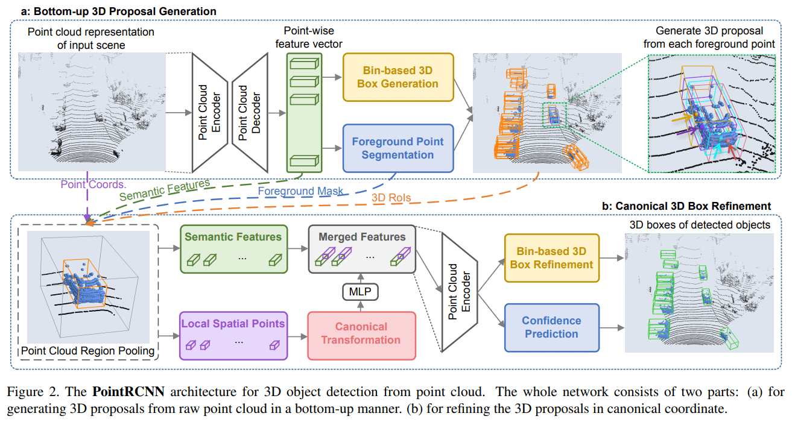
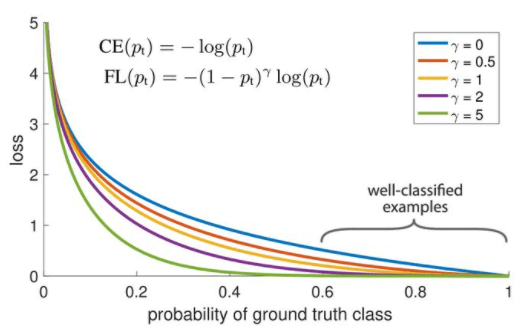
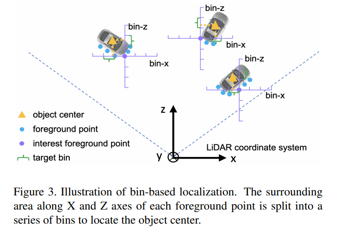
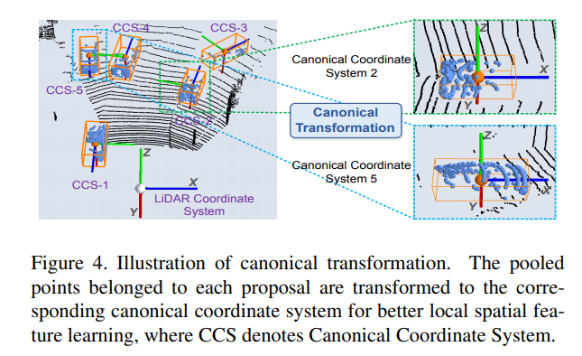
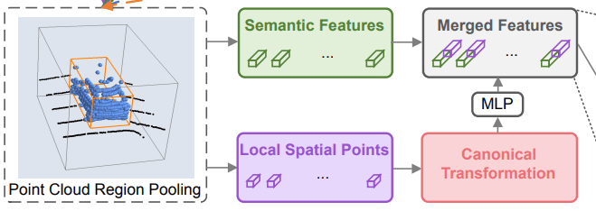
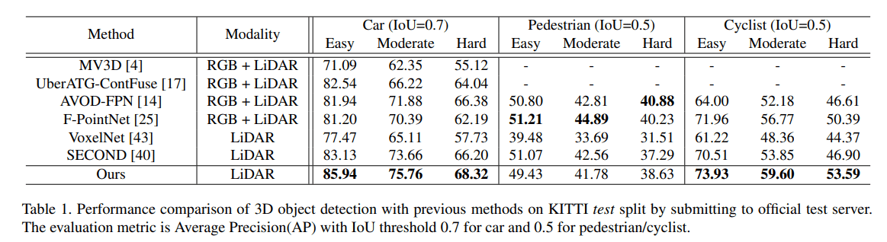
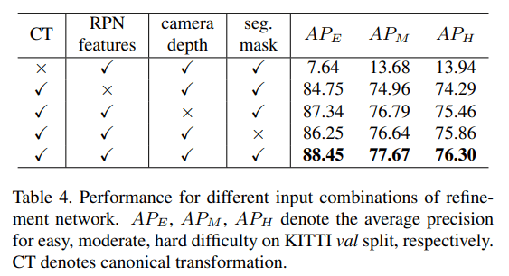
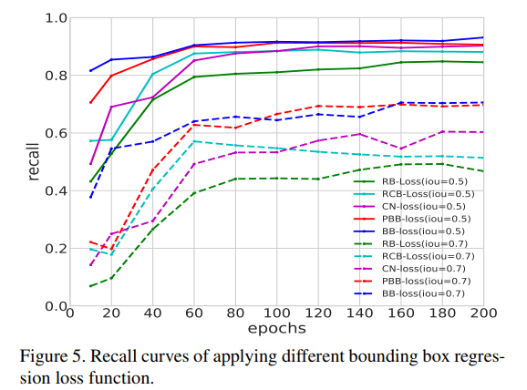

# PointRCNN

---

Shi, Shaoshuai, Xiaogang Wang, and Hongsheng Li. “PointRCNN: 3D Object Proposal Generation and Detection from Point Cloud.” *ArXiv:1812.04244 [Cs]*, May 16, 2019. http://arxiv.org/abs/1812.04244.

Comment: Accepted by CVPR 2019

---

今后的论文整理应该遵循一个统一的框架：

1. 前言：主要为了提出问题，引入背景，引出论文。描述一下文章解决了什么问题，以及其重要亮点 Remark
2. 结构：描述论文中的网络结构，及其核心思想
3. 实验：论文的结果好坏
4. 总结：写一些自己的想法，提出可能的方向

## Introduction

PointRCNN 的一大特点是，该方法**基于原始的点云数据直接进行特征提取和 RPN 操作**。随着 PointNet 系列论文的出现，可以直接基于点云原始数据进行特征提取，而不需要进行体素化 (VoxelNet，SECOND) 或者对点云进行投影 (PointPillar) 再使用二维的一些方法。直接使用点云数据，最明显的好处就是减少了信息丢失 information loss

但在其他的文章当中，可以看到使用二维的处理方法并不是完全被排斥的 (CenterPoint)。因为 3D 选框有7维 $(x, y, z, w, h, l, \theta)$，最后一个维度代表的是角度，理论上来讲三维中物体的角度应该是有3个分量的，而这里仅有某一个平面（俯视）的角度，这里角度维度的确实本身就为二维方法提供了很好的入口

PointRCNN 提出的贡献：

1. 提出了 3D 选框生成算法，a bottom-up point cloud-based 3D bounding box proposal generation algorithm
2. 提出了 bin-based losses，提升网络表现与收敛速度
3. 使用规范变换 Canonical transformation

后两个贡献**似乎**在指向两个方向：网络更倾向由易到难的学习，网络更擅于学习规范化的数据

## PointRCNN Architecture

PointRCNN 的学习分为两个阶段：

1. 3D 选框生成 proposal generation，使用 PointNet++ 提取每一个点的特征向量，使用这些向量预测前景点和背景点，并生成初步选框

2. 3D 选框细化 box refinement，利用初步提取的选框，再对这些选框进行精细化处理

### Stage-1: 3D 选框生成

#### 前景点和背景点分割

论文使用 PointNet++ with multi-scale grouping 作为 backbone，提取每一个点的特征向量，每个点的特征向量是具有一定的感受野的，也就是包含了局部范围的信息。当然这个 backbone 也可以换成其他网络结构，可能效果会更好

现在获得了逐点的特征向量 point-wise feature vector，先使用这些特征向量做前景点和背景点的分类任务，其损失函数为 focal loss
$$
\mathcal{L}_{\text {focal }}\left(p_{t}\right)=-\alpha_{t}\left(1-p_{t}\right)^{\gamma} \log \left(p_{t}\right)
\\
\text{where }p_{t}=\left\{\begin{array}{ll}p & \text { for forground point } \\ 1-p & \text { otherwise }\end{array}\right.
$$
focal loss 在三维目标检测中是一个很常见的损失函数，下图可以清楚地看到，在 γ 比较大时，大部分的loss值都是比较低的，除非网络的预测非常的离谱，惩罚才会急剧增加。可以说 focal loss 能够减轻惩罚，对于正负样本不均匀的数据来说会很有用

更详细的说明，[知乎](https://zhuanlan.zhihu.com/p/122542747)

#### 选框生成

经过了前景点和背景点的二元分类任务，网络就要正式进行选框生成。需要注意的是，网络仅采用前景点来生成选框，尽管在网络训练之初，前景点和背景点的分类结果并不靠谱，但随着训练的深入会越来越准确

怎样通过前景点生成选框呢？一个简单的想法就是：每一个点都去回归预测该点所属的选框。论文在某些目标上采取了回归的思想，在一些重要目标上采用了分类+回归的预测方法，论文称这种思想为 bin-based。现在来看看在这一阶段网络想要预测的目标是什么，
$$
\begin{array}{l}
\operatorname{bin}_{x}^{(p)}=\left\lfloor\frac{x^{p}-x^{(p)}+\mathcal{S}}{\delta}\right\rfloor, \operatorname{bin}_{z}^{(p)}=\left\lfloor\frac{z^{p}-z^{(p)}+\mathcal{S}}{\delta}\right\rfloor \\
\operatorname{res}_{u \in\{x, z\}}^{(p)}=\frac{1}{\mathcal{C}}\left(u^{p}-u^{(p)}+\mathcal{S}-\left(\operatorname{bin}_{u}^{(p)} \cdot \delta+\frac{\delta}{2}\right)\right),(2) \\
\operatorname{res}_{y}^{(p)}=y^{p}-y^{(p)}
\end{array}
$$
结合下面这张图来解释一下其中的变量

$(x^{(p)}, y^{(p)}, z^{(p)})$ 代表的是前景点的坐标，$(x^{p}, y^{p}, z^{p})$ 代表的是目标中心点的坐标，其余量均为常量，如 S 为搜索范围，δ 为 bin 的长度，C 为归一化常量。在文章并没有明确指出，如果超出了搜索范围是否就不使用该点进行预测，所以不太理解这里搜索范围的意义

现在可以具体来看目标的含义，首先是 $(bin_x^{(p)}, bin_z^{(p)})$ 可以将其看作中心点相对于前景点的栅格坐标。然后是残差，对于 x, z 坐标计算了栅格坐标和实际坐标的残差，对于 y 坐标则直接计算中心点相对于前景点的差距

想要得到的选框有7个变量  $(x, y, z, w, h, l, \theta)$，上面仅提到了3个，剩余的四个中，角度 θ 采取和 x, z 类似的思路使用 bin-based 思想，将角度分为多个区域；而选框的长款高则采取和 y 类似的思路，直接预测其残差，其残差为该标签与整个数据集的平均值的差

如果得到了以上预测值：bin, res，那么通过简单的计算，就能够得到预测选框的所有参数。设置这样的预测目标意义在哪里呢？以下为个人理解：

1. 使用 bin-based 思想，将回归问题转化为分类问题，先去预测中心点落在哪个栅格中，然后再通过残差精细调整
2. 使用残差，预测一个相对值是更容易的，预测一个绝对值需要更多的计算。从物理的角度上来说，就好像规定了一个零势能面，让计算变得有标准

有了目标标签和网络预测的结果，就需要损失函数来衡量结果的好坏
$$
\begin{array}{l}
\mathcal{L}_{\text {bin }}^{(p)}=\sum_{u \in\{x, z, \theta\}}\left(\mathcal{F}_{\mathrm{cls}}\left(\widehat{\mathrm{bin}}_{u}^{(p)}, \operatorname{bin}_{u}^{(p)}\right)+\mathcal{F}_{\text {reg }}\left(\widehat{\operatorname{res}}_{u}^{(p)}, \operatorname{res}_{u}^{(p)}\right)\right) \\
\mathcal{L}_{\text {res }}^{(p)}=\sum_{v \in\{y, h, w, l\}} \mathcal{F}_{\text {reg }}\left(\widehat{\operatorname{res}}_{v}^{(p)}, \operatorname{res}_{v}^{(p)}\right) \\
\mathcal{L}_{\text {reg }}=\frac{1}{N_{\text {pos }}} \sum_{p \in \text { pos }}\left(\mathcal{L}_{\text {bin }}^{(p)}+\mathcal{L}_{\text {res }}^{(p)}\right)
\end{array}
$$
分类任务采取的是 cross entropy classification loss，回归任务采取的是 smooth L1 loss

#### NMS

使用 non-maximum suppression (NMS) 算法去除多余的选框，关于训练和推理时的具体参数请参考原文。筛选出来的选框，将进行下一步细化，NMS 几乎是筛选最终选框/细化选框必不可缺的，可能之后的总结里不会提，但不代表没有这一步骤

> For training, we use 0.85 as the bird’s view IoU threshold and after NMS we keep top 300 proposals for training the stage-2 sub-network. For inference, we use oriented NMS with IoU threshold 0.8, and only top 100 proposals are kept for the refinement of stage-2 sub-network.

关于 NMS 的参考链接：[link](https://www.cnblogs.com/makefile/p/nms.html)

### Stage2: 3D 选框细化

选框细化 refinement 有4个主要步骤：

1. 增大选框 region pooling，稍微将初步得到的选框扩大一点，使得该选框包含更多的前景点，同时剔除选框中的背景点。这对 Stage-1 的分割任务有一定要求

2. 规范变换 canonical transformation，对每个选框建立了一个以自己为中心的**个体坐标系**，如下图所示

   

3. 特征学习 feature learning

4. 细化与分类 refinement & classification

现在对特征学习和重新细化进行详细地了解

#### 特征学习

由于经过了规范变换丢失了深度信息，为每一个点加上人为构造的深度特征
$$
d^{(p)} = \sqrt{(x^{(p)})^2+ (y^{(p)})^2 + (z^{(p)})^2}
$$
每个点除了深度特征外，还增加了反射强度特征 r 和分割面罩 m。将这些规范变换并且增强后的特征，送入到一个 MLP 中进行转换得到一个输出，将该输出与 PointNet++ 中学习的语义特征连接起来，进行最后的细化工作

#### 细化与分类

这里的学习过程和 Stage-1 中的学习过程是相似的。预测目标依然使用是 bin-based 思想，不过是在规范变化后的坐标下进行，而且仅对在 Stage-1 产生的基础选框内的点进行计算。其具体预测目标值就不再赘述，论文里给出了规范变化后的 ground truth bounding box 如何计算
$$
\tilde{\mathbf{b}}_{i}^{\mathrm{gt}}=\left(x_{i}^{\mathrm{gt}}-x_{i}, y_{i}^{\mathrm{gt}}-y_{i}, z_{i}^{\mathrm{gt}}-z_{i}, h_{i}^{\mathrm{gt}}, w_{i}^{\mathrm{gt}}, l_{i}^{\mathrm{gt}}, \theta_{i}^{\mathrm{gt}}-\theta_{i}\right)
$$
其中没有 gt 上标的值即为对应基础选框的参数。除了对选框进行进一步的精细化外，还要执行多分类任务，该多分类任务的网络论文并没有详细说明，应该可以参照 PointNet 系列。Region pooling 的方法是在选框中的点里随机采样512个，便于之后输入 MLP 

最终将精细化任务和多分类任务的损失函数相加，得到最终的损失函数
$$
\begin{aligned}
\mathcal{L}_{\text {refine }}=& \frac{1}{\| \mathcal{B}\|} \sum_{i \in \mathcal{B}} \mathcal{F}_{\text {cls }}\left(\operatorname{prob}_{i}, \text { label }_{i}\right) \\
&+\frac{1}{\left\|\mathcal{B}_{\text {pos }}\right\|} \sum_{i \in \mathcal{B}_{\text {pos }}}\left(\tilde{\mathcal{L}}_{\text {bin }}^{(i)}+\tilde{\mathcal{L}}_{\text {res }}^{(i)}\right)
\end{aligned}
$$
其中 positive bounding box 定义为如下

> For training the box classification head, a proposal is considered as positive if its maximum 3D IoU with ground-truth boxes is above 0.6

在测试\推理时为了选出最终得分最高的选框，还要再使用一次 NMS 算法

> We finally apply oriented NMS with bird’s view IoU threshold 0.01 to remove the overlapping bounding boxes

## Experiment

需要注意的是 PointRCNN 两个阶段是分开训练的，而不是一个端到端的训练。分开训练和端对端训练有什么优势吗？

### KITTI

关于 average precision (AP) 和 recall 参考链接：[知乎](https://zhuanlan.zhihu.com/p/56961620)

### Ablation study

可以看到规范变换的作用非常大，大得离谱

### Bin-based loss recall

蓝色曲线为论文中使用的损失函数，效果最好

## Conclusion

PointRCNN 为 2-Stage 网络，提出的 bin-based 损失函数和规范变换 canonical transformation 提升了网络的性能。并且直接使用点云数据，减少了原始点云的信息损失。但是整体看下来感觉 trick 和细节挺多的，比如其 region pooling 和前景背景点分割等等，论文里并没有记录其推理速度，在其他文献中找到大约为 10 fps，或许今后需要在速度上进行更快的突破

## TO READ

LiDAR R-CNN
