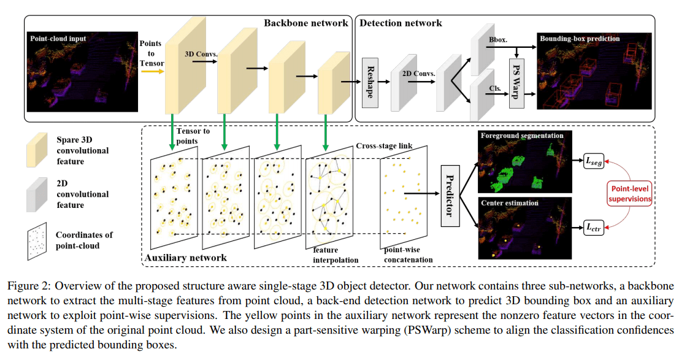
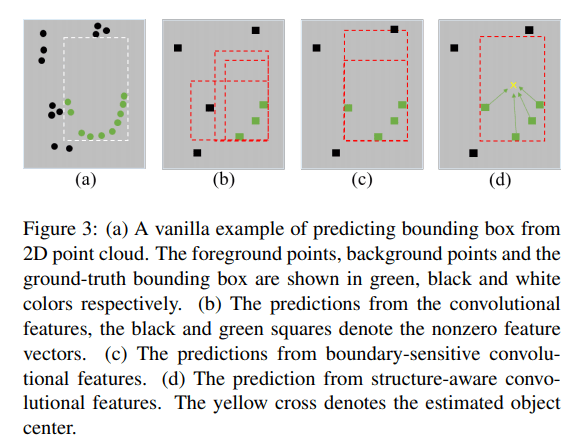
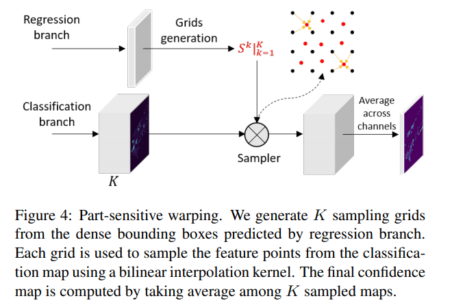
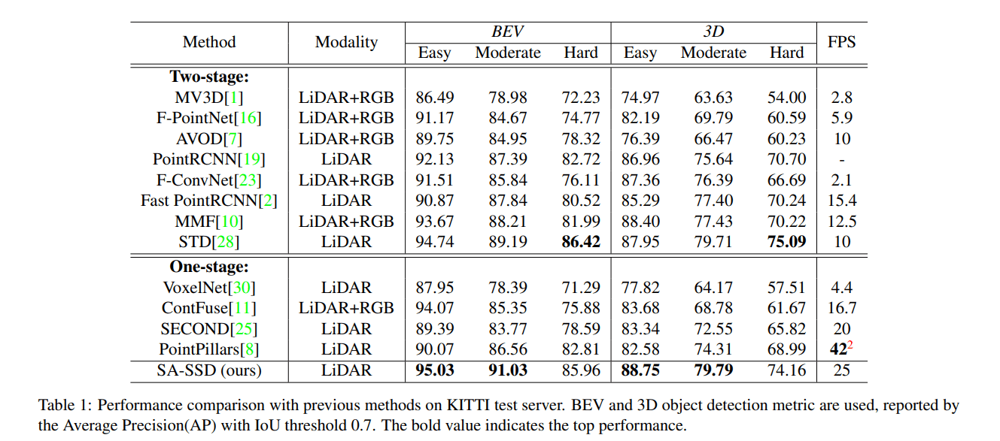
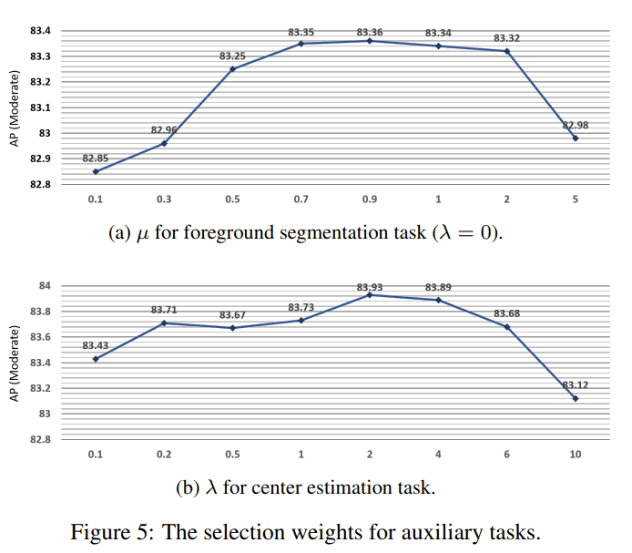
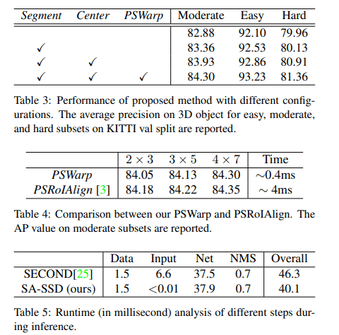

# SA-SSD 

---

He, Chenhang, Hui Zeng, Jianqiang Huang, Xian-Sheng Hua, and Lei Zhang. “Structure Aware Single-Stage 3D Object Detection From Point Cloud.” In *2020 IEEE/CVF Conference on Computer Vision and Pattern Recognition (CVPR)*, 11870–79. Seattle, WA, USA: IEEE, 2020. https://doi.org/10.1109/CVPR42600.2020.01189.

---

## Introduction

现阶段点云目标检测常用 SSD 方法为，使用卷积网络逐步缩小 feature map 形状，同时感受野也在逐渐提高，最终使用 downscale 的特征图谱去做选框的预测。这个过程中不可避免地会丢失空间信息：

1. 在将点云进行体素化时会丢失原始点云的空间信息
2. 在进行卷积操作时，虽然进一步提取了局部特征，但同时也会丢失细节信息

为了解决信息丢失问题，可以使用 2-Stage 目标检测网络。在第二阶段可以利用更精细的空间信息，重点关注第一阶段提出的 RoI，从而预测更加精准，这揭示了利用点云的细粒度 fine-grained 空间信息的重要性。然而，对每个点进行操作并为每个 RoI 重新提取特征会大大增加计算成本，使得两阶段方法难以达到实时速度

使用辅助任务来提升主任务的表现，在目标检测网络中也是非常常见的方法。例如在 PV-RCNN 中则进行了前景点任务，并利用该任务对不同点的特征进行权重分配，前景点将获得更大的权重。

论文使用可分离辅助网络来补偿损失的空间信息。辅助网络的输入为 backbone 中不同分辨率的 feature map，将特征图谱的栅格化特征表示，使用特征传播 feature propagation 转化为逐点的特征表示，然后使用逐点的特征去做两个辅助任务：前景点分离和中心预测。在训练过程中辅助网络与主干网络进行联合优化，所以主干网络的 backbone 参数中将具有原始点云的语义信息。而在进行推理的时候，辅助网络将从主干网络中分离，故不增加任何的计算

[CSDN](https://blog.csdn.net/qq_39732684/article/details/105147497) 上对于这篇论文的代码解读，该网络的代码构建是基于 MMDetection 和 SECOND

### 疑问

在网络中间插入辅助任务的做法，我在二维目标检测中的一篇文章（Hourglass Networks）中也看到过类似的结构。但在 Hourglass 中这种做法叫做中间监督 intermediate supervision，但该结构在推理中并没有被分离，其中的特征图谱经过转化过后再一次加入到了主干网络中

如果将 SA-SSD 辅助网络中学习的特征再次送入主干网络之中效果会更好吗？事实上，这样就回到了 2-Stage 目标检测网络结构。例如 PV-RCNN 也是将 voxel-wise 特征转化为 point-wise 特征，再使用 point-wise 特征根据 RoI 做选框细化。所以需要提出的问题为：什么样的辅助网络结构，能够让主干网络有效提取精细的空间信息。**这个问题将又引申出两个疑问：如果辅助网络的对特征的转换过于复杂，那么更新到主干网络中的参数是否还有意义？如果采用与主干网络相似的结构作为辅助网络的结构，这种相似结构是否会帮助特征学习？**

## SA-SSD Architecture

### Input pre-process

论文采用了简单 floor 操作，将所有点的坐标映射到栅格点上。这样的预处理与 SECOND 相比，使用时间非常短，在最后的实验部分有图表
$$
\overline{p_i} = (⌊ \frac{x_i}{d_x} ⌋, ⌊ \frac{y_i}{d_y} ⌋, ⌊ \frac{z_i}{d_z} ⌋)
$$

### Backbone network

主干网络的结构比较简单，主要是基于 VoxelNet/SECOND 网络结构，使用 3D 稀疏卷积 sparse convolution 进行特征提取。将得到的 3D 特征图谱重塑 reshape 为二维 BEV 特征图谱表示，即将 z 轴方向的特征连接起来。最终使用该 BEV 特征图谱分为头，做选框预测任务和分类任务

### Detachable auxiliary network

辅助网络的目标是帮助主干网络感知 3D 点云的结构信息。下面详细地介绍辅助网络的使用动机

#### Motivation

在主干网络提取点云特征的过程中，会不断地进行卷积操作，该操作也是一个下采样操作，将不可避免地丢失准确的空间信息。当仅使用部分点（由于下采样的原因）对 3D 选框进行预测时，如果添加一些其他信息进行辅助，能够更好地帮助预测结果，比如：每个点的是否为前景点、每个点的选框中心在何处。有了这些辅助信息，能够让预测的选框更加准确

受此启发，最简单操作为，直接使用更多的网络来完成对于辅助信息的预测，然后再将这些辅助特征、信息与主干网络的特征相连接，进行最终的预测。但是这些网络将会使用更多的计算资源，本论文则希望在不增加计算资源的同时获得这些辅助任务的特征与信息，基于此提出了可分离辅助网络。该辅助网络在训练时与主干网络联合优化，而在推理时将从主干网络中分离，也即在训练时由于辅助网络的引进会增加更多的计算，但在推理时没有其他多余的计算，保持主干网络的高效率

### Point-wise feature representation

为解决以上提出的问题，论文的解决方案为：构建一个具有点级 point-level 监督的辅助网络，以引导主干网络在不分辨率的特征图谱去学习更细粒度的结构。该引导为隐性的引导，在训练过程中通过辅助任务和反向转播去调整主干网络中的参数，使得主干网络获得更细节的特征信息。具体方法如下：

1. 使用特征传播 feature propagation，将不同分辨率下的 voxel-level 特征转化为 point-level 特征，该操作与 PointNet++ 中的特征传播是一致的，是基于空间距离的插值操作 inverse distance weighted average 
   $$
   f^{(j)}(x)=\frac{\sum_{i=1}^{k} w_{i}(x) f_{i}^{(j)}}{\sum_{i=1}^{k} w_{i}(x)} \quad \text { where } \quad w_{i}(x)=\frac{1}{d\left(x, x_{i}\right)^{p}}, j=1, \ldots, C
   $$
   而这些插值点的来源论文中并没有提及，但是每一个 voxel-level 特征所转换出来的 point-level 特征应该都是相同形状的

2.  将不同分辨率下得到的 point-level 特征连接起来使用 shared MLP 进行编码（在论文的代码中并没有体现）
3. 将编码得到的特征，使用 MLP 去预测两个结果：每个点的属于前景点的概率，前景点到目标中心的偏移量。这里的 unit point convolutions 应该还是

两个任务的损失函数也是常规的 focal loss 和 smooth L1 loss，且 L1 loss 仅针对于前景点
$$
\mathcal{L}_{\mathrm{seg}}=\frac{1}{N_{\text {pos }}} \sum_{i}^{N}-\alpha\left(1-\hat{s}_{i}\right)^{\gamma} \log \left(\hat{s}_{i}\right)
\\
where \ 
\hat{s}_{i}=\left\{\begin{array}{ll}
\tilde{s}_{i} & \text { if } s_{i}=1 \\
1-\tilde{s}_{i} & \text { otherwise. }
\end{array}\right.
$$

$$
\mathcal{L}_{\mathrm{ctr}}=\frac{1}{N_{\text {pos }}} \sum_{i}^{N} \text { Smooth- } l_{1}(\Delta \tilde{\mathbf{p}}-\Delta \mathbf{p}) \cdot \mathbb{1}\left[s_{i}=1\right]
$$

###  Part-sensitive warping

如果使用 anchor-based 方法进行目标检测，例如：Faster RCNN，会出现预测选框与分类置信度之间并不匹配。分类置信度的特征来源是由预先设值的 anchor 决定的，而不是来自所预测的选框。为解决这一问题，论文提出了 part-sensitive warping operation (PSWarp) 用于矫正这一不匹配现象，其中心思想为：让预测选框的分类置信度，来自于预测选框对应的分类特征图谱区域。具体操作更加复杂一点

1. 将分类特征图谱改变维度，从 $(W, L, F)$ 至 $(W,L,C, K)$ 其中 C 表示类别数量，K 表示将预测选框的俯视图平均分成了 K 份（论文将选框分为了 4x7=28 份），K 个维度里的每一个维度代表该点为选框某个部分的得分。例如当 K = 4 时，维度 (0, 1, 2, 3) 代表预测选框的 (左上，右上，左下，右下) 的得分

2. 将预测选框的俯视图平均分为 K 份后，取每一个部分的中心点作为采样点，再使用双线性插值 bilinear interpolation 获得**采样点在分类图谱中的特征值**。为了更具体的说明插值过程，将这 K 个采样点进行编号 $\{S_k: k=1, 2,...,K\}$，假设第 i 个采样点 $S_i$ 其插值参考的特征图谱 feature map $\mathcal{X}$ 也为第 i 个，即 $(W,L,C,i)$ 记为 $\mathcal{X^i}$。代数过程如下
   $$
   \mathcal{C}_{p}=\frac{1}{K} \sum_{k=1}^{K} \sum_{i\in\{\lfloor{u^k}\rfloor ,\lfloor{u^k+1}\rfloor\}\atop  j\in\{\lfloor{v^k}\rfloor ,\lfloor{v^k+1}\rfloor\}} \mathcal{X_{ij}^k}\times b(i,j,u^k,v^k)
   $$
   代码可以参考 [CSDN](https://blog.csdn.net/themasterbi/article/details/106913582)，这篇博客的所写的源代码注释，是众多博客中让我唯一理解的注释，不然通过论文中的文字很难理解 PSWarp 操作。最终获得输出 $(K, 1, N, 1)$，其中 $N$ 为该场景中预测选框的数量。图示如下

   

3. K 个采样点将会得到的 K 个得分，它们的平均值作为最终分类得分，最后使用 sigmoid 函数获得分类置信度

将辅助任务和主任务的损失函数乘以权重超参数，相加后得到整个网络的损失函数
$$
\mathcal{L}=\mathcal{L}_{\text {cls }}+\omega \mathcal{L}_{\text {box }}+\mu \mathcal{L}_{\text {seg }}+\lambda \mathcal{L}_{\text {ctr }}
$$
前两项即为主任务的分类任务和预测选框任务，后两项为辅助任务的分割任务和预测中心任务。所有的分类任务和回归任务都是 focal loss 和 smooth L1 loss

损失函数没有使用到 IoU 相关的部分，IoU 其实是一个非常有效的综合评估标准，包含了不少的信息。之后可以考虑加入预测 IoU 的任务，该任务或许对原网络有不错的优化

## Experiment

### Train

在 RPN 网络训练过程中，由于 anchor-based 属性，需要提供 anchor 的 positive/negative 属性以进行分类任务的训练，其 IoU 阈值分别为0.6和0.45。在推理阶段使用阈值为0.1的 NMS 操作 

### KITTI

### Weight selection of auxiliary tasks

论文采用 $\mu=0.9,\lambda=2$

### Ablation study & compare

可以看出3个特殊设计各有0.5%左右的提升，最终提供了接近1.5%的提升，同时网络速度也保持得相当不错

## Conclusion

论文创新性地使用了可分离辅助网络，在推理时不增加额外计算量，同时提升了最终的表现。可以感觉该思想是一个不错的突破口，但是这背后留下了更多的疑问：辅助网络的具体结构应该如何设计，是该简单，还是该复杂，或者都不是；该方法是否能称为一种主流的方法，将整个目标检测的框架带到一个新的台阶上；细粒度信息应该以怎样的表示方法加入到其中，尤其与 2-Stage 方法做比较，直接的特征加入和间接的特征引导学习，两者该怎么衡量...

PSWarp 方法想要解决的困难是真实存在的，也就是置信度与选框不匹配问题。但该方法是否为解决该问题最好的，或许其他论文有更优雅的解决方案，还有待继续学习
