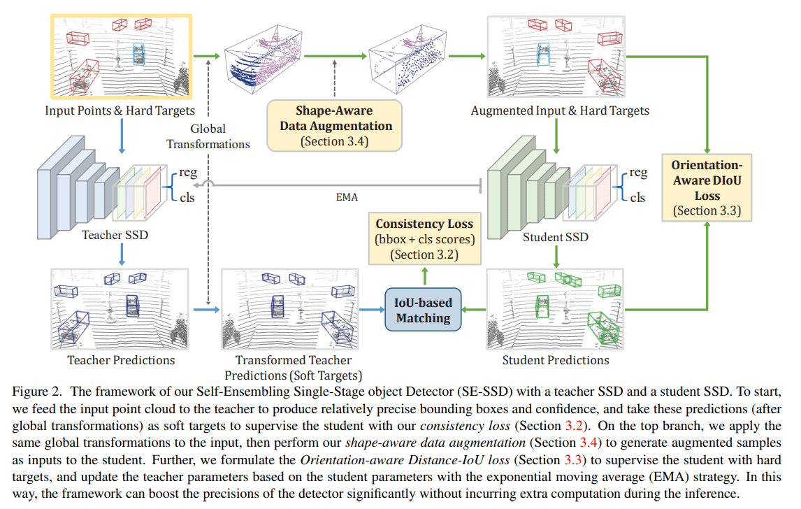
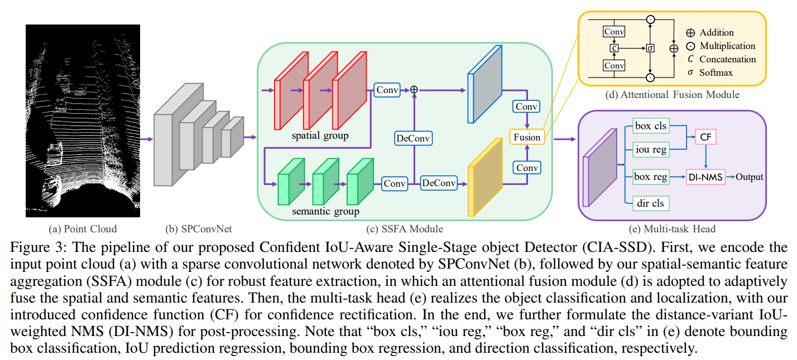
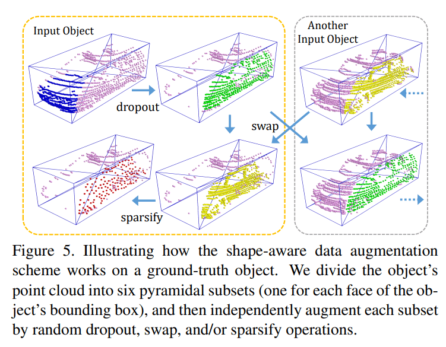
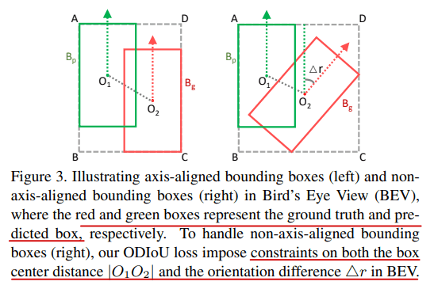
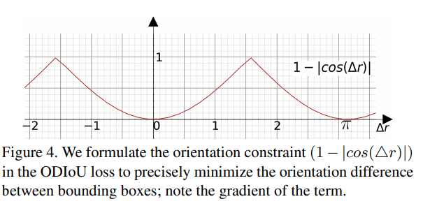
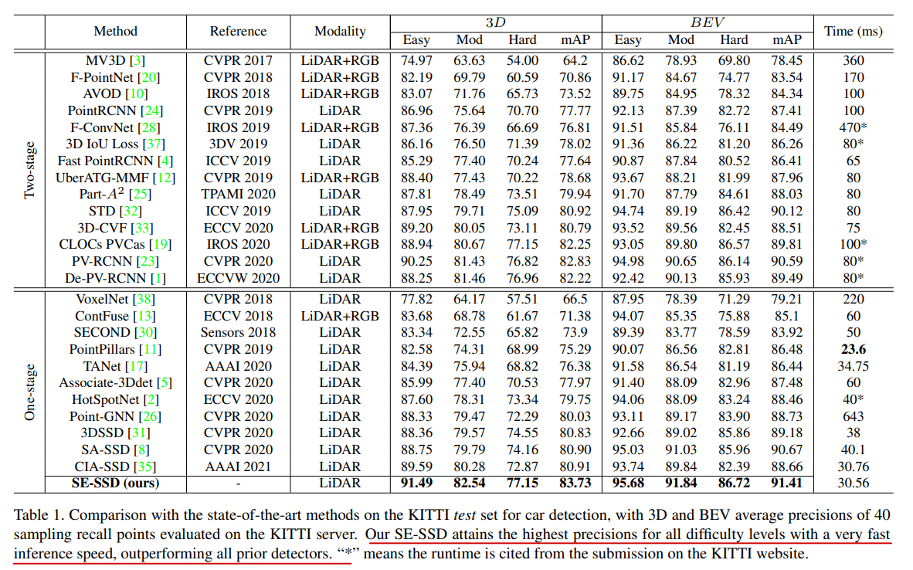
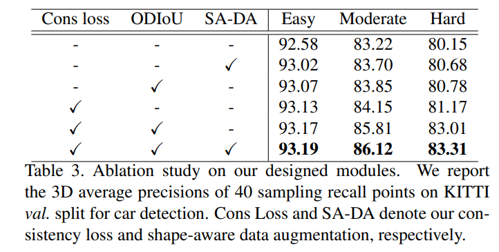
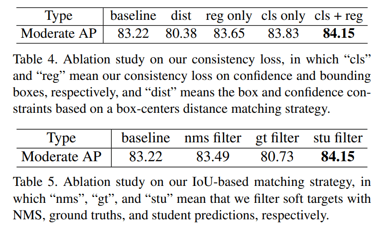

# SE-SSD

---

Zheng, Wu, Weiliang Tang, Li Jiang, and Chi-Wing Fu. “SE-SSD: Self-Ensembling Single-Stage Object Detector From Point Cloud.” *ArXiv:2104.09804 [Cs]*, April 20, 2021. http://arxiv.org/abs/2104.09804.

---

## Introduction

本论文的核心为使用知识蒸馏 **Knowledge Distill** + **Mean Teacher**的思想，加入软目标 soft target 对网络的预测结果进行监督学习。生成该 soft target 不是使用原始方法，将不同模型的 prediction 进行集成，而是先将模型进行集成，再使用集成模型进行预测 prediction。集成模型结构 ensemble model 与原始网络相同，称为 Teacher-SSD，而原始网络称为 Student-SSD，其中 Teacher-SSD 的参数为 Student-SSD 参数的集成，这也是为什么模型名叫自嵌入 SSD (self-embedding)

### Why soft target

手动注释的硬目标（即标签 hard target/label）相比，软目标通常具有更高的熵，从而为学生提供更多信息以供学习，弥补了监督信号的不足。并且论文的软目标来自于自身模型的集成，所以与自身的预测结果比较相似，避免了梯度的剧烈变化。而所谓更高的熵该如何去理解？参考 [知乎](https://zhuanlan.zhihu.com/p/390167950)

展开分析一下软目标的作用，以分类任务为例，总结如下：

1. 分类标签为 one hot 向量，仅为一个点，也即该目标所属类别。而使用 teacher model 对于每个样本输出一个连续的 label 分布，这样可以利用的监督信息就远比 one hot 的多了
2. 软目标还提供了其他分类的得分/可能性，含有了类别与类别之间的信息
3. （在本论文中）将学习曲线变得更加平滑，减少了梯度方差，帮助更好的微调

除了该核心思想外，论文还提出了新的数据增强的方式和新的损失函数以提升网络表现：

1. Shape-aware data augmentation
2. Consistency loss for soft target
3. Orientation-aware distance-IoU loss for hard target 

## SE-SSD Architecture

SE-SSD 的整体结构非常的简洁。网络的计算有两条路线，teacher 路线 & student 路线

1. Teacher 路线（图中标以蓝色箭头）：将原始点云输入到 Teacher SSD 中产生预测结果 predictions，对预测选框进行全局变换 global transformation (including a random translation, flipping, and scaling) 生成软目标 soft target

2. Student 路线（途中标以绿色箭头）：将原始点云进行全局变换 global transformation，然后进行数据增强 shape aware data augmentation，生成增强过后的输入和硬目标。将增强后的数据输入 Student SSD 做多任务：回归任务和分类任务，最终得到预测结果 student predictions。该预测结果将与硬目标和软目标同时输入损失函数，进行计算并优化网络参数

以上就是整体的流程，下面需要对 Student SSD，数据增强方法以及损失函数进行详细的了解

### Architecture of Student SSD

SSD 的结构与作者的前作文章 CIA-SSD 是一致的。该网络为一个轻量型结构，但是推理效果依然很好。按理来讲 SA-SSD 已经很快了，但是该模型比其更快更好。论文中解释了速度的原因：CIA-SSD 使用的 channel 数大部分都是 SA-SSD 的一半，但是将语义和空间信息的学习移到了主干网络中，综合之下胜出。还有一篇论文 Voxel R-CNN 的表现也非常优秀，都在速度和准确率上超越了 SA-SSD。这些结果是否意味着辅助网络的彻底失败呢？

我认为辅助网络提供了一种可能性：即使是小模型也能够使用更好的参数达到一流的效果。并且辅助网络的思想很简单，能够轻松地加入到大部分的结构当中，而不需要花费大量的时间进行结构设计

下面对 CIA-SSD 的重要结构进行简要的介绍

1. 使用稀疏卷积将体素化点云进行编码，并转化为 BEV 特征图谱
2. 使用 SSFA 模块对 BEV 特征图谱进行进一步特征提取：
   1. 保持原 BEV 特征图谱的形状，进行多次卷积继续提取小尺度的空间特征 spatial group，假设最终得到空间特征图谱 $F_{spatial}$
   2. 将 $F_{spatial}$ 作为输入，进一步提取高级/感受野更大的语义特征 semantic group，假设最终得到语义特征图谱 $F_{semantic}$
   3. 将语义特征进行上采样/反卷积 upsampling/deconvolution 达到和空间特征一样的形状，以准备融合
   4. 融合阶段，将两个特征图谱的通道数压缩为1，并使用 sigmoid 函数映射至 0-1 区间，得到两个新的权重特征图谱。然后将权重特征图谱与原来的特征图谱逐元素相乘，得到最终用于多任务的特征图谱 $F$
3. 进行多任务预测：分类任务、IoU 预测任务、box 回归预测任务、方向分类任务

CIA-SSD 中提到了一些 trick 在本论文之中均没有使用，个人觉得比较复杂，不太好理解，就不继续深入研究了，而且如是好 trick 的话本论文应该会沿用。总体来看 CIA-SSD 的结构依然是加强对多尺度信息的提取并进行融合

### Shape-aware data augmentation

由于点云数据的不规则性，很多物体表面上的点都没有被采集到，这是物理层面的原因。为了模拟这种数据缺失并增加样本多样性，论文采取了下图所示的做法

用语言简要叙述：

0. 在进行操作前先对数据集进行基本的数据增强 global transformation (including a random translation, flipping, and scaling)
1. 将每个3D选框分为6个子区域，方法为将选框顶点与选框中心相连接，形成六个四棱锥
2. 对每个3D选框，在6个子区域中随机选择一个剔除，以模拟采集时点云丢失的情况
3. 将不同3D选框之间的子区域进行交换，子区域的相对位置是一样的，例如将两个选框的右侧的四棱锥进行交换。该操作增加样本的多样性
4. 对每个3D选框，随机选择一个子区域进行下采样，使其更加稀疏。采样方法为 farthest point sampling (FPS)

### Consistency loss

为了让软目标不会对预测选框进行错误引导，需要先对软目标和预测选框同时进行筛选：

1. 去掉置信度低于阈值 $\tau_c$ 的软目标和预测选框
2. 仅匹配 IoU 高的软目标和预测选框，二者 IoU 低于阈值 $\tau_I$ 的不进行损失函数 consistency loss 计算

数学表现形式如下：
$$
\begin{array}{c}
\mathcal{L}_{b o x}^{c}=\frac{1}{N^{\prime}} \sum_{i=1}^{N} \mathbb{1}\left(I o U_{i}>\tau_{I}\right) \sum_{e} \frac{1}{7} \mathcal{L}_{\delta_{e}}^{c} \\
\\

\delta_{e}=\left\{\begin{array}{ll}
\left|e_{s}-e_{t}\right| & \text { if } e \in\{x, y, z, w, l, h\} \\
\left|\sin \left(e_{s}-e_{t}\right)\right| & \text { if } e \in\{r\}
\end{array}\right.
\end{array}
$$
$\mathcal{L}_{\delta_e}^c$ 为 smooth L1 loss，$N$ 和 $N'$ 为起始预测选框数和筛选后的选框数。对于分类也使用类似的损失函数
$$
\mathcal{L}_{c l s}^{c}=\frac{1}{N^{\prime}} \sum_{i=1}^{N} \mathbb{1}\left(I o U_{i}>\tau_{I}\right) \mathcal{L}_{\delta_{c}}^{c}
\\
\delta_{c}=\left|\sigma\left(c_{s}\right)-\sigma\left(c_{t}\right)\right|
$$

### Orientation-aware distance-IoU loss

为了让预测选框的几何参数更关注目标中心和旋转方向，论文设计了相关的损失函数，引导选框与硬目标对齐
$$
\mathcal{L}_{b o x}^{s}=1-\operatorname{IoU}\left(B_{p}, B_{g}\right)+\frac{c^{2}}{d^{2}}+\gamma(1-|\cos (\Delta r)|)
$$
$B_p$ 和 $B_g$ 代表预测选框和硬目标/标签，$c$ 代表中心距离，$d$ 代表包围两个选框的最小长方体的对角线，$\Delta r$ 代表两个选框 BEV 相差的角度，$\gamma$ 为超参数，图示如下

论文画出了 $(1-|cos(\Delta r)|)$ 的图像，方向差别越大损失函数越大

除了回归任务，还有选框的分类任务，以及选框朝向的分类任务，两个任务的损失函数分别为 focal loss 和 binary cross entropy loss。故整个网络的全部损失函数写为
$$
\mathcal{L}_{\text {student }}=\mathcal{L}_{\text {cls }}^{s}+\omega_{1} \mathcal{L}_{\text {box }}^{s}+\omega_{2} \mathcal{L}_{\text {dir }}^{s}+\mu_{t}\left(\mathcal{L}_{\text {cls }}^{c}+\mathcal{L}_{\text {box }}^{c}\right)
$$
前三项为预测选框与硬目标的损失函数，分别对应：选框分类任务，选框 $(x, y ,z ,w, l, h, \theta)$ 回归任务，选框朝向分类任务

后两项为预测选框与软目标的损失函数 consistency loss，分别对应：分类一致损失，选框一致损失。其余参数为权重超参数，其中 $\mu_t$ 随时间从0增长至1

## Experiment

### KITTI

目前（2021/10/16） SE-SSD 依旧在 KITTI 榜单上排名顶尖 $9^{th}$

### Ablation study

论文中的三个重要结构，在验证集上 Easy 难度提升是最小的，因为已经比较准了，而在 Moderate 和 Hard 难度中都提升了 3% 左右。其中可以看到单独作用最大的结构为 consistency loss，而且在该结构的加持下， ODIoU loss 的效果似乎也变得更好

对于 ODIoU 不能直接去掉，论文使用的是 smooth L1 loss 代替

### Consistency loss

两个表分别说明了：

1. 分类和回归，两个任务的预测结果同时对齐软目标时效果最好

2. 并且对软目标进行筛选时，基于 IoU 策略的筛选能够保留更多的信息。其中 nms filter 代表的是使用 NMS 策略对软目标进行筛选， gt filter 代表的是剔除与 ground truth 标签重叠的软目标

## Conclusion

SE-SSD 的表现可以说是非常的惊艳，所使用的 Teacher-SSD & Student-SSD & soft target 思想简单且有效，或许在之后能够成为一种常用的提升网络效果的手段。论文设计的数据增强和损失函数也在一定程度上增加了网络准确率，这也说明了除了网络结构本身，**其他的信息（标签、样本）以及评估模型的方式**也是相当重要的。在阅读期间也有一些疑问和想法产生

**Q:** 同时软目标相对于预先设定的 anchor，具有更精确的边界框和置信度，这里是否可以借鉴 2-Stage 中的思想，对于软目标进一步的利用，将其作为更高级的注意力机制

**Q:** 对于软目标是否一定要来自于自身的集成，使用其他模型的效果会如何。对于集成模型的参数更新方式不一定使用 EWA，可否借鉴强化学习中的方法。对于 consistency loss 能否进一步改进，比如增加 IoU 相关损失

**Q:** （与 SA-SSD 联动）辅助任务与软目标的异步进行，先使用辅助函数进行基础学习，再使用软目标进行知识蒸馏

