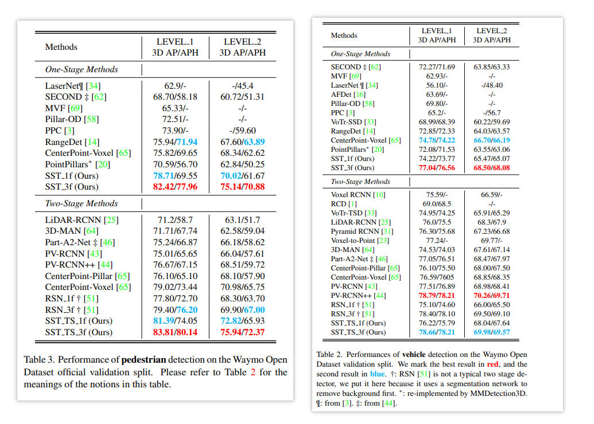

# Single Stride Sparse Transformer

---

Fan, Lue, et al. “Embracing Single Stride 3D Object Detector with Sparse Transformer.” *ArXiv:2112.06375 [Cs]*, Dec. 2021. *arXiv.org*, http://arxiv.org/abs/2112.06375.

---

将 transformer 和点云的稀疏性结合起来，简直不要太契合，将 backbone 更换为 SST 后，使用简单的 anchor head 就能够将表现提到 SOTA，尤其是行人的表现，过于亮眼，必须要好好整理一下这篇论文

推荐作者本人在知乎的解读 [zhihu](https://zhuanlan.zhihu.com/p/476056546)，把整个探索的思路讲得非常清楚

## Introduction

在自动驾驶场景中，物体的大小相比于整个输入场景来讲通常都很小。论文使用下面的图更具体地解释：3D 自动驾驶场景和 2D 图像场景的物体大小分布有很大的区别

2D 场景物体大小分布是长尾式，而 3D 场景则是集中在为两个峰，并且其相对大小非常小（一个物体在特征图谱中只有几个甚至i一个像素点）

于是引出一个问题：主流的多尺度卷积 backbone 在这样的场景下真的是必要的吗？是否有可能设计出一个高效可行的单步长（没有降采样）检测器呢？为了设计这样的检测器会面临两大难点：

1. 计算量增加。这是非常直接的，增加分辨率会增加计算复杂度
2. 感受野减少。在高分辨率图像下，一个像素对应的大小将会很小。如果使用一般的 3x3 卷积核，需要更深的卷积才能获得更大的感受野

其实上面提到的两大难点一直都存在，之前也有解决方法：

1. 计算量增加 --> Sparse Convolution
2. 感受野减少 --> Dilation Convolution or Big Kernel

但是这些解决方法都只能解决各自的问题，而不能兼顾两个难题。比如稀疏卷积不能兼顾感受野，而大卷积核计算量又会很大，至于空洞卷积则会遗漏细节对小物体效果并不好，从下图可以略窥一二

那咋办呢？下面直接引用原作者的解决思路，只想感叹一句：这样的理解真的太丝滑了！

> 基于上述的困难，我们想到了蹭一波Transformer中attention机制，它有两个好处，一是能建模long-range dependency，很容易获取到足够的感受野；二是它可以处理变长序列，这不正好适用于无序又稀疏的点云？于是我们follow了swin transformer中划分window的想法，把体素化后的点云空间也划了划window。而与swin不同的是，我们舍弃了hierarchy结构，并把attention进行了稀疏化改造。这样就得到了一个没有降采样的网络，有多少体素（voxel）进网络，就有多少体素出网络。而因为attention的locality和sparsity，计算量也能保持在可接受范围内。

## SST

整个论文的结构非常简洁，用两张图就能比较清晰地理解。第一张图就是网络流程图

如果以 PointPillars 进行比较的话，相当于把其中的 BEV backbone 替换为多个 attention based blocks。这些 block 可以用下面的图表示

简单来说，block 将 feature map 划分为 sub window，在 window 内部使用 sparse attention，然后再使用 shift window 让 window 之间进行交互。如果了解 Swin Transformer 的话，应该会对上面的图比较熟悉，只不过少了 hierarchy 结构，也即不需要多尺度结构

还需要注意的是，在将特征输入到 detection head 之前，还使用了两个 3x3 的卷积。这样做的目的是为了填补特征图谱上的大量空洞，毕竟之前所有的操作都是 sparse based，空的就是空的，不会有特征传递过去

## 如何实现 sparse attention

直接搬运作者在知乎的回答

> 由于被很多人喷过很多次代码有点复杂，所以这里附上一个sparse attention的实现思路，不care细节的朋友可以跳过，希望大家别骂了：
>
> 实现的核心在于我们需要维护 $[N, C]$ 和 $[W,V,C]$ 这两个data view（直观地说就是tensor shape）的转换。这里， $N$ 表示整个batch中的非空voxel数量， $C$ 表示特征维度，$W$ 表示整个batch中的window数量， $V$ 表示window中最多所能容纳的非空voxel数量。注意由于我们使用了前文所提到的bucketing-padding策略，实际上这里的 $V$ 和 $W$ 都不止一个，它们的数量（不是数值）等于buckets的个数。在 $[N,C]$ 的data view中，SST进行FFN的计算，而在 $[W,V,C]$ 的data view中，SST在 $V$ 的维度进行attention的计算，每个voxel都回去query别的voxel。这里实现上的难度在于：voxel位置的随机分布，voxel的dropping，window的shift，bucketing-padding这几个因素会交织在一起互相影响。我们最终代码的主体逻辑是先根据给定的信息算出一套数据索引，再反复利用这套数据索引去完成data view的转换。因为我们的stride不变，voxel的layout也不会变，因此这套数据索引可以在多个layer中被反复使用，只需要计算一次。

## Experiment

### Comparison with SOTA

SST 在 Vehicle 上的表现和其他 SOTA 相当，而在行人表现上，SST 是一骑绝尘，使用 3-frame + 2-stage 表现就能够远远甩掉目前的 SOTA

在附录里面也贴了其他检测器的 multi frame 结果，不过是 2-frame（其实这篇论文的附录也大有东西）

### Deep Investigation of Single Stride

#### Better use dense observations

在更密集场景下 SST 的效果非常好，使用 3-frame 就能够继续在行人上大幅提点

#### Localization quality

使用更高分辨率直觉上能够带来更好的定位，论文使用了更高的 IoU thresh 来做了一个比较。比较让人吃惊的是在行人上仍然超越了 3DAL 这个自动标注模型，该模型使用了很多 trick 就是为了把表现提到最好

### Hyper-paramter

论文实验表明 SST 对于 Region Size 和 Network Depth 的变化并不敏感，如果对于计算有需求的话，应该可以做一些相应操作

## Appendix

这篇论文的附录也讨论了不少的东西，实际上作者把 SST 里面能提升的点很多都提出来了

1. 更好的上下采样方法。虽然 Swin 解决了图像的下采样方法，但是对于稀疏的点云数据，现在仍是一个开放问题
2. 使用 IoU prediction 纠正得分
3. 使用更强的 rpn head
4. 使用更强的 roi head
5. 使用更快的 transformer (like DynamicViT) 以及相对位置编码 relative positional encoding
5. ...（又有好多坑没有看啊😭