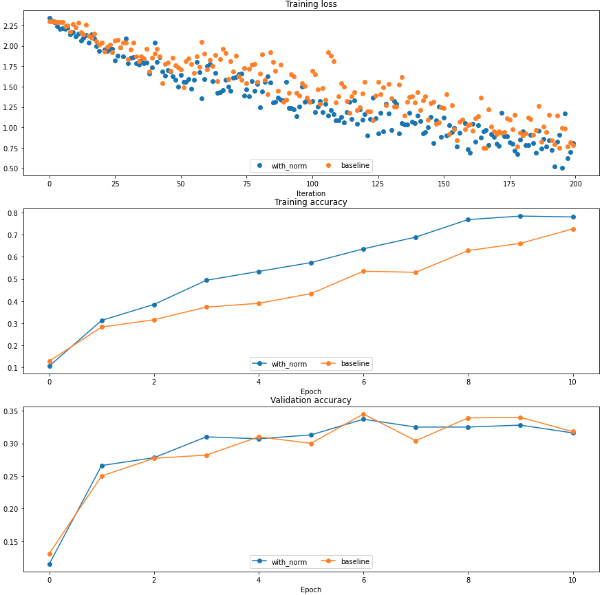
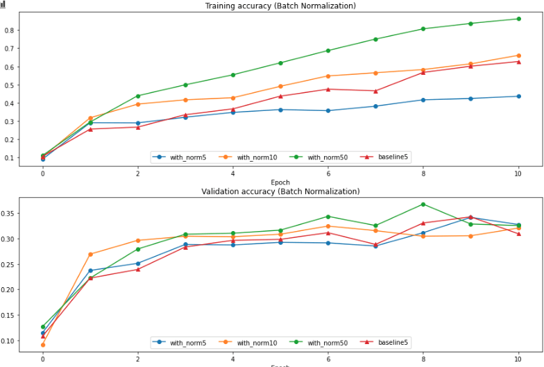
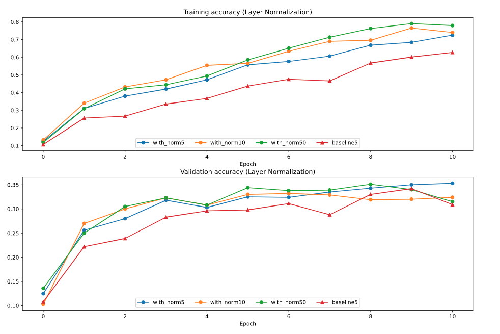
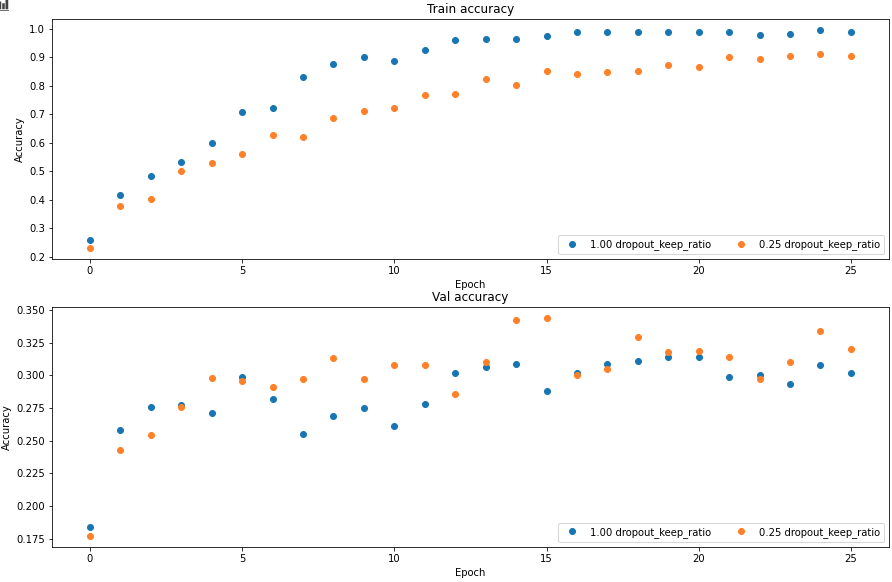
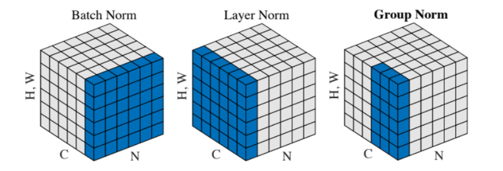

# cs231n 2021 Assignment 2 note

## 资源

assignment 模板: [github](https://github.com/cs231n/cs231n.github.io) 

官方: [课程链接](https://cs231n.github.io/assignments2021/assignment2/)

assignment 参考链接: [2020](https://github.com/amanchadha/stanford-cs231n-assignments-2020)

发现了一种新的模式: pycharm + git + anaconda & jupyter

上面的组合能够帮助写代码的效率提升，pycharm 能够帮助调试，git 用于版本管理，conda 用于环境管理。jupyter 在测试代码块上有很大的优势，并且很多 cs231n 的作业形式都是以 ipynb 的文件类型发布，更适合在 jupyter 上打开，而且 jupyter 能够直接使用创建好的 conda 环境，特别方便

经过一番折腾，最终决定使用 vs code 替换 pycharm，原因是 vs code 有 jupyter notebook 插件，可以直接显示在 editor 内，比 Pycharm 更方便而且以后想要学习其他语言 vs code 优势更大

## 过程中的编程复习

1. 重新复习了 numpy 的一些用法，一个重要思想就是尽量少考虑使用循环解决，要以 index 索引思想来解决数据的操作问题。

   reshape已经存在的shape

   ```python
   a.reshape(b.shape)
   ```

   当接受参数是元组而是可变参数 *args 的时候，可以用 *tuple 来将参数变为 *args

   ```python
   np.random.randn(*a.shape)
   ```

   要学会善用矩阵点乘 A * B，是将对应元素相乘，在计算模的时候，或者当其中一个是 indication function 时很有用

2. 重新复习了字典的用法，核心是创造字典，dict(), dict.fromkeys()

   字典的 key, val 迭代器，如果不用 items，则只有 key

   ```python
   for key, val in dict.items():
   	pas
   ```

3. 对于格式化字符串有新的认知，下面例子

   ```python
   self.params = {}
   self.params['b%d' % (i+1)] = weight_scale * np.zeros(hd)
   ```

   可以用这样的形式来调用 key

## Fully Connected Networks

1. 对于网络的认知有了更新。要把层(layer, w)和点(node, x)分开来看，这样网络结构才更清晰。一般隐藏层不包含输出层
2. **反向传播熟悉 back propagation，尤其是矩阵相乘的反向传播，只需要记住结论就行了。对于广播过后的结果，需要将广播的矩阵作 sum 处理，得到广播前的对应元素梯度**
3. 5 layers 和 3 layers 网络优化时比较，差异在哪里？5 layer 更难优化，对于初始值敏感
4. **对于优化算法进行了进一步了解，由三个核心点：AdaGrad, Momentum, EWA 最后自然推出 Adam 优化算法**
5. **在编写代码的时候重要的版本需要保存，这就需要使用 git**

## Batch normalization

进一步清晰了 bn 的过程与作用，可以回看自己的笔记了解详情

### Inline Question 1

**How does the scale of weight initialization affect models with/without batch normalization differently, and why?**

You should find that using batch normalization helps the network to converge much faster. 

使用 batch normalization 会让网络在训练集上收敛更快。这和普通的 normalization 是一个道理，减少 zigzag 拐弯

还有几个需要知道和理解的点是：

1. batch normalization 帮助缓解梯度消失/爆炸的问题，这将减缓因为 weight initialization 过大或过小而产生梯度消失/爆炸的问题
2. batch normalization 有一定的正则化效果，避免过拟合



### Inline Question 2

**hat does this imply about the relationship between batch normalization and batch size? Why is this relationship observed?**

一般规律是：batch size 越大训练集上收敛越快。当 batch size 比较小的时候，比 baseline 速度更慢，原因在于过少的样本带来的偏差太大，这样的噪音会影响训练和测试表现



在训练和测试时均会用到 bn layer，测试时用的 $\mu,\sigma$  参数是训练过程中的指数加权平均 EWA

### Layer Normalization

用在 RNN 中更多，如果以后接触 NLP 领域的话再深入整理。简单的解释 [知乎链接](https://zhuanlan.zhihu.com/p/74516930) 

假设我们有 10行 3列 的数据，即我们的batchsize = 10，每一行数据有三个特征，这是一种“列缩放”。

而layer方向相反，它针对的是每一行进行缩放。即只看一笔数据，算出这笔所有特征的均值与方差再缩放。这是一种“行缩放”。

Q: 为什么 gamma 和 beta 还是原来的 (D, ) 形状？Layer normalization 在 RNN 中有什么作用？



看得出 layer normalization 在训练上也是有一定作用的，但在图像方面相比于 batch normalization 效果差一点，另一个比较自然的结果是，对于 layer normalization 来说 hidden dimension 取较大值较好

## Drop out

两行代码解决 (inverted) dropout layer 核心

```python
mask = np.random.rand(*input.shape) < p
output = input * mask / p
```

vallina dropout 是在 test 时将输出乘以 p 使得输出是一个合理期望值。但如果我们在训练的时候已经除以 p 了，在测试时就不需要作任何操作。下图为正则化效果 regularization



## Convolutional Neural Networks

1. 用嵌套循环实现了最原始的卷积操作，使用 np.pad 函数能实现 padding 操作，感觉这个函数的参数不是那么灵活

2. 返回最大值坐标 np.argmax，如果想要返回多元坐标还需要使用 np.unravel_index 转化

   `np.unravel(indices, shape)`

3. assignment 提供了 fast_layers.py 来实现快速卷积操作，比我自己写的循环代码要快 1000 多倍，使用了 im2col 技巧以及 Cpython extension

4. 为什么在正则化的时候正则项中不包括偏差 b? 个人理解认为 b 对于正则化的贡献并不大，而 w 参数则占据了绝大部分的参数。

### Spatial Batch Normalization

这是卷积神经网络特有的 batch normalization。之前使用的 batch normalization 面对的是 (N, D) 形状的数据，但卷积过后得到的输出是类似 (N, C, H, W) 这样的多维数据。那我们应该怎样去计算这一批数据的统计量 $\mu, \sigma$ 呢？

如果沿着之前的思维，我们只沿着样本数据轴 N 去计算 $\mu, \sigma$ 

```python
# data.shape = (N, C, H, W)
mean = np.mean(data, axis=0)
var  = np.var(data, axis=0)
```

这将会得到 (C, H, W) 形状的统计量，其中每一个值 (c, h, w)，其样本来自于 N 个像素点（同一 channel，同一位置）。但我们希望样本的数量更广泛一些，具体一点来说，我们希望样本来自于 N 个 feature map (H, W)，用 numpy 表示为

```python
# data.shape = (N, C, H, W)
mean = np.mean(data, axis=(0, 2, 3))
var = np.var(data, axis=(0, 2, 3))
```

这将会得到 (C,) 形状的统计量，即：得到了对于某一个 channel 的统计量，这是合理的，因为同一个 channel 我们使用的是同一个 kernel。这样我们不仅得到了更广泛样本的统计量，还减少了参数数量

如果要使用之前写的 batch_norm 函数的话可以将数据转化为 (N * H * W, C) ，在 numpy 中使用 transpose + reshape 就可以完成

```python
data.transpose(0, 2, 3, 1).reshape(-1, C)
```

### Spatial Group Normalization

一张图展示Batch Norm， Layer Norm ，Group Norm的区别



Group Norm可以理解为在layer Norm的基础上，输入维度为 (N, C, H, W)，对C进行分组，即 (N, G, C//G, H, W)。为了完成这一部分，重新思考了如何基于系统计算 back propagation

**可以以重要的中间变量为节点，根据计算图逐步推导梯度。难点在于有矩阵参与的计算，经常伴随着矩阵形状的改变，在进行 back propagation 中一定要让梯度跟着这些计算进行升维和降维，可以想象为梯度会随着这些节点形状的变化进行复杂的流动，有分流(例如降维度)，也有汇合(例如 broadcast)**

例如，在 forward pass 中 broadcast 会将矩阵升维，sum 会将矩阵降维，如果在 backward pass 中遇到 broadcast 操作时，则需要将 upper_grad 根据对应维度求和，举个例子，如果我们要求下面 X 的梯度的话，代码应该时这样的

```python
# input: X, X.shape = (N, D)
# f(X) = X - np.mean(X)
# upper_grad = dout, dout.shape = (N, D)
dmean = np.sum(dout, axis=0)	# sum broadcast dimension
dmean = dmean / N	# mean operation back prop
dX = dout - dmean
```

如果想不使用计算图直接按照一般的矩阵梯度计算，遇到对矩阵/向量求导时，就会出现张量，也就是说维度会增加，需要熟悉张量的运算及其思维。还是借用上面的例子，但我们把平均值作为 (N, D) 形状来看待

```python
# input: X, X.shape = (N, D)
# f(X) = X - np.mean(X) * np.ones(X.shape)
# upper_grad = dout, dout.shape = (N, D)
```

$$
\frac{\partial{loss}}{\partial{f(x)}} = dout，\ f(x)=x-\mu
\\
\frac{\partial{f(x)}}{\partial{\mu}} = a\ ((N\times D) \times (N\times D))\ shape\ tensor
\\
\frac{\partial{loss}}{\partial{\mu}}=\frac{\partial{loss}}{\partial{f(x)}} ·\frac{\partial{f(x)}}{\partial{\mu}}=dout
\\
\frac{\partial{\mu}}{\partial{x}} = a\ ((N\times D) \times (N\times D))\ shape\ tensor
\\
\frac{\partial{loss}}{\partial{x}}=\frac{\partial{loss}}{\partial{f(x)}}·\frac{\partial{f(x)}}{\partial{x}} - \frac{\partial{loss}}{\partial{f(x)}}·\frac{\partial{f(x)}}{\partial{\mu}}·\frac{\partial{\mu}}{\partial{x}}=dout -dout·\frac{\partial{\mu}}{\partial{x}}
$$

这将是一种普适的方法，更加抽象化，能够处理任何的矩阵求导，但不推荐实际中使用。

不论使用哪种方法，最核心的还是要理解梯度流动的本质——某一个变量的变动能够引起输出多少变动

## BUG

### Fully Connected Layer

现在卡在了 solver 上

不能得到 overfitting 的结果

1. 尝试更换 solver 看能否得到不一样的结果

   失败了

2. 尝试使用2016的所有答案，看是否是自己的代码出问题了

   失败了

   小技巧 Ctrl+r 能够更换 pycharm 相同字段

3. 尝试更改 colab 本身的文件，使用2016年的colab文件

   成功，原因在于 learning rate 太小了，不能找到全局最优

### Batch normalization

1. 卡在了计算 back prop 上

   最后出现的失误还是在于每一个公式必须要精确才行

   ```python
   norm_x = (x - sample_mean) / np.sqrt(sample_var + eps)
   norm_x = (x - sample_mean) / (np.sqrt(sample_var) + eps)
   ```

   上面两个式子虽然在计算结果上相差不多，但是在网络的计算中，一点点的误差传播过后会变得越来越大

2. 尝试使用 jupyter 进行编程，遇到问题：The kernel appears to have died. It will restart automatically

   以为是 jupyter 的问题，但测试了不同的软件都出错了，最终发现是自己代码的问题！当找了一圈没有找到答案时，可能就要怀疑自己了，而不是怀疑软件出了问题！不过这也有好处，让我决定放弃使用 pycharm 转战 vs code

