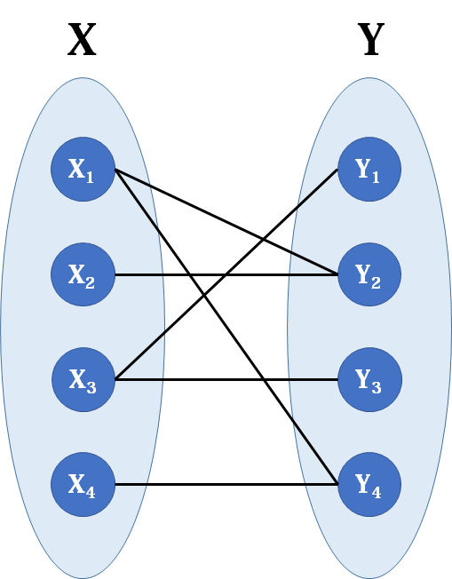

## 图论算法

[OI Wiki](https://oi-wiki.org/graph/)

## 图的表示与遍历

### 概念

1. 使用 `G(V, E)` 表示一个图，V 为顶点集合 Vertex，E 为边集合 Edge。图中**不允许没有顶点**，但是可以没有边

2. **度**：顶点相邻边的数目，常用 `deg(v), d(v)` 表示，不同的度有着不同的性质：

   - 孤立点 (Isolated vertex) ： `d(v) == 0`

   - 叶节点 (Leaf vertex) / 悬挂点 (Pendant vertex) ： `d(v) == 1`

   - 偶点 (Even vertex) ： `d(v) % 2 == 0`

   - 奇点 (Odd vertex) ：`d(v) % 2 == 1`。奇点的个数是偶数

   - 支配点 (Universal vertex) ：`d(v) = V - 1`，和所有其他点都相邻

   在有向图中还可以进一步分为**入度和出度**

3. **链 chain/walk**：一个可行的顶点序列，简写为 `v0 → v1 → ... → vk`

4. **迹 trail**：链，所有的边都不同

5. **路径 path**：迹，所有的点都不同

6. 回路 circuit：迹，头尾相同

7. 环：路径，头尾相同

### 表示

1. 邻接矩阵
2. 邻接表

### 遍历

1. 深度优先
2. 广度优先

## 七桥/一笔画问题

[zhihu](https://zhuanlan.zhihu.com/p/76263375)

### 定理1

对于任意图，奇顶点的个数一定是偶数

证明：设度数为 $i$ 的顶点有 $n_i$ 个，边的总数为 m，有
$$
\sum_{i=0}^{k} i \cdot n_{i}=2 m
$$
将度数分为度数为奇和度数为偶两个部分，并把度数为偶的部分移到等式右侧，有
$$
\sum_{2 \nmid i, i=1}^{k} i \cdot n_{i}=2 m-\sum_{2 \mid i, i=0}^{k} i \cdot n_{i}
$$
显然，等式的右侧是一个偶数，那么左侧也必然是一个偶数。而左侧是由若干个奇数相加，只有偶数个奇数相加才可能得到偶数，故奇顶点的个数一定是偶数

### 定理2

有限图 G 存在一条包含所有边的迹的充要条件：G 是连通的，且奇顶点的个数为0或2。当且仅当奇顶点个数为0时，为回路，从任意起点出发都可以回到起点。当奇顶点个数为2时，从一个奇顶点出发可到达另一个奇顶点

证明过程好像需要数学归纳法，网上也没有找到特别严谨的证明...不过理解起来也挺符合直觉的

## 最短路径

**问题描述**：对于边权为正的图，求任意两个结点之间的最短路

**单源最短路**：指定源点，求它到其余各个结点的最短路

### Dijkstra Algorithm

解决单源最短路径问题（不允许负边的存在）。算法思想：类似于广度优先搜索，逐点扩张集合 $S$，该集合中的点到源点的最短距离将不会因为加入新的点而改变

如何逐点扩张？给定集合 $S$，先获得 $S$ 下一步可能扩张的点（利用广度搜索，找到能直接连接到 $S$ 的点），并计算这些点到源点的距离，选择距离最短的点加入到集合 $S$ 中

时间空间复杂度 O(N^2)

### Floyd-Warshall Algorithm

解决任意两个点之间的最短路径（允许负边的存在）。其实可以使用 N 次 DijKstra 算法解决，虽然和 Floyd 算法的渐进时间复杂度是一样的，但是实际上 Floyd 算法更快。算法思想：对中转点 $i$，对每个点对 $(j, k)$，计算从 $j$ 出发必须经过 $i$ 到达 $k$ 的最小路径

Floyd 算法的本质是动态规划，既然如此那就来写一下他的状态转移方程，[zhihu](https://zhuanlan.zhihu.com/p/33162490)

Floyd 算法的代码本身也很简单，三重循环就可以完成

```python
def Floyd(dis):
    #min (Dis(i,j) , Dis(i,k) + Dis(k,j) )
    nums_vertex = len(dis[0])
    for k in range(nums_vertex):
        for i in range(nums_vertex):
            for j in range(nums_vertex):
                if dis[i][j] > dis[i][k] + dis[k][j]:
                    dis[i][j] = dis[i][k] + dis[k][j]
    return dis
```

但是循环的顺序是有讲究的，这也是如何定义状态来决定的。确定状态 `dp[k][i][j]` 为利用 k 个节点作为中转，从 i 到 j 的最短路径，所以状态转移方程如下
$$
dp[k][i][j] = min(dp[k-1][i][k] + dp[k-1][k][j],\ dp[k-1][i][j])
$$
在实际实现中，可以省略掉 k 维度上的存储空间，所以空间复杂度由 O(N^3) 降至 O(N^2)

而 Dijkstra 通常认为其为一种贪心算法，并没有从动态规划的角度来进行解释，也有人认为贪心算法是一种特殊的动态规划。这里我尝试瞎写一下🤣，状态定义为一个集合 S，S 中已经点均已知到源点最短距离集合，并且不会受未来点加入的影响
$$
dp[s'] = dp[s] + \underset{i\in(v-s)}{argmin}(d(i,o,s))
$$
其中 $d(v-s,o,s)$ 代表的是从点 $i$ 利用集合 $s$ 到达源点 $o$ 的距离集合

## 最小生成树

两个经典算法 Kruskal & Prim

### Kruska

算法以边为核心展开：每次从边集中取出权重最小且两个顶点都不在同一个集合的边加入生成树中。辅之以[并查集](https://zhuanlan.zhihu.com/p/93647900)来判断两个顶点是否连通

### Prim

算法以点为核心展开：类似于 Dijkstra 算法，逐点扩张最小生成树的节点集合，与之不同的是判定方式。在最小生成树中，以边的权重和为判定依据，在单源最小路径中以到源点的距离为判定依据

## 二分图

**二分图 (Bipartite graph)**：图的点集分为两部分，每一部分的内部都没有连边（或者说所有边的两个点刚好分别在两部分中）。判断一个图是否是二分图也比较容易，把整个图遍历一遍，一条边的两个节点必定属于不同的部分，如果遍历完后没有出现矛盾即为二分图

### 匈牙利算法

https://zhuanlan.zhihu.com/p/208596378

[匈牙利算法](https://zhuanlan.zhihu.com/p/96229700)也叫做二分图的最大匹配算法

**匹配**：在 G 的一个子图 M 中，M 的边集中的任意两条边都不依附于同一个顶点，则称 M 是一个匹配。在二分图中，匹配可以看作是两个集合之间的匹配，每个节点最多只能匹配另一个集合中的一个。而所谓的最大匹配，就是要有尽可能多的匹配边，也就是有尽可能多的匹配对，注意最大匹配数量唯一，但匹配结果可能不唯一



网络上最习惯用贪心算法/深度搜索/增广路去解决这个问题，虽然贪心算法比较好理解，但通常贪心算法都省略了最优性证明。建议先上面链接里的算法步骤解释，核心思想：贪心匹配，如遇矛盾则尝试递归解决，如果无法解决则说明无法匹配

链接里写的是 C++ 版本，也是我看到的比较简洁的。自己跟着写了一个 python 方便自己理解

```python
# map is adjacent matrix M x N
# p[j] denotes the node which j is paired with
# vis[j] records if node j is visited

from typing import List

def Hugarian(map: List[List[bool]]):
    left = len(map)
    right = len(map[0])
    p = [-1] * right
    def match(i, visit):
        # find matched pair for i
        for j in range(right):
            if map[i][j] and (not visit[j]):
                visit[j] = True
                if p[j] == -1 or match(p[j]):
                    p[j] = i
                    return True
        return False
    
    count = 0
    for i in range(left):
        visit = [False] * right
        if match(i, visit):
            count += 1
    return count
```

事实上匈牙利算法能够归结到**最大流**算法当中，如何转化可以参考 [bilibili](https://www.bilibili.com/video/BV1G54y157HA)，看完就变成妙妙怪

### KM 算法

这是匈牙利算法的加权版本，也就是每条边都是有权重的，在最大匹配的基础上，我们希望这些匹配边加起来的权重最大/最小

通常和匈牙利算法混淆起来叫，也是大家通常认为的匈牙利算法。查阅了挺多资料，网络上也很少有人贴出关于 KM 算法的代码，说明还是比较复杂的，一般直接调用现成的函数库

```python
from scipy.optimize import linear_sum_assignment
```

同样的 KM 算法依然可以转化成为网络流问题：**最小费用最大流**

## 网络流

[OI Wiki](https://oi-wiki.org/graph/) [网络流](https://zhuanlan.zhihu.com/p/122375531) [bilibili](https://www.bilibili.com/video/BV1Q7411R7ie)

**定义**：其实就是一张有向图，其边的权值称为容量。额外地，它拥有一个源点和汇点

**性质**：1. 容量限制：流经该边的流量不超过该边的容量；2. 流守恒性：从源点流出的流量等于从汇点流入的流量

网络流中最常见的问题就是**网络最大流**。假定从源点流出的流量足够多，求能够流入汇点的最大流量

网络流最难的地方其实在于建模，有很多看似毫不相关的题目都可以建立网络流的模型。如果想见识一下，刷一刷网络流24题。感觉不能再深入了...基本上到了运筹学/算法竞赛的领域，如果真在笔试中遇到了就用暂时贪心算法解决部分样本吧...

看以后有没有时间整理运筹学，持续留坑...

## 字典树/前缀树

该数据结构可方便用于字符串前缀匹配问题，其本质是一个26叉树。前缀树能够解决的基本问题可以描述为：输入若干字符串和若干字符串前缀，要求找出匹配各个前缀的所有字符串

看完 [bilibili](https://www.bilibili.com/video/BV1Az4y1S7c7) 就有一个很好的概念了。下面贴一份实现的 [leetcode 208](https://leetcode.cn/problems/implement-trie-prefix-tree/) 代码，简单实现了 `insert & searchPrefix` 功能

```python
class Trie:
    def __init__(self):
        self.children = [None] * 26
        self.isEnd = False
    
    def searchPrefix(self, prefix: str) -> "Trie":
        node = self
        for ch in prefix:
            ch = ord(ch) - ord("a")
            if not node.children[ch]:
                return None
            node = node.children[ch]
        return node

    def insert(self, word: str) -> None:
        node = self
        for ch in word:
            ch = ord(ch) - ord("a")
            if not node.children[ch]:
                node.children[ch] = Trie()
            node = node.children[ch]
        node.isEnd = True

    def search(self, word: str) -> bool:
        node = self.searchPrefix(word)
        return node is not None and node.isEnd
```

