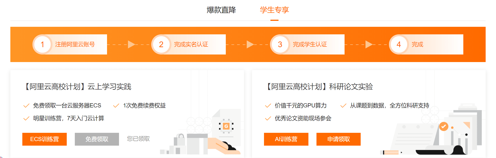
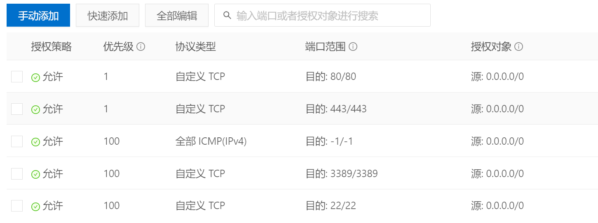
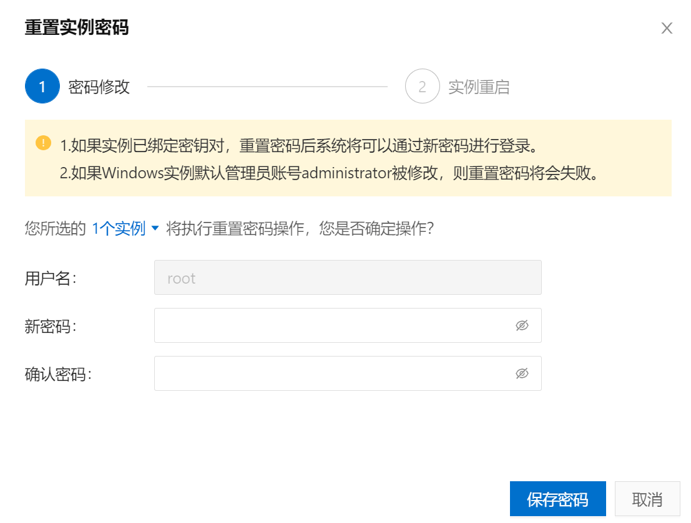
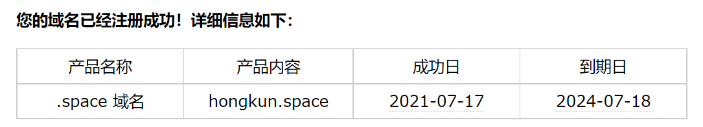
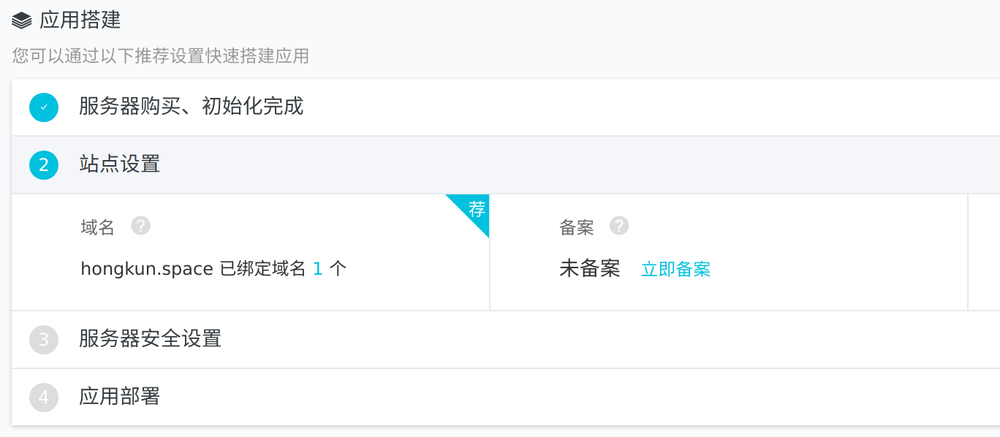
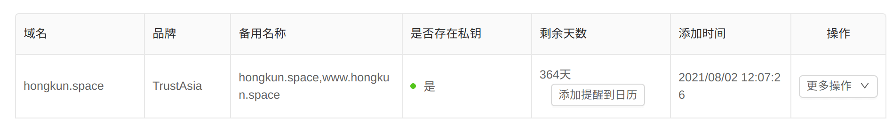
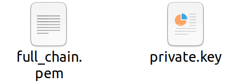
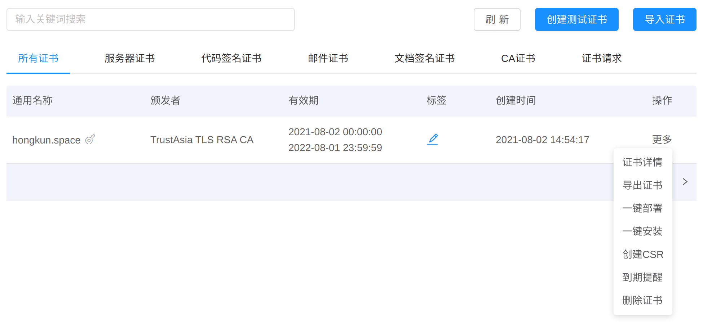
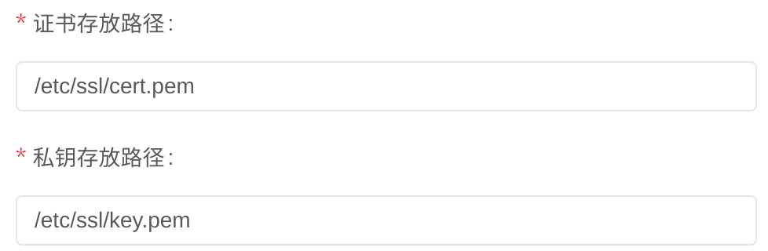

# 阿里云服务器ECS

参考链接：

[狂神说_bilibili](https://www.bilibili.com/video/BV177411K7bH)

官方链接：

[阿里云开发者成长计划](https://developer.aliyun.com/plan/grow-up)

[ECS训练营](https://developer.aliyun.com/adc/student?spm=a2c6h.19776329.J_4403085560.4.658b3d804yW1UU#J_3120529270)

[云服务器ECS](https://www.aliyun.com/product/ecs?spm=5176.224200.J_8058803260.52.1401586cYUB7hI)

## 学生机

如果是学生/新用户，一定要去看看有哪些优惠，比如[阿里云开发者成长计划](https://developer.aliyun.com/plan/grow-up)。此刻阿里云提供的学生优惠是免费使用2个月的服务器资源。如果购买的话，一个1核2G的服务器就足够了



## 设置安全组

进入控制台开启端口，否则外部无法访问。除了默认的三个端口，通过“快速添加”，我再添加了 http(80) & https(443) 两个端口。由于现在我对计算机网络一窍不通，所以先就这样吧



## 重置实例密码

修改密码之后实例就会自动重启

然后就可以通过 `ssh root@ip` 连接到服务器，其中 ip 是你服务器的公网 ip



## Enjoy

之后就可以像操作 Linux 一样，操作自己的服务器啦！

## 将博客部署到服务器上

几个参考教程：[阿里云教程](https://developer.aliyun.com/article/775005) [csdn 教程](https://blog.csdn.net/weixin_41154636/article/details/99685965) [腾讯云教程](https://cloud.tencent.com/developer/article/1632020) [知乎教程](https://zhuanlan.zhihu.com/p/120743882)

在开始之前，先根据之前的 Linux 安装教程简单设置一下自己的服务器：添加新用户，更改主机名

现在本地配置好 hexo 环境，具体配置过程在之前的博客有详细记录

### 在服务器上安装 git

```shell
sudo yum install -y git
# 安装成功后查看 git version
git --version 
git version 2.27.0
```

因为之前在 Ubuntu 上使用的是 apt 包管理，在 CentOS 上则换为 yum 包管理。我试验了一下，如果不加 sudo 是不能下载成功的

```shell
Error: This command has to be run under the root user.
```

所以我认为 yum 和 apt 一样需要 sudo 权限

### 安装 nginx

什么是 nginx？下面是官网描述

> NGINX is a high‑performance, highly scalable, highly available web server, reverse proxy server, and web accelerator (combining the features of an HTTP load balancer, content cache, and more).

在我理解看来，部署网站的过程中 nginx 就是用来提供网页服务的服务器。这里就要更进一步理解什么是广义上的服务器

> 从广义上讲，服务器是指网络中能对其它机器提供某些服务的计算机系统。从狭义上讲，服务器是专指某些高性能计算机，能通过网络，对外提供服务。

使用以下命令安装

```shell
sudo yum install -y nginx
```

### 建立 git 仓库

Hexo 可以使用 git 来部署，这样每次写完之后就都可以使用git来一键部署了，比较方便。我们先为系统添加一个 git 用户

```shell
useradd -m git # 添加一个新用户
passwd git # 设置git用户密码
su git # 切换用户进行后续操作
cd /home/git/
mkdir -p projects/blog # 把项目目录建立起来
mkdir repos && cd repos
git init --bare blog.git # 创建仓库
cd blog.git/hooks
vim post-receive # 创建一个钩子
```

post-receive文件的内容如下：

```shell
#!/bin/sh
git --work-tree=/home/git/projects/blog --git-dir=/home/git/repos/blog.git checkout -f
```

给 post-receive 添加执行权限

```shell
chmod +x post-receive
```

git init --bare 和 git init 有什么区别？ [csdn 链接](https://blog.csdn.net/sinat_34349564/article/details/52487860)

hooks有什么作用？ [csdn 链接](https://blog.csdn.net/weixin_41154636/article/details/99685965)

该钩子的意思是当本地有提交到服务器时，会将文件放在/home/hexo下

`-f`这个参数如果在多人协作的博客中可能会引发不好的结果，因为他是强制更新的意思，会将本地版本覆盖掉远程服务器的版本，但是是个人的博客系统就无所谓了

### 将公钥配置到服务器上

可以通过建立SSH信任关系，来免去登陆服务器时输入密码的步骤

```shell
ssh-copy-id -i ~/.ssh/id_rsa.pub git@server_ip
```

我尝试了一下自己手动复制 id_rsa.pub 到 authorized_keys 文件中，但是不能实现免密登陆，可能时复制时的字符串出现了问题，之前在 github 时也遇到了类似问题，直接复制公钥无法识别的情况

### 更改 git 用户默认 shell

为了安全，我们最好禁用 git 用户的 shell 登录权限。从而只能用 git clone，git push 等 git 操作访问服务器

```shell
cat /etc/shells # 查看 git-shell 是否在登录方式里面
which git-shell # 找到git-shell的路径，记下来
sudo vim /etc/shells # 把 git-shell 路径添加到文件末尾
```

然后更改 git 用户 shell

```shell
sudo vim /etc/passwd
# 将原来的 /bin/bash 改为 /usr/bin/git-shell
# git:x:1001:1001::/home/git:/usr/bin/git-shell
```

 这样当你再次用 ssh 连接 git 用户时就会出现以下信息

```shell
fatal: Interactive git shell is not enabled.
hint: ~/git-shell-commands should exist and have read and execute access.
Connection to your_ip closed.
```

### 部署上线

我们修改**本地** hexo 配置文件 _config.yml

```yaml
deploy:
  type: git
  repo: git@your_ip:/home/git/repos/blog.git
# repo: git@github.com:name/name.github.io.git
  branch: master
```

配置好后就是 hexo 三连一键部署：`hexo clean && hexo g && hexo d`

### 配置 nginx

```shell
cd /etc/nginx
cp nginx.conf nginx_backup.conf # 备份配置文件
vim nginx.conf
```

有两个需要修改的地方：

1. 开头的 `user nginx` 要改为 `user root` 

2. server 部分

   ```nginx
    server{
            listen       80; #监听80端口
            server_name 139.159.245.212; #你的服务器名，通常是域名，如果是域名，你就需要监听80端口
            root       /home/git/projects/blog; #网站的根目录
            location / {
            }
   ```

配置好后 `nginx -s reload` 重新加载配置信息，如果是第一次进行加载，则还需要先运行命令 `nginx -c /etc/nginx/nginx.conf`

现在你就可以通过 ip 地址访问你的网页啦！

我发现由于我的网站封面太大(有6M)，打开时加载比较慢。所以我需要压缩一下封面图片的大小，推荐两个压缩图片网站

https://compressjpeg.com/

https://tinypng.com/

## 域名

什么是域名？参考链接：[CodeSheep bilibili](https://www.bilibili.com/video/BV1kE411i7Jo?from=search&seid=2556702162224412196)

建议阅读官方文档：[阿里云域名服务](https://help.aliyun.com/product/35473.html?spm=a2c4g.11186623.6.540.5b09689epNroGg) [什么是阿里云域名服务](https://help.aliyun.com/document_detail/61257.html?spm=a2c4g.11174283.2.6.36904c070bCdBM)

根据官方文档 [注册通用域名](https://help.aliyun.com/document_detail/54068.htm?spm=a2c4g.11186623.2.13.5ff0689efHL52u#task-1830383)，花费79元巨资注册了3年域名 hongkun.space



完成购买过后还需要进行：

1. [实名认证](https://help.aliyun.com/document_detail/35881.htm?spm=a2c4g.11186623.2.14.275a689e1pnnCW#concept-uhk-w5v-12b)：一般3天左右审核通过
2. [域名备案](https://beian.aliyun.com/pcContainer/formpage?page=selfBa&pageAction=init&orderType=100)：初审1-2天，完整备案审核过程大概十多天

注意需要先进行实名认证，然后才能完成备案

这里我还遇到一个问题，我通过学生优惠免费领取的服务器不能进行域名备案，因为至少需要有3个月的服务器使用权才能备案。看来还是得自己购买一个服务器，我再次花费巨资96元（新用户优惠）购买了一年的轻量应用服务器

### 轻量应用服务器

[轻量应用服务器](https://www.aliyun.com/product/swas?spm=5176.8789780.J_8058803260.52.578945b5xsNx3V)有单独的[控制台](https://account.aliyun.com/login/login.htm?spm=5176.161059.J_5253785160.3.2c9ea505nvWZQs&oauth_callback=https%3A%2F%2Fswas.console.aliyun.com%2F%3Fspm%3D5176.161059.J_835498.2.3e9f7fdaKmYuj7&lang=zh#/servers)，用来部署网站性价比非常不错，配置过程和上面的云服务器一样

在轻量应用服务器的控制台中，域名解析和备案就在概览页面当中，根据流程进行即可



## 部署 SSL 证书 (https)

网站现在可以访问了，但是如下图可见，登陆网站会提示 **Not Secure!!!**


这可不能忍，于是我根据 [CSDN 教程](https://blog.csdn.net/qq_33505555/article/details/106046616) 给阿里云服务器配置 SSL 证书，使用的是 FreeSSL 一个提供免费 https 证书申请的网站

### 使用 FreeSSL 申请证书

老规矩，先看看 [官网教程](https://blog.freessl.cn/tag/ssl-apply/)

1. 生成 CSR [什么是 CSR ? 腾讯云文档](https://cloud.tencent.com/document/product/400/5367)

   教程中推荐使用 Keymanager 生成

2. 在阿里云服务器中配置 DNS 解析，并对配置进行检测和验证

   验证成功后可以在 FreeSSL 控制台中查看证书

   

   在“更多操作”中可以下载证书，一个 pem 文件，一个 private.key

   

3. 然后将证书 .pem 文件导入到 keymanager 中

   

4. 进行一键部署。基于你自己的框架，选择不同的部署方法，我选择部署到 Nginx 上。这里的“一键部署”实质上就是上传你的证书到服务器上

   

   部署成功过后，使用 [myssl.com ](https://myssl.com/) 检查网站的安全性。但是如果你的 Nginx 配置不对的话，

5. 配置 Nginx

   现在我们希望通过 https 443 端口来打开网站，与之前监听 http 80 端口，我们监听 443 端口，然后将 80 端口重定向

   ```nginx
     server {
           #listen 80;
           listen 443;
           ssl on;
           ssl_certificate /etc/ssl/cert.pem;
           ssl_certificate_key /etc/ssl/key.pem;
           server_name  hongkun.space;
           root         /home/git/blog;
       	...
       }
       server {
           listen 80;
           server_name hongkun.space
           # permenant redirect to https
           return 301 https://hongkun.space$request_uri;
       }
   ```

   配置好过后重启 `nginx -s reload`

6. 现在访问网站，旁边就有高贵的:lock:

   

   部署成功过后，还可以使用 [myssl.com ](https://myssl.com/) 检查网站的安全性

