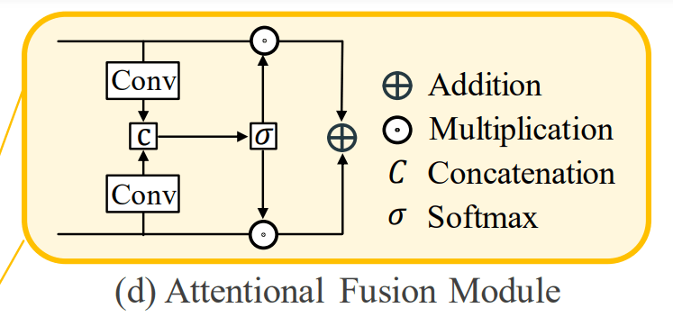
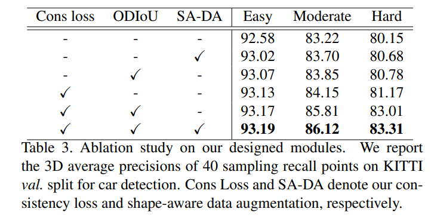

# Experiments

## 两阶段

###  Voxel RCNN

Car AP_R40@0.70, 0.70, 0.70:
bbox AP:98.6838, 94.9714, 94.5734
bev  AP:95.4932, 91.3593, 90.7081
**3d   AP:92.2776, 85.2507, 82.8455**
aos  AP:98.65, 94.83, 94.37

### Aux RCNN

3d   AP:92.5166, 85.3168, 82.7826

### 辅助任务 point to boundary

Car AP_R40@0.70, 0.70, 0.70:
bbox AP:99.0885, 94.9660, 94.5484
bev  AP:**96.0193**, 91.5175, 91.0261
3d   AP:92.6725, 85.2775, 82.8658
aos  AP:**99.05**, 94.81, 94.33

对于 bev 和 aos 任务的简单目标有所提升

## 单阶段

### Second light baseline

Car AP_R40@0.70, 0.70, 0.70:
bbox AP:97.9217, 94.8273, 93.8639
bev  AP:94.3289, 90.5105, 88.0537
**3d   AP:91.2898, 82.2102, 80.6642**
aos  AP:97.90, 94.71, 93.63

### Aux SSD

相比 baseline 没有提升

Car AP_R40@0.70, 0.70, 0.70:
bbox AP:96.0987, 94.5760, 92.0079
bev  AP:92.7582, 90.4592, 87.9560
**3d   AP:90.7960, 82.2038, 79.0885**
aos  AP:96.08, 94.48, 91.84

### Aux Task cls

牺牲效率，使用独立的 channel 去完成辅助任务。仅加入分类辅助任务时效果最好，超过 baseline 0.3%

bbox_max: [98.397, 94.9759, 93.8435]

bev_max: [94.8694, 91.0347, 89.5974]

**3d_max: [91.5534, 82.5279, 79.4576]**

aos_max: [98.37, 94.84, 93.63]

加入回归任务后，效果降低。对于 bev 和 aos 的简单任务都有提升

3d_max: [91.5878, 82.2747, 79.1748]

### 调整 post processing 参数

调整后处理超参数 score_thresh：0.1 -> 0.3，有明显的提升。更改后辅助网络 Aux SSD 仍没有超越 baseline

Car AP_R40@0.70, 0.70, 0.70:
bbox AP:96.6938, 95.5150, 92.8741
bev  AP:93.2652, 91.1586, 88.6616
**3d   AP:91.7329, 82.7856, 79.8036**
aos  AP:96.68, 95.39, 92.67

## 尝试使用 attention

### 简单复现

效果比 baseline 82.88 更差了

Car AP_R40@0.70, 0.70, 0.70:
bbox AP:96.5706, 95.3962, 92.8516
bev  AP:92.9648, 89.1376, 88.4450
**3d   AP:89.3462, 82.1915, 79.2426**
aos  AP:96.56, 95.26, 92.65

### 启发：使用更深的 backbone 网络

效果有所提升达到了与 second baseline 相同的效果，距离论文中的 83.22% 效果仍有 0.5% 的差距，原因可能来自于参数初始化（待验证）

Car AP_R40@0.70, 0.70, 0.70:
bbox AP:96.7290, 95.6147, 92.8696
bev  AP:92.9110, 89.1837, 88.3808
**3d   AP:91.2990, 82.7279, 79.7193**
aos  AP:96.72, 95.52, 92.71

## 总结

1. **post processing 超参数对于网络表现有较大影响**
2. **backbone 需要更深层的网络以提取更好的特征**（导致辅助网络无法超越 baseline 的主要原因）

## TODO

1. **在辅助网络中使用更深的 backbone，获得优于 baseline 的表现模型**
2. **将两阶段的预测结果作为 soft target 计算一致损失**
3. 尝试更快速的 pillars 作为 backbone

## 加深结果

Car AP_R40@0.70, 0.70, 0.70:
bbox AP:96.7281, 95.5430, 92.8340
bev  AP:93.3386, 89.2946, 88.4235
3d   AP:92.1778, 82.9362, 79.8330
aos  AP:96.71, 95.44, 92.66

调整了初始化又增加了一点

Car AP_R40@0.70, 0.70, 0.70:
bbox AP:96.5931, 95.4757, 92.8139
bev  AP:93.4782, 91.5599, 88.9915
3d   AP:91.8384, 83.0566, 80.0839
aos  AP:96.58, 95.35, 92.62

现在又发现了一个问题...CIA-SSD 根本没有使用它代码里的初始化函数。所以可能以上的结果都不太好说明

**策略：先重点完成两阶段的功能以及 ODIoU 损失的测试**

优先选用辅助网络作为 backbone，使用端到端的训练方式

# Experiment results

## AuxSSD cls

bbox_max: [98.5645, 94.9341, 92.3461]

bev_max: [94.6285, 90.8081, 88.267]

3d_max: [91.2572, 82.1198, 79.1106]

aos_max: [98.52, 94.77, 92.12]

## AuxTask cls

bbox_max: [98.397, 94.9759, 93.8435]

bev_max: [94.8694, 91.0347, 89.5974]

3d_max: [91.5534, 82.5279, 79.4576]

aos_max: [98.37, 94.84, 93.63]

## AuxTask cls (detached)

bbox_max: [98.4918, 94.7834, 92.1996]

bev_max: [95.0803, 90.724, 88.1854]

3d_max: [91.7286, 82.3107, 79.307]

aos_max: [98.42, 94.6, 91.92]

## AuxTask cls reg

bbox_max: [98.4983, 94.9013, 93.3837]

bev_max: [95.2527, 90.7908, 88.3979]

3d_max: [91.5878, 82.2747, 79.1748]

aos_max: [98.46, 94.71, 93.15]

## AuxTask cls reg seperate channels (detached)

bbox_max: [98.0956, 94.9911, 93.8856]

bev_max: [95.0537, 90.8672, 88.2496]

3d_max: [91.5508, 82.477, 79.3123]

aos_max: [98.02, 94.83, 93.62]

## AuxTask cls reg seperate channels

bbox_max: [98.2469, 94.7602, 92.1562]

bev_max: [94.5679, 90.5397, 87.9908]

3d_max: [91.4427, 82.2415, 79.1425]

aos_max: [98.1, 94.59, 91.92]

## AuxTask cls reg seperate double 1x1

bbox_max: [98.304, 95.1231, 93.9537]

bev_max: [95.0014, 90.7448, 88.1211]

3d_max: [91.5969, 82.0603, 78.8603]

aos_max: [98.26, 94.98, 93.7]

## AuxSSD light

bbox_max: [98.9202, 95.5083, 92.933]

bev_max: [95.5428, 91.2985, 88.7646]

3d_max: [91.9704, 82.7484, 79.7442]

aos_max: [98.88, 95.37, 92.73]

## AuxSSD light

bbox_max: [98.1615, 94.6858, 93.6091]

bev_max: [94.4515, 90.6882, 88.3672]

3d_max: [91.1519, 82.2971, 79.1066]

aos_max: [98.13, 94.58, 93.39]

bad version

bbox_max: [98.4793, 95.0451, 93.6596]

bev_max: [94.5261, 90.4346, 87.8574]

3d_max: [91.3269, 81.9187, 78.8315]

aos_max: [98.44, 94.9, 93.41]

worse version

bbox_max: [98.1508, 94.7455, 93.2874]

bev_max: [94.7739, 90.3371, 88.1539]

3d_max: [91.0923, 82.0935, 79.0342]

aos_max: [98.07, 94.59, 93.03]

## AuxSSD second official

bbox_max: [98.9265, 95.5103, 92.9056]

bev_max: [95.506, 91.6164, 88.9618]

3d_max: [91.9073, 82.8771, 79.8777]

aos_max: [98.88, 95.38, 92.7]

## AuxSSD p2b cls

bbox_max: [98.2223, 94.7432, 93.4867]

bev_max: [94.99, 91.0292, 88.3222]

3d_max: [91.3235, 82.1279, 78.9955]

aos_max: [98.18, 94.6, 93.23]

## AuxSSD p2b

bbox_max: [98.2791, 94.7361, 93.6735]

bev_max: [95.0461, 91.0435, 88.2551]

3d_max: [91.3133, 82.0138, 79.0973]

aos_max: [98.23, 94.57, 93.43]

## VoxelRCNN

bbox_max: [99.175, 94.8766, 94.4535]

bev_max: [95.9825, 91.22, 90.7259]

3d_max: [92.6991, 85.1862, 82.7573]

aos_max: [99.14, 94.75, 94.25]

## SECOND light

bbox_max: [97.9683, 93.7844, 92.4294]

bev_max: [94.1153, 89.3004, 86.7583]

3d_max: [89.9025, 80.9161, 77.7502]

aos_max: [97.94, 93.66, 92.23]

## SECOND official

bbox_max: [98.0778, 94.4803, 91.9423]

bev_max: [94.7366, 90.2454, 87.7872]

3d_max: [90.4633, 81.657, 78.7141]

aos_max: [97.96, 94.33, 91.7]

# NaN situation

没有 detach 会出现下面的报警

WARNING:root:NaN or Inf found in input tensor.

使用 BN & relu 出现了 3 次，不使用出现了 9 次

在使用 pointpillars 也出现了上述情况，是来自于自己写的 precision recall 函数，并不是所说的梯度爆炸。可能要重新 train 一下
