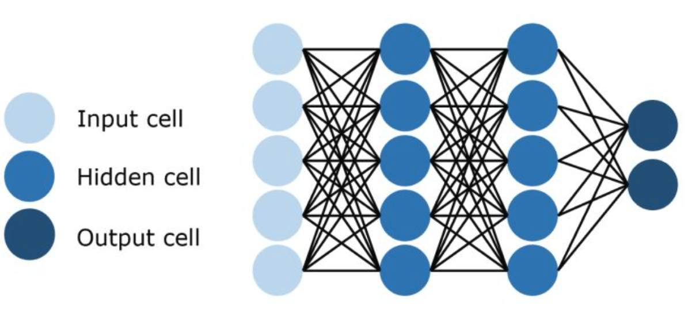
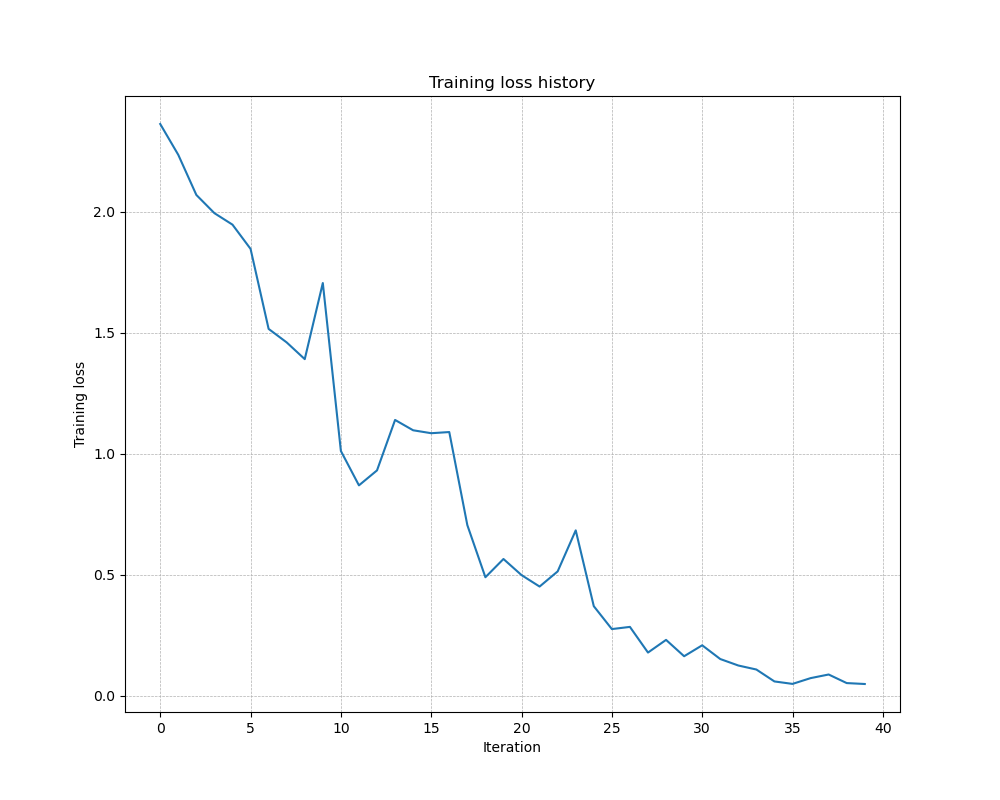

# 应用软件开发基础论文报告

### ——Python numpy实习报告 (以前馈神经网络为例)

## 选题背景

**深度前馈网络（deep feed-forward network）**也叫作**前馈神经网络（feed-forward neural network）**或者**多层感知机（multilayer perceptron, MLP）**，是典型的深度学习模型。前馈网络的目标是近似某个函数。例如，对于分类器，$y = f (x)$ 将输入 x 映射到一个类别 y。前馈网络定义了一个映射 $y = f(x; θ)$，并且学习参数 θ 的值，使它能够得到最佳的函数近似。

这种模型被称为前向（feed-forward）的，是因为信息流过 x 的函数，流经用于 定义 f 的中间计算过程，最终到达输出 y。在模型的输出和模型本身之间没有反馈连接接。

前馈神经网络被称作**全连接网络（fully connected network）**是因为它们通常用许多不同函数复合在一起来表示。该模型与一个有向无环图相关联，而图描述了函数是如何复合在一起的。例如，我们有三个函数 $f_1, f_2, f_3$ 连接在一个链上以形成 
$$
f(x) = f_3(f_2(f_1(x)))
$$
这些链式结构是神经网络中最常用的结构。链的全长称为模型的**深度（depth）**。正是因为这个术语才出现了 ‘‘深度学习’’ 这个名字。

前馈神经网络在深度学习中扮演者非常重要的角色，是深度学习发展的基石。现在人们已经发展出了一些强大的深度学习框架，例如 TensorFlow, Pytorch 等等，在这些框架之上，能够方便地搭建各种各样的复杂网络，加速了深度学习的发展。前馈神经网络在这些框架之中也封装得非常好，可以用几行代码就可以轻松实现，本报告的主要目的在于使用 python 第三方库 numpy 来实现全连接网络的建立、优化等等，自下而上地深入地了解前馈神经网络的搭建过程及其工作原理。

## 原理

全连接网络可以分为三个部分：输入层、隐藏层、输出层。网络中的每个隐藏层通常都是向量值的。这些隐藏层的维数决定了模型的**宽度 （width）**。向量的每个元素都可以被视为起到类似一个神经元的作用。除了将层想象成向量到向量的单个函数，我们也可以把层想象成由许多并行操作的**单元（unit）** 组成，每个单元表示一个向量到标量的函数。

现代的神经网络研究受到更多的是来自许多数学和工程学科的指引，并且神经网络的目 标并不是完美地给大脑建模。**我们最好将前馈神经网络想成是为了实现统计泛化而设计出的函数近似机，它偶尔从我们了解的大脑中提取灵感，但并不是大脑功能的模型**。



由于线性模型有明显的缺陷，即模型的能力被局限在线性函数里，所以它无法理解任何两个输入变量间的相互作用。为了扩展线性模型来表示 x 的非线性函数，我们可以不把线性模型用于 x 本身， 而是用在一个变换后的输入 ϕ(x) 上，这里 **ϕ 是一个非线性变换**。我们可以认为 ϕ 提供了一组描述 x 的特征，或者认为它提供了 x 的一个新的表示。

深度学习的策略是去学习 ϕ。在这种方法中，我们有一个模型 y = f(x; θ, w) = ϕ(x; θ) ⊤w。我们现在有两种参数：用于从一大类函数中学习 ϕ 的参数 θ，以及用于将 ϕ(x) 映射到所需的输出的参数 w。这是深度前馈网络的一个例子，**其中 ϕ 定义了一个隐藏层**。这是种方法放弃了训练问题的凸性的， 但是利大于弊。

神经网络的非线性导致大多数我们感兴趣的代价函数都变得非凸，这意味着神经网络的训练通常使用迭代的、基于梯度的优化，仅仅使得代价函数达到一个非常小的值。和其他的机器学习模型一样，为了使用基于梯度的学习方法我们必须选择一个代价函数，并且我们必须选择如何表示模型的输出。

## 历史和分类

深度学习（Deep Learning）一词最初在 **1986** 被引入机器学习（Machine Learning），后来在 2000 年时被用于**人工神经网络（ANN**）。深度神经网络由多个隐层组成，以学习具有多个抽象层次的数据特征。深度学习方法允许计算机通过相对简单的概念来学习复杂的概念。对于人工神经网络（ANN），深度学习（DL）（也称为分层学习（Hierarchical Learning）），为了学习复杂的功能，深层的架构被用于多个抽象层次，即非线性操作。用准确的话总结就是，**深度学习是机器学习的一个子领域，它使用了多层次的非线性信息处理和抽象，用于有监督、无监督、半监督、自监督、弱监督等的特征学习、表示、分类、回归和模式识别等**。

**第一代**人工神经网络由简单的感知器神经层组成（也就是感知器），只能进行有限的简单计算。**第二代**使用反向传播，反向传播算法的核心算法是用链式求导法则，即目标函数对于输出层的导数（或梯度），通过该层向前一层求导实现，如此递延一直传递到第一层（输入层）。最后将特征传递给一个非线性激活函数，可以得到分类的结果。为了克服反向传播中出现的梯度消失和梯度爆炸等局限性，人们提出了受限玻尔兹曼机（RBM），使学习更容易。此时其他技术和神经网络也出现了，如前馈神经网络 (FNN)、卷积神经网络 (CNN)、循环神经网络 (RNN) 等，以及深层信念网络、自编码器、GAN等。从那时起，为实现各种用途，ANN 在不同方面得到了改进和设计。

## 案例实战

### main.py

```python
""" Fully-Connected Neural Network """
import time
import numpy as np
import matplotlib.pyplot as plt
from FCN.classifiers.fc_net import *
from FCN.data_utils import get_CIFAR10_data
from FCN.gradient_check import eval_numerical_gradient, eval_numerical_gradient_array
from FCN.solver import Solver

plt.rcParams['figure.figsize'] = (10.0, 8.0)  # set default size of plots
plt.rcParams['image.interpolation'] = 'nearest'
plt.rcParams['image.cmap'] = 'gray'


def rel_error(x, y):
    """ returns relative error """
    return np.max(np.abs(x - y) / (np.maximum(1e-8, np.abs(x) + np.abs(y))))


# load CIFAR10 data
data = get_CIFAR10_data()
for k, v in list(data.items()):
    print(('%s: ' % k, v.shape))


# Affine layer forward

num_inputs = 2
input_shape = (4, 5, 6)
output_dim = 3

input_size = num_inputs * np.prod(input_shape)
weight_size = output_dim * np.prod(input_shape)

x = np.linspace(-0.1, 0.5, num=input_size).reshape(num_inputs, *input_shape)
w = np.linspace(-0.2, 0.3, num=weight_size).reshape(np.prod(input_shape), output_dim)
b = np.linspace(-0.3, 0.1, num=output_dim)

out, _ = affine_forward(x, w, b)
correct_out = np.array([[ 1.49834967,  1.70660132,  1.91485297],
                        [ 3.25553199,  3.5141327,   3.77273342]])

# Compare your output with ours. The error should be around 1e-9.
print('Testing affine_forward function:')
print('difference: ', rel_error(out, correct_out))
print("--------------------------------------------------------")

# Affine layer backward
x = np.random.randn(10, 2, 3)
w = np.random.randn(6, 5)
b = np.random.randn(5)
dout = np.random.randn(10, 5)

dx_num = eval_numerical_gradient_array(lambda x: affine_forward(x, w, b)[0], x, dout)
dw_num = eval_numerical_gradient_array(lambda w: affine_forward(x, w, b)[0], w, dout)
db_num = eval_numerical_gradient_array(lambda b: affine_forward(x, w, b)[0], b, dout)

_, cache = affine_forward(x, w, b)
dx, dw, db = affine_backward(dout, cache)

# The error should be around 1e-10
print('Testing affine_backward function:')
print('dx error: ', rel_error(dx_num, dx))
print('dw error: ', rel_error(dw_num, dw))
print('db error: ', rel_error(db_num, db))
print("--------------------------------------------------------")

# Test the relu_forward/backward function

x = np.linspace(-0.5, 0.5, num=12).reshape(3, 4)

out, _ = relu_forward(x)
correct_out = np.array([[ 0.,          0.,          0.,          0.,        ],
                        [ 0.,          0.,          0.04545455,  0.13636364,],
                        [ 0.22727273,  0.31818182,  0.40909091,  0.5,       ]])

# Compare your output with ours. The error should be around 1e-8
print('Testing relu_forward function:')
print('difference: ', rel_error(out, correct_out))
print("--------------------------------------------------------")
x = np.random.randn(10, 10)
dout = np.random.randn(*x.shape)

dx_num = eval_numerical_gradient_array(lambda x: relu_forward(x)[0], x, dout)

_, cache = relu_forward(x)
dx = relu_backward(dout, cache)

# The error should be around 1e-12
print('Testing relu_backward function:')
print('dx error: ', rel_error(dx_num, dx))
print("--------------------------------------------------------")

# "Sandwich" layers: affine-relu-forward
from FCN.layer_utils import affine_relu_forward, affine_relu_backward

x = np.random.randn(2, 3, 4)
w = np.random.randn(12, 10)
b = np.random.randn(10)
dout = np.random.randn(2, 10)

out, cache = affine_relu_forward(x, w, b)
dx, dw, db = affine_relu_backward(dout, cache)

dx_num = eval_numerical_gradient_array(lambda x: affine_relu_forward(x, w, b)[0], x, dout)
dw_num = eval_numerical_gradient_array(lambda w: affine_relu_forward(x, w, b)[0], w, dout)
db_num = eval_numerical_gradient_array(lambda b: affine_relu_forward(x, w, b)[0], b, dout)

print('Testing affine_relu_forward:')
print('dx error: ', rel_error(dx_num, dx))
print('dw error: ', rel_error(dw_num, dw))
print('db error: ', rel_error(db_num, db))
print("--------------------------------------------------------")

# softmax loss
num_classes, num_inputs = 10, 50
x = 0.001 * np.random.randn(num_inputs, num_classes)
y = np.random.randint(num_classes, size=num_inputs)
dx_num = eval_numerical_gradient(lambda x: softmax_loss(x, y)[0], x, verbose=False)
loss, dx = softmax_loss(x, y)

# Test softmax_loss function. Loss should be 2.3 and dx error should be 1e-8
print('Testing softmax_loss:')
print('loss: ', loss)
print('dx error: ', rel_error(dx_num, dx))
print("--------------------------------------------------------")

# Initial Loss and Gradient Check
np.random.seed(231)
N, D, H1, H2, C = 2, 15, 20, 30, 10
X = np.random.randn(N, D)
y = np.random.randint(C, size=(N,))

for reg in [0, 3.14]:
    print("Running check with reg = ", reg)
    model = FullyConnectedNet(
        [H1, H2],
        input_dim=D,
        num_classes=C,
        reg=reg,
        weight_scale=5e-2,
        dtype=np.float64
    )

    loss, grads = model.loss(X, y)
    print("Initial loss: ", loss)

    # Most of the errors should be on the order of e-7 or smaller.
    # NOTE: It is fine however to see an error for W2 on the order of e-5
    # for the check when reg = 0.0
    for name in sorted(grads):
        f = lambda _: model.loss(X, y)[0]
        grad_num = eval_numerical_gradient(f, model.params[name], verbose=False, h=1e-5)
        print(f"{name} relative error: {rel_error(grad_num, grads[name])}")
print("--------------------------------------------------------")

# Use a three-layer Net to overfit 50 training examples
print('Overfit 50 training examples')
num_train = 50
small_data = {
  "X_train": data["X_train"][:num_train],
  "y_train": data["y_train"][:num_train],
  "X_val": data["X_val"],
  "y_val": data["y_val"],
}

weight_scale = 1e-2   # Experiment with this!
learning_rate = 8e-3  # Experiment with this!
model = FullyConnectedNet(
    [100, 100],
    weight_scale=weight_scale,
    dtype=np.float64
)
solver = Solver(
    model,
    small_data,
    print_every=10,
    num_epochs=20,
    batch_size=25,
    update_rule="sgd",
    optim_config={"learning_rate": learning_rate},
)
solver.train()

plt.plot(solver.loss_history)
plt.title("Training loss history")
plt.xlabel("Iteration")
plt.ylabel("Training loss")
plt.grid(linestyle='--', linewidth=0.5)
plt.show()
print("--------------------------------------------------------")

# Train a Model
print('Train a 6 layer model')
learning_rate = 1e-4
weight_scale = 1e-2
model = FullyConnectedNet(
    [256, 256, 128, 128, 64],
    weight_scale=weight_scale,
    dtype=np.float64
)
solver = Solver(
    model,
    data,
    print_every=1000,
    num_epochs=30,
    batch_size=25,
    update_rule='adam',
    optim_config={'learning_rate': learning_rate},
)
solver.train()

plt.plot(solver.loss_history)
plt.title('Training loss history')
plt.xlabel('Iteration')
plt.ylabel('Training loss')
plt.grid(linestyle='--', linewidth=0.5)
plt.show()

```

### fc_net.py

```python
from builtins import range
from builtins import object
import numpy as np
from ..layers import *
from ..layer_utils import *


class FullyConnectedNet(object):
    """Class for a multi-layer fully connected neural network.

    Network contains an arbitrary number of hidden layers, ReLU nonlinearities,
    and a softmax loss function. This will also implement dropout and batch/layer
    normalization as options. For a network with L layers, the architecture will be

    {affine - [batch/layer norm] - relu - [dropout]} x (L - 1) - affine - softmax

    where batch/layer normalization and dropout are optional and the {...} block is
    repeated L - 1 times.

    Learnable parameters are stored in the self.params dictionary and will be learned
    using the Solver class.
    """

    def __init__(
        self,
        hidden_dims,
        input_dim=3 * 32 * 32,
        num_classes=10,
        dropout_keep_ratio=1,
        normalization=None,
        reg=0.0,
        weight_scale=1e-2,
        dtype=np.float32,
        seed=None,
    ):
        """Initialize a new FullyConnectedNet.

        Inputs:
        - hidden_dims: A list of integers giving the size of each hidden layer.
        - input_dim: An integer giving the size of the input.
        - num_classes: An integer giving the number of classes to classify.
        - dropout_keep_ratio: Scalar between 0 and 1 giving dropout strength.
            If dropout_keep_ratio=1 then the network should not use dropout at all.
        - normalization: What type of normalization the network should use. Valid values
            are "batchnorm", "layernorm", or None for no normalization (the default).
        - reg: Scalar giving L2 regularization strength.
        - weight_scale: Scalar giving the standard deviation for random
            initialization of the weights.
        - dtype: A numpy datatype object; all computations will be performed using
            this datatype. float32 is faster but less accurate, so you should use
            float64 for numeric gradient checking.
        - seed: If not None, then pass this random seed to the dropout layers.
            This will make the dropout layers deteriminstic so we can gradient check the model.
        """
        self.normalization = normalization
        self.use_dropout = dropout_keep_ratio != 1
        self.reg = reg
        self.num_layers = 1 + len(hidden_dims)
        self.dtype = dtype
        self.params = {}
        layer_input_dim = input_dim
        for i, hd in enumerate(hidden_dims):
            self.params['W%d' % (i+1)] = weight_scale * np.random.randn(layer_input_dim, hd)
            self.params['b%d' % (i+1)] = weight_scale * np.zeros(hd)
            layer_input_dim = hd
        # output layer
        self.params['W%d' % self.num_layers] = weight_scale * np.random.randn(layer_input_dim, num_classes)
        self.params['b%d' % self.num_layers] = weight_scale * np.zeros(num_classes)
        self.dropout_param = {}
        if self.use_dropout:
            self.dropout_param = {"mode": "train", "p": dropout_keep_ratio}
            if seed is not None:
                self.dropout_param["seed"] = seed
        self.bn_params = []
        if self.normalization == "batchnorm":
            self.bn_params = [{"mode": "train"} for i in range(self.num_layers - 1)]
        if self.normalization == "layernorm":
            self.bn_params = [{} for i in range(self.num_layers - 1)]

        # Cast all parameters to the correct datatype.
        for k, v in self.params.items():
            self.params[k] = v.astype(dtype)

    def loss(self, X, y=None):
        """Compute loss and gradient for the fully connected net.
        
        Inputs:
        - X: Array of input data of shape (N, d_1, ..., d_k)
        - y: Array of labels, of shape (N,). y[i] gives the label for X[i].

        Returns:
        If y is None, then run a test-time forward pass of the model and return:
        - scores: Array of shape (N, C) giving classification scores, where
            scores[i, c] is the classification score for X[i] and class c.

        If y is not None, then run a training-time forward and backward pass and
        return a tuple of:
        - loss: Scalar value giving the loss
        - grads: Dictionary with the same keys as self.params, mapping parameter
            names to gradients of the loss with respect to those parameters.
        """
        X = X.astype(self.dtype)
        mode = "test" if y is None else "train"

        # Set train/test mode for batch_norm params and dropout param since they
        # behave differently during training and testing.
        if self.use_dropout:
            self.dropout_param["mode"] = mode
        if self.normalization == "batchnorm":
            for bn_param in self.bn_params:
                bn_param["mode"] = mode
        scores = None
        layer_input = X
        affine_relu_cache = {}
        for i in range(self.num_layers - 1):
            index = i + 1
            w = self.params['W%d' % index]
            b = self.params['b%d' % index]
            layer_input, affine_relu_cache[index] = affine_relu_forward(layer_input, w, b)
        w = self.params['W%d' % self.num_layers]
        b = self.params['b%d' % self.num_layers]
        scores, affine_relu_cache[self.num_layers] = affine_forward(layer_input, w, b)
        # If test mode return early.
        if mode == "test":
            return scores
        loss, grads = 0.0, {}
        loss, dx = softmax_loss(scores, y)
        loss = loss + 0.5 * self.reg * np.sum(self.params['W%d' % self.num_layers] *
                                              self.params['W%d' % self.num_layers])
        # last affine layer back prop
        dx, dw, db = affine_backward(dx, affine_relu_cache[self.num_layers])
        grads['W%d' % self.num_layers] = dw + self.reg * self.params['W%d' % self.num_layers]
        grads['b%d' % self.num_layers] = db
        # hidden layers back prop
        for i in range(self.num_layers - 1):
            index = self.num_layers - 1 - i
            loss = loss + 0.5 * self.reg * np.sum(self.params['W%d' % index] *
                                                  self.params['W%d' % index])
            dx, dw, db = affine_relu_backward(dx, affine_relu_cache[index])
            grads['W%d' % index] = dw + self.reg * self.params['W%d' % index]
            grads['b%d' % index] = db
        return loss, grads

```

### layers.py

```python
from builtins import range
import numpy as np


def affine_forward(x, w, b):
    """Computes the forward pass for an affine (fully connected) layer.

    The input x has shape (N, d_1, ..., d_k) and contains a minibatch of N
    examples, where each example x[i] has shape (d_1, ..., d_k). We will
    reshape each input into a vector of dimension D = d_1 * ... * d_k, and
    then transform it to an output vector of dimension M.

    Inputs:
    - x: A numpy array containing input data, of shape (N, d_1, ..., d_k)
    - w: A numpy array of weights, of shape (D, M)
    - b: A numpy array of biases, of shape (M,)

    Returns a tuple of:
    - out: output, of shape (N, M)
    - cache: (x, w, b)
    """
    out = None
    n_samples = x.shape[0]
    x_ = x.reshape(n_samples, -1)
    out = x_.dot(w) + b
    cache = (x, w, b)
    cache = (x, w, b)
    return out, cache


def affine_backward(dout, cache):
    """Computes the backward pass for an affine (fully connected) layer.

    Inputs:
    - dout: Upstream derivative, of shape (N, M)
    - cache: Tuple of:
      - x: Input data, of shape (N, d_1, ... d_k)
      - w: Weights, of shape (D, M)
      - b: Biases, of shape (M,)

    Returns a tuple of:
    - dx: Gradient with respect to x, of shape (N, d1, ..., d_k)
    - dw: Gradient with respect to w, of shape (D, M)
    - db: Gradient with respect to b, of shape (M,)
    """
    x, w, b = cache
    dx, dw, db = None, None, None
    n_samples = x.shape[0]
    x_ = x.reshape(n_samples, -1)
    dx = (dout.dot(w.T)).reshape(x.shape)
    dw = x_.T.dot(dout)
    db = np.sum(dout, axis=0)
    return dx, dw, db


def relu_forward(x):
    """Computes the forward pass for a layer of rectified linear units (ReLUs).

    Input:
    - x: Inputs, of any shape

    Returns a tuple of:
    - out: Output, of the same shape as x
    - cache: x
    """
    out = None
    out = np.maximum(x, 0)
    cache = x
    return out, cache


def relu_backward(dout, cache):
    """Computes the backward pass for a layer of rectified linear units (ReLUs).

    Input:
    - dout: Upstream derivatives, of any shape
    - cache: Input x, of same shape as dout

    Returns:
    - dx: Gradient with respect to x
    """
    dx, x = None, cache
    index = x > 0
    dx = dout * index
    return dx


def softmax_loss(x, y):
    """Computes the loss and gradient for softmax classification.

    Inputs:
    - x: Input data, of shape (N, C) where x[i, j] is the score for the jth
      class for the ith input.
    - y: Vector of labels, of shape (N,) where y[i] is the label for x[i] and
      0 <= y[i] < C

    Returns a tuple of:
    - loss: Scalar giving the loss
    - dx: Gradient of the loss with respect to x
    """
    loss, dx = None, None
    probs = np.exp(x - np.max(x, axis=1, keepdims=True))
    probs /= np.sum(probs, axis=1, keepdims=True)
    N = x.shape[0]
    loss = -np.sum(np.log(probs[np.arange(N), y])) / N
    dx = probs.copy()
    dx[np.arange(N), y] -= 1
    dx /= N
    return loss, dx


def batchnorm_forward(x, gamma, beta, bn_param):
    """Forward pass for batch normalization.

    During training the sample mean and (uncorrected) sample variance are
    computed from minibatch statistics and used to normalize the incoming data.
    During training we also keep an exponentially decaying running mean of the
    mean and variance of each feature, and these averages are used to normalize
    data at test-time.

    At each timestep we update the running averages for mean and variance using
    an exponential decay based on the momentum parameter:

    running_mean = momentum * running_mean + (1 - momentum) * sample_mean
    running_var = momentum * running_var + (1 - momentum) * sample_var

    Note that the batch normalization paper suggests a different test-time
    behavior: they compute sample mean and variance for each feature using a
    large number of training images rather than using a running average. For
    this implementation we have chosen to use running averages instead since
    they do not require an additional estimation step; the torch7
    implementation of batch normalization also uses running averages.

    Input:
    - x: Data of shape (N, D)
    - gamma: Scale parameter of shape (D,)
    - beta: Shift paremeter of shape (D,)
    - bn_param: Dictionary with the following keys:
      - mode: 'train' or 'test'; required
      - eps: Constant for numeric stability
      - momentum: Constant for running mean / variance.
      - running_mean: Array of shape (D,) giving running mean of features
      - running_var Array of shape (D,) giving running variance of features

    Returns a tuple of:
    - out: of shape (N, D)
    - cache: A tuple of values needed in the backward pass
    """
    mode = bn_param["mode"]
    eps = bn_param.get("eps", 1e-5)
    momentum = bn_param.get("momentum", 0.9)

    N, D = x.shape
    running_mean = bn_param.get("running_mean", np.zeros(D, dtype=x.dtype))
    running_var = bn_param.get("running_var", np.zeros(D, dtype=x.dtype))

    out, cache = None, None
    if mode == "train":
        pass
    elif mode == "test":
        pass
    else:
        raise ValueError('Invalid forward batchnorm mode "%s"' % mode)
    # Store the updated running means back into bn_param
    bn_param["running_mean"] = running_mean
    bn_param["running_var"] = running_var
    return out, cache


def batchnorm_backward(dout, cache):
    """Backward pass for batch normalization.

    For this implementation, you should write out a computation graph for
    batch normalization on paper and propagate gradients backward through
    intermediate nodes.

    Inputs:
    - dout: Upstream derivatives, of shape (N, D)
    - cache: Variable of intermediates from batchnorm_forward.

    Returns a tuple of:
    - dx: Gradient with respect to inputs x, of shape (N, D)
    - dgamma: Gradient with respect to scale parameter gamma, of shape (D,)
    - dbeta: Gradient with respect to shift parameter beta, of shape (D,)
    """
    dx, dgamma, dbeta = None, None, None
    pass
    return dx, dgamma, dbeta


def batchnorm_backward_alt(dout, cache):
    """Alternative backward pass for batch normalization.

    For this implementation you should work out the derivatives for the batch
    normalizaton backward pass on paper and simplify as much as possible. You
    should be able to derive a simple expression for the backward pass.
    See the jupyter notebook for more hints.

    Note: This implementation should expect to receive the same cache variable
    as batchnorm_backward, but might not use all of the values in the cache.

    Inputs / outputs: Same as batchnorm_backward
    """
    dx, dgamma, dbeta = None, None, None
    pass
    return dx, dgamma, dbeta


def layernorm_forward(x, gamma, beta, ln_param):
    """Forward pass for layer normalization.

    During both training and test-time, the incoming data is normalized per data-point,
    before being scaled by gamma and beta parameters identical to that of batch normalization.

    Note that in contrast to batch normalization, the behavior during train and test-time for
    layer normalization are identical, and we do not need to keep track of running averages
    of any sort.

    Input:
    - x: Data of shape (N, D)
    - gamma: Scale parameter of shape (D,)
    - beta: Shift paremeter of shape (D,)
    - ln_param: Dictionary with the following keys:
        - eps: Constant for numeric stability

    Returns a tuple of:
    - out: of shape (N, D)
    - cache: A tuple of values needed in the backward pass
    """
    out, cache = None, None
    eps = ln_param.get("eps", 1e-5)
    pass
    return out, cache


def layernorm_backward(dout, cache):
    """Backward pass for layer normalization.

    For this implementation, you can heavily rely on the work you've done already
    for batch normalization.

    Inputs:
    - dout: Upstream derivatives, of shape (N, D)
    - cache: Variable of intermediates from layernorm_forward.

    Returns a tuple of:
    - dx: Gradient with respect to inputs x, of shape (N, D)
    - dgamma: Gradient with respect to scale parameter gamma, of shape (D,)
    - dbeta: Gradient with respect to shift parameter beta, of shape (D,)
    """
    dx, dgamma, dbeta = None, None, None
    pass
    return dx, dgamma, dbeta


def dropout_forward(x, dropout_param):
    """Forward pass for inverted dropout.

    Note that this is different from the vanilla version of dropout.
    Here, p is the probability of keeping a neuron output, as opposed to
    the probability of dropping a neuron output.
    See http://cs231n.github.io/neural-networks-2/#reg for more details.

    Inputs:
    - x: Input data, of any shape
    - dropout_param: A dictionary with the following keys:
      - p: Dropout parameter. We keep each neuron output with probability p.
      - mode: 'test' or 'train'. If the mode is train, then perform dropout;
        if the mode is test, then just return the input.
      - seed: Seed for the random number generator. Passing seed makes this
        function deterministic, which is needed for gradient checking but not
        in real networks.

    Outputs:
    - out: Array of the same shape as x.
    - cache: tuple (dropout_param, mask). In training mode, mask is the dropout
      mask that was used to multiply the input; in test mode, mask is None.
    """
    p, mode = dropout_param["p"], dropout_param["mode"]
    if "seed" in dropout_param:
        np.random.seed(dropout_param["seed"])

    mask = None
    out = None

    if mode == "train":
        pass
    elif mode == "test":
        pass
    cache = (dropout_param, mask)
    out = out.astype(x.dtype, copy=False)
    return out, cache


def dropout_backward(dout, cache):
    """Backward pass for inverted dropout.

    Inputs:
    - dout: Upstream derivatives, of any shape
    - cache: (dropout_param, mask) from dropout_forward.
    """
    dropout_param, mask = cache
    mode = dropout_param["mode"]

    dx = None
    if mode == "train":
        pass
    elif mode == "test":
        dx = dout
    return dx


def conv_forward_naive(x, w, b, conv_param):
    """A naive implementation of the forward pass for a convolutional layer.

    The input consists of N data points, each with C channels, height H and
    width W. We convolve each input with F different filters, where each filter
    spans all C channels and has height HH and width WW.

    Input:
    - x: Input data of shape (N, C, H, W)
    - w: Filter weights of shape (F, C, HH, WW)
    - b: Biases, of shape (F,)
    - conv_param: A dictionary with the following keys:
      - 'stride': The number of pixels between adjacent receptive fields in the
        horizontal and vertical directions.
      - 'pad': The number of pixels that will be used to zero-pad the input.

    During padding, 'pad' zeros should be placed symmetrically (i.e equally on both sides)
    along the height and width axes of the input. Be careful not to modfiy the original
    input x directly.

    Returns a tuple of:
    - out: Output data, of shape (N, F, H', W') where H' and W' are given by
      H' = 1 + (H + 2 * pad - HH) / stride
      W' = 1 + (W + 2 * pad - WW) / stride
    - cache: (x, w, b, conv_param)
    """
    out = None
    pass
    cache = (x, w, b, conv_param)
    return out, cache


def conv_backward_naive(dout, cache):
    """A naive implementation of the backward pass for a convolutional layer.

    Inputs:
    - dout: Upstream derivatives.
    - cache: A tuple of (x, w, b, conv_param) as in conv_forward_naive

    Returns a tuple of:
    - dx: Gradient with respect to x
    - dw: Gradient with respect to w
    - db: Gradient with respect to b
    """
    dx, dw, db = None, None, None
    pass
    return dx, dw, db


def max_pool_forward_naive(x, pool_param):
    """A naive implementation of the forward pass for a max-pooling layer.

    Inputs:
    - x: Input data, of shape (N, C, H, W)
    - pool_param: dictionary with the following keys:
      - 'pool_height': The height of each pooling region
      - 'pool_width': The width of each pooling region
      - 'stride': The distance between adjacent pooling regions

    No padding is necessary here, eg you can assume:
      - (H - pool_height) % stride == 0
      - (W - pool_width) % stride == 0

    Returns a tuple of:
    - out: Output data, of shape (N, C, H', W') where H' and W' are given by
      H' = 1 + (H - pool_height) / stride
      W' = 1 + (W - pool_width) / stride
    - cache: (x, pool_param)
    """
    out = None
    pass
    cache = (x, pool_param)
    return out, cache


def max_pool_backward_naive(dout, cache):
    """A naive implementation of the backward pass for a max-pooling layer.

    Inputs:
    - dout: Upstream derivatives
    - cache: A tuple of (x, pool_param) as in the forward pass.

    Returns:
    - dx: Gradient with respect to x
    """
    dx = None
    pass
    return dx


def spatial_batchnorm_forward(x, gamma, beta, bn_param):
    """Computes the forward pass for spatial batch normalization.

    Inputs:
    - x: Input data of shape (N, C, H, W)
    - gamma: Scale parameter, of shape (C,)
    - beta: Shift parameter, of shape (C,)
    - bn_param: Dictionary with the following keys:
      - mode: 'train' or 'test'; required
      - eps: Constant for numeric stability
      - momentum: Constant for running mean / variance. momentum=0 means that
        old information is discarded completely at every time step, while
        momentum=1 means that new information is never incorporated. The
        default of momentum=0.9 should work well in most situations.
      - running_mean: Array of shape (D,) giving running mean of features
      - running_var Array of shape (D,) giving running variance of features

    Returns a tuple of:
    - out: Output data, of shape (N, C, H, W)
    - cache: Values needed for the backward pass
    """
    out, cache = None, None
    pass
    return out, cache


def spatial_batchnorm_backward(dout, cache):
    """Computes the backward pass for spatial batch normalization.

    Inputs:
    - dout: Upstream derivatives, of shape (N, C, H, W)
    - cache: Values from the forward pass

    Returns a tuple of:
    - dx: Gradient with respect to inputs, of shape (N, C, H, W)
    - dgamma: Gradient with respect to scale parameter, of shape (C,)
    - dbeta: Gradient with respect to shift parameter, of shape (C,)
    """
    dx, dgamma, dbeta = None, None, None
    pass
    return dx, dgamma, dbeta


def spatial_groupnorm_forward(x, gamma, beta, G, gn_param):
    """Computes the forward pass for spatial group normalization.
    
    In contrast to layer normalization, group normalization splits each entry in the data into G
    contiguous pieces, which it then normalizes independently. Per-feature shifting and scaling
    are then applied to the data, in a manner identical to that of batch normalization and layer
    normalization.

    Inputs:
    - x: Input data of shape (N, C, H, W)
    - gamma: Scale parameter, of shape (1, C, 1, 1)
    - beta: Shift parameter, of shape (1, C, 1, 1)
    - G: Integer mumber of groups to split into, should be a divisor of C
    - gn_param: Dictionary with the following keys:
      - eps: Constant for numeric stability

    Returns a tuple of:
    - out: Output data, of shape (N, C, H, W)
    - cache: Values needed for the backward pass
    """
    out, cache = None, None
    eps = gn_param.get("eps", 1e-5)
    pass
    return out, cache


def spatial_groupnorm_backward(dout, cache):
    """Computes the backward pass for spatial group normalization.

    Inputs:
    - dout: Upstream derivatives, of shape (N, C, H, W)
    - cache: Values from the forward pass

    Returns a tuple of:
    - dx: Gradient with respect to inputs, of shape (N, C, H, W)
    - dgamma: Gradient with respect to scale parameter, of shape (1, C, 1, 1)
    - dbeta: Gradient with respect to shift parameter, of shape (1, C, 1, 1)
    """
    dx, dgamma, dbeta = None, None, None
    pass
    return dx, dgamma, dbeta
```

### solver.py

```python
from __future__ import print_function, division
from future import standard_library

standard_library.install_aliases()
from builtins import range
from builtins import object
import os
import pickle as pickle

import numpy as np

from FCN import optim


class Solver(object):
    """
    A Solver encapsulates all the logic necessary for training classification
    models. The Solver performs stochastic gradient descent using different
    update rules defined in optim.py.

    The solver accepts both training and validataion data and labels so it can
    periodically check classification accuracy on both training and validation
    data to watch out for overfitting.

    To train a model, you will first construct a Solver instance, passing the
    model, dataset, and various options (learning rate, batch size, etc) to the
    constructor. You will then call the train() method to run the optimization
    procedure and train the model.

    After the train() method returns, model.params will contain the parameters
    that performed best on the validation set over the course of training.
    In addition, the instance variable solver.loss_history will contain a list
    of all losses encountered during training and the instance variables
    solver.train_acc_history and solver.val_acc_history will be lists of the
    accuracies of the model on the training and validation set at each epoch.

    Example usage might look something like this:

    data = {
      'X_train': # training data
      'y_train': # training labels
      'X_val': # validation data
      'y_val': # validation labels
    }
    model = MyAwesomeModel(hidden_size=100, reg=10)
    solver = Solver(model, data,
                    update_rule='sgd',
                    optim_config={
                      'learning_rate': 1e-4,
                    },
                    lr_decay=0.95,
                    num_epochs=5, batch_size=200,
                    print_every=100)
    solver.train()


    A Solver works on a model object that must conform to the following API:

    - model.params must be a dictionary mapping string parameter names to numpy
      arrays containing parameter values.

    - model.loss(X, y) must be a function that computes training-time loss and
      gradients, and test-time classification scores, with the following inputs
      and outputs:

      Inputs:
      - X: Array giving a minibatch of input data of shape (N, d_1, ..., d_k)
      - y: Array of labels, of shape (N,) giving labels for X where y[i] is the
        label for X[i].

      Returns:
      If y is None, run a test-time forward pass and return:
      - scores: Array of shape (N, C) giving classification scores for X where
        scores[i, c] gives the score of class c for X[i].

      If y is not None, run a training time forward and backward pass and
      return a tuple of:
      - loss: Scalar giving the loss
      - grads: Dictionary with the same keys as self.params mapping parameter
        names to gradients of the loss with respect to those parameters.
    """

    def __init__(self, model, data, **kwargs):
        """
        Construct a new Solver instance.

        Required arguments:
        - model: A model object conforming to the API described above
        - data: A dictionary of training and validation data containing:
          'X_train': Array, shape (N_train, d_1, ..., d_k) of training images
          'X_val': Array, shape (N_val, d_1, ..., d_k) of validation images
          'y_train': Array, shape (N_train,) of labels for training images
          'y_val': Array, shape (N_val,) of labels for validation images

        Optional arguments:
        - update_rule: A string giving the name of an update rule in optim.py.
          Default is 'sgd'.
        - optim_config: A dictionary containing hyperparameters that will be
          passed to the chosen update rule. Each update rule requires different
          hyperparameters (see optim.py) but all update rules require a
          'learning_rate' parameter so that should always be present.
        - lr_decay: A scalar for learning rate decay; after each epoch the
          learning rate is multiplied by this value.
        - batch_size: Size of minibatches used to compute loss and gradient
          during training.
        - num_epochs: The number of epochs to run for during training.
        - print_every: Integer; training losses will be printed every
          print_every iterations.
        - verbose: Boolean; if set to false then no output will be printed
          during training.
        - num_train_samples: Number of training samples used to check training
          accuracy; default is 1000; set to None to use entire training set.
        - num_val_samples: Number of validation samples to use to check val
          accuracy; default is None, which uses the entire validation set.
        - checkpoint_name: If not None, then save model checkpoints here every
          epoch.
        """
        self.model = model
        self.X_train = data["X_train"]
        self.y_train = data["y_train"]
        self.X_val = data["X_val"]
        self.y_val = data["y_val"]

        # Unpack keyword arguments
        self.update_rule = kwargs.pop("update_rule", "sgd")
        self.optim_config = kwargs.pop("optim_config", {})
        self.lr_decay = kwargs.pop("lr_decay", 1.0)
        self.batch_size = kwargs.pop("batch_size", 100)
        self.num_epochs = kwargs.pop("num_epochs", 10)
        self.num_train_samples = kwargs.pop("num_train_samples", 1000)
        self.num_val_samples = kwargs.pop("num_val_samples", None)

        self.checkpoint_name = kwargs.pop("checkpoint_name", None)
        self.print_every = kwargs.pop("print_every", 10)
        self.verbose = kwargs.pop("verbose", True)

        # Throw an error if there are extra keyword arguments
        if len(kwargs) > 0:
            extra = ", ".join('"%s"' % k for k in list(kwargs.keys()))
            raise ValueError("Unrecognized arguments %s" % extra)

        # Make sure the update rule exists, then replace the string
        # name with the actual function
        if not hasattr(optim, self.update_rule):
            raise ValueError('Invalid update_rule "%s"' % self.update_rule)
        self.update_rule = getattr(optim, self.update_rule)

        self._reset()

    def _reset(self):
        """
        Set up some book-keeping variables for optimization. Don't call this
        manually.
        """
        # Set up some variables for book-keeping
        self.epoch = 0
        self.best_val_acc = 0
        self.best_params = {}
        self.loss_history = []
        self.train_acc_history = []
        self.val_acc_history = []

        # Make a deep copy of the optim_config for each parameter
        self.optim_configs = {}
        for p in self.model.params:
            d = {k: v for k, v in self.optim_config.items()}
            self.optim_configs[p] = d

    def _step(self):
        """
        Make a single gradient update. This is called by train() and should not
        be called manually.
        """
        # Make a minibatch of training data
        num_train = self.X_train.shape[0]
        batch_mask = np.random.choice(num_train, self.batch_size)
        X_batch = self.X_train[batch_mask]
        y_batch = self.y_train[batch_mask]

        # Compute loss and gradient
        loss, grads = self.model.loss(X_batch, y_batch)
        self.loss_history.append(loss)

        # Perform a parameter update
        for p, w in self.model.params.items():
            dw = grads[p]
            config = self.optim_configs[p]
            next_w, next_config = self.update_rule(w, dw, config)
            self.model.params[p] = next_w
            self.optim_configs[p] = next_config

    def _save_checkpoint(self):
        if self.checkpoint_name is None:
            return
        checkpoint = {
            "model": self.model,
            "update_rule": self.update_rule,
            "lr_decay": self.lr_decay,
            "optim_config": self.optim_config,
            "batch_size": self.batch_size,
            "num_train_samples": self.num_train_samples,
            "num_val_samples": self.num_val_samples,
            "epoch": self.epoch,
            "loss_history": self.loss_history,
            "train_acc_history": self.train_acc_history,
            "val_acc_history": self.val_acc_history,
        }
        filename = "%s_epoch_%d.pkl" % (self.checkpoint_name, self.epoch)
        if self.verbose:
            print('Saving checkpoint to "%s"' % filename)
        with open(filename, "wb") as f:
            pickle.dump(checkpoint, f)

    def check_accuracy(self, X, y, num_samples=None, batch_size=100):
        """
        Check accuracy of the model on the provided data.

        Inputs:
        - X: Array of data, of shape (N, d_1, ..., d_k)
        - y: Array of labels, of shape (N,)
        - num_samples: If not None, subsample the data and only test the model
          on num_samples datapoints.
        - batch_size: Split X and y into batches of this size to avoid using
          too much memory.

        Returns:
        - acc: Scalar giving the fraction of instances that were correctly
          classified by the model.
        """

        # Maybe subsample the data
        N = X.shape[0]
        if num_samples is not None and N > num_samples:
            mask = np.random.choice(N, num_samples)
            N = num_samples
            X = X[mask]
            y = y[mask]

        # Compute predictions in batches
        num_batches = N // batch_size
        if N % batch_size != 0:
            num_batches += 1
        y_pred = []
        for i in range(num_batches):
            start = i * batch_size
            end = (i + 1) * batch_size
            scores = self.model.loss(X[start:end])
            y_pred.append(np.argmax(scores, axis=1))
        y_pred = np.hstack(y_pred)
        acc = np.mean(y_pred == y)

        return acc

    def train(self):
        """
        Run optimization to train the model.
        """
        num_train = self.X_train.shape[0]
        iterations_per_epoch = max(num_train // self.batch_size, 1)
        num_iterations = self.num_epochs * iterations_per_epoch

        for t in range(num_iterations):
            self._step()

            # Maybe print training loss
            if self.verbose and t % self.print_every == 0:
                print(
                    "(Iteration %d / %d) loss: %f"
                    % (t + 1, num_iterations, self.loss_history[-1])
                )

            # At the end of every epoch, increment the epoch counter and decay
            # the learning rate.
            epoch_end = (t + 1) % iterations_per_epoch == 0
            if epoch_end:
                self.epoch += 1
                for k in self.optim_configs:
                    self.optim_configs[k]["learning_rate"] *= self.lr_decay

            # Check train and val accuracy on the first iteration, the last
            # iteration, and at the end of each epoch.
            first_it = t == 0
            last_it = t == num_iterations - 1
            if first_it or last_it or epoch_end:
                train_acc = self.check_accuracy(
                    self.X_train, self.y_train, num_samples=self.num_train_samples
                )
                val_acc = self.check_accuracy(
                    self.X_val, self.y_val, num_samples=self.num_val_samples
                )
                self.train_acc_history.append(train_acc)
                self.val_acc_history.append(val_acc)
                self._save_checkpoint()

                if self.verbose:
                    print(
                        "(Epoch %d / %d) train acc: %f; val_acc: %f"
                        % (self.epoch, self.num_epochs, train_acc, val_acc)
                    )

                # Keep track of the best model
                if val_acc > self.best_val_acc:
                    self.best_val_acc = val_acc
                    self.best_params = {}
                    for k, v in self.model.params.items():
                        self.best_params[k] = v.copy()

        # At the end of training swap the best params into the model
        self.model.params = self.best_params
```

## 实验

### CIFAR-10数据集

本次实验采用 CIFAR-10 数据集。CIFAR-10是一个更接近普适物体的彩色图像数据集。CIFAR-10 是由Hinton 的学生Alex Krizhevsky 和Ilya Sutskever 整理的一个用于识别普适物体的小型数据集。一共包含10 个类别的 RGB 彩色图片：飞机（ airplane ）、汽车（ automobile ）、鸟类（ bird ）、猫（ cat ）、鹿（ deer ）、狗（ dog ）、蛙类（ frog ）、马（ horse ）、船（ ship ）和卡车（ truck ）。每个图片的尺寸为32 × 32 ，每个类别有6000个图像，数据集中一共有50000 张训练图片和10000 张测试图片。

### 实验步骤

1. 载入 CIFAR-10 数据集。

2. 测试前馈神经网络各个网络层：

   (1) Affine layer forward/backward

   (2) ReLU layer forward/backward

   (3) "Sandwich" layers

   (4) Softmax loss

   测试内容为检查公式计算的梯度和数值计算的梯度是否一致

3. 网络初始化检查。将网络初始化，检查各个网络层的参数是否和数值计算的参数一致

4. 网络过拟合测试。采取50个样本，让网络在20个 epoch 中在训练集上的预测准确率达到100%，training loss history 如下图

   

5. 训练一个6层前馈神经网络。网络参数在 main.py 中，Training loss history 如下图


### 输出结果

```python
/home/declan/anaconda3/bin/python /home/declan/PycharmProjects/assignment/main.py
('X_train: ', (49000, 3, 32, 32))
('y_train: ', (49000,))
('X_val: ', (1000, 3, 32, 32))
('y_val: ', (1000,))
('X_test: ', (1000, 3, 32, 32))
('y_test: ', (1000,))
Testing affine_forward function:
difference:  9.769847728806635e-10
--------------------------------------------------------
Testing affine_backward function:
dx error:  3.9797761177321483e-10
dw error:  2.086880679588048e-10
db error:  1.175381784105478e-11
--------------------------------------------------------
Testing relu_forward function:
difference:  4.999999798022158e-08
--------------------------------------------------------
Testing relu_backward function:
dx error:  3.275627447256477e-12
--------------------------------------------------------
Testing affine_relu_forward:
dx error:  2.4731883908969436e-11
dw error:  1.130423646865338e-10
db error:  7.826624913878236e-12
--------------------------------------------------------
Testing softmax_loss:
loss:  2.302678654946736
dx error:  8.692830474189084e-09
--------------------------------------------------------
Running check with reg =  0
Initial loss:  2.300479089768492
W1 relative error: 1.0252674471656573e-07
W2 relative error: 2.212047930816777e-05
W3 relative error: 4.5623278145362223e-07
b1 relative error: 4.660094372886962e-09
b2 relative error: 2.085654124402131e-09
b3 relative error: 1.689724888469736e-10
Running check with reg =  3.14
Initial loss:  7.052114776533016
W1 relative error: 1.409028728052923e-08
W2 relative error: 6.86942277940646e-08
W3 relative error: 2.1311298702113723e-08
b1 relative error: 1.475242751587128e-08
b2 relative error: 1.7223751746766738e-09
b3 relative error: 2.378772438198909e-10
--------------------------------------------------------
Overfit 50 training examples
(Iteration 1 / 40) loss: 2.363364
(Epoch 0 / 20) train acc: 0.200000; val_acc: 0.100000
(Epoch 1 / 20) train acc: 0.300000; val_acc: 0.123000
(Epoch 2 / 20) train acc: 0.420000; val_acc: 0.164000
(Epoch 3 / 20) train acc: 0.480000; val_acc: 0.182000
(Epoch 4 / 20) train acc: 0.480000; val_acc: 0.180000
(Epoch 5 / 20) train acc: 0.680000; val_acc: 0.183000
(Iteration 11 / 40) loss: 1.012326
(Epoch 6 / 20) train acc: 0.740000; val_acc: 0.195000
(Epoch 7 / 20) train acc: 0.700000; val_acc: 0.187000
(Epoch 8 / 20) train acc: 0.780000; val_acc: 0.185000
(Epoch 9 / 20) train acc: 0.860000; val_acc: 0.201000
(Epoch 10 / 20) train acc: 0.880000; val_acc: 0.196000
(Iteration 21 / 40) loss: 0.499348
(Epoch 11 / 20) train acc: 0.920000; val_acc: 0.199000
(Epoch 12 / 20) train acc: 0.900000; val_acc: 0.187000
(Epoch 13 / 20) train acc: 0.940000; val_acc: 0.204000
(Epoch 14 / 20) train acc: 1.000000; val_acc: 0.199000
(Epoch 15 / 20) train acc: 0.960000; val_acc: 0.193000
(Iteration 31 / 40) loss: 0.209285
(Epoch 16 / 20) train acc: 1.000000; val_acc: 0.195000
(Epoch 17 / 20) train acc: 1.000000; val_acc: 0.214000
(Epoch 18 / 20) train acc: 1.000000; val_acc: 0.213000
(Epoch 19 / 20) train acc: 1.000000; val_acc: 0.197000
(Epoch 20 / 20) train acc: 1.000000; val_acc: 0.198000
--------------------------------------------------------
Train a 6 layer model
(Iteration 1 / 58800) loss: 2.302535
(Epoch 0 / 30) train acc: 0.142000; val_acc: 0.126000
(Iteration 1001 / 58800) loss: 1.900293
(Epoch 1 / 30) train acc: 0.413000; val_acc: 0.393000
(Iteration 2001 / 58800) loss: 1.578841
(Iteration 3001 / 58800) loss: 1.339331
(Epoch 2 / 30) train acc: 0.433000; val_acc: 0.457000
(Iteration 4001 / 58800) loss: 1.641333
(Iteration 5001 / 58800) loss: 1.232348
(Epoch 3 / 30) train acc: 0.497000; val_acc: 0.489000
(Iteration 6001 / 58800) loss: 1.060361
(Iteration 7001 / 58800) loss: 1.445194
(Epoch 4 / 30) train acc: 0.501000; val_acc: 0.497000
(Iteration 8001 / 58800) loss: 1.261873
(Iteration 9001 / 58800) loss: 1.476637
(Epoch 5 / 30) train acc: 0.543000; val_acc: 0.516000
(Iteration 10001 / 58800) loss: 1.425499
(Iteration 11001 / 58800) loss: 0.995042
(Epoch 6 / 30) train acc: 0.585000; val_acc: 0.516000
(Iteration 12001 / 58800) loss: 1.172578
(Iteration 13001 / 58800) loss: 1.220867
(Epoch 7 / 30) train acc: 0.604000; val_acc: 0.535000
(Iteration 14001 / 58800) loss: 1.126022
(Iteration 15001 / 58800) loss: 1.189169
(Epoch 8 / 30) train acc: 0.607000; val_acc: 0.515000
(Iteration 16001 / 58800) loss: 0.911871
(Iteration 17001 / 58800) loss: 1.321649
(Epoch 9 / 30) train acc: 0.651000; val_acc: 0.540000
(Iteration 18001 / 58800) loss: 0.853801
(Iteration 19001 / 58800) loss: 1.168619
(Epoch 10 / 30) train acc: 0.636000; val_acc: 0.538000
(Iteration 20001 / 58800) loss: 0.645601
(Iteration 21001 / 58800) loss: 1.041803
(Epoch 11 / 30) train acc: 0.657000; val_acc: 0.548000
(Iteration 22001 / 58800) loss: 0.866582
(Iteration 23001 / 58800) loss: 0.939673
(Epoch 12 / 30) train acc: 0.716000; val_acc: 0.523000
(Iteration 24001 / 58800) loss: 0.539047
(Iteration 25001 / 58800) loss: 0.935193
(Epoch 13 / 30) train acc: 0.723000; val_acc: 0.545000
(Iteration 26001 / 58800) loss: 1.321233
(Iteration 27001 / 58800) loss: 0.807344
(Epoch 14 / 30) train acc: 0.706000; val_acc: 0.534000
(Iteration 28001 / 58800) loss: 0.629804
(Iteration 29001 / 58800) loss: 0.730200
(Epoch 15 / 30) train acc: 0.769000; val_acc: 0.537000
(Iteration 30001 / 58800) loss: 0.503031
(Iteration 31001 / 58800) loss: 0.439191
(Epoch 16 / 30) train acc: 0.760000; val_acc: 0.520000
(Iteration 32001 / 58800) loss: 1.236385
(Iteration 33001 / 58800) loss: 0.533880
(Epoch 17 / 30) train acc: 0.778000; val_acc: 0.534000
(Iteration 34001 / 58800) loss: 0.404297
(Iteration 35001 / 58800) loss: 0.292954
(Epoch 18 / 30) train acc: 0.765000; val_acc: 0.534000
(Iteration 36001 / 58800) loss: 0.499621
(Iteration 37001 / 58800) loss: 0.534113
(Epoch 19 / 30) train acc: 0.805000; val_acc: 0.541000
(Iteration 38001 / 58800) loss: 0.758606
(Iteration 39001 / 58800) loss: 0.668027
(Epoch 20 / 30) train acc: 0.814000; val_acc: 0.541000
(Iteration 40001 / 58800) loss: 0.510081
(Iteration 41001 / 58800) loss: 0.718000
(Epoch 21 / 30) train acc: 0.804000; val_acc: 0.538000
(Iteration 42001 / 58800) loss: 0.451329
(Iteration 43001 / 58800) loss: 0.312300
(Epoch 22 / 30) train acc: 0.831000; val_acc: 0.516000
(Iteration 44001 / 58800) loss: 0.385578
(Iteration 45001 / 58800) loss: 0.357169
(Epoch 23 / 30) train acc: 0.842000; val_acc: 0.544000
(Iteration 46001 / 58800) loss: 0.337137
(Iteration 47001 / 58800) loss: 0.609988
(Epoch 24 / 30) train acc: 0.842000; val_acc: 0.544000
(Iteration 48001 / 58800) loss: 0.578434
(Epoch 25 / 30) train acc: 0.853000; val_acc: 0.537000
(Iteration 49001 / 58800) loss: 0.436553
(Iteration 50001 / 58800) loss: 0.250274
(Epoch 26 / 30) train acc: 0.851000; val_acc: 0.543000
(Iteration 51001 / 58800) loss: 0.502778
(Iteration 52001 / 58800) loss: 0.603514
(Epoch 27 / 30) train acc: 0.858000; val_acc: 0.526000
(Iteration 53001 / 58800) loss: 0.434914
(Iteration 54001 / 58800) loss: 0.463235
(Epoch 28 / 30) train acc: 0.858000; val_acc: 0.546000
(Iteration 55001 / 58800) loss: 0.248021
(Iteration 56001 / 58800) loss: 0.244172
(Epoch 29 / 30) train acc: 0.882000; val_acc: 0.526000
(Iteration 57001 / 58800) loss: 0.242352
(Iteration 58001 / 58800) loss: 0.201015
(Epoch 30 / 30) train acc: 0.893000; val_acc: 0.533000
```

## 总结

本实验使用了 python 第三方数据库 numpy，从底层实现了前馈神经网络的搭建与优化，使用 CIFAR-10 数据集进行测试，在验证集上达到了50%以上的准确率。

### 改进思路

1. 在训练6层前馈神经网络时，依然出现了过拟合的问题。对于过拟合可以考虑使用正则化项。如果使用 L2 正则化，部分实验结果如下

   ```python
(Epoch 18 / 30) train acc: 0.750000; val_acc: 0.533000
   (Iteration 36001 / 58800) loss: 0.614462
   (Iteration 37001 / 58800) loss: 0.643702
   (Epoch 19 / 30) train acc: 0.752000; val_acc: 0.527000
   (Iteration 38001 / 58800) loss: 0.774556
   (Iteration 39001 / 58800) loss: 0.964057
   (Epoch 20 / 30) train acc: 0.758000; val_acc: 0.537000
   ```
   
   正则化参数 $\lambda= 10^{-3}$，最终结果并没有明显提升，也许使用不同的正则化参数会有更好的效果。

2. 可以使用卷积神经网络。卷积神经网络 CNN 在计算机视觉领域的应用越来越广泛，相比简单的全连接网络设计更适合于计算机视觉任务。

3. 可以尝试其他超参数，例如网络的深度，隐藏层节点个数等等。

