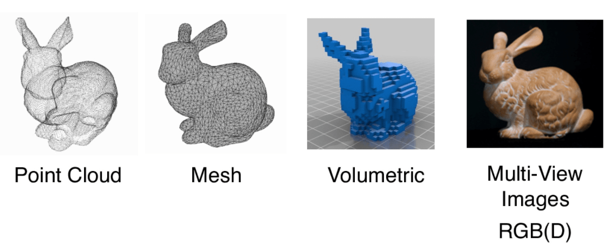
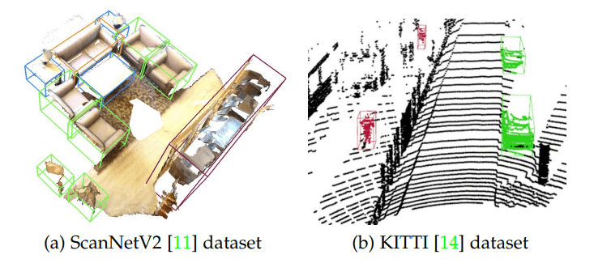
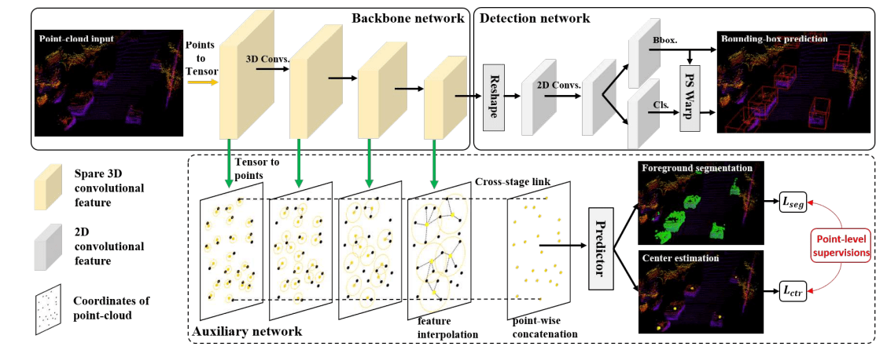

# 开题报告

## 题目

基于辅助网络和深度学习的三维点云目标检测

## 题目来源及类型

题目来源：导师研究课题

题目类型：应用基础研究

## 研究背景及意义

目标检测是计算机视觉和数字图像处理的一个热门方向，广泛应用于机器人导航、智能视频监控、工业检测、航空航天等诸多领域，通过计算机视觉减少对人力资本的消耗，具有重要的现实意义。与图像识别不同，目标检测不仅需要识别出图像上存在的物体，给出对应的类别，还需要将该物体的位置通过最小包围框（bounding box）的方式给出。

随着 Faster-RCNN[1] 出现，二维目标检测达到了空前的繁荣，出现了众多优秀的算法，例如：Mask R-CNN[2]，YOLO[3]，Swin[4]等等。但是在无人驾驶、机器人、增强现实的应用场景下，普通的二维检测并不能提供感知环境所需要的全部信息，在真实的三维世界中，物体的信息变得更加丰富，应用场景也变得更加复杂，大部分应用场景都需要有目标物体的长宽高还有偏转角等信息。

点云（point cloud）是一种基本的几何数据类型，在计算机视觉、计算机图形学和机器人领域有着广泛的应用。点云数据更接近于设备的原始表征，通过雷达扫描物体直接产生，而且点云的表达方式相比于其他三维数据类型更加简单，例如：Mesh、体素表示。

近年来，随着3D传感器（深度摄像头、激光雷达）的流行，点云数据变得更易采集；而最近火爆的无人驾驶更是激发了对新一代鲁棒、高效点云处理算法的强烈需求。在自动驾驶场景下，需要从图像中提供目标物体三维大小及旋转角度等指标，鸟瞰投影的信息对于后续自动驾驶场景中的路径规划和控制具有至关重要的作用，因此，基于3D点云的目标检测也就成为了近年来理论和应用的研究热点。

## 国内外现状分析

近年来，深度学习技术主导了许多研究领域，如计算机视觉、语音识别和自然语言处理。然而，3D 点云的深度学习仍然面临着几个重大挑战，例如数据集的小规模、高维数和 3D 点云的非结构化性质

### 数据集

点云上的深度学习越来越受到关注，尤其是最近五年发展迅速，其中发布了多个公开可用的数据集，为 3D 点云深度学习领域提供发展的基础，例如 ModelNet[5]、ShapeNet[6]、ScanNet[7]、ApolloCar3D[8]、KITTI Vision Benchmark Suite[10,9] 以及近两年发布的 Waymo[11] 和 nuScenes[12] 数据集。一些热门数据集的榜单成绩刷新非常的活跃，这也是 3D 点云深度学习领域快速发展的一个重要体现。

对于 3D 目标检测和跟踪，有两种类型的点云数据集：室内场景和室外城市场景。 室内数据集中的点云要么从密集深度图转换而来，要么从 3D Mesh 网格中采样。 室外城市数据集专为自动驾驶而设计，其中点云在空间上很好地分离并且这些点云很稀疏。对于 3D 对象检测，平均准确率（AP）是最常用的标准，它被计算为 precision-recall 曲线下的面积。

### 三维点云目标检测

典型的三维点云目标检测将场景的点云作为其输入，并在每个检测到的对象周围生成一个有方向的 3D 边界框，如下图所示

三维目标检测方法目前可以分为两大类

1. 基于区域提议的方法 (region proposal-based methods)
2. 单摄方法 (single shot methods)

#### Region Proposal-based Methods

这类方法首先提出包含对象的几个可能的区域（也称为提议 proposal），然后提取区域特征来确定每个提议的类别标签。 根据对象提议生成方法的不同，这些方法可以进一步分为四类：基于多视图 multi-view-based、基于分割 segmentation-based、基于视锥体 frustum-based 和其他方法

1. 基于多视图的方法

   这些方法融合了来自不同视角的图像来获得 3D 旋转框，例如，LiDAR 前视图、鸟瞰图（BEV）和 RGB 图像。这些方法的计算成本通常很高，其中的典型代表为 MV3D[13]。该网络从 BEV 图中生成了一组高精度的 3D 候选框，并将它们投影到多个视图的特征图上，然后他们结合来自不同视图的这些区域特征来预测定向的 3D 边界框。虽然这种方法在只有 300 个建议的情况下，在 0.25 的联合交集（IoU）上实现了 99.1% 的召回率，但其速度对于实际应用来说太慢了。随后，一些研究来从两个方面改进多视图 3D 目标检测方法。一个方面是寻找更好的方法来有效地融合不同模态之间的信息；另一个方面是使用更有效的方法来提取输入数据的鲁棒性表示。MMF[14] 网络提出了一种用于端到端训练的多任务多传感器 3D 目标检测网络。具体来说，利用多项任务（例如，2D 目标检测、地面估计和深度补全）来帮助网络学习更好的特征表示。进一步利用学习到的跨模态表示来产生高度准确的目标检测结果。实验结果表明，该方法在 2D、3D 和 BEV 检测任务上取得了显着改进。

2. 基于分割的方法

   这类方法首先利用现有的语义分割技术去除大部分背景点，然后在前景点上生成大量高质量的建议以节省计算。与多视图方法相比，基于分割的方法实现了更高的对象召回率，更适合具有高度遮挡和拥挤对象的复杂场景。

   PointRCNN[15] 框架是这类方法中的一个，该方法基于原始的点云数据直接进行特征提取和 RPN 操作。随着 PointNet[17,16] 系列论文的出现，可以直接基于点云原始数据进行特征提取，而不需要进行体素化或者对点云进行投影。直接使用点云数据最明显的好处就是减少了信息丢失。PointRNN[15] 直接分割 3D 点云以获得前景点，然后融合语义特征和局部空间特征以产生高质量的 3D 框。

3. 基于视锥体的方法

   基于视锥体的方法首先利用现有的 2D 目标检测器检测 RGB 图像输入来生成对象的 2D 候选区域，然后为每个 2D 候选区域提取特征，并生成 3D frustum proposal。尽管这类方法可以有效地提出 3D 对象的可能位置，但这类方法的网络机构性能受到 2D 图像检测器的限制

4. 其他方法

   除了以上三类外，还有一些方法是基于点云和体素化的 2-Stage 三维目标检测网络。例如由 OpenMMLab 发布的 PV-RCNN[18] 和 Part-A2[19] 网络，这两个网络在各个数据集上都具有相当优秀的表现，尤其是 PV-RCNN[18] 在发布时明显优于以前的所有方法，在 KITTI 数据集上总榜排名第一，并保持了接近半年的时间。PointVoxel-RCNN（PV-RCNN[18]）利用 3D 卷积网络和基于 PointNet[17,16] 的集合抽象来学习点云特征。具体来说，输入点云首先被体素化，然后被送入 3D 稀疏卷积网络以生成高质量的提议。然后通过体素集抽象模块将学习到的体素特征编码成一小组关键点。此外，他们还提出了一个关键点到网格的 ROI 抽象模块来捕获丰富的上下文信息以进行选框细化。

#### Single Shot Methods

Single shot 类方法使用 single-stage 网络直接预测类概率并回归对象的 3D 边界框，这一类检测器也被称为 Single Shot Detection (SSD)。他们不像基于区域提议的方法需要生成提议，然后利用这些提议再进一步做特征提取。SSD 直接对 3D 边界框进行预测， 因此这类网络可以高速运行，比基于区域提议的方法更快，并且在良好的网络设计之下，能够达到媲美基于区域提议的网络。 根据输入数据的类型，single shot 方法可以分为三类：基于鸟瞰图的方法 BEV-based、基于离散化的方法 discretization-based 和基于点的方法 point-based。

1. 基于鸟瞰图的方法

   该类方法以 BEV 表示作为输入。其中 PIXOR[20] 使用等距单元离散化场景的点云，并以类似的方式编码反射率，从而产生一个规范的表示。然后应用全卷积网络（FCN）网络来估计对象的位置和航向角。该方法以 28.6 fps 的运行速度优于大部分 single shot 方法，能够达到基本的实时检测。

2. 基于离散化的方法

   这些方法将点云转换为规则的离散表示，这是一个体素化的过程，将整个三维点云空间划分为规则的栅格。然后应用 3D CNN 来对离散化的输入进行特征提取，最后利用提取的特征来预测对象的类别和 3D 选框。

   其中一个基于体素的端到端可训练框架为 VoxelNet[21]。他们将点云划分为等距的体素，并将每个体素内的特征编码为 4D 张量。然后将编码得到的特征输入一个 RPN 以产生检测结果。虽然它的性能很强，但由于体素和 3D 卷积的稀疏性，这种方法的运行速度很慢。后来，SECOND[22] 使用稀疏卷积网络 3D Sparse Convolution 来提高 VoxelNet[21] 的推理效率，从原来速度仅为 2.0 fps 提升了10倍以上，达到了 26.2 fps 的推理速度。

   之后又提出了 PointPillars[23] 网络来进行 3D 目标检测。该方法利用 PointNet[17,16] 来学习垂直列（Pillars）中组织的点云的特征，并将学习到的特征编码为伪图像。然后应用 2D 对象检测管道来预测 3D 边界框。 PointPillars[23] 在平均精度（AP）方面优于大部分多视图融合方法。此外，PointPillars[23] 可以在 3D 和 BEV KITTI[9] 基准测试中以 62 fps 的速度运行，是目前最快的点云目标检测网络之一，而且保持了良好的平均准确率，这使其非常适合实际应用。这些网络时常作为经典的 baseline 作为实验比较，也常常作为其他网络的 backbone 进行底层的特征提取，这恰好说明了这些经典网络具有不错的通用性和可靠性。

3. 基于点的方法

   基于点的方法直接将原始点云作为输入，其中 3DSSD [161] 是这个方向的开创性工作。它引入了 Distance-FPS（D-FPS）和 Feature-FPS（F-FPS）的融合采样策略，以去除耗时的特征传播（FP）层和 PointRCNN[133] 中的细化模块。 然后，候选生成层 (CG) 用于充分利用具有代表性的点，这些点被进一步送到具有 3D 中心标签的 anchor-free 回归模块以预测 3D 对象框。实验结果表明，3DSSD 在保持 25 fps 速度的同时，优于基于两阶段点的方法 PointRCNN[133]。

#### Others

除了以上主流的两类方法外，近几年人们也在其他方面有尝试性的研究，例如使用图神经网络 GNN 来对点云进行编码。Point-GNN[25] 是这个方向的开创性工作，他们首先将输入点云编码为具有固定半径的近邻图，然后将该图输入 Point-GNN[25] 以预测对象的类别和框，最终结果 Point-GNN[25] 在 KITTI 数据集上有非常不错的表现，但是其代价是大量的点云处理和图生成计算，推理速度仅能达到 1.7 fps。总体来讲，该研究表明了利用图神经网络来对点云做深度学习是可能的，在今后的研究中会是潜在的发展方向。

## 研究目标、研究内容和拟解决的关键问题

### 研究目标

在已有的三维点云目标检测模型的基础之上，使用辅助网络提升检测器对于点云的学习能力，增强网络对于点云的语义表达，从而达到提升性能的目标，并且不增加网络最终推理的复杂度，保持其运行速度。

现阶段辅助网络按照连接类型可以分为两类，一类为任务型辅助网络，该类网络将直接连接在主干网络之中，通过辅助任务更新原网络中的参数；另一类为软目标型辅助网络，即在主干网络之外为主干网络提供软目标以进行监督学习。本研究将结合两种辅助网络，与主干网络进行联合优化，尽可能在一定程度上超越前人的实验结果。

### 研究内容

1. 对任务型和软目标型辅助网络进行研究，分析它们对主干网络的作用，并尝试探索更适合于目标检测的辅助任务和联合优化方式，以获得更好的实验表现。
2. 对 Region Proposal Network (RPN) 结构进行研究，改进传统 anchor-based 结构，探索更加高效的提议方法。
3. 对损失函数进行研究，通过增加 IoU 相关损失，尝试提升网络表现。
4. 使用 KITTI 数据集对提出的网络进行评估，验证网络的效率与准确率。

### 拟解决的问题

1. 目前三维点云目标检测器可以分为两个大类：1-Stage 检测器和 2-Stage 检测器，其中 2-Stage 检测器利用更细粒度的空间信息，对预测选框进行精细化，所以在精度上一般比 1-Stage 检测器更准，但付出的是推理时间的增加。拟通过可分离的辅助网络，在不增加推理时间的条件下，为主干网络添加更丰富的空间信息，以此完成速度与准度的兼顾。
2. 在监督学习中，由于标签所含的信息太少，导致学习过程中监督信号不足，进而影响网络表现。拟通过使用软目标增强标签信息，以提升网络性能，其中软目标由辅助网络预测提出。
3. 传统 anchor-based RPN 会在特征图谱上采样大量的锚框，并通过锚框中的特征预测出选框参数，由于锚框的低效性阻碍了网络性能进一步的提升。拟采用 center-based 思想替代 anchor-based 思想，设计更高效的 RPN 结构 。
4. 深度学习是一种端到端的训练方法，其学习目标和损失函数对于网络的参数有最直接的影响。一般的选框回归任务使用的是 smooth L1 损失函数以评估选框大小。拟增加 IoU 相关损失函数，使得网络对选框的评估角度更加全面，从而提升网络表现。

## 研究方法、设计及试验方法、可行性分析

### 研究方法

为了研究针对对三维点云目标检测所提出的目标与问题，使用的研究方法分为几个主要部分：首先是阅读国内外相关领域的高质量论文，总结其中的关键思想，分析论文中的结构细节与可改进之处；针对拟解决的问题，结合所读文献，提出合理的网络结构和实验方案；最后通过开源框架实现网络，并对网络性能进行评估以及进一步优化。

1. 大量阅读国内外相关领域的论文

   随着三维点云目标检测的发展，越来越多的研究方法不断涌现，也有越来越大的数据集持续地发布。各个网络结构之间都有差异，但是基本目标都是一致的，比如提取多尺度的点云特征以加强网络表示能力。通过总结各个网络的共性和优点，作为研究的基本参考框架，然后再考虑能否将各个网络之间的优势有效结合起来，例如基于体素化特征提取的规范性和基于原始点云的精确性。基于辅助网络的论文，在近两年也才刚刚提出，是一个非常吸引人的方向，如何将辅助网络的优势和之前的网络结构相结合也将会是本研究的思考重点。

2. 分析已有三维点云目标检测网络

   当前的点云 3D 对象检测可以分为两个流，即 1-Stage 方法和 2-Stage 方法。1-Stage 方法将稀疏的 3D 点云解析为紧凑的表示，例如体素栅格或鸟瞰图像（BEV），将这些特征图像使用卷积神经网络进行直接预测从而得到选框，这使得 1-Stage 方法通常简单有效。然而，逐渐缩小的特征图不可避免地会失去空间分辨率和点云信息，使得单阶段检测器处理稀疏点云相对于两阶段的检测器其精度会低一些。

   与 1-Stage 网络相比，2-Stage 网络可以在第二阶段利用更精细的空间信息，第二阶段将重点关注第一阶段预测的感兴趣区域（RoI），从而预测更准确的边界框。这展示了利用点云的原始细粒度的空间信息非常重要，这些信息将帮助网络实现更加精确的定位。然而，对每个点进行操作并为每个 RoI 重新提取特征会大大增加计算成本，这使得两阶段方法难以达到实时检测的速度要求。为了将两个流派的 3D 目标检测方法结合起来，近两年一些论文采用了辅助网络的思想，在数据集上获得了不错的效果

   SA-SSD[26] 是辅助网络方向上开创性的文章之一，其实使用辅助任务来提升主任务的表现在目标检测网络中也是常见方法，例如在 PV-RCNN 中进行了前景点分割任务，并利用该任务对不同点的特征进行权重分配，前景点将获得更大的权重。对比之下，SA-SSD 使用可分离辅助网络来补偿损失的空间信息。辅助网络的输入为 backbone 中不同分辨率的 feature map，将特征图谱的栅格化特征表示，使用特征传播 feature propagation 转化为逐点的特征表示，然后使用逐点的特征去做两个辅助任务：前景点分离和中心预测。在训练过程中辅助网络与主干网络进行联合优化，所以主干网络的 backbone 参数中将具有原始点云的语义信息。而在进行推理的时候，辅助网络将从主干网络中分离，故不增加任何的计算。下图为该网络的结构示意图

   

   

   SE-SSD[26] 则受到 SA-SSD[27] 和 mean teacher target[28] 的启发，进一步开发辅助网络在三维点云目标检测上的应用，使用了一对检测器 Teacher-SSD 和 Student-SSD 设计了网络框架。Teacher-SSD 由 Student-SSD 中的参数集成而成，它将产生监督学生的软目标。与手动注释的硬目标（标签）相比，软目标通常具有更多的熵，从而为学生提供更多信息以供学习。以分类任务为例，软目标的信息优势表现在如下两点：

   1. 分类标签为 one hot 向量，仅为一个点，也即该目标所属类别。而使用 teacher model 对于每个样本输出一个连续的 label 分布，这样可以利用的监督信息就远比 one hot 的多了
   2. 软目标还提供了其他分类的得分/可能性，含有了类别与类别之间的信息

   因此，SE-SSD 利用设计好的约束条件来使得软目标和硬目标联合优化模型。同时为了不会产生额外的推理时间，在最终使用模型推理时，仅使用 Student-SSD 进行三维目标检测。最终表现结果 SE-SSD[26] 超越了当时几乎所有的三维点云目标检测器，不仅仅在准确率上表现出色，在运行速度上也远快于 2-Stage 网络。

   SA-SSD 和 SE-SSD 都是使用辅助网络的典型，二者都在数据集上有良好的表现，但其中也有可能的改进之处。例如在 SA-SSD 中的辅助网络使用的是逐点特征 point-wise feature，一般涉及到对原始点云进行逐点特征计算时都会比较复杂，计算量大。如果可以使用更加高效的辅助特征表示，能够避免复杂逐点特征提取，就能进一步加速计算，减小训练成本。

3. 使用开源框架进行网络搭建与优化

   主要框架拟使用 OpenMMLab 开源框架。OpenMMLab 是商汤科技的人工智能视觉算法框架，为迄今最完备的计算机视觉算法体系和框架，涉及超过10种研究方向，开放超过100种算法、1000种预训练模型，在学术界和工业界使用十分广泛。针对于三维目标检测该框架开发了 3D 目标检测工具箱 MMDetection3D，同时针对点云目标检测还有 OpenPCDet 开源项目，利用这些开源项目能够比较方便地进行实验和研究。

   选择在各个数据集中均表现优异的目标检测网络作为主干网络，并将任务型辅助网络连接在主干网络的 backbone 之中。该辅助网络将作为 encoder 把 backbone 中的特征重新编码，进行辅助任务训练，训练过程中能够直接对网络的 backbone 参数进行优化。辅助任务将以最简单语义分割任务为出发点，再逐渐探索其他任务对于性能的提升与影响。软目标型辅助网络将采用与主体网络近似的结构，以持续提供高质量软目标。通过约束软目标和预测结果的损失函数，使得二者尽可能地对齐，进而通过反向传播算法对整个网络的参数调整。两个类型的辅助网络分别从局部（backbone）和全局对网络整体进行联合优化。

### 设计实验方案

1. 实验拟采用经典的 SECOND 作为 backbone 网络以提取 3D 体素特征，相比于基于点的特征提取，基于体素的特征提取方法使用 3D 稀疏卷积，能够更有效率地进行特征提取。
2. 受到 Voxel R-CNN 的启发，即使是使用体素级空间信息，这些信息提取出来的特征也能够帮助提升网络的表现，达到使用精确空间信息特征的水平。将 backbone 中不同分辨率的特征，进一步编码为体素特征用于进行辅助任务。
3. 为了摆脱传统 anchor-based 结构的瓶颈，使用 anchor-free 结构以更有效地对 3D 选框进行预测。将 RPN 设计为 center-based 结构，直接预测目标的中心位置，根据中心点的特征回归得到选框的其他参数。
4. 将辅助网络与主干网络在数据集上进行训练，在该阶段的训练完成之后，分离辅助网络，将主干网络取出并构造 Student-SSD 与 Teacher-SSD。借助于 Teacher-SSD 预测的软目标，对 Student-SSD 进行下一阶段的训练，同时记录实验过程中的重要结果。
5. 根据实验结果分析网络结构，并对其中的不足进行改进。

### 可行性分析

1. 从 SA-SSD[20] 到 SE-SSD[21] 已经表明了辅助网络对于三维点云目标检测表现有巨大的提升，其中 SA-SSD 使用中心预测和前景点预测任务，向网络中隐式加入点云空间信息和语义信息；SE-SSD 则使用软目标，增强了标签的监督信号。二者所使用的辅助网络虽然类型不同，但作用是一致的：从表现结果来看它们提升了网络的精准度；从推理时间看，它们与主干网络分离，保障了推理速度。
2. Center-based 相关工作表明了将特征提取重点放在目标的中心，能够有效提升 RPN 网络的表现。并且这样的提升是具有一般性的，使用不同的 backbone 均能改进原 anchor-based RPN 网络。
3. 以上提到的各个网络，其代码实现已经开源，并且众多表现优异的模型都已经在 OpenMMLab 框架之下实现。在此统一框架之下能够更方便地实现复杂的模型，并对模型进行各种实验以帮助分析模型性能，最终根据实验结果改进模型。

## 计划进度和质量保障

### 计划进度

2021年10月~2021年12月

阅读三维点云目标检测相关文献，进一步学习网络结构及其作用

2021年12月~2022年6月

尝试复现准确率高的模型，在复现基础上尝试进行创新和调整，完善自己的网络结构

2022年6月~2022年12月

将自己的网络结构进行消融实验与对比实验，实验结果进行深入分析，完成论文初步架构

2022年12月~2023年3月

整理实验数据和研究成果，撰写并提交完整的毕业论文

### 质量保证

严格按照学院毕业论文的各项要求进行

## 预期成果和创新点

### 预期成果

使用任务型辅助网络和软目标型辅助网络，帮助主干网络更好地完成目标检测。并使用 center-based 思想，改进 anchor-based 区域提议网络。通过不断实验不断优化，提升三维点云目标检测效果，尽可能超越前人的表现。

### 创新点

1. 将不同类型的辅助网络创新性地结合到三维目标检测当中，使得网络在训练的过程中尽可能地利用监督信息和样本信息。
2. 使用 center-based 思想，改进 anchor-based RPN 以提升预测表现。
3. 整个框架均使用 voxel-wise 特征提取，避免了逐点特征提取的大量计算，加速进程。

## 参考文献

由 zotero 在 word 中生成，这里不再列出

